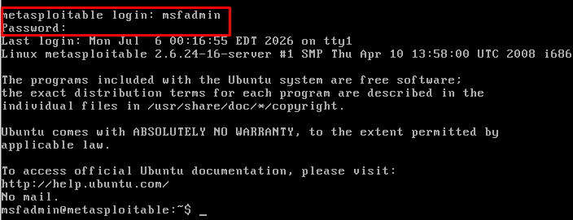
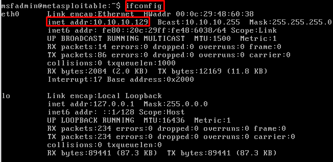
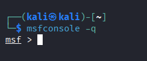
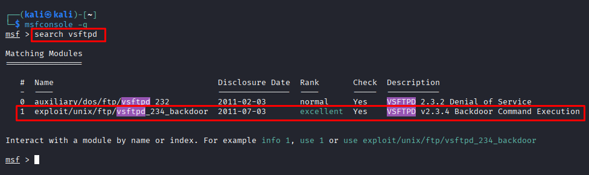

# Metasploitable — vsftpd 2.3.4 Backdoor

**Date:** June 2026 <br>
**Author:** ShahinSecLab <br>
**Category:** Network Penetration Testing <br>
**Difficulty:** Easy <br>
**Tools:** nmap, Metasploit

## Table of Contents

* [Introduction](#introduction)
* [Why This Attack Works](#why-this-attack-works)
* [Lab Setup](#lab-setup)
* [What I Needed Before Starting](#what-i-needed-before-starting)
* [What I Understood During the Process](#what-i-understood-during-the-process)
* [Attack Flow](#attack-flow)
* [Step 1 — Setting Up and Verifying the Target](#step-1--setting-up-and-verifying-the-target)
* [Step 2 — Scanning the Target with Nmap](#step-2--scanning-the-target-with-nmap)
* [Step 3 — Identifying the Vulnerable Service](#step-3--identifying-the-vulnerable-service)
* [Step 4 — Exploiting vsftpd 2.3.4 with Metasploit](#step-4--exploiting-vsftpd-234-with-metasploit)
* [Step 5 — Getting a Root Shell](#step-5--getting-a-root-shell)
* [How Defenders Can Catch This](#how-defenders-can-catch-this)
* [How to Prevent It](#how-to-prevent-it)
* [References](#references)
* [What I Achieved](#what-i-achieved)

## Introduction

Metasploitable is an intentionally vulnerable version of Linux virtual machine used for penetration testing practice. The vulnerability that I aimed to exploit in this lab is known as "vsftpd 2.3.4 Backdoor". It is a well-known vulnerability whereby the malicious backdoor was planted into vsftpd source code back in 2011. If anyone logs into the FTP service using :) in his/her username, the backdoor triggers, giving the root shell access on port 6200.

## Why This Attack Is Effective

In 2011, there was a backdoor introduced in the vsftpd 2.3.4 source code. It was very basic; if the username contained :) when trying to log in using FTP, then vsftpd would create a bind shell on TCP port 6200 in root. Anyone that knew how could immediately have root-level access to the computer without having any valid credentials.
The Metasploitable installation comes with this vulnerable version of vsftpd.

## Lab Setup
```
| Component         | Details                     |
|-------------------|-----------------------------|
| Attacker Machine  | Kali Linux                  |
| Target Machine    | Metasploitable 2            |
| Target IP         | 192.168.5.145               |
| Network           | VMware Host-Only Network    |
```

### Tools Used
```
| Tool        | Purpose                                       |
|-------------|-----------------------------------------------|
| nmap        | Scan and identify open services on the target |
| Metasploit  | Run the vsftpd 2.3.4 backdoor exploit         |
```

## What I Needed Before Starting
```
| What                        | Why                                   |
|-----------------------------|---------------------------------------|
| Metasploitable 2 VM running | Target machine                        |
| Kali Linux                  | Attacker machine with all tools ready |
| nmap                        | To scan and identify open services    |
| Metasploit                  | To run the vsftpd exploit             |
```

## What I Understood During the Process

Through the process of this attack, I understood that:

- Conducting a version scan using nmap is always the initial step; knowledge of the specific version of the service is crucial for the successful selection of the appropriate exploit.
- The backdoor of vsftpd 2.3.4 is among the most famous exploits used in penetration testing exercises.
- It was very easy to exploit the vulnerability using Metasploit; all one needed was to enter the IP address of the target.
- Direct access to root without any escalation of privileges highlights the dangers that arise from the use of unpatched services.
- This is a perfect illustration of why supply chain security is important; the backdoor was hardcoded into the source code of the program.

## Attack Flow

```
Powered on Metasploitable 2 and verified the IP address
                        ↓
Switched to Kali and ran nmap version scan on 192.168.5.139
                        ↓
Found FTP port 21 open running vsftpd 2.3.4
                        ↓
Searched for vsftpd 2.3.4 exploit in Metasploit
                        ↓
Found exploit/unix/ftp/vsftpd_234_backdoor
                        ↓
Set RHOSTS to 192.168.5.139
                        ↓
Ran the exploit
                        ↓
Backdoor triggered — shell opened on port 6200
                        ↓
Got a root shell directly
                        ↓
whoami → root
```

## Step 1 — Setting Up and Verifying the Target

I powered on the Metasploitable 2 virtual machine in VMware. Once it booted up, the login screen showed the default credentials:

```bash
Login: msfadmin
Password: msfadmin
```
<p align="center">
  
</p>

I logged in and checked the IP address of the machine:

```bash
ifconfig
```
**Output:**

```
eth0      Link encap:Ethernet  HWaddr 00:0c:29:48:60:38
          inet addr:192.168.5.145  Bcast:192.168.5.255  Mask:255.255.255.0
          inet6 addr: fe80::20c:29ff:fe48:6038/64 Scope:Link
          UP BROADCAST RUNNING MULTICAST  MTU:1500  Metric:1
          RX packets:57 errors:0 dropped:0 overruns:0 frame:0
          TX packets:66 errors:0 dropped:0 overruns:0 carrier:0
          collisions:0 txqueuelen:1000
          RX bytes:5085 (4.9 KB)  TX bytes:6880 (6.7 KB)
          Interrupt:17 Base address:0x2000
```
The machine was up and running at `192.168.5.145` I switched over to my Kali machine and started the attack from there.

<p align="center">
  
</p>

## Step 2 — Scanning the Target with Nmap

I ran an nmap scan to find open ports and identify running services on the target.

```bash
nmap -sV -sC 192.168.5.145
```
`-sV`: Version detection — finds the exact version of each service running
`-sC` : Runs default nmap scripts against discovered services

**Output:**

```
Starting Nmap 7.98 ( https://nmap.org ) at 2026-07-06 01:36 -0400
Nmap scan report for 192.168.5.145
Host is up (0.0011s latency).
Not shown: 977 closed tcp ports (reset)

PORT     STATE SERVICE     VERSION
21/tcp   open  ftp         vsftpd 2.3.4
22/tcp   open  ssh         OpenSSH 4.7p1 Debian 8ubuntu1 (protocol 2.0)
23/tcp   open  telnet      Linux telnetd
25/tcp   open  smtp        Postfix smtpd
53/tcp   open  domain      ISC BIND 9.4.2
80/tcp   open  http        Apache httpd 2.2.8 ((Ubuntu) DAV/2)
111/tcp  open  rpcbind     2 (RPC #100000)
139/tcp  open  netbios-ssn Samba smbd 3.X - 4.X
445/tcp  open  netbios-ssn Samba smbd 3.0.20-Debian
512/tcp  open  exec        netkit-rsh rexecd
513/tcp  open  login       OpenBSD or Solaris rlogind
514/tcp  open  tcpwrapped
1099/tcp open  java-rmi    GNU Classpath grmiregistry
1524/tcp open  bindshell   Metasploitable root shell
2049/tcp open  nfs         2-4 (RPC #100003)
2121/tcp open  ftp         ProFTPD 1.3.1
3306/tcp open  mysql       MySQL 5.0.51a-3ubuntu5
5432/tcp open  postgresql  PostgreSQL DB 8.3.0 - 8.3.7
5900/tcp open  vnc         VNC (protocol 3.3)
6000/tcp open  X11         (access denied)
6667/tcp open  irc         UnrealIRCd
8009/tcp open  ajp13       Apache Jserv (Protocol v1.3)
8180/tcp open  http        Apache Tomcat/Coyote JSP engine 1.1
```
The scan came back with a huge list of open ports and services. The machine was running a lot of outdated and vulnerable software. The one that stood out right away was:

```
21/tcp   open  ftp   vsftpd 2.3.4
```
vsftpd 2.3.4 is a well known version with a backdoor — that was my target.

## Step 3 — Identifying the Vulnerable Service

From the nmap output I confirmed:
```
| Service | Port | Version         | Status                        |
|---------|------|-----------------|-------------------------------|
| FTP     | 21   | vsftpd 2.3.4    | Vulnerable to backdoor exploit|
```

vsftpd 2.3.4 has a backdoor that was added directly into the source code in 2011. When triggered, it opens a root shell on port 6200. Metasploit has a ready made module for this.

## Step 4 — Exploiting vsftpd 2.3.4 with Metasploit

### Started Metasploit

```bash
msfconsole -q
```
<p align="center">
  
</p>

### Searched for the vsftpd Exploit

```bash
msf > search vsftpd
``` 
```
Matching Modules
================

   #  Name                                  Disclosure Date  Rank       Check  Description
   -  ----                                  ---------------  ----       -----  -----------
   0  auxiliary/dos/ftp/vsftpd_232          2011-02-03       normal     Yes    VSFTPD 2.3.2 Denial of Service
   1  exploit/unix/ftp/vsftpd_234_backdoor  2011-07-03       excellent  Yes    VSFTPD v2.3.4 Backdoor Command Execution


Interact with a module by name or index. For example info 1, use 1 or use exploit/unix/ftp/vsftpd_234_backdoor
```
<p align="center">
  
</p>

### Selected the Exploit