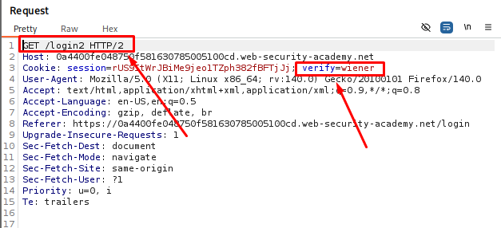
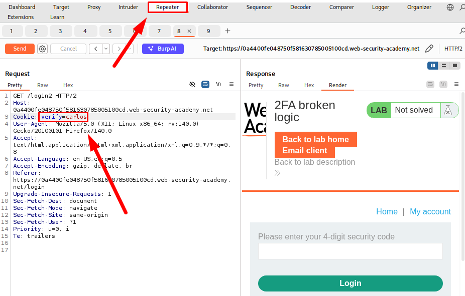
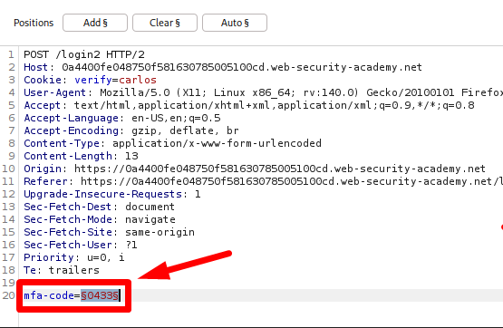
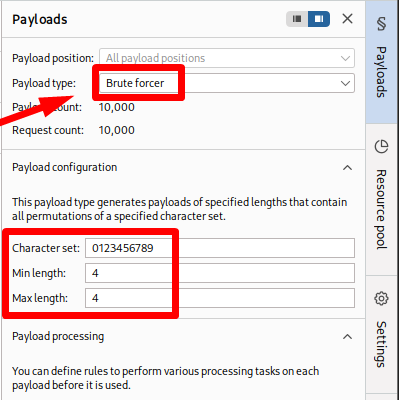
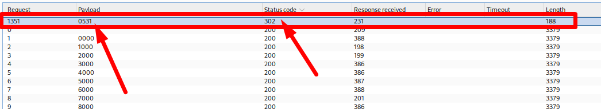
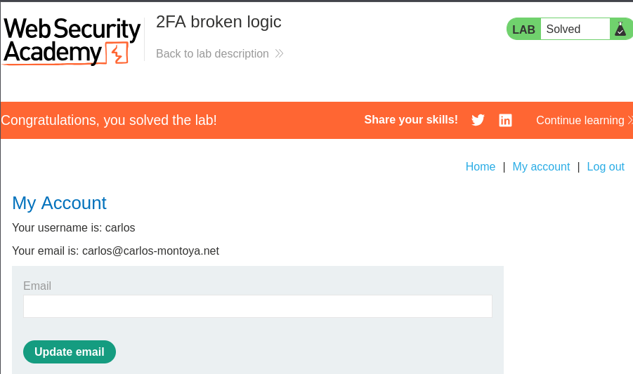

# 2FA Broken Logic

**Date:** October 2026 <br>
**Author:** ShahinSecLab <br>
**Category:** Authentication <br>
**Vulnerability:** Broken 2FA Logic <br>
**Difficulty:** Practitioner <br>
**Platform:** PortSwigger Web Security Academy <br>
**Tools:** Burp Suite, Firefox 

## Table of Contents

* [Introduction](#introduction)
* [Attack Flow](#attack-flow)
* [Why This Works](#why-this-works)
* [Lab Setup](#lab-setup)
* [Tools Used](#tools-used)
* [Prerequisites](#prerequisites)
* [Step 1 — Checking the 2FA Request](#step-1--checking-the-2fa-request)
* [Step 2 — Changing the Verify Parameter](#step-2--changing-the-verify-parameter)
* [Step 3 — Capturing the 2FA Request](#step-3--capturing-the-2fa-request)
* [Step 4 — Sending the Request to Intruder](#step-4--sending-the-request-to-intruder)
* [Step 5 — Configuring Payloads](#step-5--configuring-payloads)
* [Step 6 — Starting the Attack and Finding the 2FA Code](#step-6--starting-the-attack-and-finding-the-2fa-code)
* [Step 7 — Logging in as Carlos](#step-7--logging-in-as-carlos)
* [How Defenders Can Catch This](#how-defenders-can-catch-this)
* [How to Fix It](#how-to-fix-it)
* [References](#references)
* [Lessons Learned](#lessons-learned)


## Introduction

This lab is vulnerable to broken 2FA logic.

The application uses the `verify` parameter to decide which user's account is being verified.

The problem is that this value can be changed to another username.

Because of this, I could use my own username and password to reach the 2FA page, change the `verify` value to `carlos`, and then brute-force Carlos's 2FA code.

The goal was to:

1. Find how the 2FA process works.
2. Change the `verify` parameter to `carlos`.
3. Brute-force the 2FA code.
4. Log in to Carlos's account.

## Attack Flow

```text
Login with my own account
        ↓
Check the 2FA request
        ↓
Find the verify parameter
        ↓
Change verify to carlos
        ↓
Log in again
        ↓
Send POST /login2 to Intruder
        ↓
Set verify=carlos
        ↓
Brute-force the mfa-code
        ↓
Find the correct code
        ↓
Load the 302 response
        ↓
Click My account
        ↓
Lab solved
```

## Why This Works

Normally, after logging in, the 2FA code should be checked for the same account.

For example:

```text
Username: wiener
Password: peter
        ↓
2FA code for wiener
```

But this application uses the `verify` parameter to decide which account is being checked.

For example:

```text
verify=wiener
```

I could change it to:

```text
verify=carlos
```

The application then checked the 2FA code for Carlos.

This means I did not need Carlos's password. I only needed to find his 2FA code.

## Lab Setup

| Item             | Details                          |
| ---------------- | --------------------------------- |
| Attacker Machine | Kali Linux                       |
| Target           | PortSwigger Web Security Academy |
| Lab              | 2FA broken logic                 |
| Tool             | Burp Suite                       |
| Browser          | Firefox                          |
| Target User      | `carlos`                         |

## Tools Used

* **Burp Proxy** — Capture the login requests.
* **Burp Repeater** — Change the `verify` parameter.
* **Burp Intruder** — Brute-force the 2FA code.
* **Firefox** — Login and access the account.

## Prerequisites

* Burp Suite
* Firefox
* PortSwigger Web Security Academy account
* Basic knowledge of Burp Proxy, Repeater, and Intruder

## Step 1 — Checking the 2FA Request

With Burp Suite running, I opened the login page and entered my username and password.

I was then taken to the 2FA page.

I entered the 2FA code and checked the request in Burp.

In Burp Proxy → HTTP history, I found:

```
POST /login2
```

The request contained:

```
verify=wiener
```

The verify parameter showed which account was being verified.

I sent this request to Burp Repeater.

<p align="center">
  
</p>

## Step 2 — Changing the Verify Parameter

In  **Burp Repeater**, I changed the verify parameter.

My request was:

```http
GET /login2
```

I changed:

```text
verify=wiener
```

to:

```text
verify=carlos
```

The request looked like:

```http
GET /login2?verify=carlos
```

I sent the request.

This generated a temporary 2FA code for Carlos.

<p align="center">
  
</p>

## Step 3 — Capturing the 2FA Request

I then logged in again with my own username and password and captured the 2FA request.

The captured request was:

```http
POST /login2
```

It contained:

```text
verify=wiener
mfa-code=0433
```

## Step 4 — Sending the Request to Intruder

I sent the `POST /login2` request to **Burp Intruder**.

I changed:

```text
verify=wiener
```

to:

```text
verify=carlos
```
Then I added a payload position to the `mfa-code` parameter.

The request looked like:

```text
verify=carlos&mfa-code=§0433§
```

The `mfa-code` value was the part I wanted to brute-force.

<p align="center">
  
</p>

## Step 5 — Configuring Payloads

For the payload position, I selected **Brute forcer**.

Then I set the character set to:

```
0123456789
```

I set both the minimum and maximum length to 4.

<p align="center">
  
</p>

## Step 6 — Starting the Attack and Finding the 2FA Code

I started the attack.

Most requests returned the normal failed 2FA response.

I checked the responses and found one request with a different response.

That request returned:

```text
302
```

This showed that the 2FA code was correct.

<p align="center">
  
</p>

## Step 7 — Logging in as Carlos

I loaded the `302` response in the browser.

The browser redirected to the account page.

I clicked **My account**.

The account page opened successfully.

This confirmed that I had logged in as Carlos and the lab was solved.

<p align="center">
  
</p>

## How Defenders Can Catch This

* Monitor repeated failed 2FA attempts.
* Monitor large numbers of 2FA codes being tried.
* Check for changes to account-related parameters.
* Log successful and failed 2FA attempts.
* Alert on unusual login activity.

## How to Fix It

### 1. Keep the 2FA tied to the same user

The server should remember which user completed the first login step.

The second step should only work for that same user.

### 2. Do not trust the `verify` parameter

A user should not be able to change:

```text
verify=wiener
```

to:

```text
verify=carlos
```

and change which account is being verified.

### 3. Limit 2FA attempts

The application should limit how many incorrect 2FA codes can be entered.

### 4. Use proper session handling

The 2FA process should be tied to the login session instead of a value that the user can change.

## References

* [PortSwigger Web Security Academy — 2FA broken logic](https://portswigger.net/web-security/authentication/multi-factor/lab-2fa-broken-logic)
* [OWASP Authentication Cheat Sheet](https://cheatsheetseries.owasp.org/cheatsheets/Authentication_Cheat_Sheet.html)

## Lessons Learned

* The 2FA process must stay connected to the user who logged in.
* Client-side parameters should not decide which account is being verified.
* Changing `verify` from one username to another can break the 2FA logic.
* Burp Repeater is useful for testing parameter changes.
* Burp Intruder can be used to brute-force a 2FA code.
* A different response can help identify the correct 2FA code.