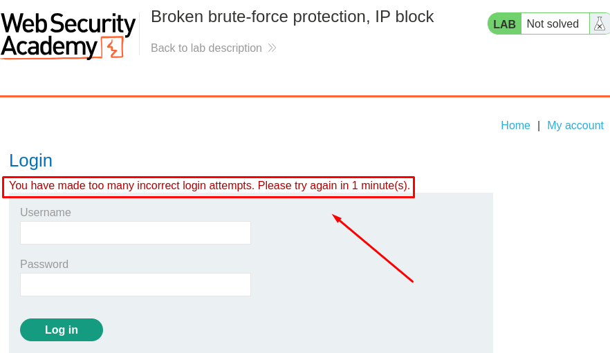
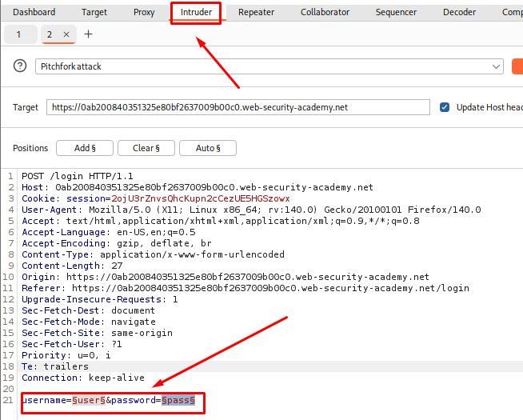
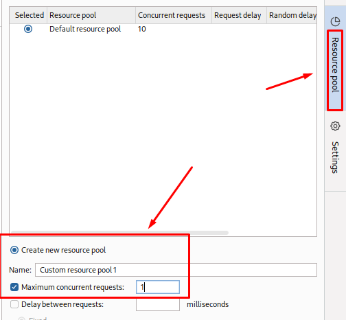
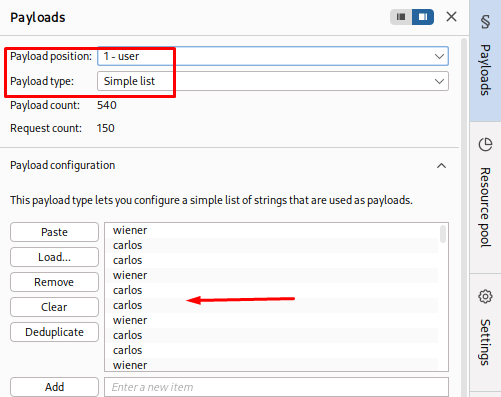
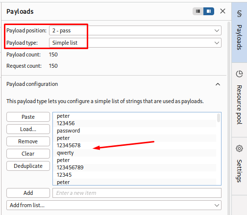
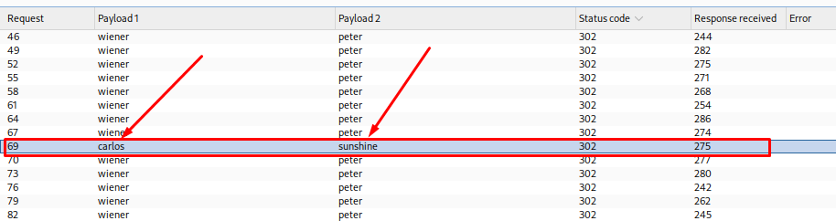
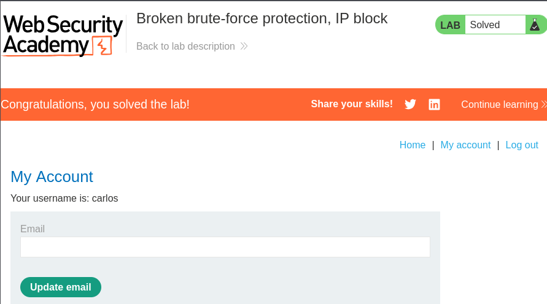

# Password Brute-Forcing via Broken Authentication Resetting

**Date:** October 2026 <br>
**Author:** ShahinSecLab <br>
**Category:** Authentication <br>
**Vulnerability:** Broken Authentication / Logic Flaw (Rate Limit Bypass) <br>
**Difficulty:** Practitioner <br>
**Platform:** PortSwigger Web Security Academy <br>
**Tools:** Burp Suite, Firefox


## Table of Contents

* [Introduction](#introduction)
* [Attack Flow](#attack-flow)
* [Why This Works](#why-this-works)
* [Lab Setup](#lab-setup)
* [Tools Used](#tools-used)
* [Prerequisites](#prerequisites)
* [Step 1 — Testing the Login Request & Observing IP Block](#step-1--testing-the-login-request--observing-ip-block)
* [Step 2 — Finding the Reset Flaw](#step-2--finding-the-reset-flaw)
* [Step 3 — Setting Up Burp Intruder Pitchfork Attack](#step-3--setting-up-burp-intruder-pitchfork-attack)
* [Step 4 — Resource Pool and Payloads](#step-4--resource-pool-and-payloads)
* [Step 5 — Running the Attack and Pulling the Password](#step-5--running-the-attack-and-pulling-the-password)
* [Step 6 — Logging in to Solve the Lab](#step-6--logging-in-to-solve-the-lab)
* [How Defenders Can Catch This](#how-defenders-can-catch-this)
* [How to Fix It](#how-to-fix-it)
* [References](#references)
* [Lessons Learned](#lessons-learned)


## Introduction

This lab has a broken rate limit. The application blocks an IP address for a short time after 3 failed login attempts in a row.

The problem is that a successful login resets the failed-attempt counter for that IP address.

So, by switching between a valid login and a password guess for the target account, the counter keeps getting reset. This makes it possible to keep guessing passwords without getting blocked.


## Attack Flow

```text
Send Failed Login Requests to POST /login
        │
        ▼
Observe IP Block After 3 Failed Attempts
        │
        ▼
Find the Reset Flaw (Valid Login Clears Counter)
        │
        ▼
Send POST /login Request to Intruder (Pitchfork Attack)
        │
        ▼
Set Maximum Concurrent Requests = 1 in Resource Pool
        │
        ▼
Payload 1 (Username): Alternating [wiener, carlos, wiener, carlos...]
        │
        ▼
Payload 2 (Password): Alternating [peter, candidate_pass1, peter, candidate_pass2...]
        │
        ▼
Run the Pitchfork Attack Sequentially
        │
        ▼
Filter Out 200 Status Codes & Find the 302 Redirect
        │
        ▼
Pull Carlos's Valid Password
        │
        ▼
Log In as Carlos & Access the Account Page
```

## Why This Works

The application allows only 3 failed login attempts before blocking the IP.

The problem is that a successful login resets the failed-attempt counter back to 0.

For example:

A wrong password for carlos increases the counter.
A successful login with wiener:peter resets the counter to 0.
So, if every password guess for carlos is followed by a successful login with wiener:peter, the counter never reaches 3.

The requests also need to be sent one after another in the correct order. That's why I set Maximum concurrent requests to 1. Otherwise, the requests may be processed out of order and the attack won't work properly.

## Lab Setup

| Component | Details |
|---|---|
| Attacker Machine | Kali Linux |
| Target | PortSwigger Web Security Academy Lab |
| Lab | Password brute-forcing via broken authentication resetting |
| Tool | Burp Suite Repeater and Intruder |
| Browser | Firefox |
| Vulnerability Type | Broken Authentication / Logic Flaw (Rate Limit Bypass) |
| Valid Credentials | wiener:peter |
| Target Account | carlos |

## Tools Used

| Tool | Purpose |
|---|---|
| Burp Suite Proxy | Capture the initial login POST request |
| Burp Suite Repeater | Check login behavior and confirm the counter reset |
| Burp Suite Intruder | Run the Pitchfork attack with paired alternating payloads |
| Firefox | Access the app and confirm the solve |

## Prerequisites

- Burp Suite Community or Professional installed
- Browser proxy set up to route through Burp
- Access to PortSwigger Web Security Academy
- Known valid credentials (wiener:peter) and the target username (carlos)
- A password list to guess from

## Step 1 — Testing the Login Request & Observing IP Block

I opened the login page and tried several wrong passwords to see how the application handles failed login attempts.

After 3 failed attempts in a row, the application blocked my IP address for a short time and showed a rate-limit error.

<p align="center">
  
</p>

## Step 2 — Finding the Reset Flaw

I captured the POST /login request from Proxy → HTTP history and sent it to Repeater.

Then I tested whether a successful login resets the failed-attempt counter:

- 2 failed login attempts for carlos
- 1 successful login with wiener:peter
- 1 more failed login attempt for carlos

The IP was not blocked.

This showed that a successful login with wiener:peter resets the failed-attempt counter.

## Step 3 — Setting Up Burp Intruder Pitchfork Attack

I sent the POST /login request to Intruder and selected the **Pitchfork** attack type.

Then I marked the username and password values as the payload positions:

```text
POST /login HTTP/1.1
Host: 0ab200840351325e80bf2637009b00c0.web-security-academy.net
...

sername=§user§&password=§pass§
```

This lets me use a different payload list for each position and send them together in the same request.

<p align="center">
  
</p>

## Step 4 — Resource Pool and Payloads

### Resource Pool

To make sure the requests were sent in the correct order, I created a new Resource Pool and set Maximum concurrent requests to 1.

<p align="center">
  
</p>

### Payload Set 1 — Usernames

I used wiener as the valid account and carlos as the target account.

The username list was arranged so that every wiener login was followed by two carlos attempts.
I used a Python script to generate the payloads in this pattern:

```text
wiener
carlos
carlos

wiener
carlos
carlos

wiener
carlos
carlos
...
```
<p align="center">
  
</p>

### Payload Set 2 — Passwords

For wiener, I used the known password peter.

For carlos, I used the password list I wanted to test:

```text
peter
123456
password
peter
12345678
qwerty
peter
letmein
...
```
<p align="center">
  
</p>

I used a Python script to generate these lists so that the usernames and passwords stayed in the correct order.

This way, every two password guesses for carlos were followed by a successful wiener:peter login, which reset the failed-attempt counter.

## Step 5 — Running the Attack and Pulling the Password
Started the Intruder attack and let it run.

Once it finished, I filtered the results to remove the normal 200 OK responses and sorted the entries by username.

Among the repeated carlos attempts, one request returned a 302 Found response.

The matching entry showed the valid credentials:

Username: carlos
Password: sunshine

The 302 Found response indicated that the login attempt was successful.

<p align="center">
  
</p>

## Step 6 — Logging in to Solve the Lab

Back in Firefox, I logged in as carlos using the password I found.

The account page loaded successfully, confirming that the lab was solved.

<p align="center">
  
</p>

## How Defenders Can Catch This

- A single IP sending fast, alternating login attempts across different accounts
- One account logging in repeatedly while another account racks up failed attempts right alongside it
- SIEM alerts watching for login-failure counters resetting unusually often per IP
- WAF rules tuned to catch sequential credential-stuffing or brute-force patterns

## How to Fix It

**1. Split up the rate-limit counters**
Track failures by IP + target username together, not just by IP alone.

**2. Keep failure states separate**
A successful login for one account shouldn't touch or clear the failure state tied to a different account.

**3. Lock accounts directly**
Lock out a target account after a set number of failed attempts, no matter what other successful logins happen from the same IP.

**4. Add CAPTCHA or MFA**
Trigger CAPTCHA or a second auth factor when login traffic looks fast or suspicious.

## References

| Resource | Link |
|---|---|
| PortSwigger Web Security Academy — Password brute-forcing via broken authentication resetting | PortSwigger Lab |
| OWASP — Authentication Cheat Sheet | OWASP Authentication Cheat Sheet |

## Lessons Learned

- Rate-limiting logic needs to be checked for reset flaws during any real assessment.
- A successful action in one context (valid login) should never wipe out security controls tied to a different context (brute-forcing another account).
- Sequential multi-payload attacks (Pitchfork with single concurrency) are the way to go for logic bugs that depend on request order.
- Solid rate limiting needs to track both the source IP and the target account independently.