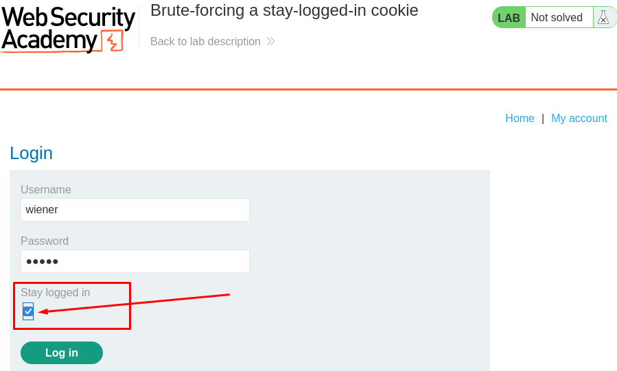
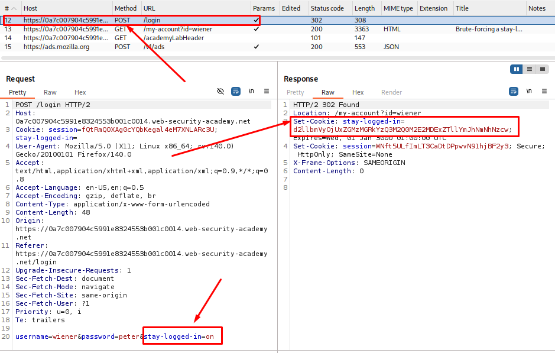
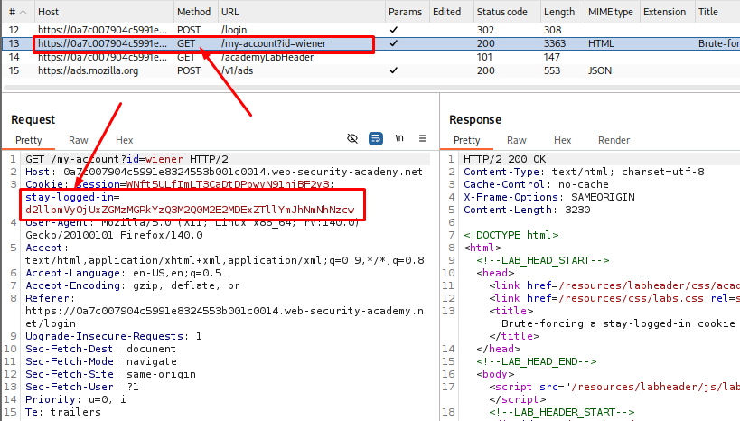
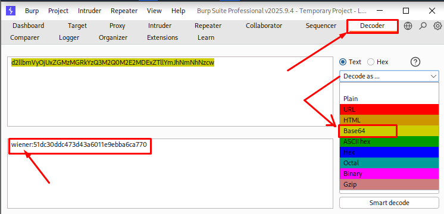
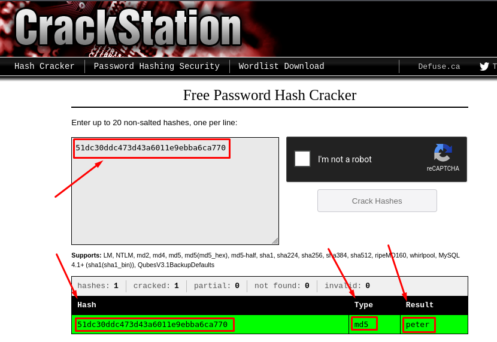
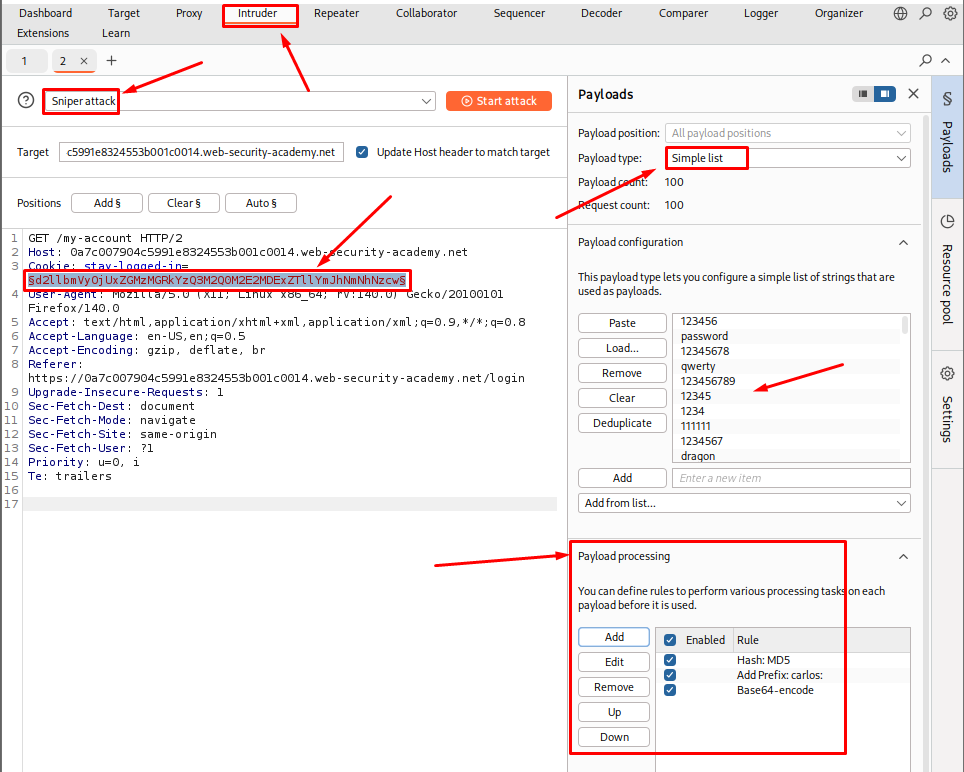
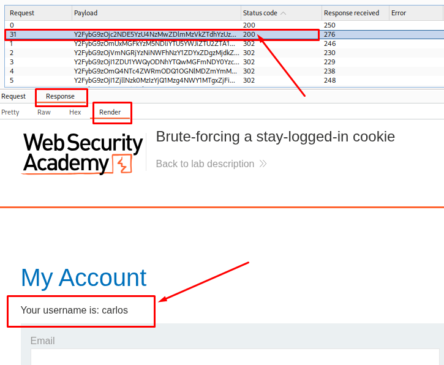
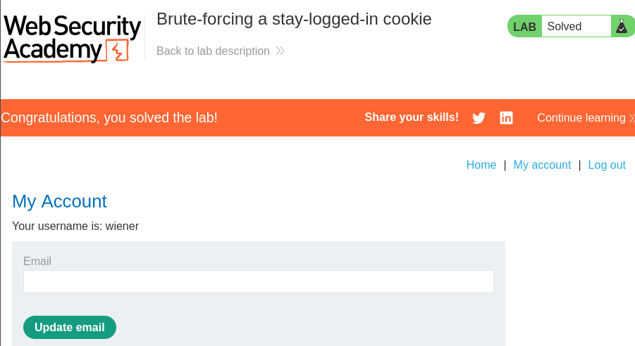

# Brute-Forcing a Stay-Logged-In Cookie

**Date:** October 2026 <br>
**Author:** ShahinSecLab <br>
**Category:** Authentication <br>
**Vulnerability:** Authentication Bypass via Cookie Forgery <br>
**Difficulty:** Practitioner <br>
**Platform:** PortSwigger Web Security Academy <br>
**Tools:** Burp Suite, Firefox <br>

## Table of Contents

* [Introduction](#introduction)
* [Attack Flow](#attack-flow)
* [Why This Attack Works](#why-this-attack-works)
* [Lab Setup](#lab-setup)
* [Tools Used](#tools-used)
* [Prerequisites](#prerequisites)
* [Step 1 — Login Page Recon](#step-1--login-page-recon)
* [Step 2 — Capturing the Stay-Logged-In Cookie](#step-2--capturing-the-stay-logged-in-cookie)
* [Step 3 — Decoding the Cookie](#step-3--decoding-the-cookie)
* [Step 4 — Setting Up Burp Intruder and Payload Processing](#step-4--setting-up-burp-intruder-and-payload-processing)
* [Step 5 — Running the Attack and Spotting the Valid Cookie](#step-5--running-the-attack-and-spotting-the-valid-cookie)
* [Step 6 — Logging In With the Forged Cookie](#step-6--logging-in-with-the-forged-cookie)
* [Detection](#detection)
* [Prevention](#prevention)
* [References](#references)
* [Key Takeaways](#key-takeaways)

## Introduction

This lab has a "Stay logged in" checkbox on the login page. Ticking it and logging in sets a cookie that keeps the session alive even after closing the browser. The problem is that this cookie value follows a predictable format, and the brute-force protection applied to the normal login form does not apply to this cookie mechanism. That opens the door to brute-forcing the cookie and taking over any account.

The goal was to:

1. Find how the stay-logged-in cookie is built.
2. Decode the cookie to confirm the username:hash format.
3. Brute-force the password through the cookie value.
4. Log in to Carlos's account.

## Attack Flow

```
[Login Page] --check "Stay logged in"--> [Valid Login]
       |
       v
[Cookie Set: stay-logged-in=base64(carlos:md5(password))]
       |
       v
[Intercept request with cookie in Burp]
       |
       v
[Send to Intruder, mark cookie value as payload position]
       |
       v
[Payload Processing: Hash(MD5) -> Add Prefix "carlos:" -> Encode Base64]
       |
       v
[Run attack against candidate passwords]
       |
       v
[Check response length/status for successful login]
       |
       v
[Replace cookie with winning value -> Access /my-account as carlos]
```

## Why This Attack Works

Most stay-logged-in cookies are built the same way every time, something like `base64(username:md5(password))`. Once I know that formula, I can take a password list, hash each one with MD5, stick the username in front, base64 encode the whole thing, and fire it off as a cookie. The server checks this cookie on every request, but it never applies any rate limiting or lockout here. The login form locks an account after a few wrong tries, but the cookie path skips that check entirely. That gap is the core weakness.

## Lab Setup

| Field | Value |
|---|---|
| Target | PortSwigger Web Security Academy |
| Lab Name | Brute-forcing a stay-logged-in cookie |
| Target Username | carlos |
| Vulnerable Mechanism | "Stay logged in" persistent cookie |
| Tool Used | Burp Suite Community Edition (Proxy, Intruder) |
| Wordlist | PortSwigger candidate passwords list |

## Tools Used
- Burp Suite Community Edition (Proxy, Intruder)
- Browser with Burp's proxy configured

## Prerequisites

* Burp Suite running with browser proxy configured
* PortSwigger's candidate passwords list downloaded
* Basic understanding of Burp Intruder payload processing rules (Hash, Add Prefix, Encode)

## Step 1 — Login Page Recon

I opened the login page and noticed a **Stay logged in** checkbox.

I checked the box and logged in with the test account provided by the lab. After logging in, I checked the cookies in Burp and found a new `stay-logged-in` cookie.

I then looked at this cookie to see how it works.

<p align="center">
  
</p>

## Step 2 — Capturing the Stay-Logged-In Cookie

I opened **Proxy → HTTP history** in Burp and found the login request.

In the response, I found a `Set-Cookie` header containing the `stay-logged-in` cookie.

The cookie value was a long string that looked like Base64. I saved the value because I wanted to check what information was stored inside it.

<p align="center">
  
</p>
<p align="center">
  
</p>


## Step 3 — Decoding the Cookie

I took the stay-logged-in cookie value from my own session and pasted it into Burp Decoder. With Base64 selected as the decode type, the value turned into a readable string made of two parts separated by a colon.

```
wiener:51dc30ddc473d43a6011e9ebba6ca770
```

| Field | Value | Description |
|---|---|---|
| Tool | Burp Decoder | Used to decode the cookie from Base64 |
| Encoded Input | `d2llbmVyOjUxZGMzMGRkYzQ3M2Q0M2E2MDExZTllYmJhNmNhNzcw` | Raw stay-logged-in cookie value |
| Decoded Output | `wiener:51dc30ddc473d43a6011e9ebba6ca770` | username:hash pair after decoding |

<p align="center">
  
</p>

The first part is the username, and the second part looked like a hash rather than a plain password. To confirm what kind of hash it was, I ran the string through CrackStation.

| Field | Value | Description |
|---|---|---|
| Tool | CrackStation (Free Password Hash Cracker) | Used to identify and crack the hash |
| Hash Submitted | `51dc30ddc473d43a6011e9ebba6ca770` | Hash portion from the decoded cookie |
| Type Identified | md5 | Confirms the hashing algorithm |
| Result | `peter` | Plaintext password behind the hash |

<p align="center">
  
</p>

This confirmed the cookie is built as `username:md5(password)`, encoded in Base64. Since I already know my own password, matching it against the cracked result just proved the formula. The next step is to apply the same formula against carlos's account, where the password is unknown.

## Step 4 — Setting Up Burp Intruder and Payload Processing

Before sending the request to Intruder, I had to clean it up a bit. I removed the `?id=wiener` parameter from the `GET /my-account?id=wiener` request line, and I also removed the `session` cookie, keeping only the `stay-logged-in` cookie in place. Without doing this, the attack did not succeed, since the leftover `id=wiener` and the active session cookie kept tying the request back to my own account instead of letting the forged `stay-logged-in` cookie decide who the request logs in as.

I sent the login request to Intruder and marked the entire `stay-logged-in` cookie value as the payload position, so only that value changes on each attempt.

| Field | Value | Description |
|---|---|---|
| Attack Type | Sniper | Single payload position attack |
| Payload Position | stay-logged-in cookie value | Full cookie value marked as the only payload marker |
| Payload Type | Simple list | Candidate passwords loaded from a wordlist |
| Payload Count | 100 | Number of passwords in the list |

Since the cookie has to follow the `username:md5(password)` format I worked out in the last step, I could not just throw raw passwords at the position. I needed Intruder to build that exact string for each payload before sending it. For this, I used the payload processing rules under Payload configuration, applied in order:

| Order | Rule | Description |
|---|---|---|
| 1 | Hash: MD5 | Converts each password in the list to its MD5 hash |
| 2 | Add Prefix: carlos: | Prepends the target username and colon to the hash |
| 3 | Base64-encode | Encodes the full `carlos:hash` string the same way the real cookie is encoded |

<p align="center">
  
</p>

With these three rules stacked, every payload going out is a properly formatted, Base64-encoded `carlos:md5(password)` cookie, built fresh from each word in the list. This way I was ready to brute-force carlos's password by replaying the cookie with each candidate and checking which response logs me in as carlos.

## Step 5 — Running the Attack and Spotting the Valid Cookie

After starting the attack, I checked the status code and response details for each attempt. Most wrong passwords redirected back to the login page with status 302 and a short response length, since an invalid cookie kills the session. One entry, request 31, stood out with status 200 and a much longer response length, meaning the server served the actual My Account page instead of redirecting.

| Field | Value | Description |
|---|---|---|
| Failed Attempts | Status 302, length ~173 | Invalid cookie, redirected to login |
| Successful Attempt | Status 200, length 3450 | Valid cookie, My Account page loaded directly |
| Confirmation | "Your username is: carlos" rendered in response | Confirms the session belongs to carlos |
| Password Found | Revealed in payload column for request 31 | Original candidate password behind the winning hash |

<p align="center">
  
</p>

## Step 6 — Logging In With the Forged Cookie

Once I had the password behind the valid payload, I rebuilt the same cookie value using the same processing chain and set it as the `stay-logged-in` cookie in the browser, then reloaded `/my-account`. The page loaded as carlos's account and the lab marked itself solved.

| Field | Value | Description |
|---|---|---|
| Final Step | Replace cookie in browser | Set the winning base64 value manually |
| Access Gained | /my-account as carlos | Confirms account takeover |
| Lab Status | Solved | Objective completed |

<p align="center">
  
</p>

## Detection

* A high volume of distinct `stay-logged-in` cookie values hitting the server from the same source IP in a short window (brute-force pattern)
* An unusual rate of failed authentication attempts arriving only through the cookie header, bypassing the login form entirely
* Repeated 302 redirects back to the login page tied to one IP, followed by a single 200 response — a signature of a successful brute-force hit

## Prevention

* Avoid predictable hashes inside persistent cookies; use a cryptographically random, server-side session token instead
* Apply the same rate limiting and account lockout to stay-logged-in cookie verification that the login form already has
* Replace MD5 with a salted, slow hashing algorithm (bcrypt, Argon2) to make both offline and online brute-force harder
* Keep no reversible or predictable user data inside the cookie value

## References

* PortSwigger Web Security Academy — Authentication vulnerabilities
* OWASP — Session Management Cheat Sheet

## Key Takeaways

* "Remember me" or "stay logged in" features often skip the security rules applied to the main login form, which creates a hidden attack surface
* Once the cookie structure is known (base64 plus a known hash algorithm), the whole authentication mechanism opens up to brute-forcing
* Chaining Burp Intruder's payload processing rules (Hash → Prefix → Encode) makes it possible to replicate a complex cookie format
* Rate limiting on the login form alone is not enough; every entry point into authentication needs the same coverage