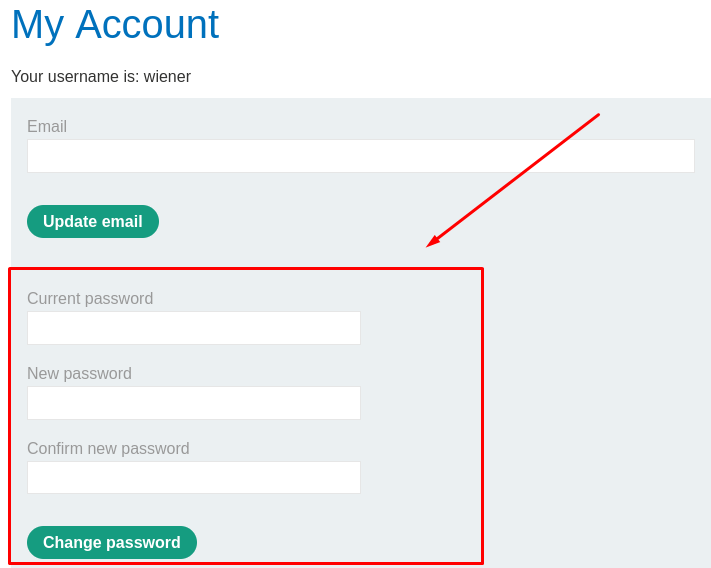
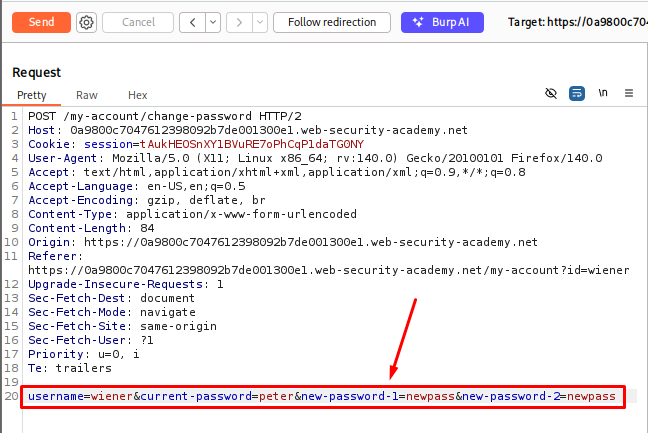
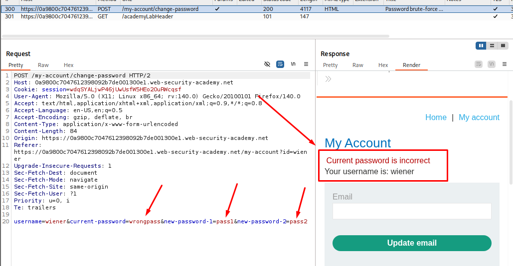
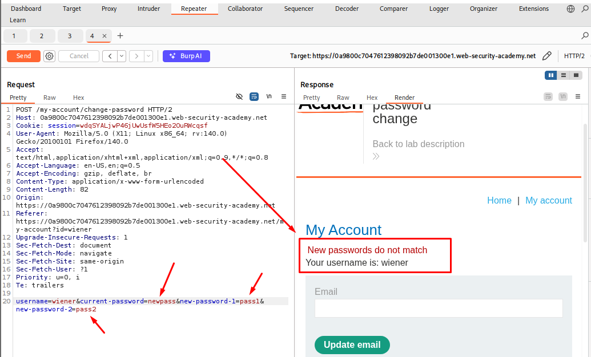
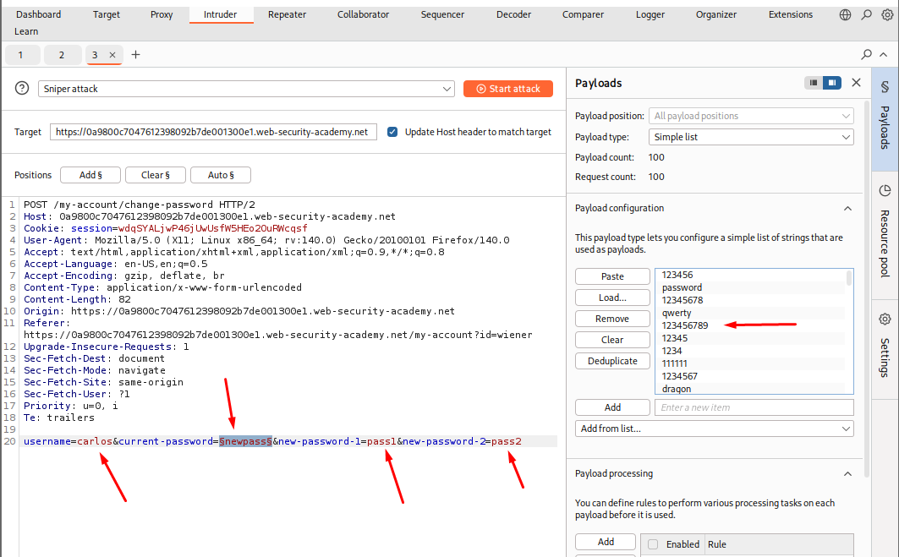
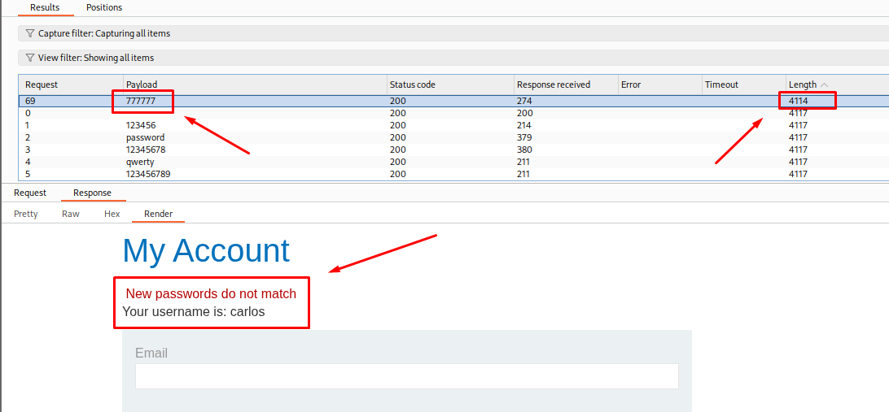
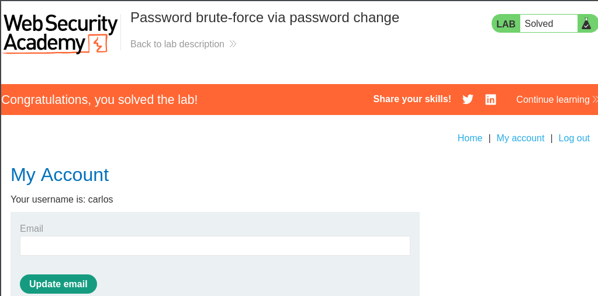

# Password Brute-Force via Password Change

**Date:** October 2026

**Author:** ShahinSecLab

**Category:** Authentication

**Vulnerability:** Password Brute-Force via Password Change

**Difficulty:** Practitioner

**Platform:** PortSwigger Web Security Academy

**Tools:** Burp Suite, Firefox

## Table of Contents

* [Introduction](#introduction)
* [Attack Flow](#attack-flow)
* [Why This Attack Works](#why-this-attack-works)
* [Lab Setup](#lab-setup)
* [Tools Used](#tools-used)
* [Prerequisites](#prerequisites)
* [Step 1 — Logging In to the Account](#step-1--logging-in-to-the-account)
* [Step 2 — Capturing the Password Change Request](#step-2--capturing-the-password-change-request)
* [Step 3 — Checking the Error Messages](#step-3--checking-the-error-messages)
* [Step 4 — Sending the Request to Intruder](#step-4--sending-the-request-to-intruder)
* [Step 5 — Brute-Forcing the Current Password](#step-5--brute-forcing-the-current-password)
* [Step 6 — Finding the Correct Password](#step-6--finding-the-correct-password)
* [Step 7 — Logging In as Carlos](#step-7--logging-in-as-carlos)
* [Detection](#detection)
* [Prevention](#prevention)
* [References](#references)
* [Key Takeaways](#key-takeaways)

## Introduction

This lab is vulnerable to **password brute-force attacks through the password change function**. The application returns different error messages depending on the values submitted in the password change request. I used this difference to find the correct current password by testing the candidate password list with Burp Intruder.

After finding the password, I logged in as Carlos and accessed his **My account** page.

The goal was to:

1. Log in using the provided credentials.
2. Capture and examine the password change request.
3. Check how the application responds to incorrect passwords.
4. Use Burp Intruder to test the candidate password list.
5. Find the correct password and log in as Carlos.

## Attack Flow

```text
[Login as wiener]
        |
        v
[Open My account page]
        |
        v
[Capture password change request]
        |
        v
[Send request to Burp Repeater]
        |
        v
[Check current password error message]
        |
        v
[Check new password mismatched error message]
        |
        v
[Send request to Burp Intruder]
        |
        v
[Load candidate password list]
        |
        v
[Compare responses]
        |
        v
[Find Carlos's current password]
        |
        v
[Login as Carlos]
        |
        v
[Access My account page]
        |
        v
[Lab solved]
```

## Why This Attack Works

The application handles incorrect current passwords differently from mismatched new passwords.

When I entered an incorrect current password, the application returned the message `Current password do not match`. When the two new password fields contained different values, it returned `New passwords do not match`.

These different responses helped me identify how the application checked the submitted values. By testing candidate passwords in the `current-password` parameter with Burp Intruder, I could identify the correct password from the response.

The application did not adequately prevent repeated password guesses, making this attack possible.

## Lab Setup

| Field | Value |
|---|---|
| Target | PortSwigger Web Security Academy |
| Lab Name | Password brute-force via password change |
| My Username | `wiener` |
| My Password | `peter` |
| Target Username | `carlos` |
| Vulnerable Function | Password change |
| Main Parameter | `current-password` |
| Attack Method | Password brute-force using error messages |

## Tools Used

- Burp Suite (Proxy, Repeater, Intruder)
- Firefox
- FoxyProxy
- PortSwigger-provided candidate password list

## Prerequisites

* A running PortSwigger Web Security Academy lab
* Burp Suite connected to Firefox
* Basic knowledge of HTTP requests and response messages
* Familiarity with Burp Proxy, Repeater, and Intruder
* The candidate password list provided by the lab

## Step 1 — Logging In to the Account

I opened the lab in Firefox and logged in using the credentials provided by PortSwigger.

```text
Username: wiener
Password: peter
```

After logging in, I opened the My account page and located the password change form.

<p align="center">
  
</p>

## Step 2 — Capturing the Password Change Request

I enabled FoxyProxy and selected the Burp proxy configuration.

Then I opened **Burp → Proxy → HTTP history**. I opened the password change page and changed my password from `peter` to `newpass`. I found the request sent to `/my-account/change-password` and sent it to Burp Repeater.

The request contained these parameters:

```text
username=wiener&current-password=peter&new-password-1=newpass&new-password-2=newpass
```

The `current-password` parameter was the main focus because I wanted to test different possible current passwords.

<p align="center">
  
</p>

## Step 3 — Comparing the Error Messages

I used Burp Repeater to test how the application handled different password values.

First, I entered an incorrect current password while keeping both new password fields the same:

```text
username=wiener&current-password=wrongpass&new-password-1=pass1&new-password-2=pass2
```

The response showed:

```text
Current password is incorrect
```
<p align="center">
  
</p>

Next, I used the correct current password, `newpass`, but kept the two new password fields different:

```text
username=wiener&current-password=newpass&new-password-1=pass1&new-password-2=pass2
```

This time, the response showed:

```text
New passwords do not match
```
<p align="center">
  
</p>

This confirmed that the application checked the current password before checking whether the new passwords matched, and that the two checks returned different error messages.

## Step 4 — Brute-Forcing Carlos's Current Password

I sent the password change request to Burp Suite Intruder and changed the username to `carlos`. I kept the two new password fields different, `pass1` and `pass2`, so the right current password would stand out with a different response.

I set the payload position on the `current-password` parameter and chose a Sniper attack. The request looked like this:

```text
username=carlos&current-password=§newpass§&new-password-1=pass1&new-password-2=pass2
```

In the Payloads tab, I loaded a simple list of common passwords.

<p align="center">
  
</p>

I ran the attack and sorted the results by response length. Most of the payloads came back around the same length, 4117, with the message `Current password is incorrect`. But one payload, `777777`, came back with a different length, 4114, and a status code of 200.

I opened that response and saw this message:

```text
New passwords do not match
```

Behind that message, the **My Account** page was already loading, with the username showing as `carlos`. So `777777` had to be Carlos's current password — it passed the current-password check and only failed on the new-password mismatch.

<p align="center">
  
</p>

## Step 5 — Logging In as Carlos

I went back to the login page and logged in as `carlos` using the password I found, `777777`.

| Field | Value | Description |
|---|---|---|
| Username | `carlos` | Target account |
| Password | `777777` | Password found through Intruder |
| Result | My account page opened | Lab solved |

It worked. The My account page opened for Carlos, and the lab was marked as solved.

<p align="center">
  
</p>

## Detection

* Repeated password change requests from the same session or IP address
* Many requests containing different values in the `current-password` parameter
* Repeated failed current-password checks
* Unusual request patterns targeting the same account
* A high number of password change attempts within a short period

## Prevention

* Apply rate limiting to repeated current-password attempts.
* Add temporary restrictions after several failed attempts.
* Avoid returning different error messages that reveal which password check failed.
* Monitor repeated password change requests and alert users about suspicious activity.
* Require proper authentication before allowing sensitive account changes.
* Use the authenticated session to identify the account being changed instead of trusting a user-controlled username parameter.

## References

* [PortSwigger Web Security Academy — Authentication](https://portswigger.net/web-security/authentication)
* [PortSwigger — Lab: Password brute-force via password change](https://portswigger.net/web-security/authentication/other-mechanisms/lab-password-brute-force-via-password-change)
* [OWASP — Authentication Cheat Sheet](https://cheatsheetseries.owasp.org/cheatsheets/Authentication_Cheat_Sheet.html)

## Key Takeaways

* Password change functions can expose weaknesses in password validation.
* Different error messages can reveal whether a password guess is correct.
* Burp Repeater helps test how an application handles different inputs.
* Burp Intruder can automate testing a candidate password list.
* Rate limiting and clear authentication checks help prevent password brute-force attacks.