# Username Enumeration via Response Timing

**Date:** October 2026 <br>
**Author:** ShahinSecLab <br>
**Category:** Authentication <br>
**Vulnerability:** Username Enumeration (Timing-Based) <br>
**Difficulty:** Expert <br>
**Platform:** PortSwigger Web Security Academy <br>
**Tools:** Burp Suite, Firefox


## Table of Contents

* [Introduction](#introduction)
* [Attack Flow](#attack-flow)
* [Why This Attack Works](#why-this-attack-works)
* [Lab Setup](#lab-setup)
* [Tools Used](#tools-used)
* [Prerequisites](#prerequisites)
* [Step 1 — Testing the Login Request](#step-1--testing-the-login-request)
* [Step 2 — Bypassing the IP Block](#step-2--bypassing-the-ip-block)
* [Step 3 — Noticing the Timing Difference](#step-3--noticing-the-timing-difference)
* [Step 4 — Finding a Valid Username with Intruder](#step-4--finding-a-valid-username-with-intruder)
* [Step 5 — Finding the Password](#step-5--finding-the-password)
* [Step 6 — Logging in](#step-6--logging-in)
* [How Defenders Can Catch This](#how-defenders-can-catch-this)
* [How to Prevent It](#how-to-prevent-it)
* [References](#references)
* [Lessons Learned](#lessons-learned)


## Introduction

This lab shows a harder version of username enumeration, where the application does not leak anything in the error message or the status code. Instead, it leaks through time.

The login form checks the username first. If the username exists, the application goes on to hash the password before rejecting the login. Hashing takes time, and that time grows with the length of the password that was submitted. If the username does not exist, the application skips this step and replies almost instantly.

This small delay is enough to tell a valid username apart from an invalid one, without ever seeing a different error message.

On top of that, the lab blocks an IP address after too many failed logins, so brute forcing has to get around that block as well. The application trusts the `X-Forwarded-For` header to decide where a request is coming from, and that header can be changed freely in each request.


## Attack Flow

```text
Send Invalid Login Request to Repeater
        │
        ▼
Notice IP Gets Blocked After Many Attempts
        │
        ▼
Add X-Forwarded-For Header to Spoof IP
        │
        ▼
Notice Response Time Increases for Valid Username
        │
        ▼
Send Request to Intruder (Pitchfork Attack)
        │
        ▼
Payload 1: X-Forwarded-For (Numbers 1-100)
        │
        ▼
Payload 2: Username List, Long Password
        │
        ▼
Sort by Response Time, Find the Outlier
        │
        ▼
Confirm the Username by Repeating the Request
        │
        ▼
New Intruder Attack: Password List + Spoofed IP
        │
        ▼
Find Request Returning 302
        │
        ▼
Login with Found Credentials
```


## Why This Attack Works

The application does its password check only after it confirms the username is real. Checking a password means hashing it, and hashing a long string takes measurably longer than hashing a short one or skipping the step entirely.

So:

* Invalid username → no hashing happens → fast, flat response time.
* Valid username → password gets hashed → response time grows with password length.

By sending one very long password against many candidate usernames, the one request that takes noticeably longer points straight to the valid username, even though the error message and status code look identical every time.

The IP block is handled separately. Since the server reads the client's IP from the `X-Forwarded-For` header instead of the real connection, each request in Intruder can carry a different fake IP, so the block never triggers.


## Lab Setup

| Component              | Details                                     |
| ----------------------- | -------------------------------------------- |
| **Attacker Machine**     | Kali Linux                                   |
| **Target**               | PortSwigger Web Security Academy             |
| **Lab**                  | Username enumeration via response timing     |
| **Tool**                 | Burp Suite Repeater and Intruder             |
| **Browser**              | Firefox                                      |
| **Vulnerability Type**   | Username Enumeration (Timing Side-Channel)   |
| **Target Account**       | Lab-provided user                            |


## Tools Used

| Tool                    | Purpose                                      |
| ------------------------ | --------------------------------------------- |
| **Burp Suite Proxy**      | Capture the login request                    |
| **Burp Suite Repeater**   | Test the IP block and the timing difference  |
| **Burp Suite Intruder**   | Run the Pitchfork attack for username and password |
| **Firefox**               | Access the lab and login page                |


## Prerequisites

* Burp Suite installed
* Firefox configured to proxy through Burp
* Access to the PortSwigger lab
* A list of candidate usernames
* A list of candidate passwords
* Understanding of Burp Intruder's Pitchfork attack type


## Step 1 — Testing the Login Request

I opened the login page and submitted an invalid username and password to capture the request in **Proxy → HTTP history**.

I sent this request to **Repeater** and kept resending it with different usernames and passwords to see how the application behaved.

After enough failed attempts, the application started blocking my IP address and returning an error instead of the normal login page.

<p align="center">
  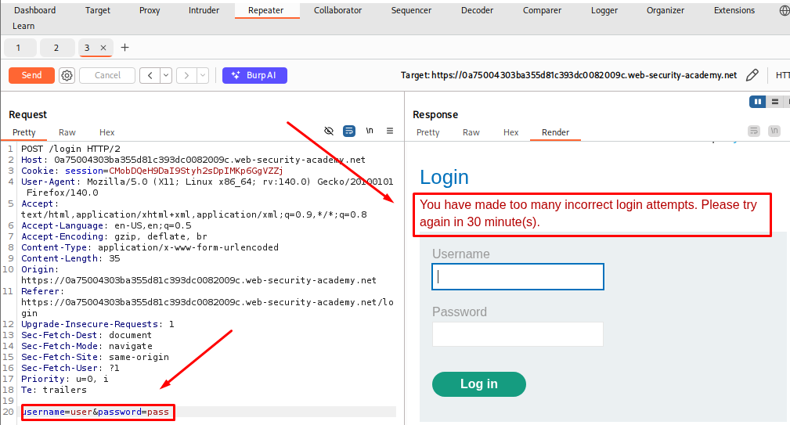
</p>

## Step 2 — Bypassing the IP Block

While looking through the request in Repeater, I noticed it accepted an `X-Forwarded-For` header.

I added the header manually:

```text
X-Forwarded-For: 1
```

Changing this value to a different number each time let me send fresh requests without triggering the IP block again, since the server trusted this header to decide where the request came from.

<p align="center">
  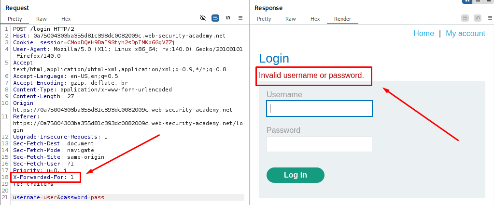
</p>


## Step 3 — Noticing the Timing Difference

With the IP block sorted out, I went back to trying different usernames in Repeater, keeping an eye on the response time shown at the bottom of the panel.

Most usernames came back fast, and the speed stayed about the same every single time.

<p align="center">
  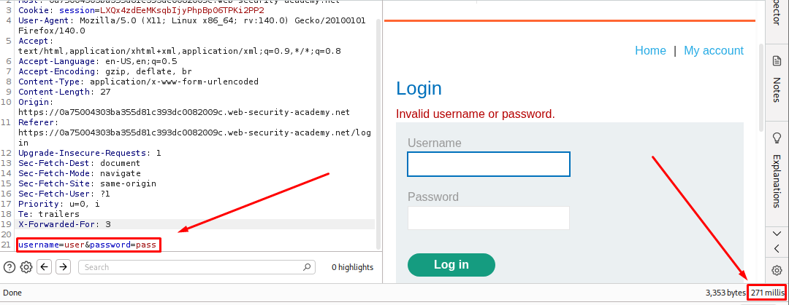
</p>

But when I tried my own lab username, the reply took a bit longer than usual. And the longer the password I typed, the longer that delay got.

<p align="center">
  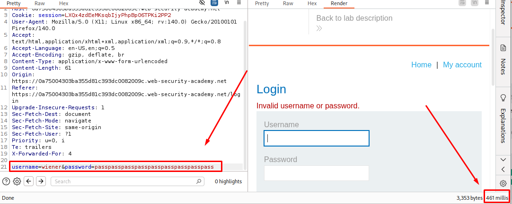
</p>

<p align="center">
  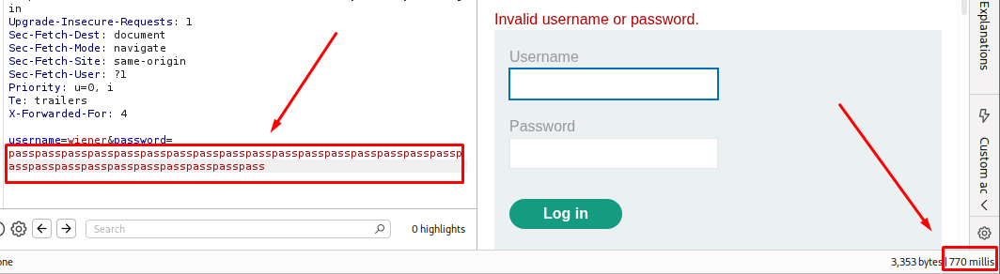
</p>

That was the clue. The extra time only showed up when hashing was actually happening in the background, and hashing only happens if the username is real.


## Step 4 — Finding a Valid Username with Intruder

I sent the login request to **Intruder** and set the attack type to:

```text
Pitchfork
```

I added two payload positions:

```text
X-Forwarded-For: §1§
username=user&password=passpasspasspasspasspasspasspasspasspasspasspasspasspass
```

The password field was left as one very long fixed string, not a payload, so every request would take the same extra time if the username turned out to be valid.

<p align="center">
  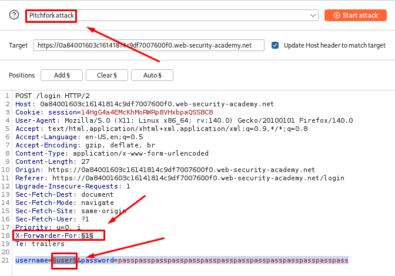
</p>

### Setting the Payloads

For payload position 1, I chose:

```text
Payload type: Numbers
Range: 1 - 100
Step: 1
Max fraction digits: 0
```

This spoofed a new IP for every request.

<p align="center">
  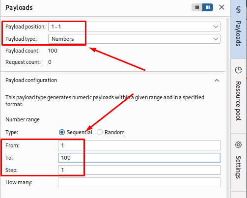
</p>

For payload position 2, I loaded a list of candidate usernames provided by the lab.

I started the attack.

<p align="center">
  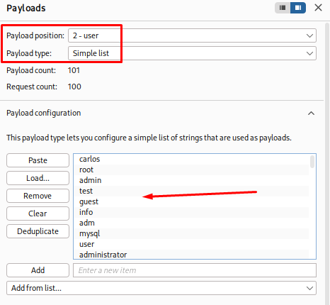
</p>

### Checking the Results

Once the attack finished,I sorted the results by the Response received column, and one row jumped out right away. Most requests were sitting around 280-380 ms, but one request came back at 538 ms, well above everything else.

The username on that row was:

```text
alpha
```
I repeated that same request a few times in Repeater to make sure it was consistently slower and not just a one-off delay, then made a note of the username.

<p align="center">
  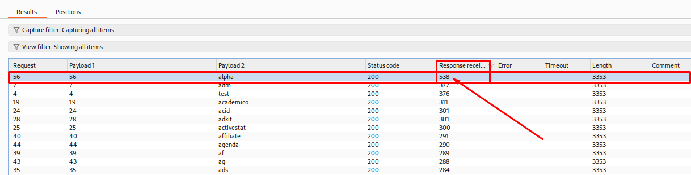
</p>

## Step 5 — Finding the Password

I created a new Intruder attack from the same base request, still using **Pitchfork**.

I added the `X-Forwarded-For` header again as a payload position, and set the username to the one I had just found, with the password field now marked as the second payload position:

```text
X-Forwarded-For: §1§
username=alpha&password=pass
```

For payload position 1, I loaded the same list of numbers to keep spoofing the IP.

For payload position 2, I loaded my password list.

I started the attack.

### Checking the Results

I looked through the responses for a status code of:

```text
302 Found
```

One request matched. I made a note of the password from that request.

The password on that row was:

```text
charlie
```

<p align="center">
  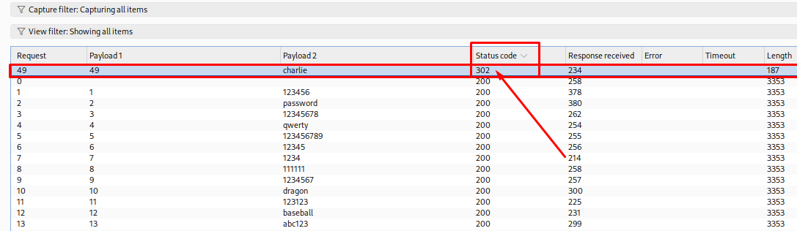
</p>

## Step 6 — Logging in

I went back to the login page and entered the username and password I had found.

The login was successful, and the user account page confirmed the lab was solved.

<p align="center">
  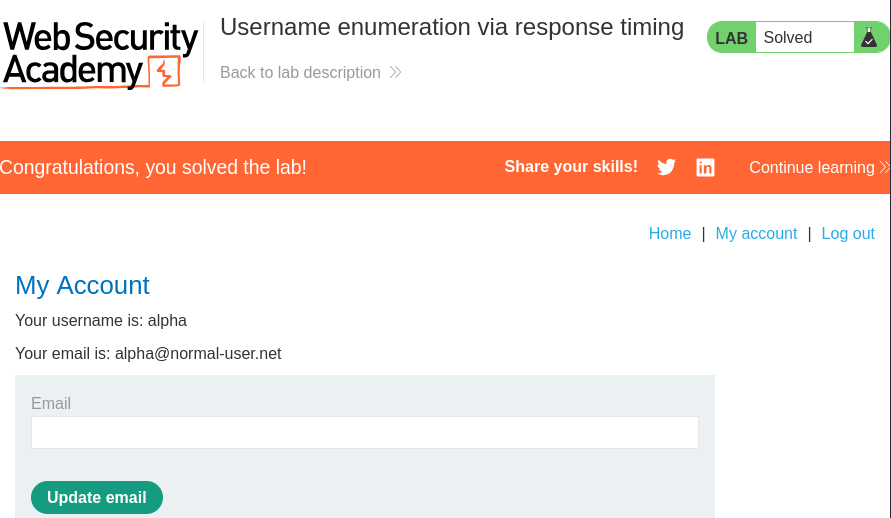
</p>


## How Defenders Can Catch This

* Repeated login requests carrying different `X-Forwarded-For` values from what looks like one real client.
* A high volume of login attempts spread across many spoofed IPs in a short window.
* Login requests with unusually long password fields.
* Measurable, consistent timing differences between responses for different usernames.
* Automated tooling patterns such as fixed intervals between requests or identical header sets.


## How to Prevent It

### 1. Keep Response Time Constant

The application should take the same amount of time to respond whether the username exists or not. This can be done by always performing a dummy hash operation even when the username is invalid.

### 2. Do Not Trust Client-Supplied Headers for IP Identification

Rate limiting and IP blocking should rely on the real connecting IP address, not on a header like `X-Forwarded-For` that the client can set freely, unless the application sits behind a trusted proxy that sets this header itself.

### 3. Rate Limit by Account, Not Just by IP

Limiting login attempts per username, in addition to per IP, reduces the value of IP spoofing as a bypass.

### 4. Cap Password Length Early

Rejecting excessively long passwords before they reach the hashing step removes the lever an attacker needs to amplify the timing difference.

### 5. Monitor for Timing Anomalies

Logging and alerting on login requests that take significantly longer than the baseline can catch this kind of probing early.


## References

| Resource                                                                      | Link                                                                                                                                    |
| ------------------------------------------------------------------------------ | ------------------------------------------------------------------------------------------------------------------------------------- |
| **PortSwigger Web Security Academy — Username enumeration via response timing** | [PortSwigger Lab](https://portswigger.net/web-security/authentication/password-based/lab-username-enumeration-via-response-timing) |
| **OWASP — Authentication Cheat Sheet**                                          | [OWASP Authentication Cheat Sheet](https://cheatsheetseries.owasp.org/cheatsheets/Authentication_Cheat_Sheet.html)                      |


## Lessons Learned

* A timing difference can leak information even when every visible part of the response looks identical.
* Password hashing time grows with password length, and this can be turned into a side channel.
* Headers like `X-Forwarded-For` should never be trusted blindly for security controls like rate limiting.
* Burp Intruder's Pitchfork attack is useful when two payload positions need to move together, like a spoofed IP and a username.
* Sorting Intruder results by response time can reveal outliers that error messages or status codes would never show.
* Small, consistent delays are often more reliable indicators than any single response field.