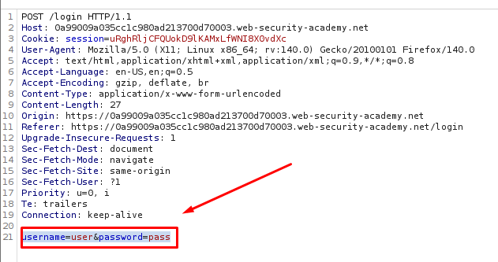
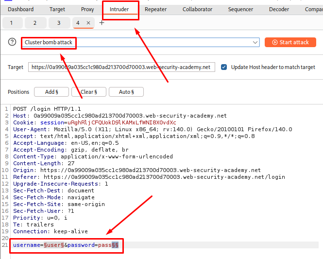
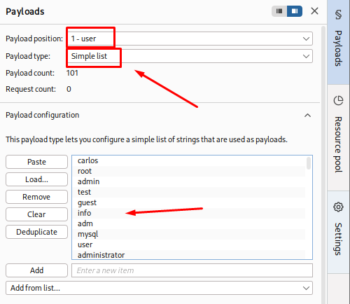
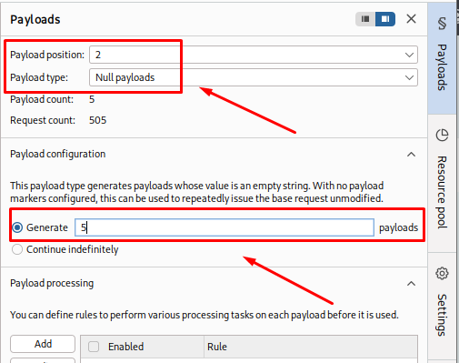
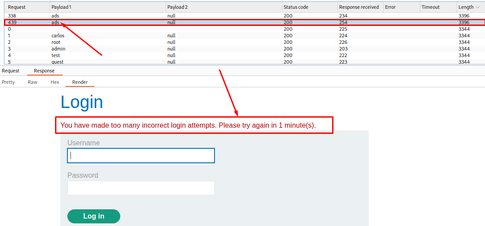
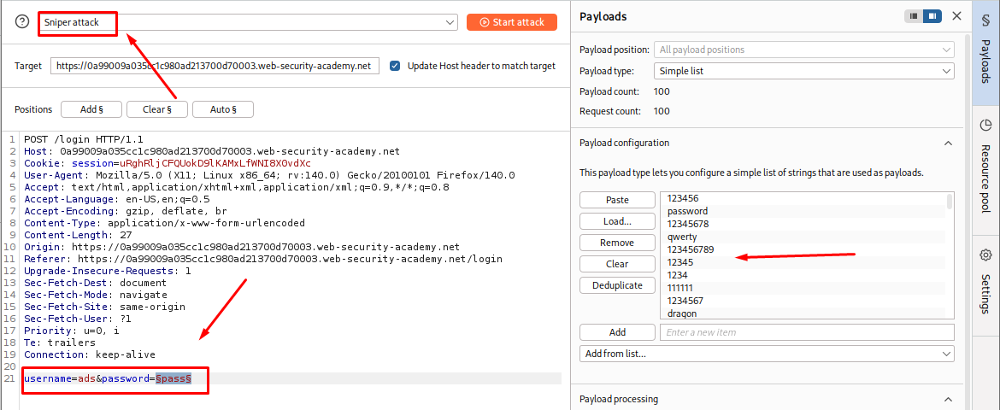
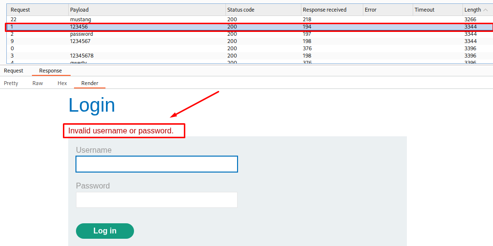
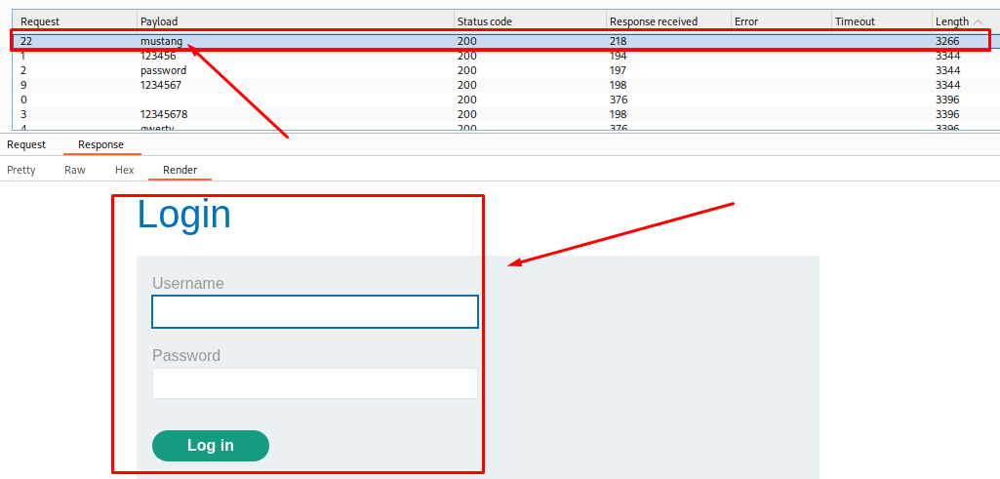

# Username Enumeration via Account Locking

**Date:** October 2026 <br>
**Author:** ShahinSecLab <br>
**Category:** Authentication <br>
**Vulnerability:** Username Enumeration / Broken Account Locking <br>
**Difficulty:** Practitioner <br>
**Platform:** PortSwigger Web Security Academy <br>
**Tools:** Burp Suite, Firefox

## Table of Contents

* [Introduction](#introduction)
* [Attack Flow](#attack-flow)
* [Why This Works](#why-this-works)
* [Lab Setup](#lab-setup)
* [Tools Used](#tools-used)
* [Prerequisites](#prerequisites)
* [Step 1 — Testing the Login Request](#step-1--testing-the-login-request)
* [Step 2 — Setting Up Burp Intruder Cluster Bomb Attack](#step-2--setting-up-burp-intruder-cluster-bomb-attack)
* [Step 3 — Configuring Payloads](#step-3--configuring-payloads)
* [Step 4 — Brute-Forcing the Password](#step-4--brute-forcing-the-password)
* [Step 5 — Finding the Valid Password](#step-5--finding-the-valid-password)
* [Step 6 — Logging in to Solve the Lab](#step-6--logging-in-to-solve-the-lab)
* [How Defenders Can Catch This](#how-defenders-can-catch-this)
* [How to Fix It](#how-to-fix-it)
* [References](#references)
* [Lessons Learned](#lessons-learned)

## Introduction

This lab is vulnerable to username enumeration.

The application uses account locking to prevent repeated login attempts. However, the login responses are slightly different when a valid username becomes locked.

This difference can be used to identify a valid username.

After finding a valid username, the password can be brute-forced by checking the response for a different error message.

The goal is to:

1. Find a valid username.
2. Brute-force the user's password.
3. Log in and access the account page.

## Attack Flow

```text
Send an Invalid Login Request
        │
        ▼
Send the Request to Burp Intruder
        │
        ▼
Use Cluster Bomb Attack
        │
        ▼
Repeat Each Username 5 Times
        │
        ▼
Compare Response Lengths and Error Messages
        │
        ▼
Find the Username That Gets Account-Locked
        │
        ▼
Set Up a New Intruder Attack
        │
        ▼
Use Sniper Attack Against the Password
        │
        ▼
Add the Password List
        │
        ▼
Create a Grep Extract Rule for the Error Message
        │
        ▼
Find the Password With No Error Message
        │
        ▼
Wait for the Account Lock to Reset
        │
        ▼
Log In and Access the Account Page
```

## Why This Works

The application locks an account after too many incorrect login attempts.

Normally, this should make password brute-forcing difficult.

However, the application returns a different response when a valid username reaches the account lock limit.

For example:

```text
Invalid username or password.
```

After several attempts with a valid username:

```text
You have made too many incorrect login attempts.
```

This difference makes it possible to tell which usernames are valid.

Once the valid username is found, the password can be tested separately.

During the password attack, most incorrect passwords return an error message. The correct password returns a different response without the login error message.

This makes the correct password easy to identify.

## Lab Setup

| **Component**      | **Details**                              |
| ------------------ | ----------------------------------------- |
| Attacker Machine   | Kali Linux                               |
| Target             | PortSwigger Web Security Academy Lab     |
| Lab                | Username enumeration via account locking |
| Tool               | Burp Suite Intruder                      |
| Browser            | Firefox                                  |
| Vulnerability Type | Username Enumeration / Logic Flaw        |


## Tools Used

| **Tool**         | **Purpose**                                 |
| ---------------- | -------------------------------------------- |
| Burp Suite Proxy | Capture the login request                   |
| Burp Intruder    | Test usernames and brute-force the password |
| Firefox          | Access the login page and confirm the solve |

## Prerequisites

* Burp Suite Community or Professional installed
* Browser proxy configured to route through Burp
* Access to PortSwigger Web Security Academy
* A list of possible usernames
* A list of possible passwords

## Step 1 — Testing the Login Request

I opened the login page and submitted an invalid username and password.

For example:

```text
Username: user
Password: pass
```
The application gave me an error:

```text
Invalid username or password.
```

I then opened **Burp Suite → Proxy → HTTP history** and found the login request:

```http
POST /login
```

The request contained the username and password parameters:

```text
username=user&password=pass
```

<p align="center">
  
</p>

## Step 2 — Setting Up Burp Intruder Cluster Bomb Attack

I sent the `POST /login` request to **Burp Intruder**.

I selected **Cluster bomb** from the attack type drop-down menu.

First, I added a payload position to the username parameter:

```text
username=§user§&password=pass
```

Then, I added another blank payload position at the end of the request body:

```text
username=§user§&password=pass§§
```

I added this second position so I could repeat each username multiple times during the attack. I explain how I configured it in the next step.

<p align="center">
  
</p>

## Step 3 — Configuring Payloads

### Payload Set 1 — Usernames

I added the username list to the first payload position provided by the lab.

<p align="center">
  
</p>

### Payload Set 2 — Null Payloads

For the second payload position, I selected **Null payloads**.

Then, I set the number of generated payloads to **5**.

This caused each username to be submitted 5 times with the same password.

For example:

```text
user
user
user
user
user
```

This allowed me to test each username multiple times and check if any username triggered the account-locking response.

<p align="center">
  
</p>

I started the attack.

### Finding the Valid Username

After the attack finished, I compared the responses.

Most usernames returned responses with similar lengths.

One username returned a longer response.

After checking the response, I found the following message:

```text
You have made too many incorrect login attempts. Please try again in 1 minute(s).
```
<p align="center">
  
</p>

This showed that the account had been locked.

The valid username was:

```text
ads
```

## Step 4 — Brute-Forcing the Password

I created a new Burp Intruder attack using the same `POST /login` request.

Selected **Sniper** as the attack type. Set the username to the valid username:

```text
username=ads
```

Added a payload position to the password parameter:

```text
password=§pass§
```

The final request looked similar to:

```text
username=ads&password=§pass§
```

Added the password list to the payload set provided by lab.

<p align="center">
  
</p>

And again I started the attack.

## Step 5 — Finding the Valid Password

After the attack finished, I noticed that most password attempts returned an error message.

```text
Invalid username or password
```
<p align="center">
  
</p>

However, one response did not contain the error message.

<p align="center">
  
</p>

This response was different from the failed attempts, so I checked the password used in that request.

The password was:

```text
mustang
```

The credentials were:

```text
Username: ads
Password: mustang
```

## Step 6 — Logging in to Solve the Lab

I returned to the login page and entered the username and password found during the attacks.

```text
Username: ads
Password: mustang
```

The login was successful.

The account page loaded successfully, which confirmed that the lab was solved.

## How Defenders Can Catch This

* Monitor repeated failed login attempts against the same username.
* Watch for multiple usernames being tested from the same source.
* Alert on unusual account-locking activity.
* Monitor repeated login attempts with different usernames and passwords.
* Log and review differences in authentication responses.

## How to Fix It

**1. Use the same response for valid and invalid usernames**

The application should not reveal whether a username exists through different error messages.

**2. Avoid revealing account lock status**

Messages such as:

```text
You have made too many incorrect login attempts.
```

can help attackers identify valid usernames.

Use a generic response instead.

**3. Apply rate limiting carefully**

Rate limiting should not reveal whether an account exists.

**4. Use MFA**

Multi-factor authentication adds another layer of protection even if a password is discovered.

## References

| **Resource**                                                                | **Link**                         |
| ----------------------------------------------------------------------------- | ----------------------------------- |
| PortSwigger Web Security Academy — Username enumeration via account locking | PortSwigger Lab                  |
| OWASP — Authentication Cheat Sheet                                          | OWASP Authentication Cheat Sheet |

## Lessons Learned

* Different login responses can reveal valid usernames.
* Account locking can sometimes help attackers instead of stopping them.
* Response length can be useful when comparing login attempts.
* A different error message can reveal the state of an account.
* After finding a valid username, password attacks can be performed against that account.
* Authentication errors should reveal as little information as possible.