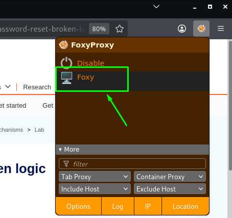

# Username Enumeration via Response Differences

**Date:** October 2026
**Author:** ShahinSecLab
**Category:** Authentication
**Vulnerability:** Username Enumeration
**Difficulty:** Easy
**Platform:** PortSwigger Web Security Academy
**Tools:** Burp Suite, Firefox

---

## Table of Contents

* [Introduction](#introduction)
* [Attack Flow](#attack-flow)
* [Why This Attack Works](#why-this-attack-works)
* [Lab Setup](#lab-setup)
* [Tools Used](#tools-used)
* [Prerequisites](#prerequisites)
* [Step 1 — Configuring FoxyProxy](#step-1--configuring-foxyproxy)
* [Step 2 — Testing the Login Request](#step-2--testing-the-login-request)
* [Step 3 — Finding a Valid Username](#step-3--finding-a-valid-username)
* [Step 4 — Finding the Password](#step-4--finding-the-password)
* [Step 5 — Logging in](#step-5--logging-in)
* [How Defenders Can Catch This](#how-defenders-can-catch-this)
* [How to Prevent It](#how-to-prevent-it)
* [References](#references)
* [Lessons Learned](#lessons-learned)

---

## Introduction

This lab shows how a small difference in a login error message can reveal a valid username.

The application normally returns:

```text
Invalid username or password.
```

But when a valid username is used, the response contains a small difference:

```text
Invalid username or password  
```

Instead of a full stop/period, there is a trailing space at the end of the message.

This small difference can be used to find a valid username from a list of possible usernames.

After finding the username, the same login endpoint can be tested with a list of passwords to find the correct password.

---

## Attack Flow

```text
Send Invalid Login Request
        │
        ▼
Send Username Parameter to Intruder
        │
        ▼
Add Candidate Usernames
        │
        ▼
Use Grep - Extract to Find Error Message
        │
        ▼
Find Response with Different Error Message
        │
        ▼
Identify Valid Username
        │
        ▼
Test Password List with Intruder
        │
        ▼
Find Request Returning 302
        │
        ▼
Login with Found Credentials
```

---

## Why This Attack Works

The application gives slightly different responses when the username is valid or invalid.

Most invalid usernames return:

```text
Invalid username or password.
```

One username returns a slightly different message because instead of a full stop/period, there is a trailing space at the end of the message:

```text
Invalid username or password  
```

Even though the difference is very small, Burp Intruder can extract and compare the response text.

This makes it possible to identify a valid username.

After finding the username, the same technique can be used to test a password list.

---

## Lab Setup

| Component              | Details                                             |
| ---------------------- | --------------------------------------------------- |
| **Attacker Machine**   | Kali Linux                                          |
| **Target**             | PortSwigger Web Security Academy                    |
| **Lab**                | Username enumeration via subtly different responses |
| **Tool**               | Burp Suite Intruder                                 |
| **Browser**            | Firefox                                             |
| **Vulnerability Type** | Username Enumeration                                |
| **Target Account**     | Lab-provided user                                   |

---

## Tools Used

| Tool                    | Purpose                                 |
| ----------------------- | --------------------------------------- |
| **FoxyProxy**           | Send Firefox traffic through Burp Suite |
| **Burp Suite Proxy**    | Capture and inspect login requests      |
| **Burp Suite Intruder** | Test usernames and passwords            |
| **Firefox**             | Access the lab and login page           |

---

## Prerequisites

* Burp Suite installed
* Firefox configured with FoxyProxy
* Access to the PortSwigger lab
* A list of candidate usernames
* A list of candidate passwords
* Basic understanding of HTTP POST requests

---

## Step 1 — Configuring FoxyProxy

Before starting the lab, I turned on **FoxyProxy** in Firefox and selected the Burp Suite proxy.

This sends the Firefox traffic through Burp Suite so I can see the requests.

I checked **Burp Suite → Proxy → HTTP history** to make sure the requests were showing up.

<p align="center">
  
</p

---

## Step 2 — Testing the Login Request

I opened the login page and submitted an invalid username and password.

For example:

```text
Username: invalid-user
Password: invalid-password
```

I then opened **Burp Suite → Proxy → HTTP history** and found the login request:

```http
POST /login
```

The request contained the username and password parameters:

```text
username=invalid-user&password=invalid-password
```

I highlighted the username parameter and sent the request to **Burp Intruder**.

---

## Step 3 — Finding a Valid Username

I opened the **Intruder** tab.

Burp automatically marked the username as the payload position.

The request looked like:

```text
username=§invalid-user§&password=invalid-password
```

### Adding the Username List

In the **Payloads** tab, I selected:

```text
Simple list
```

I then added the list of possible usernames.

### Using Grep - Extract

Next, I opened the **Settings** tab.

Under:

**Grep - Extract**

I clicked:

**Add**

A response appeared in the dialog.

I scrolled through the response and found:

```text
Invalid username or password.
```

I highlighted this message.

Burp automatically selected the required settings.

I clicked **OK** and started the attack.

### Checking the Results

When the attack finished, Burp added another column containing the extracted error message.

I sorted the results using this column.

Most responses contained:

```text
Invalid username or password.
```

But one response was slightly different:

```text
Invalid username or password. 
```

The difference was a **space after the period**.

This showed that the username in that request was valid.

I made a note of that username.

---

## Step 4 — Finding the Password

After finding the valid username, I closed the Intruder results window and returned to the **Intruder** tab.

I changed the request so that the username was fixed and the password became the payload position.

The request looked like:

```text
username=identified-user&password=§invalid-password§
```

I then opened the **Payloads** tab.

I cleared the username list and added the list of possible passwords.

I started the attack again.

### Checking the Results

When the attack finished, I checked the HTTP status codes.

One request returned:

```text
302 Found
```

This was different from the other failed login attempts.

I made a note of the password from that request.

---

## Step 5 — Logging in

I returned to the login page and entered the username and password found during the attacks.

```text
Username: identified-user
Password: identified-password
```

The login was successful.

I then opened the user account page and the lab was solved.

---

## How Defenders Can Catch This

Security teams can look for signs of username enumeration and automated login attempts, such as:

* Many login requests with different usernames.
* Many login attempts from the same IP address.
* Large numbers of failed login attempts in a short time.
* Requests with usernames from common username lists.
* Repeated password attempts against the same account.
* Unusual use of automated tools against the login endpoint.

---

## How to Prevent It

### 1. Use the Same Error Message

The application should return the same message for both invalid usernames and invalid passwords.

For example:

```text
Invalid username or password.
```

The response should not change based on whether the username exists.

### 2. Keep Response Details the Same

The response should also avoid differences in:

* Error messages
* HTTP status codes
* Response length
* Response timing
* Redirect behavior

These differences can give attackers useful information.

### 3. Add Login Rate Limiting

Limit the number of login attempts from a single IP address or account over a period of time.

### 4. Add Account Protection

Repeated failed login attempts should trigger additional protection, such as temporary delays or other appropriate controls.

### 5. Monitor Login Attempts

Log and monitor unusual login activity so that large numbers of username or password attempts can be detected.

---

## References

| Resource                                                                                   | Link                                                                                                                                          |
| ------------------------------------------------------------------------------------------ | --------------------------------------------------------------------------------------------------------------------------------------------- |
| **PortSwigger Web Security Academy — Username enumeration via subtly different responses** | [PortSwigger Lab](https://portswigger.net/web-security/authentication/password-based/lab-username-enumeration-via-subtly-different-responses) |
| **OWASP — Authentication Cheat Sheet**                                                     | [OWASP Authentication Cheat Sheet](https://cheatsheetseries.owasp.org/cheatsheets/Authentication_Cheat_Sheet.html)                            |

---

## Lessons Learned

* Small differences in HTTP responses can reveal useful information.
* A username does not always need to be confirmed directly by the application to be discovered.
* Burp Intruder can quickly test a large list of usernames.
* **Grep - Extract** makes it easier to compare specific parts of responses.
* After finding a valid username, the password can be tested separately.
* Login responses should be kept consistent for invalid usernames and passwords.
