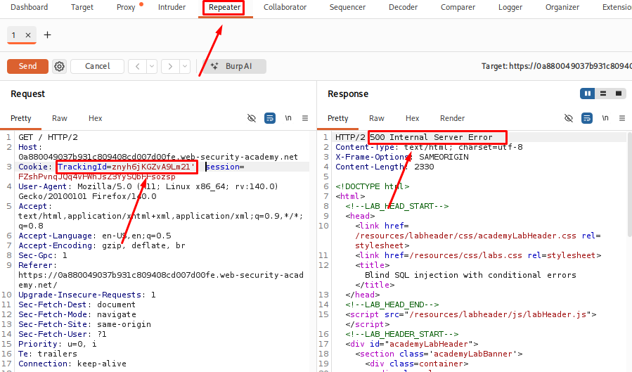
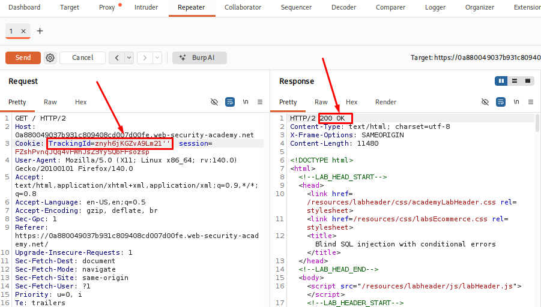
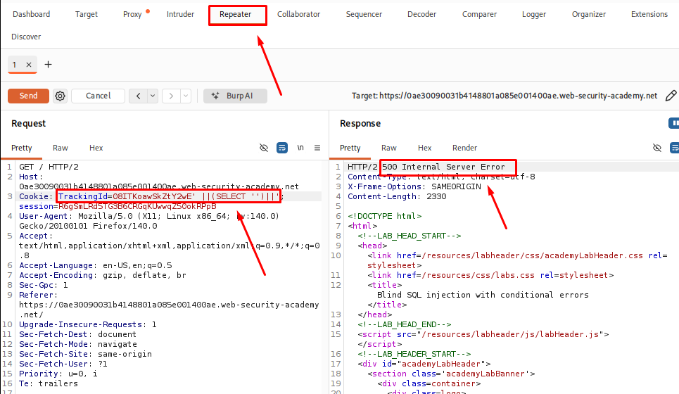
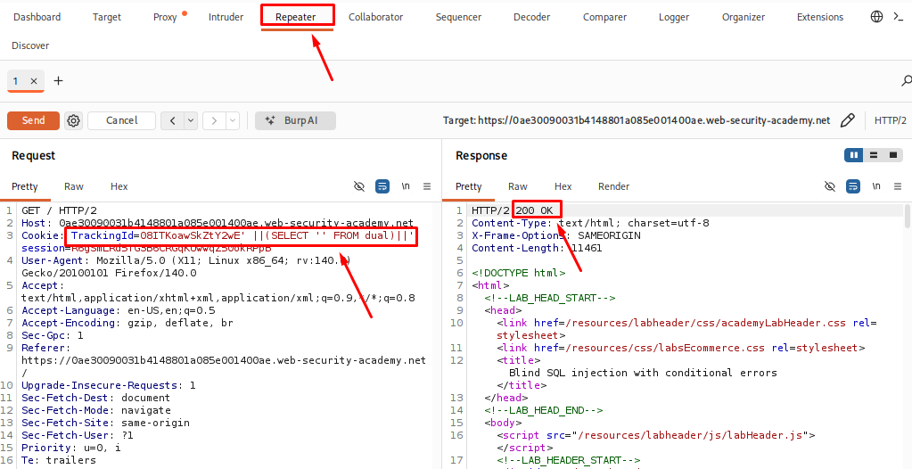
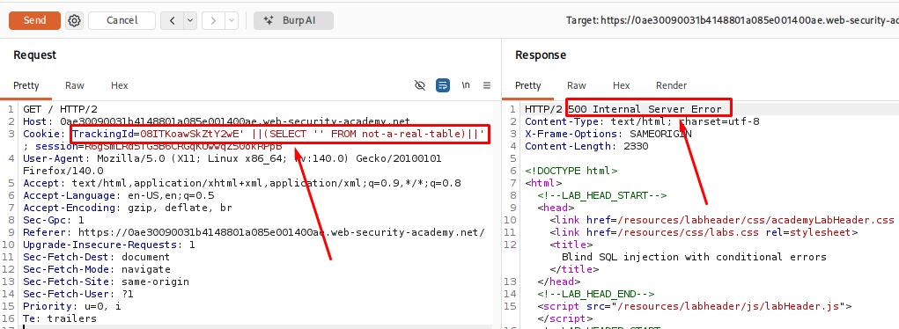

# Blind SQL injection with conditional errors

**Date:** July 2026<br>
**Author:** ShahinSecLab<br>
**Category:** SQL Injection<br>
**Vulnerability:** Blind SQL Injection<br>
**Difficulty:** Easy<br>
**Platform:** PortSwigger Web Security Academy<br>
**Database:** PostgreSQL<br>
**Tools:** Burp Suite Community Edition, Firefox

## Table of Contents

* [Introduction](#introduction)
* [Why This Attack Works](#why-this-attack-works)
* [Lab Setup](#lab-setup)
* [Prerequisites](#prerequisites)
* [Attack Flow](#attack-flow)
* [Step-by-Step Walkthrough](#step-by-step-walkthrough)
   * [Step 1 — Confirm the injection point](#step-1--confirm-the-injection-point)
   * [Step 2 — Confirm it's a SQL syntax error](#step-2--confirm-its-a-sql-syntax-error)
   * [Step 3 — Confirm the query is actually running](#step-3--confirm-the-query-is-actually-running)
   * [Step 4 — Check if the users table exists](#step-4--check-if-the-users-table-exists)
   * [Step 5 — Trigger a conditional error](#step-5--trigger-a-conditional-error)
   * [Step 6 — Check if the administrator user exists](#step-6--check-if-the-administrator-user-exists)
   * [Step 7 — Find the password length](#step-7--find-the-password-length)
   * [Step 8 — Extract the password with Burp Intruder](#step-8--extract-the-password-with-burp-intruder)
   * [Step 9 — Log in as administrator](#step-9--log-in-as-administrator)
* [Detection](#detection)
* [Prevention](#prevention)
* [References](#references)
* [Key Takeaways](#key-takeaways)

## Introduction

This lab demonstrates a blind SQL injection vulnerability that uses conditional errors.

Unlike other blind SQL injection techniques, the application does not show different page content or use a time delay. Instead, it returns an error only when a SQL condition is true. When the condition is false, the page loads normally.

By comparing these two responses, it is possible to test SQL conditions and slowly gather information from the database.

In this lab, the backend database is Oracle, so the payloads use Oracle-specific functions such as `CASE WHEN`, `TO_CHAR()`, and the `dual` table.

## Attack Flow
```
Check if TrackingId is vulnerable
        │
        ▼
Find the SQL error
        │
        ▼
Test database queries
        │
        ▼
Find the users table
        │
        ▼
Check if administrator user exists
        │
        ▼
Find password length
        │
        ▼
Extract password characters
        │
        ▼
Login as administrator
```

## Why This Attack Works

The application uses the `TrackingId` cookie directly in an SQL query without properly handling user input.

Because the database is Oracle, a `CASE WHEN` statement can be used to create an error only when a condition is true. In this lab, `TO_CHAR(1/0)` is used to trigger a divide-by-zero error.

When the condition is true, the application returns an error page. When the condition is false, the page loads normally.

By comparing these responses, it is possible to test SQL conditions and slowly retrieve information from the database without seeing the actual data.

## Lab Setup

| Component | Details |
|---|---|
| Attacker Machine | Kali Linux |
| Target | PortSwigger Web Security Academy (Blind SQLi with conditional errors lab) |
| Tool Used | Burp Suite (Proxy, Repeater, Intruder) |
| Database | Oracle |
| Injection Point | `TrackingId` cookie |

## Tools Used

| Tool | Purpose |
|---|---|
| Burp Suite (Proxy) | Intercept requests and read/modify the `TrackingId` cookie |
| Burp Suite (Repeater) | Manually test injection payloads and read error vs. no-error responses |
| Burp Suite (Intruder) | Automate character-by-character password extraction |
| Web Browser | Access the lab front page and login page |

## Prerequisites

- Burp Suite Community/Pro set up with browser proxy
- Basic knowledge of Oracle SQL syntax (dual table, TO_CHAR, SUBSTR)
- Understanding of blind SQL injection concepts
- Access to the PortSwigger lab instance

## Step 1 — Confirming the Injection Point

I started the PortSwigger lab by visiting the shop's front page and capturing the request containing the `TrackingId` cookie using Burp Suite.

I sent the request to Burp Repeater and modified the `TrackingId` value manually to test whether it was vulnerable.

The original cookie value was:
```
TrackingId=znyh6jKGZvA9Lm21
```

I added a single quote at the end of the value:

```
TrackingId=znyh6jKGZvA9Lm21'
```

After sending the request, the application returned an error message.

<p align="center">
  
</p>

Then I added another quote to close the string:
```
TrackingId=znyh6jKGZvA9Lm21''
```

The error disappeared after sending the request again.

<p align="center">
  
</p>

This confirmed that the single quote was affecting the SQL query. The `TrackingId` cookie value was being used inside an SQL statement, which confirmed the presence of a SQL Injection vulnerability.

## Step 2 — Confirming the SQL Syntax Error

After finding the injection point, I wanted to make sure the error was actually coming from the SQL query and not from something else.

I used Burp Repeater to modify the `TrackingId` cookie and tested a simple subquery:

```sql
TrackingId=08ITKoawSkZtY2wE' ||(SELECT '')||'
```

**Breakdown**

| Part | Description |
|---|---|
| `08ITKoawSkZtY2wE` | The original tracking ID from the application |
| `'` | Closes the original string in the SQL query |
| `||` | Concatenates the original value with the result of another SQL expression |
| `(SELECT '')` | Executes a subquery that returns an empty string |
| `||` | Concatenates the subquery result with the remaining part of the query |
| `'` | Closes the injected SQL string to keep the query valid |

This request returned an error. I suspected that the query format was correct, but the database type might be causing the issue.

<p align="center">
  
</p>

To check this, I added the Oracle-specific `dual` table:

```sql
TrackingId=08ITKoawSkZtY2wE'||(SELECT '' FROM dual)||'
```
**Breakdown**

| Part | Description |
|---|---|
| `08ITKoawSkZtY2wE` | The original tracking ID from the application |
| `'` | Closes the original string in the SQL query |
| `||` | Concatenates the original value with the result of another SQL expression |
| `(SELECT '' FROM dual)` | Executes a subquery that returns an empty string from the `dual` table |
| `||` | Concatenates the subquery result with the remaining part of the query |
| `'` | Closes the injected SQL string to keep the query valid |

This time, the request worked without any error.

From this test, I confirmed that the application was using an Oracle database. Oracle requires a table to be specified in a `SELECT` statement, and `dual` is a built-in table that can be used when no actual table is needed.

This confirmed that my input was being executed inside an SQL query and that the backend database was Oracle.

<p align="center">
  
</p>

## Step 3 — Confirming the Query Was Executed

After confirming that the backend was using Oracle, I wanted to verify that my injected query was actually being executed.

I modified the `TrackingId` cookie in Burp Repeater and referenced a table that does not exist:

```sql
TrackingId=08ITKoawSkZtY2wE'||(SELECT '' FROM not-a-real-table)||'
```
**Breakdown**

| Part | Description |
|---|---|
| `08ITKoawSkZtY2wE` | The original tracking ID from the application |
| `'` | Closes the original string in the SQL query |
| `||` | Concatenates the original value with the result of another SQL expression |
| `(SELECT '' FROM not-a-real-table)` | Attempts to execute a subquery using a table that does not exist. This is commonly used to trigger a database error and confirm that the subquery is being executed. |
| `||` | Concatenates the subquery result with the remaining part of the query |
| `'` | Closes the injected SQL string to keep the query valid |

After sending the request, the application returned an error.

The only invalid part of the payload was the table name. Since Oracle tried to look up the table and failed, it confirmed that my injected query was being parsed and executed by the database.

This showed that I could successfully inject and run SQL queries through the `TrackingId` cookie.

<p align="center">
  
</p>
