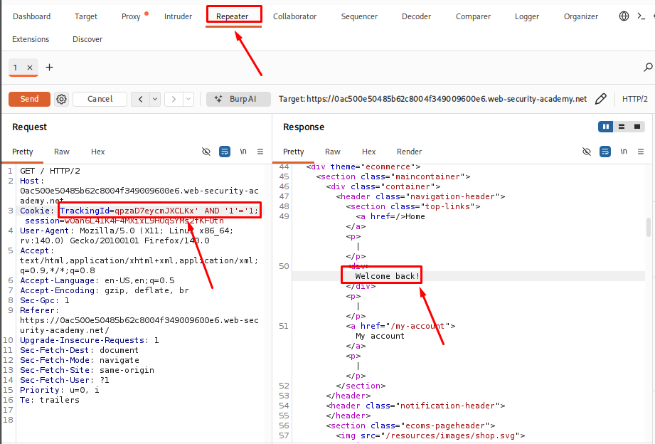
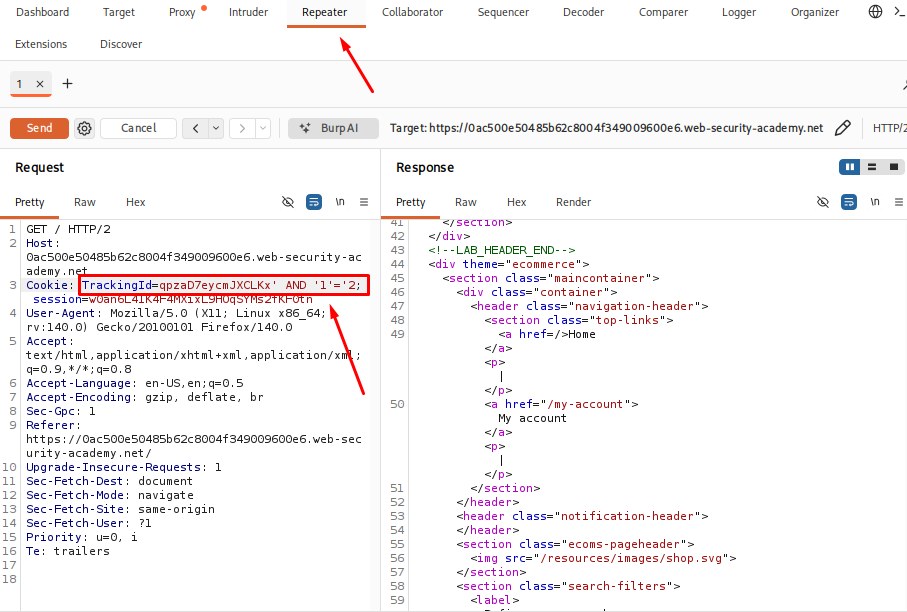
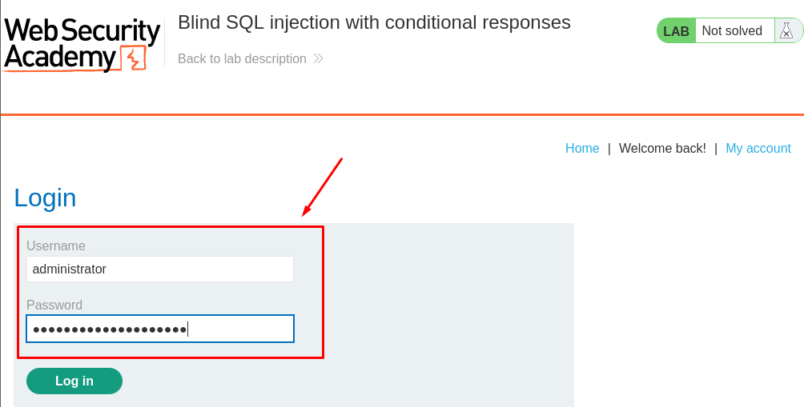

# Blind SQL Injection with Conditional Responses

## Table of Contents

* [Introduction](#introduction)
* [Attack Flow](#attack-flow)
* [Why This Attack Works](#why-this-attack-works)
* [Lab Setup](#lab-setup)
* [Tools Used](#tools-used)
* [Prerequisites](#prerequisites)
* [Step 1 - Launching the Lab and Finding the Cookie](#step-1---launching-the-lab-and-finding-the-cookie)
* [Step 2 - Checking the SQL Injection Behavior](#step-2---checking-the-sql-injection-behavior)
* [Step 3 - Confirming the Users Table](#step-3---confirming-the-users-table)
* [Step 4 - Checking for the Administrator User](#step-4---checking-for-the-administrator-user)
* [Step 5 - Finding the Administrator Password Length](#step-5---finding-the-administrator-password-length)
* [Step 6 - Extracting the Administrator Password](#step-6---extracting-the-administrator-password)
* [Step 7 - Logging In as Administrator](#step-7---logging-in-as-administrator)
* [How to Detect This Attack](#how-to-detect-this-attack)
* [How to Prevent It](#how-to-prevent-it)
* [Lessons Learned](#lessons-learned)
* [References](#references)

## Introduction

This lab shows how a blind SQL injection vulnerability can be used to retrieve data from a database even when the application does not display database errors or query results.

In this lab, the application uses a tracking cookie to identify users. By changing the value of this cookie, SQL queries can be injected into the database.

Since the application does not return the query results, the response is checked to see whether a condition is true or false. Using this method, it is possible to retrieve sensitive information, such as the administrator's password.

## Attack Flow

```
User visits the application
            │
            ▼
The application sends a tracking cookie
            │
            ▼
The cookie value is vulnerable to SQL injection
            │
            ▼
A conditional SQL query is added
            │
            ▼
The application response changes based on the condition
            │
            ▼
The database information is tested step by step
            │
            ▼
The administrator password is extracted
            │
            ▼
The administrator account is accessed
```

## Why This Attack Works

The application uses the value from the tracking cookie in an SQL query without properly handling user input.

Since the application does not show database errors or query results, the attacker cannot see the data directly.

Instead, SQL queries are used to check whether a condition is true or false.

If the condition is true, the application's response is different. If the condition is false, the response changes.

By checking one character at a time and watching the response, the administrator's password can be found.

## Lab Setup

| Item | Details |
|------|---------|
| **Platform** | PortSwigger Web Security Academy |
| **Vulnerability** | Blind SQL Injection |
| **Database** | PostgreSQL |
| **Injection** Point | TrackingId cookie |
| **Goal** | Extract the administrator password and log in |


## Tools Used

| Tool | Purpose |
|------|---------|
| **Burp Suite Community Edition** | Intercepted, modified, and replayed HTTP requests using Proxy and Repeater |
| **Firefox** | Accessed and tested the target application |

## Prerequisites

| Requirement | Why It Is Needed |
|-------------|------------------|
| **Basic SQL** | To understand how SQL queries work |
| **SELECT Statement** | To understand how data is retrieved from a database |
| **WHERE Clause** | To understand how records are filtered |
| **Basic SQL Injection** | To understand how user input can change a SQL query |
| **HTTP Requests and Responses** | To understand how the application communicates with the server |
| **Burp Suite Basics** | To intercept and modify HTTP requests |
| **Database Tables and Columns** | To understand where the retrieved data comes from |

## Step 1 - Launching the Lab in Burp Suite

I started the lab from PortSwigger Web Security Academy and opened the application.

According to the lab description, the TrackingId cookie is vulnerable to SQL injection. I intercepted the request in Burp Suite and looked for the TrackingId cookie.

```
Cookie: TrackingId=qpzaD7eycmJXCLKx;
```

I sent the request to Repeater so I could modify the cookie value and test different SQL payloads in the following steps.

## Step 2 - Checking the SQL Injection Behavior

I modified the `TrackingId` cookie in Burp Suite Repeater and tested two different conditions.

**True condition:**

```sql
TrackingId=qpzaD7eycmJXCLKx' AND '1'='1
```
**Breakdown**

| Part | Deascription |
|---|---|
| `qpzaD7eycmJXCLKx` | The original tracking ID from the application |
| `'` | Closes the original string in the SQL query |
| `AND` | Adds another condition to the query |
| `'1'='1` | This condition is always true |

Why this matters:

When this payload is sent, the SQL query becomes something like:

```sql
SELECT * FROM tracking WHERE TrackingId = 'qpzaD7eycmJXCLKx' AND '1'='1'
```

Since `'1'='1'` is always true, the query works normally and the page behaves the same as before.

This shows that extra SQL code can be added to the application's query without causing an error.

The next step is usually to try a false condition like `' AND '1'='2` and compare. If the page changes (different content, different behavior), that shows the app is reacting to the added condition, and blind SQLi is possible.

<p align="center">
  
</p>

Next, I tested a condition that is always false.

**False condition:**

```sql
TrackingId=qpzaD7eycmJXCLKx' AND '1'='2
```

With the first payload, the application displayed the **"Welcome back"** message.

With the second payload, the **"Welcome back"** message was no longer displayed.

Because the page changed depending on whether the condition was true or false, it confirmed that the TrackingId cookie was being used in an SQL query and that the application was vulnerable to blind SQL injection using conditional responses.

<p align="center">
  
</p>


## Step 3 - Confirming the Users Table

After confirming the injection point, I tested whether the `users` table existed.

Payload:

```sql
TrackingId=x' AND (SELECT 'a' FROM users LIMIT 1)='a
```

The application returned the normal response, confirming that the `users` table was available.


## Step 4 - Checking for the Administrator User

Next, I checked whether the administrator account existed in the table.

Payload:

```sql
TrackingId=x' AND (SELECT username FROM users WHERE username='administrator')='administrator
```

The response confirmed that the administrator user was present.


## Step 5 - Finding the Administrator Password Length

Since the password was not displayed directly, I tested its length using the `LENGTH()` function.

Example:

```sql
TrackingId=x' AND (SELECT LENGTH(password) FROM users WHERE username='administrator')=20--
```

By changing the number, I found the correct password length.


## Step 6 - Extracting the Administrator Password

After finding the password length, I tested each character position using the `SUBSTRING()` function.

Example:

```sql
TrackingId=x' AND SUBSTRING((SELECT password FROM users WHERE username='administrator'),1,1)='a'--
```

Burp Suite Intruder was used to test different characters until the correct value was found.

This process was repeated for each character position until the full password was recovered.


## Step 7 - Logging In as Administrator

After extracting the administrator password, I used the credentials to log in to the application.

The login was successful, confirming that the password had been correctly retrieved.

<p align="center">
  
</p>


## How to Detect This Attack

- Monitor unusual SQL keywords inside cookie values.
- Review application logs for repeated requests with different conditions.
- Look for abnormal database queries.
- Use security monitoring tools to detect suspicious input patterns.
- Test applications regularly for SQL injection issues.


## How to Prevent It

- Use prepared statements and parameterized queries.
- Avoid building SQL queries with user-controlled input.
- Validate input before using it in database queries.
- Limit database user permissions.
- Hide detailed database errors from users.
- Perform regular security testing.


## Lessons Learned

During this lab, I learned how blind SQL injection can be used to retrieve database information without directly viewing the query results.

Key takeaways:

- Blind SQL injection relies on application behavior instead of visible database output.
- True and false conditions can reveal information from the database.
- `SUBSTRING()` can be used to extract data character by character.
- Burp Suite Intruder can help automate character testing.
- Improper handling of user input can expose sensitive database information.


## References

- [PortSwigger Web Security Academy](https://portswigger.net/web-security)
- [Blind SQL Injection Labs](https://portswigger.net/web-security/sql-injection/blind)
- [OWASP SQL Injection Prevention Cheat Sheet](https://cheatsheetseries.owasp.org/cheatsheets/SQL_Injection_Prevention_Cheat_Sheet.html)
- [PostgreSQL Documentation](https://www.postgresql.org/docs/)