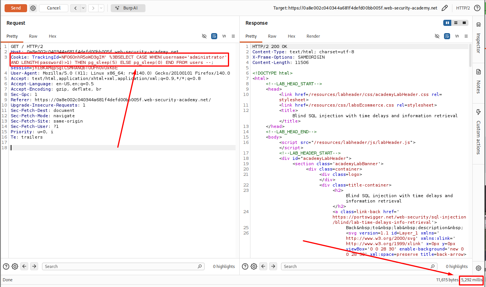
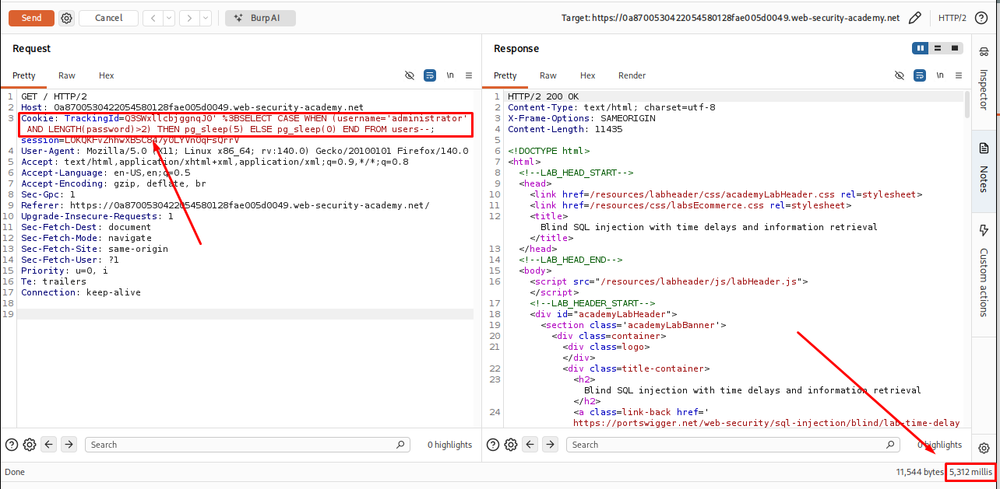
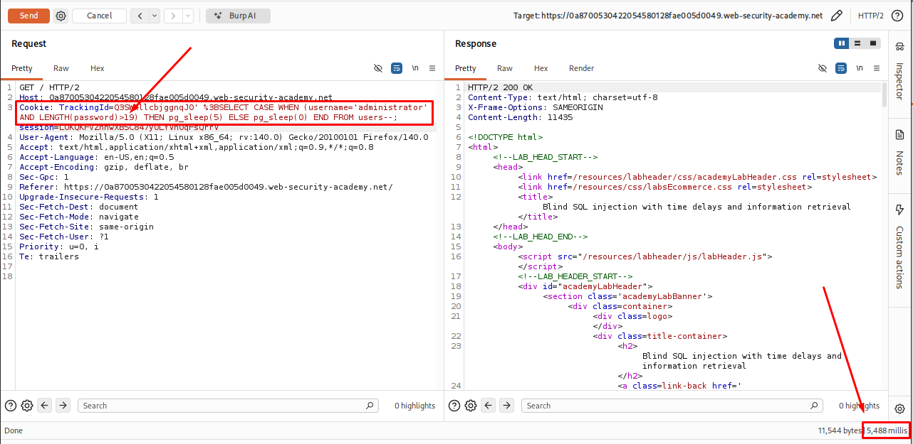
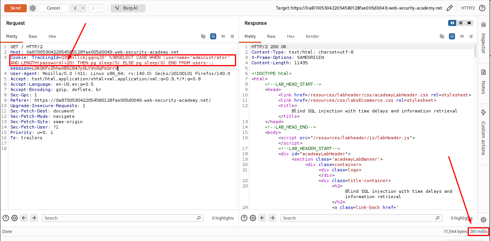

# Blind SQL Injection with Time Delays and Information Retrieval

## Table of Contents

* [Introduction](#introduction)
* [Attack Flow](#attack-flow)
* [Why This Attack Works](#why-this-attack-works)
* [Lab Setup](#lab-setup)
* [Tools Used](#tools-used)
* [Prerequisites](#prerequisites)
  * [Step 1 - Setting Up the Lab and Intercepting the Request](#step-1-setting-up-the-lab-and-intercepting-the-request)
  * [Step 2 - Confirming the SQL Injection Point with a Time Delay](#step-2-confirming-the-sql-injection-point-with-a-time-delay)
  * [Step 3 - Testing a False Condition](#step-3-testing-a-false-condition)
  * [Step 4 - Checking if the "administrator" User Exists](#step-4-checking-if-the-administrator-user-exists)
  * [Step 5 - Finding the Password Length](#step-5-finding-the-password-length)
  * [Step 6 - Setting Up Burp Intruder for Character Extraction](#step-7-setting-up-burp-intruder-for-character-extraction)
  * [Step 7 - Making Sure Requests Run One at a Time](#step-8-making-sure-requests-run-one-at-a-time)
  * [Step 8 - Finding the First Character of the Password](#step-9-finding-the-first-character-of-the-password)
  * [Step 9 - Repeating the Attack for Each Remaining Character](#step-10-repeating-the-attack-for-each-remaining-character)
  * [Step 10 - Logging In and Solving the Lab](#step-11-logging-in-and-solving-the-lab)
* [How Defenders Can Catch This](#how-defenders-can-catch-this)
* [How to Prevent It](#how-to-prevent-it)
* [References](#references)
* [Lessons Learned](#lessons-learned)

## Introduction

This writeup covers a lab from PortSwigger's Web Security Academy called **"Blind SQL injection with time delays and information retrieval"**. In this lab, the app doesn't show any errors or extra data on screen when I inject SQL into a cookie. The only way to tell if my injected query worked was by watching how long the server took to respond. I used this timing trick to pull out the administrator's password one character at a time, then logged in with it to solve the lab.

## Workflow

Intercept the Request
          ↓
Confirm SQL Injection
          ↓
Confirm a False Condition
          ↓
Confirm the Target User Exists
          ↓
Find the Password Length
          ↓
Determine the Exact Length
          ↓
Configure Burp Intruder
          ↓
Use Single-Threaded Requests
          ↓
Recover Each Character
          ↓
Repeat for Every Position
          ↓
        Log In


## Why This Attack Works

The application takes the `TrackingId` cookie and puts it directly into a SQL query without checking or filtering it first. Because of this, I can add my own SQL code to the query.

In this lab, the application doesn't show any database errors or return any database data in the page. No matter what I send in the cookie, the response looks the same. That's why this is called blind SQL injection.

Even though I can't see the query result, I can still make the database do something. By using a payload that tells the database to wait for a few seconds when a condition is true, I can check the response time. If the page takes longer to load, I know the condition is true. If it responds normally, the condition is false.

This lets me ask the database simple true or false questions. For example, I can check whether a user exists, find the length of a password, and test each character one by one. By repeating this process, I can slowly recover the entire password without ever seeing the database output directly.

## Lab Setup

- Target: PortSwigger Web Security Academy lab environment
- Database: PostgreSQL
- Vulnerable parameter: TrackingId cookie
- Tool used: Burp Suite Community Edition (Proxy, Repeater, Intruder)

## Prerequisites

- Burp Suite set up as a proxy in front of the browser
- Basic understanding of SQL syntax (SELECT, CASE WHEN, SUBSTRING)
- Knowledge of how cookies are sent in HTTP requests

## Step 1 - Setting Up the Lab and Intercepting the Request

I opened the **Blind SQL injection with time delays and information retrieval** lab in PortSwigger Web Security Academy.

Before interacting with the application, I turned **Intercept** on in **Burp Suite** and visited the lab's home page. Burp intercepted the request sent by my browser.

In the request, I found the following `Cookie` header:

```bash
Cookie: TrackingId=Q3SWxllcbjggnqJ0; session=LOKQKFvZhhwXB5C847y0LYVn0qFsQrrV
```

The request contained two cookies:

- `TrackingId` – Used by the application to identify or track the visitor.
- `session` – Used to keep the current user session active.

I chose the `TrackingId` cookie for testing because tracking cookies are often used in database queries. If the application does not handle the value safely, it can become an SQL injection point.

To make testing easier, I sent the request to **Burp Repeater**. This allowed me to modify the `TrackingId` value and send the same request multiple times without refreshing the page.

<p align="center">
  
</p>
<p align="center">
  
</p>
<p align="center">
  
</p>

## Step 2 - Confirming the SQL Injection Point with a Time Delay

In **Burp Repeater**, I modified the `TrackingId` cookie and replaced its value with the following payload:

```bash
TrackingId=Q3SWxllcbjggnqJ0' %3BSELECT CASE WHEN (1=1) THEN pg_sleep(5) ELSE pg_sleep(0) END --
```
**Breakdown**

| Part | Description |
|------|-------------|
| `Q3SWxllcbjggnqJ0'` | Closes the original string so the injected SQL can be executed. |
| `%3B` | URL-encoded semicolon (`;`). It ends the original SQL statement and starts a new one. |
| `SELECT CASE WHEN (1=1)` | A condition that is always true. It is used to check whether the injected SQL is executed. |
| `THEN pg_sleep(5)` | If the condition is true, PostgreSQL waits for 5 seconds before returning a response. |
| `ELSE pg_sleep(0)` | If the condition is false, no delay is added. |
| `END--` | Ends the `CASE` expression and comments out the rest of the original query. |

After sending the request, the response took about **5,302 ms** to return.
The delay matched the `pg_sleep(5)` function in the payload. This confirmed that the SQL code inside the `TrackingId` cookie was being executed by the database.
At this point, I confirmed that the `TrackingId` cookie was vulnerable to **time-based blind SQL injection**.

<p align="center">
  
</p>

## Step 3 - Testing a False Condition

To make sure the delay only happened when the condition was true, I changed the payload to use a condition that is always false:


```bash
TrackingId=Q3SWxllcbjggnqJ0' %3BSELECT CASE WHEN(1=2) THEN pg_sleep(5) ELSE pg_sleep(0) END--
```
Since `1=2` is always false, the `ELSE` statement should run, which means the database should not pause before sending the response.

After sending the request, the response was returned in about **294 ms**, with no noticeable delay.

Comparing the results:

- **True condition (`1=1`)** → Response delayed by about **5,302 ms**
- **False condition (`1=2`)** → Response returned immediately

This confirmed that I could determine whether a condition was **true** or **false** by measuring the response time. This is the basic idea behind **time-based blind SQL injection**.

<p align="center">
  
</p>

## Step 4 - Checking if the "administrator" User Exists

After confirming that I could distinguish **true** and **false** conditions based on the response time, I checked whether the `administrator` user existed in the `users` table.

I used the following payload:

```bash
TrackingId=Q3SWxllcbjggnqJ0' %3BSELECT CASE WHEN(username='administrator') THEN pg_sleep(5) ELSE pg_sleep(0) END FROM users--
```
**Breakdown**

| Part | Description |
|------|-------------|
| `WHEN (username='administrator')` | Checks whether the current row contains the username `administrator`. |
| `FROM users` | Runs the check against the `users` table. |

After sending the request, the response took about **5,293 ms** to return.

The delay showed that the condition was **true**, confirming that a user named `administrator` exists in the `users` table.

The response took 5,293 ms, showing the delay kicked in. This meant the condition was true — a user named administrator really does exist in the users table.

<p align="center">
  
</p>

## Step 5 - Finding the Password Length

After confirming that the `administrator` user exists, I started finding the length of the password.

I used the following payload:

```bash
TrackingId=Q3SWxllcbjggnqJ0'%3BSELECT CASE WHEN (username='administrator' AND LENGTH(password)>1) THEN pg_sleep(5) ELSE pg_sleep(0) END FROM users--
```

### Payload Breakdown

| Part | Description |
|------|-------------|
| `AND LENGTH(password)>1` | Checks whether the administrator's password is longer than 1 character. |

<p align="center">
  
</p>

After sending the request, the response took about **5,292 ms**, which meant the condition was **true**. This confirmed that the password was longer than one character.

Next, I increased the number and sent the request again:

```bash
TrackingId=Q3SWxllcbjggnqJ0'%3BSELECT CASE WHEN (username='administrator' AND LENGTH(password)>2) THEN pg_sleep(5) ELSE pg_sleep(0) END FROM users--
```
<p align="center">
  
</p>

The response was delayed again, so I continued increasing the value (`>3`, `>4`, `>5`, and so on), sending the request after each change.

After repeating the test with increasing values, I found that the response was delayed up to `LENGTH(password)>19`, this one also came back delayed, around **5,488 ms**. 

```bash
TrackingId=Q3SWxllcbjggnqJ0'%3BSELECT CASE WHEN (username='administrator' AND LENGTH(password)>19) THEN pg_sleep(5) ELSE pg_sleep(0) END FROM users--
```
<p align="center">
  
</p>

But the delay stopped when I tested `LENGTH(password)>20`.

```bash
TrackingId=Q3SWxllcbjggnqJ0'%3BSELECT CASE WHEN (username='administrator' AND LENGTH(password)>20) THEN pg_sleep(5) ELSE pg_sleep(0) END FROM users--
```

The response came back in **261 ms**, no delay. which meant the condition was **false**. From these results, I determined that the administrator's password was **20 characters** long.

<p align="center">
  
</p>


## Step 11 - Logging In and Solving the Lab

With all 20 characters put together, I now had the full password for the administrator account. I went to the My account login page, entered administrator as the username along with the password I had extracted, and logged in successfully.

The lab was marked as solved.

## How Defenders Can Catch This

| Sign to look for | What it means |
|---|---|
| Slow responses from one source | If a certain IP keeps getting responses that take exactly 5s, 10s, or some fixed number, that's not normal traffic — that's someone timing something |
| Weird keywords in logs | Words like `SLEEP`, `WAITFOR DELAY`, `BENCHMARK`, or `pg_sleep` showing up inside cookie values or form fields in the access logs |
| The same field getting hit over and over | If one cookie or parameter is being sent with slightly different values, again and again, hundreds of times, that's a brute-force pattern, which is exactly what Intruder does |
| Database slow query logs | The database itself will show query execution times spiking way above normal, right around the same time as the suspicious requests |

## How to Prevent It

- Use parameterized queries or prepared statements everywhere user input touches a query, never build SQL by joining strings together with input mixed in
- Validate and clean up every piece of input before it goes anywhere near the database
- If using an ORM, stick to its query builder instead of writing raw SQL by hand
- Put a WAF in front of the app to catch and block obvious keywords like SLEEP, WAITFOR, BENCHMARK
- Give the database user account the least amount of access it actually needs, so even if injection happens, the damage is limited
- Set a timeout on how long a single query is allowed to run, so an attacker can't force the database to hang for several seconds

## Lesson Learned

- Even when an app shows nothing on screen, no error, no extra data, it can still leak information through something as simple as response time
- Blind doesn't mean safe. If input reaches a query unfiltered, there's always some way to pull data out, it just takes more patience
- Running requests one at a time matters a lot in timing attacks. Sending them too fast or in parallel ruins the whole measurement
- Breaking a big unknown (a 20 character password) into small yes/no questions is what makes this kind of attack possible at all
- This attack is slow and takes a lot of requests, but it works even against a database that gives away nothing else