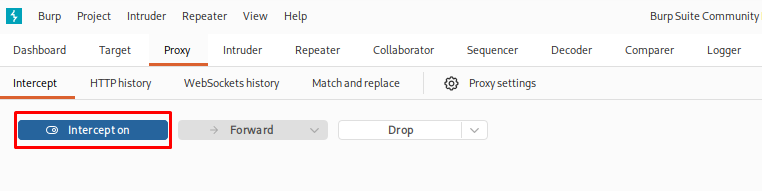
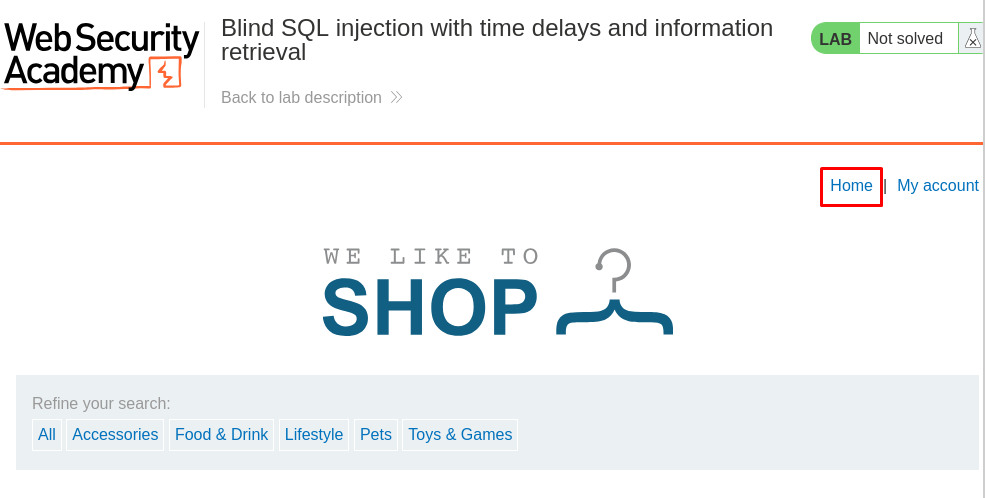
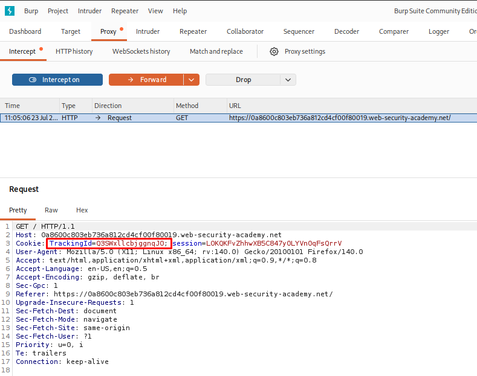
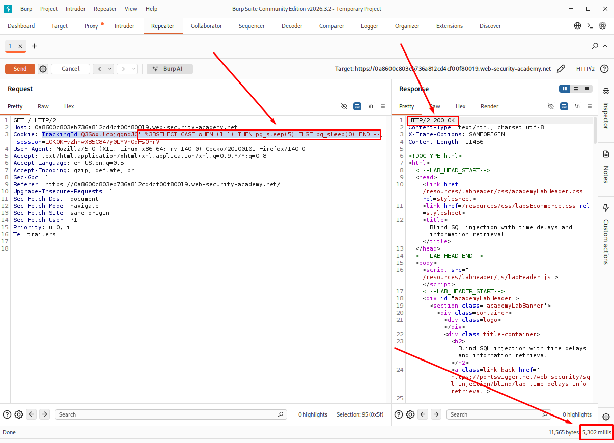
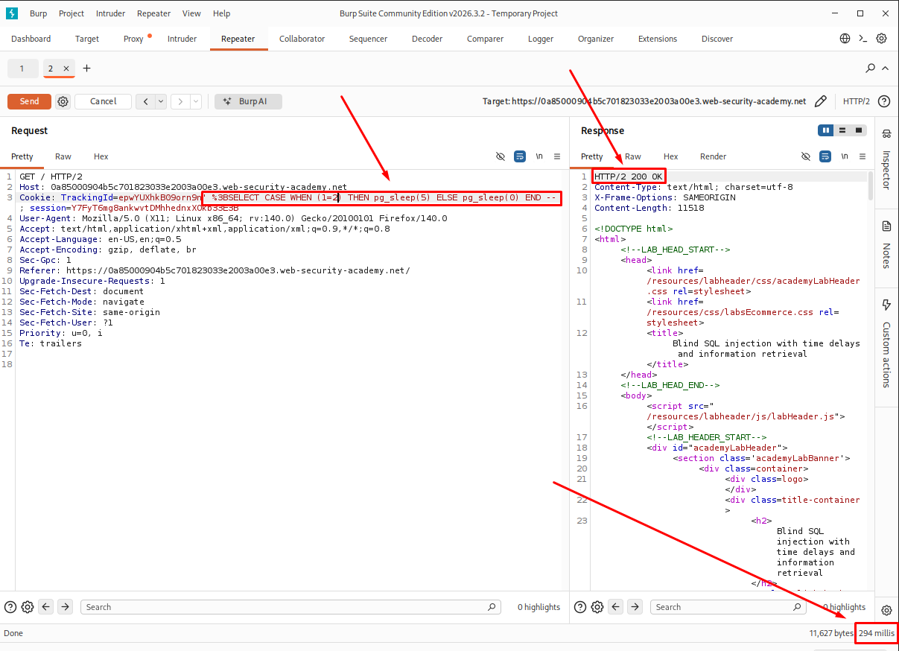
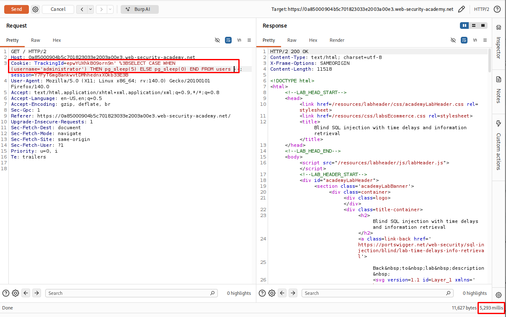

# Blind SQL Injection with Time Delays and Information Retrieval

## Table of Contents


* [Introduction](#introduction)
* [Attack Flow](#attack-flow)
* [Why This Attack Works](#why-this-attack-works)
* [Lab Setup](#lab-setup)
* [Tools Used](#tools-used)
* [Prerequisites](#prerequisites)
  * [Step 1: Setting Up the Lab and Intercepting the Request](#step-1-setting-up-the-lab-and-intercepting-the-request)
  * [Step 2: Confirming the SQL Injection Point via Time Delay](#step-2-confirming-the-sql-injection-point-via-time-delay)
  * [Step 3: Testing a False Condition](#step-3-testing-a-false-condition)
  * [Step 4: Checking if the "administrator" User Exists](#step-4-checking-if-the-administrator-user-exists)
  * [Step 5: Finding the Password Length](#step-5-finding-the-password-length)
  * [Step 6: Finding Where the Password Length Check Stops Being True](#step-6-finding-where-the-password-length-check-stops-being-true)
  * [Step 7: Setting Up Burp Intruder for Character Extraction](#step-7-setting-up-burp-intruder-for-character-extraction)
  * [Step 8: Making Sure Requests Run One at a Time](#step-8-making-sure-requests-run-one-at-a-time)
  * [Step 9: Finding the First Character of the Password](#step-9-finding-the-first-character-of-the-password)
  * [Step 10: Repeating the Attack for Each Remaining Character](#step-10-repeating-the-attack-for-each-remaining-character)
  * [Step 11: Logging In and Solving the Lab](#step-11-logging-in-and-solving-the-lab)
* [How Defenders Can Catch This](#how-defenders-can-catch-this)
* [How to Prevent It](#how-to-prevent-it)
* [References](#references)
* [Lessons Learned](#lessons-learned)

## Introduction

This writeup covers a lab from PortSwigger's Web Security Academy called **"Blind SQL injection with time delays and information retrieval"**. In this lab, the app doesn't show any errors or extra data on screen when I inject SQL into a cookie. The only way to tell if my injected query worked was by watching how long the server took to respond. I used this timing trick to pull out the administrator's password one character at a time, then logged in with it to solve the lab.

## Workflow

Intercept the Request
          ↓
Confirm SQL Injection
          ↓
Confirm a False Condition
          ↓
Confirm the Target User Exists
          ↓
Find the Password Length
          ↓
Determine the Exact Length
          ↓
Configure Burp Intruder
          ↓
Use Single-Threaded Requests
          ↓
Recover Each Character
          ↓
Repeat for Every Position
          ↓
        Log In


## Why This Attack Works

The application takes the `TrackingId` cookie and puts it directly into a SQL query without checking or filtering it first. Because of this, I can add my own SQL code to the query.

In this lab, the application doesn't show any database errors or return any database data in the page. No matter what I send in the cookie, the response looks the same. That's why this is called blind SQL injection.

Even though I can't see the query result, I can still make the database do something. By using a payload that tells the database to wait for a few seconds when a condition is true, I can check the response time. If the page takes longer to load, I know the condition is true. If it responds normally, the condition is false.

This lets me ask the database simple true or false questions. For example, I can check whether a user exists, find the length of a password, and test each character one by one. By repeating this process, I can slowly recover the entire password without ever seeing the database output directly.

## Lab Setup

- Target: PortSwigger Web Security Academy lab environment
- Database: PostgreSQL
- Vulnerable parameter: TrackingId cookie
- Tool used: Burp Suite Community Edition (Proxy, Repeater, Intruder)

## Prerequisites

- Burp Suite set up as a proxy in front of the browser
- Basic understanding of SQL syntax (SELECT, CASE WHEN, SUBSTRING)
- Knowledge of how cookies are sent in HTTP requests

## Step 1: Setting Up the Lab and Intercepting the Request

I opened the "Blind SQL injection with time delays and information retrieval" lab from PortSwigger Web Security Academy. Before touching anything, I turned on Intercept in Burp Suite's Proxy tab, then visited the lab's front page.

Once the front page loaded, Burp caught the request going out to the server. Inside this request, I could see the `Cookie` header carrying a `TrackingId` value along with a `session` value:

```bash
Cookie: TrackingId=Q3SWxllcbjggnqJ0; session=LOKQKFvZhhwXB5C847y0LYVn0qFsQrrV
```
I picked `TrackingId` as my target because shopping sites often use cookies like this to track visitors, and the value usually comes straight from a database lookup — which makes it worth testing for SQL injection.

I sent this request to Burp Repeater so I could edit and resend it as many times as I wanted, without reloading the page every time.

<p align="center">
  
</p>
<p align="center">
  
</p>
<p align="center">
  
</p>

## Step 2: Confirming the SQL Injection Point via Time Delay

Inside Burp Repeater, I changed the `TrackingId` cookie value to this payload, to see if the server would actually run SQL code I put in it:

```bash
Q3SWxllcbjggnqJ0' %3BSELECT CASE WHEN (1=1) THEN pg_sleep(5) ELSE pg_sleep(0) END --
```
**Breakdown**

| Part                          | Description|
|----------------------------------|-------------------------------------------------------------------|
| `Q3SWxllcbjggnqJ0'`                    | Random tracking string followed by a single quote to close the original string value so my own SQL can start right after |
| `%3B`                             | URL-encoded semicolon (`;`) — ends the current statement and starts a new one |
| `SELECT CASE WHEN (1=1)`          | A condition that's always true, just to check if my code runs at all |
| `THEN pg_sleep(5)`                | If the condition is true, make PostgreSQL wait 5 seconds          |
| `ELSE pg_sleep(0)`                | If false, don't wait at all                                       |
| `END --`                          | Closes the CASE block and comments out the rest of the original query |


I clicked Send, and the response came back after **5,302 ms** — about 5 seconds, just like I told it to wait. This showed me the cookie value was going directly into a SQL query on the backend, and the server was running whatever I put there. This confirmed the `TrackingId` cookie was vulnerable to **time-based blind SQL injection**.

<p align="center">
  
</p>

## Step 3: Testing a False Condition

Next, I wanted to see what happens when the condition is false, so I changed the payload to this:

```bash
Q3SWxllcbjggnqJ0' %3BSELECT+CASE+WHEN+(1=2)+THEN+pg_sleep(5)+ELSE+pg_sleep(0)+END--
```
Here `1=2` is never true, so the `ELSE` part should run instead, which means no delay at all.

The response came back in just 294 ms, almost instantly. This confirmed I could tell true and false apart just by watching how long the response takes — which is the whole idea behind time-based blind SQL injection.

<p align="center">
  
</p>

## Step 4: Checking if the "administrator" User Exists

Now that I could tell true from false using timing, I moved on to asking the database a real question — whether a user called `administrator` exists in the `users` table:

```bash
Q3SWxllcbjggnqJ0' %3BSELECT+CASE+WHEN+(username='administrator')+THEN+pg_sleep(5)+ELSE+pg_sleep(0)+END+FROM+users--
```
**Breakdown**

| Part   | Description|
|--------|------------|
|`WHEN (username='administrator')`|Checks if any row in the table has this exact username|
|`FROM users`|	Runs this check against the users table|

The response took 5,283 ms, showing the delay kicked in. This meant the condition was true — a user named administrator really does exist in the users table.

<p align="center">
  
</p>

## Step 5: Finding the Password Length

Now that I knew the `administrator` user exists, the next thing to figure out was how long their password is. I used the `LENGTH()` function to check this one number at a time:

```bash
Q3SWxllcbjggnqJ0' %3BSELECT+CASE+WHEN+(username='administrator'+AND+LENGTH(password)>=10)+THEN+pg_sleep(5)+ELSE+pg_sleep(0)+END+FROM+users--
```
**Breakdown**

| Part   | Description|
|--------|------------|
|`AND LENGTH(password)>1`|Checks if the password has more than 1 character, on top of matching the username|

The response took around 5,200 ms, meaning the condition was true — the password is longer than 1 character.

I kept sending the same request, just bumping the number up each time (`>2`, `>3`, `>4`...) and watching for the delay:

```bash
Q3SWxllcbjggnqJ0' %3BSELECT+CASE+WHEN+(username='administrator'+AND+LENGTH(password)>2)+THEN+pg_sleep(5)+ELSE+pg_sleep(0)+END+FROM+users--
```
This one also came back delayed, around **5,299 ms**, so I kept increasing the number and repeating the same check in Burp Repeater until the delay finally stopped showing up. The number right before the delay disappeared was the actual length of the password.