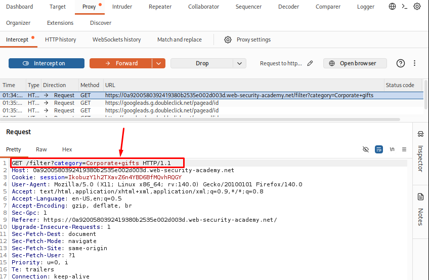
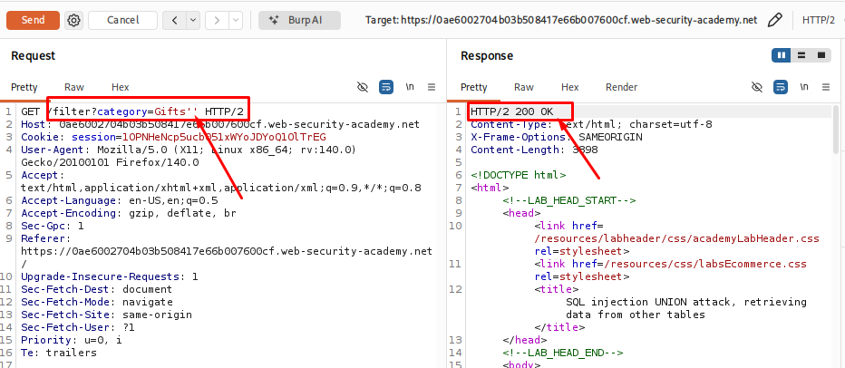
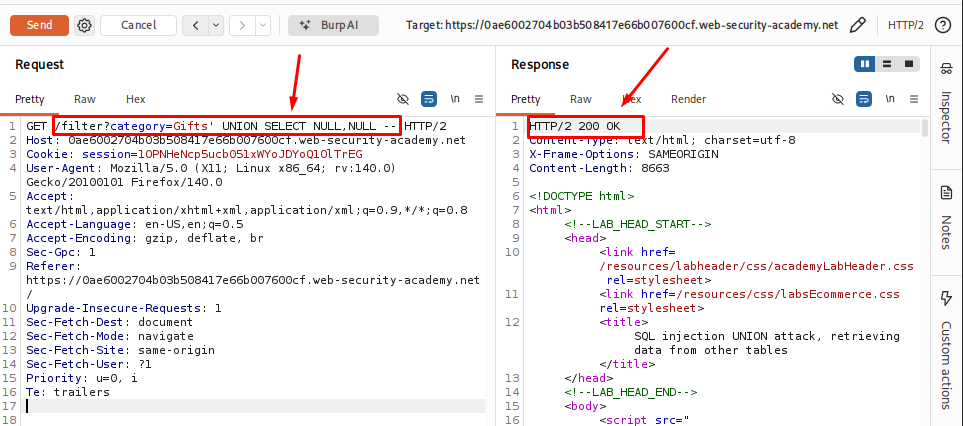
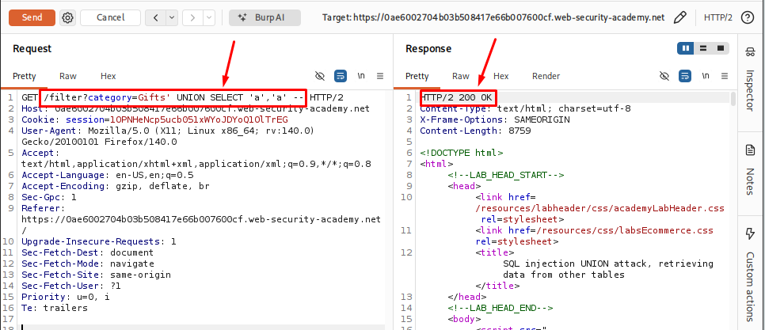
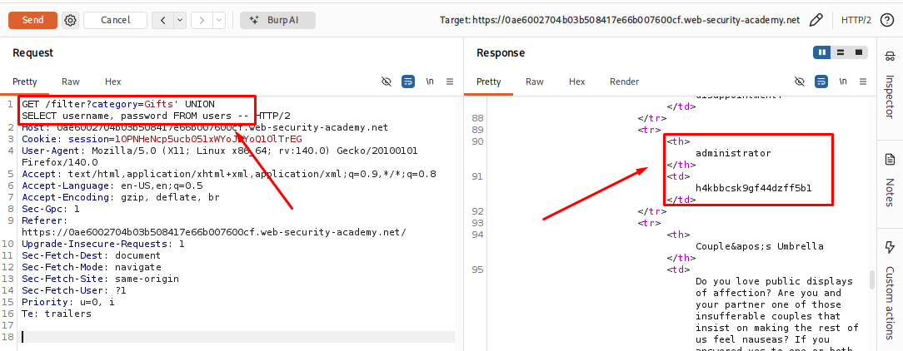
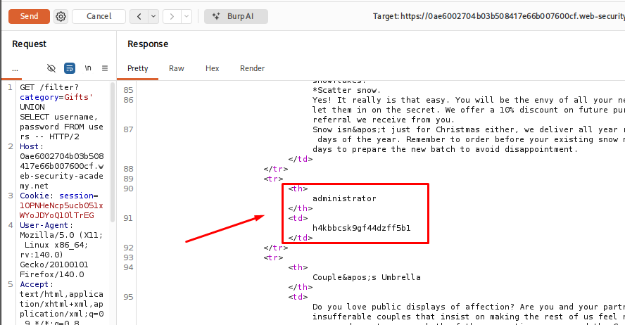
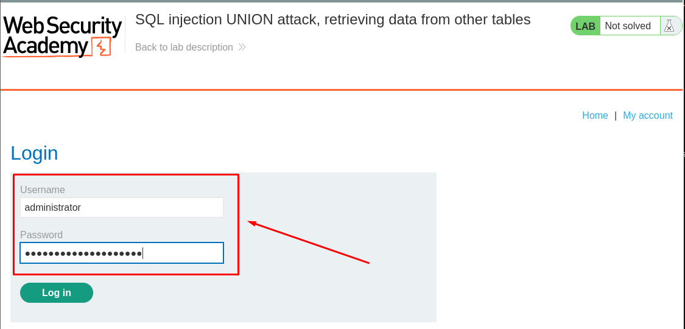
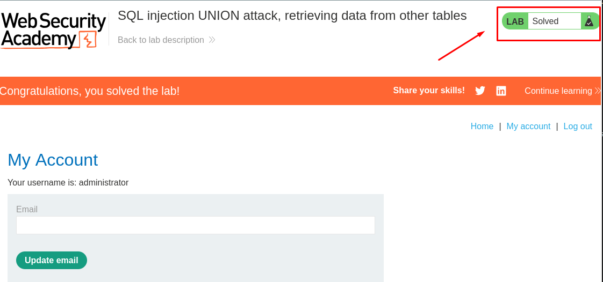

# SQL injection UNION attack, retrieving data from other tables

## Table of Contents

* [Introduction](#introduction)
* [Attack Flow](#attack-flow)
* [Why This Attack Works](#why-this-attack-works)
* [Lab Setup](#lab-setup)
* [Tools Used](#tools-used)
* [Prerequisites](#prerequisites)
* [Step 1 - Launching the Lab and Identifying the Injection Point](#step-1---launching-the-lab-and-identifying-the-injection-point)
* [Step 2 - Determining the Number of Columns](#step-2---determining-the-number-of-columns)
* [Step 3 - Identifying String-Compatible Columns](#step-3---identifying-string-compatible-columns)
* [Step 4 - Retrieving Data from Another Table](#step-4---retrieving-data-from-another-table)
* [Step 5 - Identifying Administrator Credentials](#step-5---identifying-administrator-credentials)
* [Step 6 - Logging In as the Administrator](#step-6---logging-in-as-the-administrator)
* [How Defenders Can Catch This](#how-defenders-can-catch-this)
* [How to Prevent It](#how-to-prevent-it)
* [References](#references)
* [Lessons Learned](#lessons-learned)

## Introduction

SQL Injection is one of the most common and dangerous vulnerabilities in web applications. It happens when a web application includes user input in an SQL query without checking or handling it properly.

One type of SQL Injection is **UNION-based SQL Injection**. In this attack, the attacker uses the SQL `UNION` operator to combine the original query with another `SELECT` query. If both queries have the same structure, the database returns the results from both queries together.

This allows the attacker to view data from database tables that the application was never meant to show.

## Attack Flow
```
User selects a product category
            │
            ▼
Application builds a SQL query
            │
            ▼
The category parameter is vulnerable to SQL injection
            │
            ▼
A UNION query is added to the original SQL statement
            │
            ▼
The database executes the combined query
            │
            ▼
Results from another database table are returned
            │
            ▼
The application displays the combined results
            │
            ▼
Sensitive data becomes visible in the response
```

## Why This Attack Works

This attack works because the application puts user input directly into a SQL query without checking it properly.

When a user selects a product category, the application builds a SQL query to get matching products from the database. If the input is not validated, an attacker can change the original query by adding SQL code.

The `UNION` operator allows the results of two `SELECT` statements to be combined into one result. If the injected query has the same number of columns and compatible data types as the original query, the database treats both queries as valid and returns the combined results.

Instead of showing only product data, the application may also return data from another table, such as usernames or passwords, if the database user has permission to read those tables.

This happens because the database cannot tell the difference between the original query and the injected one. It simply runs the final SQL statement it receives from the application.

For a UNION attack to work, a few conditions must be met:

- The application must be vulnerable to SQL injection.
- The original query must return data to the page.
- The injected query must return the same number of columns as the original query.
- The data types of the matching columns must be compatible.
- The database user must have permission to read the target table.

If all of these conditions are true, the attacker can make the application display data that was never meant to be exposed.

## Lab Setup

| Item | Details |
|------|---------|
| **Platform** | PortSwigger Web Security Academy |
| **Category** | SQL Injection |
| **Technique** | UNION-based SQL Injection |
| **Injection Point** | Product category parameter |
| **Operating System** | Kali Linux |
| **Browser** | Firefox |
| **Proxy Tool** | Burp Suite Community Edition |

## Tools Used

| Tool | Purpose |
|------|---------|
| **Burp Suite Community Edition** | Intercepted and modified HTTP requests |
| **Firefox** | Accessed the target application |

## Prerequisites

| Requirement | Why It Is Needed |
|-------------|------------------|
| **Basic SQL** | To understand how SQL queries work |
| **SELECT Statement** | To understand how data is retrieved from a database |
| **WHERE Clause** | To understand how records are filtered |
| **UNION Operator** | To understand how two query results can be combined |
| **Basic SQL Injection** | To understand how user input can change a SQL query |
| **HTTP Requests and Responses** | To understand how the application communicates with the server |
| **Burp Suite Basics** | To intercept and modify HTTP requests |
| **Database Tables and Columns** | To understand where the retrieved data comes from |

## Step 1 - Launching the Lab and Identifying the Injection Point

First, I launched the lab from PortSwigger Web Security Academy and opened the target application in Firefox.

The application is an online shop where products can be filtered by category. I configured Firefox to work with Burp Suite and enabled Intercept to capture the HTTP requests.

After selecting a product category, I captured the request in Burp Suite and sent it to Repeater for testing.

**Captured Request:**

```http
GET /filter?category=Gifts HTTP/2
Host: 0ae6002704b03b508417e66b007600cf.web-security-academy.net
```

The category value was sent as a request parameter, so I started testing this parameter to check whether the application was handling user input safely.

I added a single quote (`'`) at the end of the category value:

```http
category=Gifts'
```

After sending the request, the application returned a database error instead of the normal response. This happened because the additional quote affected the SQL query structure created by the application.

<p align="center">
  
</p>

I also tested the input with additional quotes and noticed that the error behavior changed. This showed that the application was directly using the user input inside an SQL query.

<p align="center">
  
</p>

Based on these responses, I identified the `category` parameter as a possible SQL injection point and continued further testing.

**What I observed:**

- The `category` parameter was reflected in the SQL query.
- Adding a single quote caused a database error.
- This confirmed that the `category` parameter was a possible SQL injection point.

# Step 2 - Determining the Number of Columns

After identifying the possible SQL injection point, the next step was to find the number of columns returned by the original SQL query.

This is required because a UNION query only works when both SELECT statements return the same number of columns.

I tested the parameter with a UNION-based query and used different numbers of `NULL` values to match the columns returned by the original query.

Example:

```sql
Gift' UNION SELECT NULL,NULL --
```

After sending the request, I checked the application's response. The query was accepted when the number of columns matched the original query.

This confirmed the number of columns used by the original SQL statement and allowed me to continue with the next step.

<p align="center">
  
</p>

**What I observed:**

- The application accepted the UNION query when the column count was correct.
- Incorrect column counts caused the query to fail.
- The original query returned three columns.

# Step 3 - Identifying String-Compatible Columns

After determining the number of columns, the next step was to find which columns could accept and display string values.

This step is important because the data we want to retrieve from the database is stored as text. The UNION query needs compatible data types in order to return the results successfully.

I tested the columns by placing simple string values and checking the application's response.

Payload used:

```sql
Gifts' UNION SELECT 'a','a' --
```
After sending the request, the application returned a normal response without any SQL error. This confirmed that the selected columns were able to handle string data.

<p align="center">
  
</p>

What I observed:

- The UNION query executed successfully.
- The selected columns accepted string values.
- The columns were suitable for retrieving text-based information in the next step.


# Step 4 - Retrieving Data from Another Table

After identifying the number of columns and the column that supports string values, the next step was to test whether data from other database tables could be retrieved.

The application was originally displaying product information, but using a UNION-based SQL injection, I attempted to combine the original query with a query targeting the `users` table.

Payload used:

```sql
Gifts' UNION SELECT username, password FROM users --
```
<p align="center">
  
</p>

# Step 5 - Identifying Administrator Credentials

After successfully retrieving data from the `users` table, the next step was to analyze the returned information and identify high-value accounts.

The extracted data contained usernames and password values, including the administrator account.

<p align="center">
  
</p>

**What I observed:**

- The `users` table contained authentication-related information.
- An administrator account was identified in the extracted data.
- Exposure of this information could allow attackers to compromise user accounts.

This demonstrated the impact of the SQL Injection vulnerability, as sensitive authentication data could be accessed directly from the database.

# Step 6 - Logging in as Administrator

Using the extracted administrator credentials, I attempted to authenticate to the application.

The login was successful, confirming that the SQL Injection vulnerability could lead to account compromise and unauthorized administrative access.

<p align="center">
  
</p>
<p align="center">
  
</p>

**Final Impact:**

- Sensitive database information was exposed.
- Administrator credentials were compromised.
- Unauthorized access to administrative functionality was possible.

## How Defenders Can Catch This

Defenders can detect UNION-based SQL Injection attacks by monitoring application behavior, database activity, and incoming requests.

### 1. Web Application Logs Monitoring

Review web server logs for suspicious patterns such as:

- SQL keywords appearing in user-controlled parameters:
  - `UNION`
  - `SELECT`
  - `FROM`
  - `--`
  - `'`
- Unusual requests containing encoded SQL characters.

Example:
```
category=Gifts' UNION SELECT username,password FROM users --
```

### 2. Database Query Monitoring

Database administrators can monitor unusual queries and detect:

- Unexpected access to sensitive tables.
- Queries retrieving large amounts of user information.
- Unauthorized access to tables like `users`, `accounts`, or `credentials`.

### 3. Web Application Firewall (WAF)

A properly configured WAF can detect and block common SQL Injection patterns by identifying malicious payloads before they reach the application.

### 4. Error Monitoring

Excessive database errors may indicate SQL Injection attempts.

Examples:

- SQL syntax errors
- Invalid column errors
- Database exception messages

### 5. Security Testing

Regular security assessments such as:

- Penetration testing
- Code reviews
- Automated vulnerability scanning

can help identify SQL Injection vulnerabilities before attackers exploit them.

## How to Prevent It

The best way to prevent UNION-based SQL Injection is to ensure that user input is never directly included in SQL queries.

### 1. Use Parameterized Queries (Prepared Statements)

Prepared statements separate SQL code from user input, preventing attackers from modifying the query structure.

Example:

Unsafe:

```sql
SELECT * FROM products WHERE category = 'Gifts'
```
Safe approach:
```
SELECT * FROM products WHERE category = ?
```

2. Implement Input Validation

Validate user input based on expected values and reject unexpected characters or patterns.

For example:

Allow only valid category names.
Reject suspicious SQL keywords when appropriate.
3. Apply Least Privilege Database Permissions

The application database user should only have the minimum permissions required.

Avoid giving application accounts:

Administrative privileges
Access to sensitive tables unnecessarily
4. Hide Database Error Messages

Do not expose detailed database errors to users.

Instead of:
```
SQL syntax error near UNION SELECT
```
show a generic message:
```
Something went wrong. Please try again later.
```
5. Use Security Testing Practices

Perform regular:

Code reviews
Vulnerability assessments
Penetration testing

to identify and fix SQL Injection issues.

## References

- PortSwigger Web Security Academy - SQL Injection Labs  
  https://portswigger.net/web-security/sql-injection

- OWASP Top 10 - Injection  
  https://owasp.org/www-project-top-ten/

- OWASP SQL Injection Prevention Cheat Sheet  
  https://cheatsheetseries.owasp.org/cheatsheets/SQL_Injection_Prevention_Cheat_Sheet.html

- PostgreSQL Documentation  
  https://www.postgresql.org/docs/

## Lessons Learned

During this lab, I learned how UNION-based SQL Injection vulnerabilities can allow attackers to retrieve sensitive information from a database.

Key takeaways:

- SQL Injection occurs when user-controlled input is directly included in SQL queries.
- The UNION operator can be abused to combine attacker-controlled queries with the original database query.
- Determining the correct number of columns is an important step before performing a UNION attack.
- Attackers can extract sensitive information such as usernames and passwords if proper security controls are missing.
- Parameterized queries and secure coding practices are the most effective defenses against SQL Injection.

This exercise improved my understanding of SQL Injection exploitation techniques and highlighted the importance of secure database interaction.