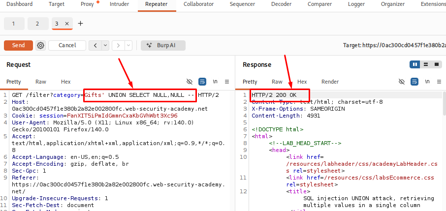
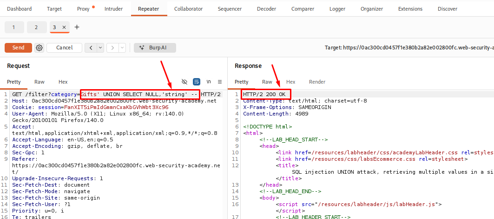
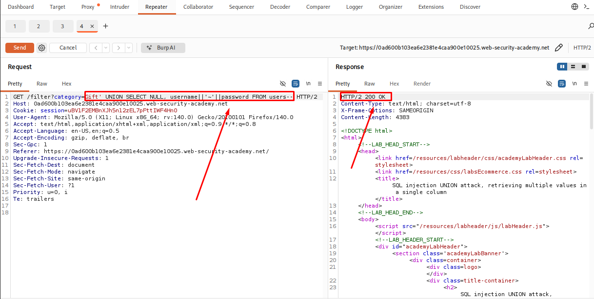
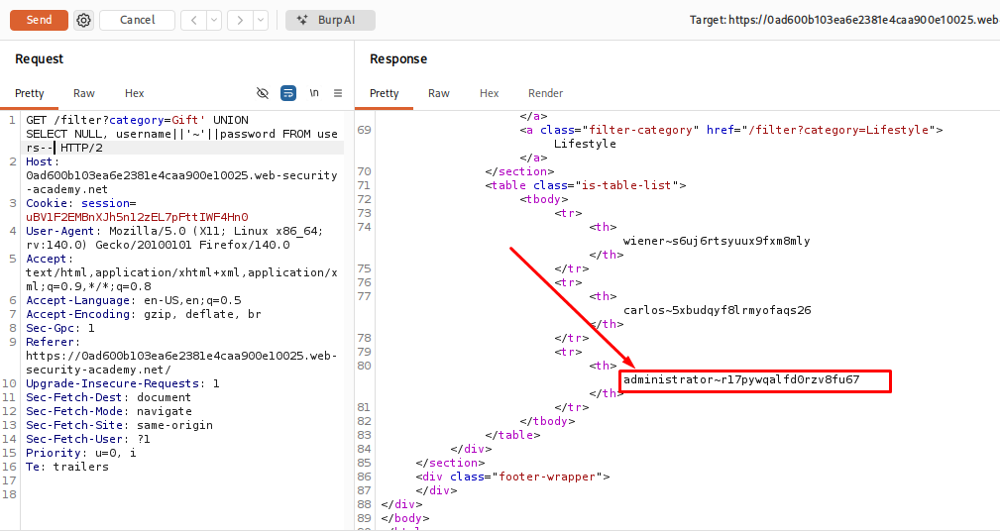
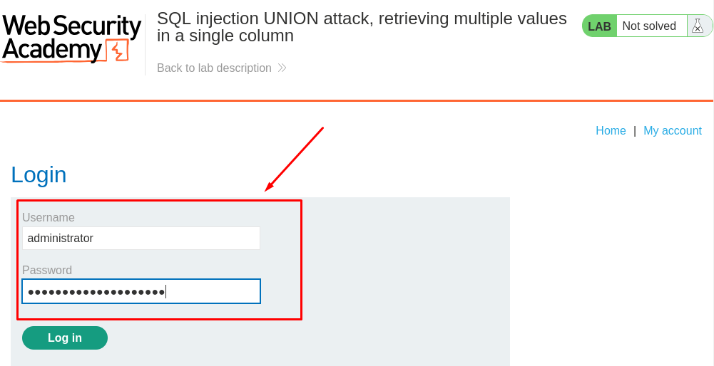
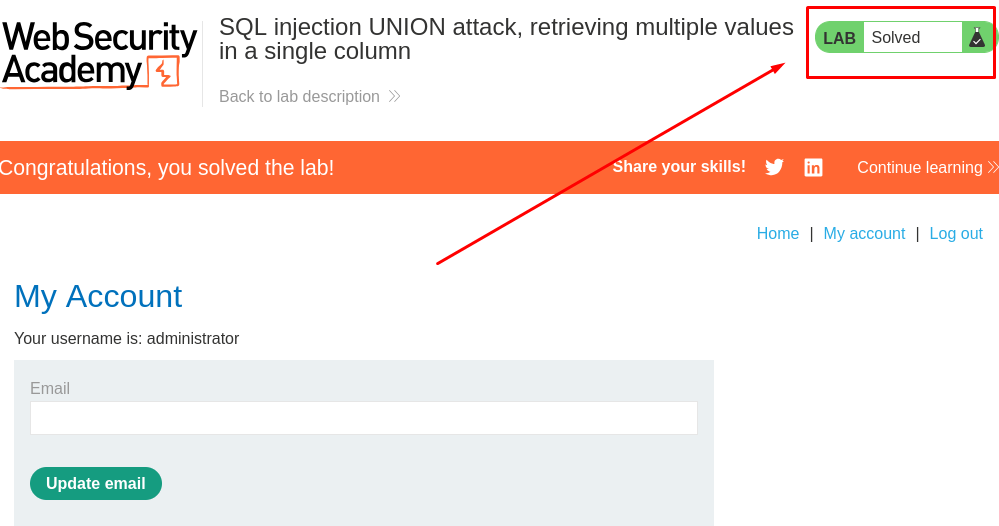

# SQL injection UNION attack, retrieving multiple values in a single column

## Table of Contents

* [Introduction](#introduction)
* [Attack Flow](#attack-flow)
* [Why This Attack Works](#why-this-attack-works)
* [Lab Setup](#lab-setup)
* [Tools Used](#tools-used)
* [Prerequisites](#prerequisites)
* [Step 1 - Launching the Lab and Identifying the Injection Point](#step-1---launching-the-lab-and-identifying-the-injection-point)
* [Step 2 - Determining the Number of Columns](#step-2---determining-the-number-of-columns)
* [Step 3 - Identifying String-Compatible Columns](#step-3---identifying-string-compatible-columns)
* [Step 4 - Combining the Username and Password into One Column](#step-4---combining-the-username-and-password-into-one-column)
* [Step 5 - Retrieving Usernames and Passwords](#step-5---retrieving-usernames-and-passwords)
* [Step 6 - Logging in as Administrator](#step-6---logging-in-as-administrator)
* [How to Detect This Attack](#how-to-detect-this-attack)
* [How to Prevent It](#how-to-prevent-it)
* [Lessons Learned](#lessons-learned)
* [References](#references)


## Step 1 - Launching the Lab and Identifying the Injection Point

First, I launched the lab from **PortSwigger Web Security Academy** and opened the target application in Firefox.

The application is an online shop where products can be filtered by category. I configured Firefox to work with Burp Suite and enabled Intercept to capture the HTTP requests.

After selecting a product category, I captured the request in Burp Suite and sent it to **Repeater** for testing.

**Captured Request:**

```http
GET /filter?category=Gifts HTTP/2
Host: 0a1c0059032dfc4185ccf83600820098.web-security-academy.net
```

The category value was sent as a request parameter, so I started testing this parameter to check whether the application was handling user input safely.

I added a single quote (`'`) at the end of the `category` value:

```http
category=Gifts'
```

After sending the request, the application returned a database error instead of the normal response. This happened because the additional quote affected the SQL query structure created by the application.

<p align="center">
  
</p>

I also tested the input with additional quotes (`''`). This time, the application returned a normal response instead of an SQL error. This showed that the application was directly using the user input inside an SQL query.

<p align="center">
  
</p>

Based on these responses, I identified the `category` parameter as a possible SQL injection point and continued further testing.

## Step 2 - Determining the Number of Columns

After identifying the possible SQL injection point, the next step was to find the number of columns returned by the original SQL query.

This is required because a UNION query only works when both `SELECT` statements return the same number of columns.

I tested the parameter with a UNION-based query and used different numbers of `NULL` values to match the columns returned by the original query.

Example:

```sql
Gift' UNION SELECT NULL,NULL --
```
**Breakdown**

| Part | Description |
|--------------|-------------|
| `Gift` | The original category value. |
| `'` | Closes the original string in the SQL query. |
| `UNION` | Combines the results of another `SELECT` query with the original query. |
| `SELECT` | Specifies the values to return. |
| `NULL, NULL` | Placeholder values used to match the number of columns in the original query. |
| `--` | Comments out the rest of the original SQL query so it is ignored by the database. |

After sending the request, the payload worked when I used two `NULL` values. This confirmed that the original SQL query returned two columns, so I moved on to the next step.

<p align="center">
  
</p>

## Step 3 - Identifying String-Compatible Columns

After determining the number of columns, the next step was to identify which columns could accept string values.

This is important because the data I wanted to retrieve from the database, such as usernames and passwords, is stored as text. For a `UNION` query to work, the data types in both queries must be compatible.

To test this, I replaced the `NULL` values with simple string values and observed the application's response.

Payload used:

```sql
Gifts' UNION SELECT NULL,'string' --
```
**Breakdown**

| Part | Description |
|--------------|-------------|
| `Gifts'` | Closes the original SQL query after the `Gifts` category value. |
| `UNION SELECT` | Combines the original query with a new query. |
| `NULL` | Placeholder for the first column. It is used because no text value is needed in this column. |
| `'string'` | Tests whether the second column accepts and displays text data. If `string` appears in the response, the column is string-compatible. |
| `--` | Comments out the rest of the original SQL query to prevent syntax errors. |

After sending the request, the application returned a normal response without any SQL errors. This confirmed that both columns accepted string values, allowing me to retrieve text data in the next step.

<p align="center">
  
</p>

## Step 4 - Combining the Username and Password into One Column

The application only displayed one column that could contain text, but the information I wanted to retrieve was stored in two separate columns: username and password.

To return both values in a single column, I used PostgreSQL's string concatenation operator (`||`). I also added the `~` character between the username and password to make the output easier to read.

```sql
Gift' UNION SELECT NULL, username||'~'||password FROM users--
```
**Breakdown**

| Part | Description |
|------|-------------|
| `Gift'` | Closes the original string in the SQL query after the category value. |
| `UNION SELECT` | Combines the original query with a new query. |
| `NULL` | Placeholder for the first column. |
| `username` | Retrieves the username from the `users` table. |
| `||` | PostgreSQL string concatenation operator used to join values together. |
| `'~'` | Adds a separator between the username and password, making the output easier to read. |
| `||` | Concatenates the next value to the existing string. |
| `password` | Retrieves the password from the `users` table. |
| `FROM users` | Specifies that the data should be retrieved from the `users` table. |
| `--` | Comments out the rest of the original SQL query to prevent syntax errors. |

This payload combines the username and password into a single value, such as **administrator~password**, allowing both values to be returned in the same column.

After confirming that the payload executed successfully, I proceeded to retrieve all usernames and passwords from the database.

<p align="center">
  
</p>

## Step 5 - Retrieving Usernames and Passwords

After combining the username and password values into a single column, I sent the request using the payload from the previous step.

The application returned the contents of the users table, with each username and password separated by the ~ character.

Example output:

administrator~8k2m4x7n9p1q5r6s
carlos~mypassword
wiener~letmein

The response contained the credentials for all users, including the administrator account.

<p align="center">
  
 </p>

From the results, I located the administrator username and copied its password. These credentials were then used in the final step to log in as the administrator user and complete the lab.

## Step 6 - Logging In as the Administrator

Using the extracted administrator credentials, I attempted to log in to the application.

The login was successful, confirming that the retrieved credentials were valid.

<p align="center">
  
</p>
<p align="center">
  
</p>

Successfully logging in as the administrator demonstrated the full impact of the SQL injection vulnerability. By retrieving credentials directly from the database, an attacker could gain unauthorized access to administrative functionality.