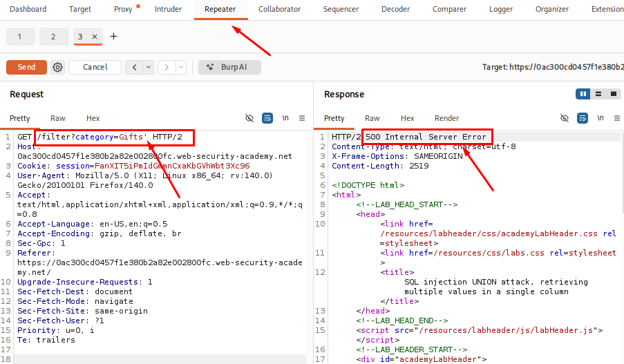
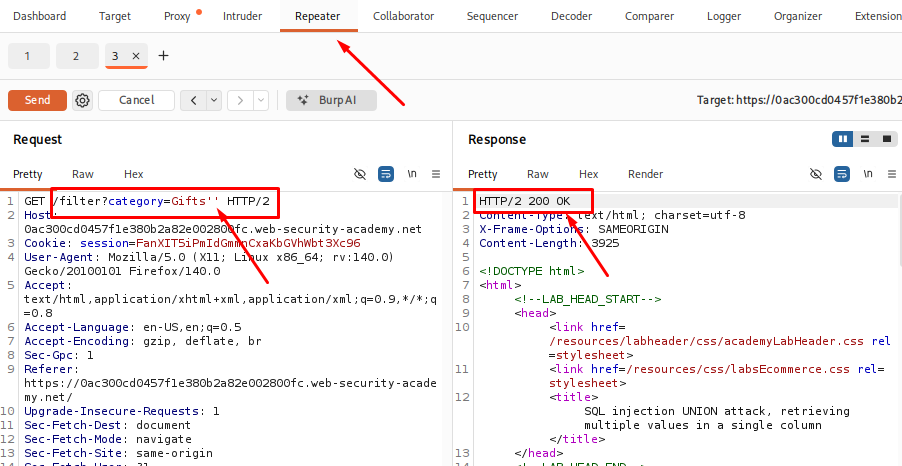

# SQL injection UNION attack, retrieving multiple values in a single column

## Table of Contents

* [Introduction](#introduction)
* [Attack Flow](#attack-flow)
* [Why This Attack Works](#why-this-attack-works)
* [Lab Setup](#lab-setup)
* [Tools Used](#tools-used)
* [Prerequisites](#prerequisites)
* [Step 1 - Launching the Lab and Identifying the Injection Point](#step-1---launching-the-lab-and-identifying-the-injection-point)
* [Step 2 - Determining the Number of Columns](#step-2---determining-the-number-of-columns)
* [Step 3 - Identifying String-Compatible Columns](#step-3---identifying-string-compatible-columns)
* [Step 4 - Combining the Username and Password into One Column](#step-4---combining-the-username-and-password-into-one-column)
* [Step 5 - Retrieving Usernames and Passwords](#step-5---retrieving-usernames-and-passwords)
* [Step 6 - Logging in as Administrator](#step-6---logging-in-as-administrator)
* [How to Detect This Attack](#how-to-detect-this-attack)
* [How to Prevent It](#how-to-prevent-it)
* [Lessons Learned](#lessons-learned)
* [References](#references)


## Step 1 - Launching the Lab and Identifying the Injection Point

First, I launched the lab from **PortSwigger Web Security Academy** and opened the target application in Firefox.

The application is an online shop where products can be filtered by category. I configured Firefox to work with Burp Suite and enabled Intercept to capture the HTTP requests.

After selecting a product category, I captured the request in Burp Suite and sent it to **Repeater** for testing.

**Captured Request:**

```http
GET /filter?category=Gifts HTTP/2
Host: 0a1c0059032dfc4185ccf83600820098.web-security-academy.net
```

The category value was sent as a request parameter, so I started testing this parameter to check whether the application was handling user input safely.

I added a single quote (`'`) at the end of the `category` value:

```http
category=Gifts'
```

After sending the request, the application returned a database error instead of the normal response. This happened because the additional quote affected the SQL query structure created by the application.

<p align="center">
  
</p>

I also tested the input with additional quotes (`''`). This time, the application returned a normal response instead of an SQL error. This showed that the application was directly using the user input inside an SQL query.

<p align="center">
  
</p>

Based on these responses, I identified the `category` parameter as a possible SQL injection point and continued further testing.