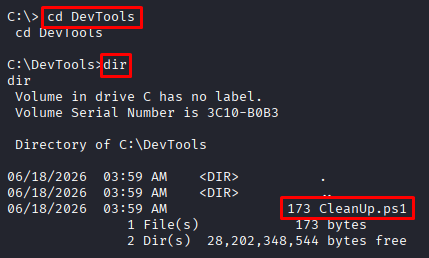

# Scheduled Task Manipulation

**Date:** June 2026<br>
**Author:** ShahinSecLab<br>
**Category:** Privilege Escalation<br>
**Difficulty:** Easy<br>
**Tools:** msfvenom, Metasploit, accesschk.exe

# Table of Contents

- [Introduction](#introduction)
- [Why This Attack Works](#why-this-attack-works)
- [Lab Setup](#lab-setup)
- [What I Needed Before Starting](#what-i-needed-before-starting)
- [What I Understood During the Process](#what-i-understood-during-the-process)
- [Attack Flow](#attack-flow)
- [Step 1 — Exploring the File System](#step-1--exploring-the-file-system)
- [Step 2 — Finding the Vulnerable Script in DevTools](#step-2--finding-the-vulnerable-script-in-devtools)
- [Step 3 — Finding the Vulnerable Script in DevTools](#step-3--finding-the-vulnerable-script-in-devtools)
- [Step 4 — Checking File Permissions on CleanUp.ps1](#step-4--checking-file-permissions-on-cleanupps1)
- [Step 5 — Injecting the Payload into CleanUp.ps1](#step-5--injecting-the-payload-into-cleanupps1)
- [Step 6 — Waiting for the Shell](#step-6--waiting-for-the-shell)
- [How Defenders Can Catch This](#how-defenders-can-catch-this)
- [How to Prevent It](#how-to-prevent-it)
- [What I Achieved](#what-i-achieved)

## Introduction

Scheduled Task Manipulation is a local privilege escalation technique. When a scheduled task runs a script or binary as SYSTEM and that script or binary has weak file permissions, a low privilege user can modify it. The next time the task runs, it executes the modified script as SYSTEM — giving full control of the machine without needing any exploit or CVE.

## Why This Attack Works

Windows scheduled tasks often run as `SYSTEM` to perform maintenance jobs like cleaning logs, running backups, or updating software. If the script or binary that the task runs has weak permissions — meaning normal users can write to it — I can add my own commands to that script. The next time the task fires, Windows runs my commands as `SYSTEM`.
The key thing here is I do not need to touch the task itself. I just modify the script it runs.

## Lab Setup

```
|    Component     |         Details         |
|------------------|-------------------------|
| Attacker Machine | Kali Linux              |
| Attacker IP      | 192.168.5.128           |
| Victim Machine   | Windows 10 (MSEDGEWIN10)|
| Victim IP        | 192.168.5.144           |
| Network          | VMware Host-Only Network|
| Domain           | WORKGROUP               |
```

## Tools Prepared on Kali Before Starting

```
| Tool            | Location                    | Purpose                                 |
|-----------------|-----------------------------|-----------------------------------------|
| accesschk.exe   | /home/kali/Desktop/tools/   | Check file permissions                  |
| rev.exe         | C:\PrivEsc\ on victim       | Malicious payload already on the victim |
| Metasploit      | Built into Kali             | Catch reverse shells                    |
```

## What I Needed Before Starting

```
|                   What                | Why                                   |
|---------------------------------------|---------------------------------------|
| Low privilege Meterpreter shell       | Starting point for the attack         |
| accesschk.exe                         | To check file permissions on scripts  |
| rev.exe already on the victim         | Payload to execute as SYSTEM          |
| Metasploit listener                   | To catch the shell when the task fires|
```

## What I Understood During the Process

While working through this attack I realized that:

- Scheduled tasks running as SYSTEM are very common in Windows environments
- If the script a task runs is writable by normal users, the machine is open to this attack
- I did not need to touch the scheduled task itself — just the script it runs
- The attack is completely passive once the payload is injected — I just wait for the task to fire
- Always check custom folders like `C:\DevTools`, `C:\BGinfo`, `C:\Temp` — admins often leave weak permissions on these

## Attack Flow

```
Already had a low privilege Meterpreter shell on the victim
                        ↓
Dropped into a CMD shell and explored C:\
                        ↓
Found C:\DevTools folder with CleanUp.ps1 inside
                        ↓
Opened CleanUp.ps1 — comment said it runs every minute as SYSTEM
                        ↓
Checked file permissions with accesschk.exe
                        ↓
Found full write access for normal users on CleanUp.ps1
                        ↓
Appended C:\PrivEsc\rev.exe to the end of CleanUp.ps1
                        ↓
Started Metasploit listener on port 4444
                        ↓
Waited for the scheduled task to fire
                        ↓
Task ran CleanUp.ps1 as SYSTEM — hit the injected line
                        ↓
rev.exe executed as SYSTEM
                        ↓
Metasploit caught the shell
                        ↓
Meterpreter session opened as SYSTEM
```

## Step 1 — Exploring the File System

I already had a Meterpreter shell on the victim machine as a low privilege user. I dropped into a CMD shell and started looking around the file system.

```bash
meterpreter > shell
```
```bash
C:\PrivEsc> cd ..
C:\> dir
```
**Output:**

```
 Directory of C:\

06/18/2026  03:59 AM    <DIR>          DevTools
06/22/2026  09:04 PM    <DIR>          inetpub
12/07/2019  02:14 AM    <DIR>          PerfLogs
06/23/2026  09:18 PM    <DIR>          PrivEsc
06/20/2026  03:12 AM    <DIR>          Program Files
05/05/2023  05:27 AM    <DIR>          Program Files (x86)
06/23/2026  05:45 AM    <DIR>          Temp
06/18/2026  04:40 AM    <DIR>          Users
06/22/2026  09:06 PM    <DIR>          Windows
               0 File(s)              0 bytes
               9 Dir(s)  28,201,332,736 bytes free
```
I went through each folder one by one looking for anything interesting. Two folders stood out straight away — `BGinfo` and `DevTools`. These are not default Windows folders, so I checked them both.

## Step 2 — Finding the Vulnerable Script in DevTools

```bash
C:\> cd DevTools
C:\DevTools> dir
```
**Output:**
```
06/18/2026  03:59 AM    <DIR>          .
06/18/2026  03:59 AM    <DIR>          ..
06/18/2026  03:59 AM               173 CleanUp.ps1
               1 File(s)            173 bytes
               2 Dir(s)  28,202,348,544 bytes free
```
<p align="center">
  
</p>